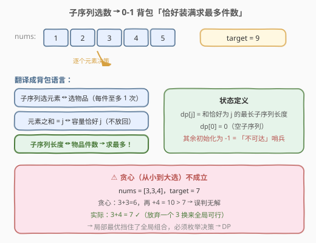
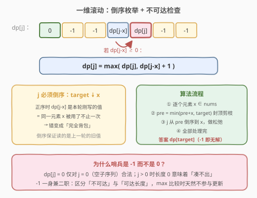
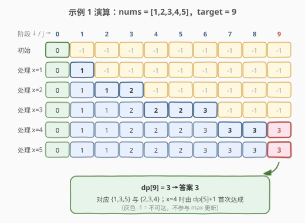

# 和为目标值的最长子序列的长度

- **题目名称**：和为目标值的最长子序列的长度
- **链接**：[2915. 和为目标值的最长子序列的长度](https://leetcode.cn/problems/length-of-the-longest-subsequence-that-sums-to-target/)
- **难度**：中等
- **标签**：数组、动态规划、0-1 背包

## 1. 题目概述

给你一个下标从 **0** 开始的整数数组 `nums` 和一个整数 `target`。返回和为 `target` 的 `nums` 子序列中，子序列**长度的最大值**。如果不存在和为 `target` 的子序列，返回 `-1`。

**子序列**指的是从原数组中删除一些或者不删除任何元素后，剩余元素保持原来的顺序构成的数组。

**示例 1**：

```text
输入：nums = [1,2,3,4,5], target = 9
输出：3
解释：总共 3 个子序列的和为 9：[4,5]、[1,3,5] 和 [2,3,4]。最长的子序列是 [1,3,5] 和 [2,3,4]，答案为 3。
```

**示例 2**：

```text
输入：nums = [4,1,3,2,1,5], target = 7
输出：4
解释：共 5 个子序列和为 7：[4,3]、[4,1,2]、[4,2,1]、[1,1,5] 和 [1,3,2,1]。最长为 [1,3,2,1]，答案为 4。
```

**示例 3**：

```text
输入：nums = [1,1,5,4,5], target = 3
输出：-1
解释：无法得到和为 3 的子序列。
```

**约束条件**：

- $1 \le nums.length \le 1000$
- $1 \le nums[i] \le 1000$
- $1 \le target \le 1000$

---

## 2. 解题思路

### 2.1 暴力思路：枚举所有子集

每个元素只有「选 / 不选」两种状态，$n$ 个元素共 $2^n$ 个子序列，逐一检查和与长度。$n = 1000$ 时 $2^{1000}$ 天文数字，**不可行**。

退一步想贪心：既然要长度最长，优先挑小的元素？也不对——$nums = [3,3,4]$、$target = 7$ 时，从小到大累加得 $3+3=6$、再 $+4=10 > 7$，贪心会误判无解；而实际 $3+4=7$ 可行。**局部最优（多塞小元素）会挡住全局组合**，必须老老实实枚举决策——这正是动态规划的领地。

### 2.2 核心观察：0-1 背包「恰好装满求最多件数」



把「选子序列」翻译成背包语言：每个元素 $x$ 是一件**重量为 $x$** 的物品，每件至多选一次（0-1 背包）；「和恰好为 $j$」即「容量恰好装满 $j$」；「子序列最长」即「物品件数最多」。于是定义：

$$dp[j] = \text{和恰好为 } j \text{ 的子序列的最大长度}$$

- **初始化**：$dp[0] = 0$（空子序列和为 0、长度 0），其余 $dp[j] = -1$ 表示**不可达**——负哨兵既标记「凑不出」，又天然不参与 `max` 更新；
- **转移**（考虑元素 $x$，倒序枚举 $j$）：

$$dp[j] = \max\big(dp[j],\ dp[j-x] + 1\big) \quad (dp[j-x] \ge 0)$$

- **答案**：$dp[target]$，仍为 $-1$ 即无解。

> 💡 这是 0-1 背包「**恰好装满求最值**」的标准姿势：与「至多装满」的初始化（全 0）不同，恰好装满必须用不可达哨兵隔离非法状态，否则「空集 + 凑不出的和」会污染答案。

### 2.3 算法流程：一维滚动 + 前缀和剪枝



1. `dp` 开到 `target + 1`，`dp[0] = 0`，其余 `-1`；
2. 维护 `pre` = 已处理元素之和（封顶 `target`），逐个元素 `x`：
   - `pre = min(pre + x, target)`——新可达的和最多到 `pre`；
   - **倒序**枚举 `j` 从 `pre` 到 `x`：若 `dp[j-x] >= 0` 则松弛 `dp[j] = max(dp[j], dp[j-x] + 1)`；
3. 返回 `dp[target]`。

两个实现要点：

- **为什么倒序**：一维滚动数组里，倒序保证 `dp[j-x]` 读的是**上一轮**（不含当前元素）的旧值；正序会把本轮刚更新的值再用一遍，等于同一元素选了两次——错变成完全背包。
- **`pre` 剪枝**：处理到元素 $x$ 时，全部已选元素之和不可能超过 $\min(\text{前缀和}, target)$，超出部分永远不可达，直接不枚举。元素都很大时（如 1000 个 $1000$、$target = 1000$）内层循环几乎空转，均摊开销大幅下降。

### 2.4 示例演算



以示例 1 `nums = [1,2,3,4,5], target = 9` 为例（表中省略 `pre` 封顶过程）：

| 阶段 | dp[0] | dp[1] | dp[2] | dp[3] | dp[4] | dp[5] | dp[6] | dp[7] | dp[8] | dp[9] |
|------|-------|-------|-------|-------|-------|-------|-------|-------|-------|-------|
| 初始 | 0 | -1 | -1 | -1 | -1 | -1 | -1 | -1 | -1 | -1 |
| 处理 x=1 | 0 | 1 | -1 | -1 | -1 | -1 | -1 | -1 | -1 | -1 |
| 处理 x=2 | 0 | 1 | 1 | 2 | -1 | -1 | -1 | -1 | -1 | -1 |
| 处理 x=3 | 0 | 1 | 1 | 2 | 2 | 2 | 3 | -1 | -1 | -1 |
| 处理 x=4 | 0 | 1 | 1 | 2 | 2 | 2 | 3 | 3 | 3 | **3** |
| 处理 x=5 | 0 | 1 | 1 | 2 | 2 | 2 | 3 | 3 | 3 | **3** |

- `x=4` 时，`dp[9]` 由 `dp[5] + 1 = 2 + 1 = 3` 首次达成（对应 $\{2,3,4\}$）；
- `x=5` 时，`dp[9] = max(3, dp[4] + 1) = 3` 保持（对应 $\{1,3,5\}$）；
- 最终 `dp[9] = 3` ✓。

---

## 3. 参考代码

### C++

```cpp
class Solution {
  public:
    int lengthOfLongestSubsequence(vector<int>& nums, int target) {
        vector<int> dp(target + 1, -1);  // -1 = 不可达
        dp[0] = 0;                       // 空子序列：和 0，长度 0
        int pre = 0;                     // 已处理元素之和（封顶 target）
        for (int x : nums) {
            pre = min(pre + x, target);
            for (int j = pre; j >= x; j--) {
                if (dp[j - x] >= 0) {
                    dp[j] = max(dp[j], dp[j - x] + 1);
                }
            }
        }
        return dp[target];
    }
};
```

### Python

```python
class Solution:
    def lengthOfLongestSubsequence(self, nums: List[int], target: int) -> int:
        dp = [0] + [-1] * target  # dp[j] = 和恰为 j 的最长长度，-1 = 不可达
        pre = 0                   # 已处理元素之和（封顶 target）
        for x in nums:
            pre = min(pre + x, target)
            for j in range(pre, x - 1, -1):
                if dp[j - x] >= 0:
                    dp[j] = max(dp[j], dp[j - x] + 1)
        return dp[target]
```

> 💡 若 `x > target`，则 `x > pre` 恒成立（`pre ≤ target`），内层循环自然不执行，无需特判；元素全部偏大时 `pre` 早早封顶，整体趋近线性。

---

## 4. 复杂度分析

| 维度 | 复杂度 | 说明 |
|------|--------|------|
| 时间复杂度 | $O(n \cdot \min(target, \sum nums))$ | 最坏 $1000 \times 1000 = 10^6$；`pre` 剪枝在元素偏大时进一步收紧 |
| 空间复杂度 | $O(target)$ | 一维滚动数组，开到 `target` 即可（容量截断） |

---

## 5. 扩展：背包家族的「四问」与对偶视角

- **背包四问**：同一套 0-1 背包骨架，问法不同则初始化与转移目标不同——**可行性**（416，布尔滚动）、**计数**（494，`+` 累加）、**最值**（1049，`max`/`min`）、本题的**「恰好装满求件数最多」**（最值的一个变体：价值恒为 1 的 max）。判题先问自己：恰好还是至多？最值还是计数？
- **对偶视角**：保留最长 ⇔ **删除最少**。设 $S = \sum nums$，则「选出和恰为 `target` 的最长子序列」等价于「删掉和恰为 $S - target$ 的最短子序列」（原问题对 322 求最少件数的镜像）。两边 dp 规模分别为 `target` 与 `S - target`，实现时取小的一侧做容量即可——本题两者同阶（均 ≤ 1000），但该对偶在 `target` 很大、`S - target` 很小时能显著降复杂度。
- **与 322 零钱兑换对照**：322 是**完全背包 + 最少件数**（元素可重复用，哨兵用 `INF`）；本题是 **0-1 背包 + 最多件数**（元素用一次，哨兵用 `-1`）。遍历顺序（内层正序 vs 倒序）与哨兵方向（求最少用大哨兵、求最多用小哨兵）恰好全面镜像。

---

## 6. 面试要点

1. **为什么贪心（优先选小元素）不成立？**

   - 反例 $nums = [3,3,4]$、$target = 7$：贪心先拿 $3,3$（和 6），再放不下 4，误判无解；实际 $3+4=7$ 可行
   - 本质：选哪些元素是**全局组合问题**，局部「多塞小元素」会堵死后续组合空间，只能用 DP 枚举决策

2. **`dp` 初始化为什么是 `-1` 而不是 `0`？**

   - 「长度 0」只对和为 0（空子序列）合法；$j > 0$ 时若 `dp[j] = 0`，无法区分「和为 $j$、长度 0」与「凑不出」
   - `-1` 同时承担两个职责：标记**不可达**，且作为极小值**不参与 `max` 更新**——非法状态被自动隔离
   - 对照 322（求最少件数）用 `INF` 哨兵：求最少用大哨兵，求最多用小哨兵，方向相反

3. **内层 `j` 为什么必须倒序枚举？**

   - 一维滚动下，`dp[j-x]` 必须是**不含当前元素**的上一轮旧值；倒序（先算大 $j$）保证读取时尚未更新
   - 正序会让同一元素在一轮内被「先用一次、再用一次」，退化成完全背包
   - 若用二维 `dp[i][j]` 则无此讲究——滚动数组省空间的代价就是引入顺序约束

4. **`pre` 剪枝为什么正确、能省多少？**

   - 正确性：处理完前 $i$ 个元素后，任何可达状态的和不超过前缀和，也不需要超过 `target`，封顶无损
   - 收益：元素普遍偏大时（如 $nums[i] \approx 1000$、$target = 1000$），每轮内层只扫 $O(1)$ 个格子；最坏（元素全为 1）仍是满打满算 $O(n \cdot target)$，剪枝只赚不亏

5. **「恰好装满」与「至多装满」的背包有什么区别？**

   - 至多装满（如 1049 求容量差最小）：所有状态默认合法，初始化全 0 / 全 INF
   - 恰好装满（本题、416 可行性、494 计数）：只有从 $dp[0]$ 出发可达的状态才合法，必须用哨兵（`-1`/`False`/`0`）隔离，转移时**先判可达再松弛**
   - 这是背包题最高频的初始化考点：初始化错了，样例可能碰巧对、大样例必挂

---

## 7. 同类练习题

- [322. 零钱兑换](https://leetcode.cn/problems/coin-change/)（[题解](../0301-0400/322_零钱兑换.md)）：完全背包求最少件数，与本题「0-1 背包求最多件数」在遍历顺序、哨兵方向上全面镜像
- [416. 分割等和子集](https://leetcode.cn/problems/partition-equal-subset-sum/)（[题解](../0401-0500/416_分割等和子集.md)）：0-1 背包可行性（恰好装满判可达），本题的布尔退化版
- [494. 目标和](https://leetcode.cn/problems/target-sum/)（[题解](../0401-0500/494_目标和.md)）：0-1 背包计数（± 号转化成恰好装满数方案数），对照「最值 vs 计数」的初始化差异
- [1049. 最后一块石头的重量 II](https://leetcode.cn/problems/last-stone-weight-ii/)（[题解](../1001-1100/1049_最后一块石头的重量II.md)）：0-1 背包最值（至多装满），对照「恰好 vs 至多」的初始化差异
