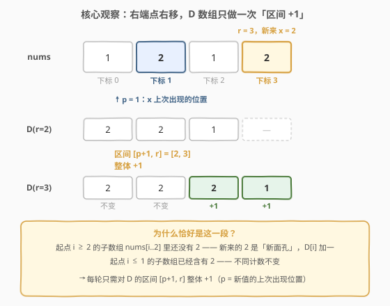
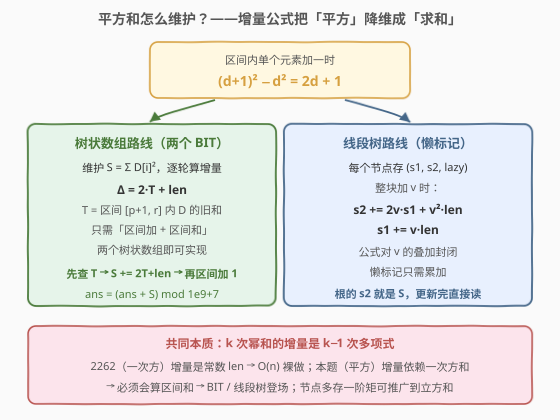
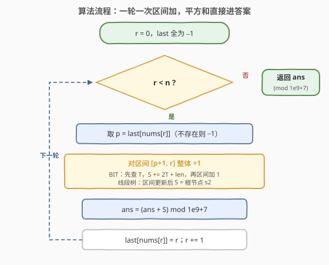
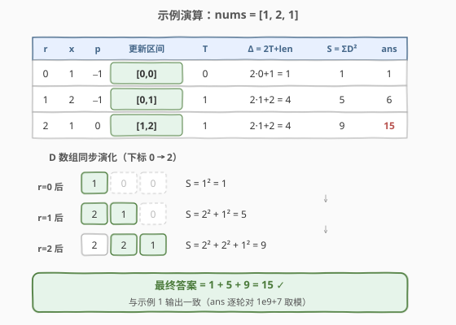

# LeetCode 子数组不同元素数目的平方和 II 题解

## 1. 题目概述

- **标题 / 题号**：子数组不同元素数目的平方和 II（#2916，hard）
- **链接**：https://leetcode.cn/problems/subarrays-distinct-element-sum-of-squares-ii/
- **难度**：困难
- **标签**：线段树、树状数组、哈希表、贡献法

**题意**：给你一个下标从 **0** 开始的整数数组 `nums`。定义子数组 `nums[i..j]`（满足 $0 \le i \le j < n$）的**不同计数**为其中不同值的数目。请返回 `nums` 中**所有子数组**的不同计数的**平方**和。由于答案可能很大，返回其对 $10^9 + 7$ **取余**的结果。子数组指数组中一段连续**非空**的元素序列。

**示例 1**：

```text
输入：nums = [1,2,1]
输出：15
解释：六个子数组的不同计数依次为 1, 1, 1, 2, 2, 2，
平方和为 1² + 1² + 1² + 2² + 2² + 2² = 15。
```

**示例 2**：

```text
输入：nums = [2,2]
输出：3
解释：三个子数组 [2]、[2]、[2,2] 的不同计数均为 1，平方和为 3。
```

**约束**：

- $1 \le nums.length \le 10^5$
- $1 \le nums[i] \le 10^5$

> 💡 本题与 2913（子数组不同元素数目的平方和 I）题意完全相同，唯一区别是数据范围：I 版 $n \le 100$ 暴力可过；II 版 $n \le 10^5$，必须有 $O(n \log n)$ 级别的做法。

## 2. 解题思路

### 2.1 暴力思路：枚举右端点 + 增量去重

枚举每个右端点 $r$，让起点 $i$ 从 $r$ 向左扩，用哈希集合增量维护窗口内不同值个数 $cnt$（每遇到新值加一），逐窗口累加 $cnt^2$：

```text
for r in 0..n-1:
    cnt = 0, seen = 空集合
    for i in r..0:            # 窗口 [i, r] 逐步变长
        if nums[i] 不在 seen 中: 插入; cnt += 1
        ans += cnt * cnt
```

内层均摊 $O(1)$，总时间 $O(n^2)$：$n \le 100$ 时约 $10^4$ 次操作，2913 直接通过；但本题 $n = 10^5$ 需要约 $10^{10}$ 次操作，**超时**。瓶颈在于：窗口每扩一格就要累加一个平方项，而平方项的值随窗口变化，无法 $O(1)$ 汇总。

### 2.2 核心观察一：按右端点递推，D 数组只发生一次「区间 +1」



设 $D_r[i] = d(i, r)$ 表示子数组 $nums[i..r]$ 的不同计数，答案即 $\sum_{r} \sum_{i \le r} D_r[i]^2$。

考察右端点从 $r-1$ 推进到 $r$（记 $x = nums[r]$，$p$ 为 $x$ 在 $[0, r-1]$ 中**最后一次出现**的位置，不存在则 $p = -1$）：

- 起点 $i \in [p+1,\ r]$：窗口 $nums[i..r-1]$ 里**还没有** $x$，新来的 $x$ 是「新面孔」→ $D_r[i] = D_{r-1}[i] + 1$（$i = r$ 时 $D_{r-1}[r] = 0$，恰好变成 1）；
- 起点 $i \in [0,\ p]$：窗口 $nums[i..r-1]$ 里**已经有** $x$ → $D_r[i] = D_{r-1}[i]$，不变。

也就是说，**每一步只是把 D 数组的一段区间 $[p+1,\ r]$ 整体加一**。这个「按上一次出现位置切段」的视角与 2262 字符串的总引力完全同源——那题维护一次方和，增量是常数，连数据结构都不需要；本题要维护**平方和**，才是难度的分水岭。

### 2.3 核心观察二：平方和的增量只依赖「区间内 D 之和」



当区间 $[l,\ r]$ 内每个 $D[i]$ 都加一时，利用恒等式 $(d+1)^2 - d^2 = 2d + 1$：

$$\Delta = \sum_{i=l}^{r} \left(2\,D_{old}[i] + 1\right) = 2 \cdot T + (r - l + 1), \quad T = \sum_{i=l}^{r} D_{old}[i]$$

**平方和的增量被降维成了「区间内一次方和」**！于是有两条等价的实现路线：

| 路线 | 维护量 | 每步操作 |
|------|--------|----------|
| **树状数组**（两个 BIT） | 逐轮增量维护 $S = \sum D[i]^2$；BIT 提供「区间加 + 区间和」 | 先查区间和 $T$ → $S \mathrel{+}= 2T + len$ → 再区间加 1 |
| **线段树**（懒标记） | 每个节点存区间和 $s_1$、区间平方和 $s_2$、懒标记 | 区间加时整块套公式，根的 $s_2$ 即当前 $S$ |

线段树的节点公式与 $\Delta$ 完全等价：对长度为 $len$ 的节点整体加 $v$，有

$$s_2' = s_2 + 2 v\, s_1 + v^2 \cdot len, \qquad s_1' = s_1 + v \cdot len$$

该公式对 $v$ 的**叠加封闭**（先加 $v_1$ 再加 $v_2$ 等价于一次加 $v_1 + v_2$），因此懒标记只需累加，无需结构化存储。

> ⚠️ **取模的时机**：树内的聚合值（BIT 中的 $D$、线段树的 $s_1/s_2$）必须存**精确值**——增量公式依赖真值代数，取模会破坏等式。好在量级可控：$s_1 \le \frac{n^2}{2} \approx 5 \times 10^9$，$S \le \frac{n^3}{3} \approx 3.3 \times 10^{14}$，都在 64 位整数范围内；只在**累加答案**时取模即可。

### 2.4 算法流程



1. 哈希表 `last` 记录每个值最近出现的下标，初始为 $-1$；
2. 从左到右枚举右端点 $r$，取 $p = last[nums[r]]$；
3. 对区间 $[p+1,\ r]$ 执行「整体加 1」——树状数组路线：**先**查区间和 $T$、算增量 $S \mathrel{+}= 2T + len$，**再**区间加 1；线段树路线：直接区间更新，读根节点 $s_2$；
4. 把当前 $S$ 累加进答案并对 $10^9+7$ 取模；
5. 更新 `last[nums[r]] = r`，进入下一轮；结束后返回答案。

### 2.5 示例演算



以示例 1 `nums = [1,2,1]` 为例（$len$ 即区间长度 $r - p$）：

| $r$ | $x$ | $p$ | 更新区间 | 区间旧和 $T$ | $\Delta = 2T + len$ | $S = \sum D^2$ | ans |
|---|---|---|---|---|---|---|---|
| 0 | 1 | $-1$ | $[0,0]$ | 0 | $2 \cdot 0 + 1 = 1$ | 1 | 1 |
| 1 | 2 | $-1$ | $[0,1]$ | 1 | $2 \cdot 1 + 2 = 4$ | 5 | 6 |
| 2 | 1 | $0$ | $[1,2]$ | 1 | $2 \cdot 1 + 2 = 4$ | 9 | 15 |

D 数组同步演化：$[1,0,0] \to [2,1,0] \to [2,2,1]$，对应的 $S = 1^2,\ 2^2+1^2,\ 2^2+2^2+1^2 = 1,\ 5,\ 9$，最终答案 $1+5+9 = 15$ ✓。

## 3. 参考代码

### C++（懒标记线段树，维护区间和与区间平方和）

```cpp
class Solution {
  public:
    int sumCounts(vector<int>& nums) {
        const long long MOD = 1e9 + 7;
        int n = nums.size();
        vector<long long> s1(4 * n), s2(4 * n), lz(4 * n);  // 区间和 / 平方和 / 懒标记
        vector<int> last(100001, -1);                       // 值域不大，数组当哈希表

        // 对覆盖长度为 len 的节点 o 整体加 v（真值运算，不取模）
        auto apply = [&](int o, int len, long long v) {
            s2[o] += 2 * v * s1[o] + v * v * len;
            s1[o] += v * len;
            lz[o] += v;
        };
        function<void(int, int, int, int, int)> update = [&](int o, int l, int r, int ql, int qr) {
            if (qr < l || r < ql) return;
            if (ql <= l && r <= qr) {
                apply(o, r - l + 1, 1);
                return;
            }
            int m = (l + r) / 2;
            if (lz[o]) {  // 懒标记下传（长度各按子节点区间算）
                apply(2 * o, m - l + 1, lz[o]);
                apply(2 * o + 1, r - m, lz[o]);
                lz[o] = 0;
            }
            update(2 * o, l, m, ql, qr);
            update(2 * o + 1, m + 1, r, ql, qr);
            s1[o] = s1[2 * o] + s1[2 * o + 1];
            s2[o] = s2[2 * o] + s2[2 * o + 1];
        };

        long long ans = 0;
        for (int r = 0; r < n; r++) {
            int p = last[nums[r]];
            update(1, 0, n - 1, p + 1, r);   // 起点在 [p+1, r] 的子数组见到新值
            ans = (ans + s2[1]) % MOD;       // 根节点 s2 = Σ d(i,r)²
            last[nums[r]] = r;
        }
        return (int)ans;
    }
};
```

### Python（两个树状数组实现「区间加 + 区间和」）

```python
class Solution:
    def sumCounts(self, nums: List[int]) -> int:
        MOD = 10 ** 9 + 7
        n = len(nums)
        b1 = [0] * (n + 1)  # 差分
        b2 = [0] * (n + 1)  # 差分 × 位置权重

        def add(b, i, v):
            while i <= n:
                b[i] += v
                i += i & (-i)

        def query(b, i):
            s = 0
            while i > 0:
                s += b[i]
                i -= i & (-i)
            return s

        def range_add(l, r, v):  # 1-based 闭区间 [l, r] 整体加 v
            add(b1, l, v); add(b1, r + 1, -v)
            add(b2, l, v * (l - 1)); add(b2, r + 1, -v * r)

        def prefix(x):  # D[1..x] 之和
            return query(b1, x) * x - query(b2, x)

        last = {}
        ans = 0
        s = 0  # 当前 Σ D[i]²（精确值，上界约 n³/3 ≈ 3.3e14）
        for r, x in enumerate(nums):
            p = last.get(x, -1)
            l, rr = p + 2, r + 1                    # 本轮 +1 的区间（1-based）
            t = prefix(rr) - prefix(l - 1)          # 区间内旧 D 之和（先查后加！）
            s += 2 * t + (rr - l + 1)               # 平方和增量 Δ = 2T + len
            ans = (ans + s) % MOD
            range_add(l, rr, 1)
            last[x] = r
        return ans
```

> 💡 两份代码复杂度同为 $O(n \log n)$：树状数组常数更小、代码更短；线段树更通用（任意幂次和、区间查询都能顺势推广）。

## 4. 复杂度分析

| 维度 | 复杂度 | 说明 |
|------|--------|------|
| 时间复杂度 | $O(n \log n)$ | 每个右端点一次 $O(\log n)$ 的区间更新（线段树），或「一次区间和查询 + 一次区间加」（树状数组） |
| 空间复杂度 | $O(n + U)$ | 线段树 $4n$ 个节点或两个树状数组 $2n$；$U = 10^5$ 为值域哈希 `last` |

## 5. 扩展：幂次越高，需要的「矩」越高

- **一次方和（2262 字符串的总引力）**：增量 $\Delta = \sum 1 = len$ 是**常数**，无需任何数据结构，$O(n)$ 贪心累加即可；
- **平方和（本题）**：增量 $\Delta = 2T + len$ 依赖**一次方和** $T$ → 需要「区间加 + 区间和」，树状数组 / 线段树登场；
- **立方和（假想的 III 版）**：$(d+1)^3 - d^3 = 3d^2 + 3d + 1$，增量同时依赖平方和与一次方和——线段树节点多存一个 $s_3$ 即可：$s_3' = s_3 + 3v\,s_2 + 3v^2 s_1 + v^3 \cdot len$。
- **通用规律**：$k$ 次幂和的增量是 $d$ 的 $k-1$ 次多项式（二项式展开），于是维护 $k$ 阶矩只需同时维护 $1 \sim k-1$ 阶矩——这正是线段树做法的推广方向，也解释了本题为何是「II」：**从 2262 到 2916，跨越的正是「常数增量 → 依赖低阶矩的增量」这一步**。

## 6. 面试要点

1. **为什么 D 数组的转移恰好是「区间 +1」？**

   - 新值 $x = nums[r]$ 只对「窗口里还没出现过 $x$」的起点生效
   - 设 $p$ 为 $x$ 上一次出现位置，则 $i > p$ 的窗口 $nums[i..r-1]$ 均不含 $x$ → 这些 $D[i]$ 加一；$i \le p$ 的窗口已含 $x$ → 不变
   - 「上一次出现位置」是处理子数组去重计数的标准切入点（同 2262）

2. **为什么不能像 2262 那样 O(1) 维护平方和？**

   - 一次方和的增量 $\sum 1 = len$ 与 $D$ 的具体值无关，是常数
   - 平方和的增量 $(d+1)^2 - d^2 = 2d + 1$ **依赖每个 $D[i]$ 的值** → 必须先知道区间内一次方和 $T$
   - 「增量的多项式阶数升一、所需的矩也升一」——这是本题定为困难的核心原因

3. **树状数组版和线段树版各维护什么？怎么选？**

   - 树状数组：用 $\Delta = 2T + len$ 把平方和维护**化归为区间和维护**，两个 BIT 实现「区间加 + 区间和」；代码短、常数小
   - 线段树：节点直接维护 $(s_1, s_2)$ 与懒标记，整块加 $v$ 时套 $s_2' = s_2 + 2vs_1 + v^2 \cdot len$；更通用，可推广到任意幂次与区间查询
   - 面试先讲清 $\Delta$ 公式（两条路线的共同根基），再按需选实现

4. **取模有哪些坑？**

   - 树内聚合值（BIT 的 $D$、线段树的 $s_1/s_2$）**绝不能取模**——增量公式依赖真值代数
   - 好在真值上界可控：$s_1 \le n^2/2 \approx 5 \times 10^9$、$S \le n^3/3 \approx 3.3 \times 10^{14}$，64 位整数足够（Python 天然大数无此虑）
   - 只在累加答案处取模；若全程不取模，答案上界 $n^4/12 \approx 8.3 \times 10^{18}$ 虽未溢出 int64 但已贴边，逐轮取模更稳

5. **懒标记公式为什么可以复合？**

   - 对同一节点先后 apply $v_1$、$v_2$，与一次 apply $v_1 + v_2$ 的效果完全一致（都是恒等式的代数叠加）
   - 所以标记无需结构化存储，累加即可；下传时按**子节点各自的区间长度**套公式
   - 注意 BIT 路线中「查 $T$」必须在「区间加」**之前**——$T$ 是旧值之和

## 同类练习题

| # | 题目 | 与本题的关联 |
|---|------|-------------|
| 2913 | [子数组不同元素数目的平方和 I](https://leetcode.cn/problems/subarrays-distinct-element-sum-of-squares-i/)（[题解](../2901-3000/2913_子数组不同元素数目的平方和I.md)） | 同题意的 $n \le 100$ 版本，$O(n^2)$ 暴力直接过，可当本题热身 |
| 2262 | [字符串的总引力](https://leetcode.cn/problems/total-appeal-of-a-string/)（[题解](../2201-2300/2262_字符串的总引力.md)） | 一次方版贡献法，「上一次出现位置 + 增量」思想的源头 |
| 1109 | [航班预订统计](https://leetcode.cn/problems/corporate-flight-bookings/)（[题解](../1101-1200/1109_航班预订统计.md)） | 区间加 + 区间和的入门题（差分 / 树状数组），树状数组路线的前置知识 |
| 732 | [我的日程安排表 III](https://leetcode.cn/problems/my-calendar-iii/)（[题解](../0701-0800/732_我的日程安排表III.md)） | 区间加 + 查全局最大值的懒标记线段树，对照体会「节点维护什么聚合量」的选型 |
