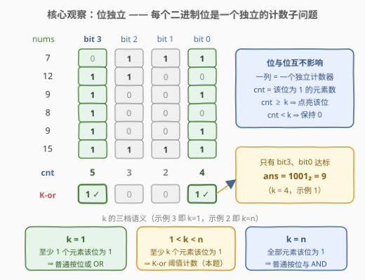
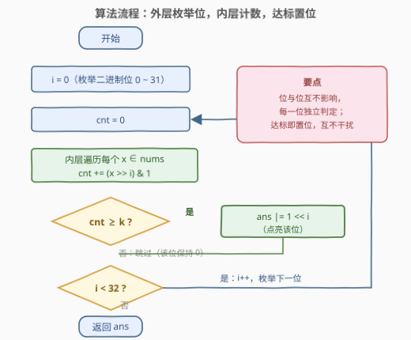
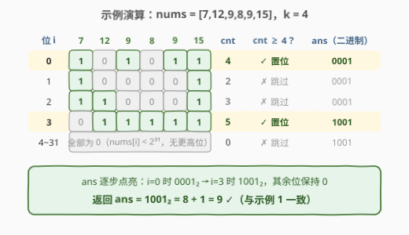

# LeetCode 找出数组中的 K-or 值 题解

## 1. 题目概述

- **标题 / 题号**：找出数组中的 K-or 值（#2917，easy）
- **链接**：https://leetcode.cn/problems/find-the-k-or-of-an-array/
- **难度**：简单
- **标签**：位运算、数组、计数

**题意**：给你一个整数数组 `nums` 和一个整数 `k`。让我们通过扩展标准的按位或来介绍 **K-or** 操作：在 K-or 操作中，如果在 `nums` 中**至少存在 $k$ 个元素**的第 $i$ 位值为 1，那么 K-or 中的第 $i$ 位的值是 1。

返回 `nums` 的 **K-or 值**。

**示例 1**：

```text
输入：nums = [7,12,9,8,9,15], k = 4
输出：9
解释：用二进制表示 numbers：
  7  = 0111
  12 = 1100
  9  = 1001
  8  = 1000
  9  = 1001
  15 = 1111
位 0 在 7, 9, 9, 15 中为 1（4 个 ≥ 4）✓
位 3 在 12, 9, 8, 9, 15 中为 1（5 个 ≥ 4）✓
位 1、位 2 的计数分别为 2、3，均 < 4 ✗
结果是 (1001)₂ = 9。
```

**示例 2**：

```text
输入：nums = [2,12,1,11,4,5], k = 6
输出：0
解释：没有位在所有 6 个数字中都为 1，所以答案为 0。
```

**示例 3**：

```text
输入：nums = [10,8,5,9,11,6,8], k = 1
输出：15
解释：k = 1 时，1-or 就是普通的按位或：
10 OR 8 OR 5 OR 9 OR 11 OR 6 OR 8 = 15。
```

**约束**：

- $1 \le \text{nums.length} \le 50$
- $0 \le \text{nums}[i] < 2^{31}$
- $1 \le k \le \text{nums.length}$

> 💡 本题核心是「**按位独立 + 阈值计数**」。K-or 的第 $i$ 位只取决于一个数：**该位为 1 的元素个数** $\text{cnt}[i]$——与其他位、元素大小、出现顺序统统无关。于是整个问题被拆成 32 个互相独立的一维计数子问题：数一数、比一比 $k$、达标就点亮。另外注意 $k$ 的两个特例：$k=1$ 时退化为普通按位或（示例 3），$k=n$ 时退化为普通按位与（示例 2）——K-or 是 OR/AND 的统一推广。

## 2. 解题思路

### 2.1 暴力思路：按定义逐位判定

按定义直译：结果的第 $i$ 位需要一个计数「有多少个元素的第 $i$ 位是 1」。最直接的做法就是**外层枚举位、内层扫描数组**：

```text
ans = 0
for i in 0..31:              # 枚举每一个二进制位
    cnt = 0
    for x in nums:           # 数一数该位为 1 的元素个数
        cnt += (x >> i) & 1
    if cnt >= k:
        ans |= 1 << i        # 达标，点亮该位
return ans
```

时间 $O(32n)$。本题 $n \le 50$，总量不超过 $32 \times 50 = 1600$ 次位运算，轻松通过。

> ⚠️ 有趣的是：这题的「暴力」就是**最优解**——每个元素的每一位都必须被看到，才能知道每个位的计数，信息量下界就是 $\Omega(32n)$。没有更聪明的算法，只有写法上的等价变换（见第 5 节的换循环方向版）。本题的考点不在复杂度，而在**把定义干净利落地翻译成位运算代码**的三个基本功：取位、置位、位范围。

### 2.2 核心观察：位独立 + k 的三档语义



**观察 1（位独立性）**：把数组写成二进制竖式后，**每一列就是一个独立的子问题**——第 $i$ 列的判定只看该列 1 的个数 $\text{cnt}[i]$，与别的列毫无关系。判定规则统一为：

$$\text{K-or 的第 } i \text{ 位} = \begin{cases} 1, & \text{cnt}[i] \ge k \\ 0, & \text{cnt}[i] < k \end{cases}$$

**观察 2（k 的三档语义）**：K-or 是「**按位投票**」的一般形式，$k$ 就是每个位点的「票数门槛」：

| $k$ 的取值 | 语义 | 等价操作 |
|-----------|------|----------|
| $k = 1$ | 至少 1 个元素该位为 1 | 普通按位**或** OR（示例 3：答案 15 = 全体 OR） |
| $1 < k < n$ | 至少 $k$ 个元素该位为 1 | **阈值计数**（本题一般情形） |
| $k = n$ | 全部元素该位为 1 | 普通按位**与** AND（示例 2：答案 0 = 全体 AND） |

> 💡 这条语义谱系是很好的**自检手段**：写完代码后拿示例 3（$k=1$）验证结果等于 `reduce(or, nums)`、拿示例 2（$k=n$）验证结果等于 `reduce(and, nums)`，两个锚点都对了，中间的阈值逻辑基本不会错。

**观察 3（三个位运算基本功）**：

- **取位**：$x$ 的第 $i$ 位是 0 还是 1，用 `(x >> i) & 1`——右移 $i$ 位把目标位送到最低位，再 `& 1` 取出；等价写法 `x & (1 << i)`（得到掩码值，判非零）。前者取出的是 0/1 本身，可以直接累加进 `cnt`，更顺手。
- **置位**：把答案的第 $i$ 位点亮，用 `ans |= 1 << i`——`1 << i` 是只有第 $i$ 位为 1 的掩码，或上去即可。
- **位范围**：约束 $0 \le \text{nums}[i] < 2^{31}$ 说明最高有效位是第 30 位，枚举 $i \in [0, 31]$ 共 32 位必然覆盖（写 32 是保险惯例，也兼容将来出现负数 int 时符号位的情形）。

### 2.3 算法流程图



**完整步骤**：

1. **初始化**：`ans = 0`。
2. **外层枚举位** $i$ **从 0 到 31**：
   - **内层计数**：`cnt = 0`，遍历每个 $x \in \text{nums}$，执行 `cnt += (x >> i) & 1`。
   - **阈值判定**：若 $\text{cnt} \ge k$，执行 `ans |= 1 << i` 点亮该位；否则跳过，该位保持 0。
3. **收尾**：32 位全部处理完，返回 `ans`。

> 💡 流程里藏着一个不变式：**任何时刻 `ans` 中为 1 的位，都是「计数已达标」的位**——每个位被访问一次、判定一次、决定一次，位与位之间零交互。这正是「位独立」在代码层面的体现。

### 2.4 示例演算

以 `nums = [7,12,9,8,9,15]`, `k = 4` 为例（即示例 1）：



| 位 $i$ | 7 | 12 | 9 | 8 | 9 | 15 | cnt | $\text{cnt} \ge 4$？ | ans（更新后） |
|--------|---|----|---|---|---|----|-----|----------------------|----------------|
| 0 | 1 | 0 | 1 | 0 | 1 | 1 | **4** | ✓ 置位 | $0001_2$ |
| 1 | 1 | 0 | 0 | 0 | 0 | 1 | 2 | ✗ 跳过 | $0001_2$ |
| 2 | 1 | 1 | 0 | 0 | 0 | 1 | 3 | ✗ 跳过 | $0001_2$ |
| 3 | 0 | 1 | 1 | 1 | 1 | 1 | **5** | ✓ 置位 | $1001_2$ |
| 4~31 | — | — | — | — | — | — | 0 | ✗ 跳过 | $1001_2$ |

最终返回 $1001_2 = 8 + 1 = 9$，与示例 1 一致。

> 💡 注意演算中 `ans` 的「点亮轨迹」：$i=0$ 时点亮 bit0 变成 $0001_2$，$i=3$ 时点亮 bit3 变成 $1001_2$，中间两位计数不达标、`ans` 原样带过——每一位的判定完全独立，互不干扰。

## 3. 参考代码

### C++

```cpp
class Solution {
public:
    int findKOr(vector<int>& nums, int k) {
        int ans = 0;
        for (int i = 0; i < 32; i++) {                 // 枚举每一个二进制位
            int cnt = 0;
            for (int x : nums)                         // 数一数该位为 1 的元素个数
                cnt += (x >> i) & 1;
            if (cnt >= k) ans |= 1 << i;               // 达到阈值 k，点亮该位
        }
        return ans;
    }
};
```

### Python

```python
class Solution:
    def findKOr(self, nums: List[int], k: int) -> int:
        ans = 0
        for i in range(32):                            # 枚举每一个二进制位
            if sum(x >> i & 1 for x in nums) >= k:     # 该位为 1 的元素个数达标
                ans |= 1 << i                          # 点亮该位
        return ans
```

> 💡 两版逻辑完全一致。Python 用 `sum` 生成器一行完成内层计数；C++ 的 `cnt += (x >> i) & 1` 依赖运算符优先级（`>>` 高于 `&`，`+=` 最低），解析为 `cnt += ((x >> i) & 1)` 是正确的，但**建议实际书写时加括号** `(x >> i) & 1`，防读代码的人误解析。

## 4. 复杂度分析

| 维度 | 复杂度 | 说明 |
|------|--------|------|
| **时间复杂度** | $O(32n)$ | 外层 32 个位 × 内层 $n$ 个元素；$n \le 50$ 时总量 $\le 1600$ 次位运算 |
| **空间复杂度** | $O(1)$ | 只用 `ans`、`cnt` 等常数个变量 |

> ⚠️ $O(32n)$ 常被写成 $O(n \log C)$（$C$ 为值域上界 $2^{31}$），两者含义相同：位数 = $\log C$。这不是可再优化的复杂度——每个元素的每一位都携带着判定所需的信息，$\Omega(32n)$ 是读入信息的下界。

## 5. 扩展：换循环方向的一次遍历写法

主解法「外层枚举位」对每个位都重扫一遍数组；还有一种是**外层枚举元素、内层拆位累加**——单趟扫描 `nums`，把每个元素的各位贡献累进计数数组：

```cpp
class Solution {
public:
    int findKOr(vector<int>& nums, int k) {
        int cnt[32] = {0};
        for (int x : nums)                             // 只扫一遍数组
            for (int i = 0; i < 32; i++)
                cnt[i] += (x >> i) & 1;
        int ans = 0;
        for (int i = 0; i < 32; i++)
            if (cnt[i] >= k) ans |= 1 << i;
        return ans;
    }
};
```

两种写法复杂度同为 $O(32n)$，只是循环方向相反。但计数数组版有一个真正的优势：**计数结果可以复用**。如果题目变形为「对多组不同的 $k$ 各回答一次 K-or」（离线多查询），只需预处理一遍 `cnt[32]`，之后每组 $k$ 只要 $O(32)$ 重新组装答案即可——把「按位投票」的**票数统计**与**当选判定**两阶段解耦。这与 [338. 比特位计数](../0301-0400/338_比特位计数.md) 中「先算低位答案再推高位」的按位预处理思想同源。

> 💡 再往深一层：`cnt[i]` 其实是比「K-or 值」更本质的中间产物——知道了全部 32 个票数，$k \in [1, n]$ 中**任何**门槛下的 K-or 都能立即得出，甚至能回答「哪个位的支持率最高」这类统计问题。面试中能主动点出「保留计数、按需组装」，是加分项。

## 6. 面试要点

1. **为什么逐位统计就是最优？还存在更快的算法吗？**

   - 不存在。每个元素的每一位都可能改变该位的计数，任何正确算法必须让每个 `(元素, 位)` 组合至少被观察一次，信息量下界 $\Omega(32n)$，主解法正好取到。能优化的只有常数（提前终止：某位计数已达 $k$ 可停、剩余元素全加上也不够 $k$ 也可停），最坏情况不变。

2. **`(x >> i) & 1` 与 `x & (1 << i)` 有什么区别？**

   - 两者等价地判定第 $i$ 位是否为 1，但**返回形态不同**：前者返回 0/1 本身，可直接 `cnt +=`；后者返回 0 或 $2^i$（掩码值），只能判非零或累加后另行处理。另外注意 C++ 运算符优先级：`>>` 高于 `&`，而 `==`、`+` 等又低于 `&`，跨运算符混用时建议显式加括号。

3. **位范围为什么枚举到 32？枚举到 31 行不行？**

   - 约束 $0 \le \text{nums}[i] < 2^{31}$ 说明最大值 $2^{31} - 1$ 的最高有效位是第 30 位，因此枚举 $i \in [0, 30]$（31 个位）就够；写 32 只是覆盖 `int` 全部位宽的保险惯例。若元素是 64 位（`long long` / 负数），把范围换成 64 即可，逻辑零改动。

4. **$k = 1$ 与 $k = n$ 分别退化成什么？如何用于自检？**

   - $k=1$：「至少一个为 1」⇔ 按位**或**；$k=n$：「全部为 1」⇔ 按位**与**。用示例 3 验证结果等于全体元素的 OR、示例 2 验证等于全体元素的 AND，两个锚点通过则阈值逻辑大概率正确——这是「特例当测试用例」的典型用法。

5. **如果要对多组 $k$ 反复查询，怎么改造？**

   - 预处理 `cnt[32]` 计数数组（一趟 $O(32n)$），之后每组 $k$ 只需 $O(32)$ 扫一遍计数数组组装答案（见第 5 节）。核心思想是把「票数统计」与「当选判定」两阶段解耦，预处理结果对一切 $k \in [1, n]$ 通用。

> 💡 **一句话总结**：2917 是「按位独立 + 阈值计数」的签到招牌题——K-or 的每一位只看「该位为 1 的元素个数」，32 个独立计数子问题各数各的、达标即点亮；$k=1$ 退化成 OR、$k=n$ 退化成 AND，正好拿来当两个天然的测试锚点。

## 同类练习题

| # | 题目 | 与本题的关联 |
|---|------|-------------|
| 191 | [位 1 的个数](https://leetcode.cn/problems/number-of-1-bits/) | 单个数逐位统计的母题，`n & (n-1)` 消最低位 1 的技巧 |
| 338 | [比特位计数](https://leetcode.cn/problems/counting-bits/) | 从「数一个数」到「数一段数」的按位计数 DP，与第 5 节计数数组思想同源 |
| 137 | [只出现一次的数字 II](https://leetcode.cn/problems/single-number-ii/) | 按位计数的经典进阶——每个 bit 计数后对 3 取模还原出现一次的数 |
| 201 | [数字范围按位与](https://leetcode.cn/problems/bitwise-and-of-numbers-range/) | AND 语义的区间版（求公共二进制前缀），与本题 $k=n$ ⇒ AND 的特例呼应 |
| 2859 | [计算 K 置位下标对应元素的和](https://leetcode.cn/problems/sum-of-values-at-indices-with-k-set-bits/) | 同为按位计数的签到题，数的是单个下标的置位个数（popcount） |
