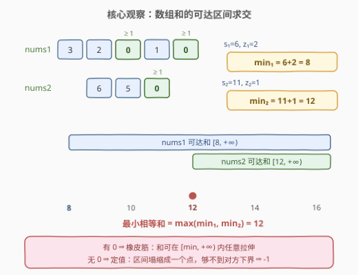
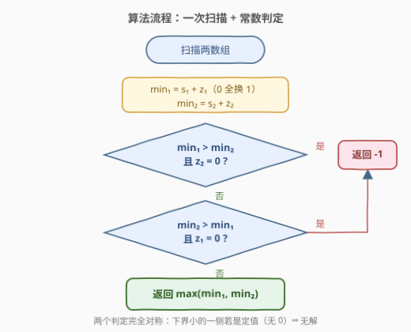
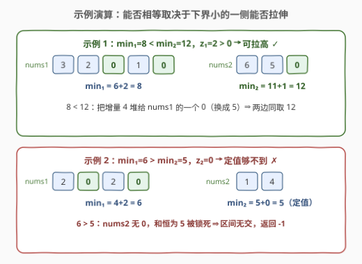

# LeetCode 数组的最小相等和 题解

## 1. 题目概述

- **标题 / 题号**：数组的最小相等和（#2918，medium）
- **链接**：https://leetcode.cn/problems/minimum-equal-sum-of-two-arrays-after-replacing-zeros/
- **难度**：中等
- **标签**：贪心、数组

**题意**：给你两个由**正整数和 0** 组成的数组 `nums1` 和 `nums2`。

你必须将两个数组中的**所有** `0` 替换为**严格**正整数，并满足两个数组中所有元素的**和相等**。

返回**最小相等和**；如果无法使两数组相等，则返回 `-1`。

**示例 1**：

```text
输入：nums1 = [3,2,0,1,0], nums2 = [6,5,0]
输出：12
解释：可以按下述方式替换数组中的 0：
- 用 2 和 4 替换 nums1 中的两个 0，得到 nums1 = [3,2,2,1,4]。
- 用 1 替换 nums2 中的一个 0，得到 nums2 = [6,5,1]。
两个数组的元素和相等，都等于 12。可以证明这是可以获得的最小相等和。
```

**示例 2**：

```text
输入：nums1 = [2,0,2,0], nums2 = [1,4]
输出：-1
解释：无法使两个数组的和相等。
```

**约束**：

- $1 \le \text{nums1.length}, \text{nums2.length} \le 10^5$
- $0 \le \text{nums1}[i], \text{nums2}[i] \le 10^6$

> 💡 本题核心是「**可达区间求交**」。每个数组替换后的元素和不是一个定值，而是一个集合：有 0 时是区间 $[\text{sum}+z,\ +\infty)$（每个 0 至少换成 1，且可以无限调大），无 0 时是单点 $\{\text{sum}\}$。两个集合取交，**交的最小元素**就是答案——交为空则返回 $-1$。全程一次线性扫描。

## 2. 解题思路

### 2.1 暴力思路：枚举目标和 T

「使两数组和相等」的目标值 $T$ 未知，最直接的想法是**从小到大枚举 $T$**，对每个 $T$ 分别验证两个数组能否取到该和，第一个可行的 $T$ 即答案。若进一步退化为「枚举所有 0 的替换组合」，那是指数级方案，连验证都谈不上。

先看验证怎么做：设 $s_i$ 为第 $i$ 个数组的元素和、$z_i$ 为其中 0 的个数——

- 若 $z_i > 0$：把某个 0 多换 $k$ 就能让和增加 $k$，因此**一切 $T \ge s_i + z_i$ 都可达**；
- 若 $z_i = 0$：和是**定值** $s_i$，只有 $T = s_i$ 可达。

问题在于 $T$ 的上界：数组和最大可达 $10^5 \times 10^6 = 10^{11}$，逐个枚举必然超时。

> ⚠️ 但上面的验证规则暴露了一个关键事实：**可达性只与下界 $s_i + z_i$ 和是否有 0 有关，与 $T$ 的具体大小无关**。于是「从小到大枚举 $T$」的循环第一步就会命中 $T = \max(\text{min}_1, \text{min}_2)$——或者永远命中不了。枚举就此坍缩成一个 $O(1)$ 公式，这正是 2.2 的观察。

### 2.2 核心观察：可达集合是区间，答案是区间交的最小元素



对每个数组定义**基线和**（把所有 0 都换成 1 时的和）：

$$\text{min}_i = s_i + z_i$$

**观察 1（可达集合）**：替换后元素和的可达集合为

$$\text{可达集合}_i = \begin{cases} [\,\text{min}_i,\ +\infty), & z_i > 0 \quad \text{（橡皮筋：可任意拉伸）} \\ \{\, s_i \,\}, & z_i = 0 \quad \text{（定值：区间塌缩成单点）} \end{cases}$$

关键是有 0 时区间**无缺口**：要凑更大的和，把全部增量堆给**任意一个** 0 即可，中间任何整数都不会被跳过。

**观察 2（答案 = 交的最小元素）**：两个集合若有交，交必然形如 $[\max(\text{min}_1, \text{min}_2),\ +\infty)$（或单点），其最小元素就是

$$\text{答案} = \max(\text{min}_1, \text{min}_2)$$

**观察 3（无解判定）**：交为空当且仅当**下界小的一侧是定值**——它被锁死在自己的 $s_i$ 上，永远够不到对方的下界：

$$\text{min}_1 < \text{min}_2 \wedge z_1 = 0 \;\Rightarrow\; -1 \qquad \text{（对称地 } \text{min}_2 < \text{min}_1 \wedge z_2 = 0 \Rightarrow -1\text{）}$$

> 💡 官方 hints 说的正是这两步：「先把所有 0 换成 1；若和较小的一侧原本没有 0，答案为 $-1$；否则把该侧的某个 1 调大即可」。

### 2.3 算法流程图



**完整步骤**：

1. **一趟扫描**：统计 $s_1, z_1, s_2, z_2$。
2. **计算基线**：$\text{min}_1 = s_1 + z_1$，$\text{min}_2 = s_2 + z_2$。
3. **两次无解判定**：
   - $\text{min}_1 < \text{min}_2$ 且 $z_1 = 0$ → 返回 $-1$；
   - $\text{min}_2 < \text{min}_1$ 且 $z_2 = 0$ → 返回 $-1$。
4. **返回** $\max(\text{min}_1, \text{min}_2)$。

> 💡 流程里两个判定分支完全对称，本质是同一句话：「**下界小的一侧必须有 0，才能被拉到对方的高度**」。两下界相等时无需任何判定，直接返回该值；两侧都有 0 时永远有解。

### 2.4 示例演算



**示例 1**：`nums1 = [3,2,0,1,0]`, `nums2 = [6,5,0]`

| 数组 | $s$ | $z$ | $\text{min} = s+z$ | 可达集合 |
|------|-----|-----|--------------------|----------|
| nums1 | 6 | 2 | **8** | $[8, +\infty)$ |
| nums2 | 11 | 1 | **12** | $[12, +\infty)$ |

$\max(8, 12) = 12$；下界小的是 nums1，$z_1 = 2 > 0$，可拉高 ⇒ 答案 **12**。构造方案：nums1 基线为 $[3,2,1,1,1]$（和 8），把增量 4 全堆给一个 0 换成 5，得 $[3,2,5,1,1]$；nums2 的 0 换成 1 得 $[6,5,1]$，两边都是 12。

**示例 2**：`nums1 = [2,0,2,0]`, `nums2 = [1,4]`

| 数组 | $s$ | $z$ | $\text{min} = s+z$ | 可达集合 |
|------|-----|-----|--------------------|----------|
| nums1 | 4 | 2 | **6** | $[6, +\infty)$ |
| nums2 | 5 | 0 | **5** | $\{5\}$（定值） |

$\max(6, 5) = 6$；但下界小的是 nums2，$z_2 = 0$，被锁死在 5 上 ⇒ 交为空，返回 **-1**。

## 3. 参考代码

### C++

```cpp
class Solution {
public:
    long long minSum(vector<int>& nums1, vector<int>& nums2) {
        long long s1 = 0, s2 = 0, z1 = 0, z2 = 0;    // s: 元素和, z: 0 的个数
        for (int x : nums1) { s1 += x; z1 += (x == 0); }
        for (int x : nums2) { s2 += x; z2 += (x == 0); }
        long long min1 = s1 + z1;                    // 基线和：所有 0 换成 1
        long long min2 = s2 + z2;
        if (min1 < min2 && z1 == 0) return -1;       // nums1 定值，够不到 min2
        if (min2 < min1 && z2 == 0) return -1;       // nums2 定值，够不到 min1
        return max(min1, min2);                      // 区间交的最小元素
    }
};
```

### Python

```python
class Solution:
    def minSum(self, nums1: List[int], nums2: List[int]) -> int:
        s1, z1 = sum(nums1), nums1.count(0)           # 元素和 与 0 的个数
        s2, z2 = sum(nums2), nums2.count(0)
        min1, min2 = s1 + z1, s2 + z2                 # 基线和：所有 0 换成 1
        if min1 < min2 and z1 == 0: return -1         # nums1 定值，够不到 min2
        if min2 < min1 and z2 == 0: return -1         # nums2 定值，够不到 min1
        return max(min1, min2)                        # 区间交的最小元素
```

> ⚠️ **必须用 64 位整数**：数组和最大 $10^5 \times 10^6 = 10^{11}$，远超 `int` 上界（约 $2.1 \times 10^9$）。C++ 中累加变量与返回值都要 `long long`；Python 整数天然无溢出。这是本题唯一的实现陷阱。

## 4. 复杂度分析

| 维度 | 复杂度 | 说明 |
|------|--------|------|
| **时间复杂度** | $O(n + m)$ | 各扫描一遍两数组统计 $s, z$，其余为常数次比较 |
| **空间复杂度** | $O(1)$ | 只用 $s_1, z_1, s_2, z_2$ 等常数个变量 |

> 💡 $O(n+m)$ 已是信息下界：不看完每个元素就无法知道和与 0 的个数，任何正确算法都至少要读一遍输入。

## 5. 扩展：替换值带上界时的双端区间求交

本题中 0 可以替换成**任意大**的正整数，所以可达区间只有下端点、上端为 $+\infty$。若变形为「0 必须替换为 $[1, L]$ 内的正整数」，可达集合变成**闭区间**：

$$[\, s + z,\ \ s + L \cdot z \,]$$

（下端：全部换成 1；上端：全部换成 $L$；中间无缺口——增量可在 $[0, (L-1)z]$ 内任意分配。）

两个闭区间 $[a_1, b_1]$、$[a_2, b_2]$ 有交的充要条件是 $\max(a_1, a_2) \le \min(b_1, b_2)$，最小相等和即 $\max(a_1, a_2)$。代码只需把两处「定值判定」换成这一条双端判定，框架零改动。

> 💡 这一推广与 [1785. 构成特定和需要添加的最少元素](../1701-1800/1785_构成特定和需要添加的最少元素.md) 同属「**有界加数凑目标和**」家族：那边问「最少加几个」，这边问「最小能凑到几」，本质都在刻画**和的可达区间**。面试中主动把单边区间推广到双端闭区间，是展示模型理解的好抓手。

## 6. 面试要点

1. **为什么答案恰好是 $\max(\text{min}_1, \text{min}_2)$，不需要尝试更大的 $T$？**

   - 两侧的可达集合要么是无上界区间、要么是单点。若两集合有交，交的最小元素不可能小于任一侧下界；而取 $T = \max(\text{min}_1, \text{min}_2)$ 时，下界大的一侧取基线即可、下界小的一侧（若有 0）把增量堆给一个 0 即可——恰好在 $T$ 处相遇。所以答案若存在，必然就是这个值。

2. **什么时候返回 $-1$？**

   - 当且仅当**下界小的一侧没有 0**：其和被锁死在 $s_i$（单点集合），永远够不到对方下界。注意对称性与特例：两下界相等时永远有解（即使两侧都无 0，都取自身和即可）；两侧都有 0 时也永远有解。

3. **如何证明有 0 时可达区间无缺口？**

   - 设基线和为 $\text{min}$，目标 $T \ge \text{min}$，增量 $\Delta = T - \text{min} \ge 0$。把 $\Delta$ **全部堆给任意一个 0**（该 0 换成 $1 + \Delta$），其余 0 保持换 1，即得和恰为 $T$ 的方案。单点分配即证明连续性。

4. **实现上有哪些坑？**

   - 两个：一是**溢出**——和最大 $10^{11}$，C++ 必须 `long long`；二是把无解条件误写成「任一侧无 0」或「min 不等即无解」——正确条件是 $\text{min}_1 < \text{min}_2 \wedge z_1 = 0$（及其对称），下界相等时即便两侧都无 0 也有解。

5. **如果 0 的替换值限制在 $[1, L]$ 内，算法怎么改？**

   - 可达集合变为闭区间 $[s+z,\ s+Lz]$，判定改为「区间求交」：$\max(a_1, a_2) \le \min(b_1, b_2)$ 时返回 $\max(a_1, a_2)$，否则 $-1$（见第 5 节）。

> 💡 **一句话总结**：2918 是「**区间求交**」的贪心签到题——每个数组的和要么是可无限拉伸的橡皮筋 $[\text{sum}+z, +\infty)$，要么是定值单点；答案就是两个集合交的最小元素 $\max(\text{min}_1, \text{min}_2)$，下界小的一侧若是定值则无解。全程一次扫描，唯一陷阱是 64 位求和。

## 同类练习题

| # | 题目 | 与本题的关联 |
|---|------|-------------|
| 453 | [最小操作次数使数组元素相等](https://leetcode.cn/problems/minimum-moves-to-equal-array-elements/) | 「使相等」的 sum 不变量视角——$n-1$ 个元素 +1 等价于 1 个元素 −1，答案 $\sum - n \cdot \min$ |
| 1785 | [构成特定和需要添加的最少元素](https://leetcode.cn/problems/minimum-elements-to-add-to-form-a-given-sum/) | 有界加数凑目标和的最少个数，上取整贪心，与本题同为「和的可达性」刻画 |
| 1877 | [数组中最大数对和的最小值](https://leetcode.cn/problems/minimize-maximum-pair-sum-in-array/) | 最小化 max 的排序贪心配对，与「最小相等和」同属下界思维 |
| 2448 | [使数组相等的最小开销](https://leetcode.cn/problems/minimum-cost-to-make-array-equal/) | 「使全体相等」目标的加权中位数经典困难版 |
| 462 | [最少移动次数使数组元素相等 II](https://leetcode.cn/problems/minimum-moves-to-equal-array-elements-ii/) | 中位数版 make-equal，与 453/2448 构成「使相等」三部曲 |
