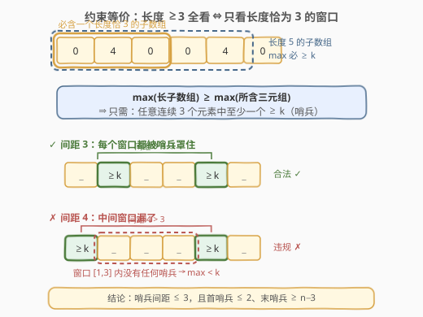
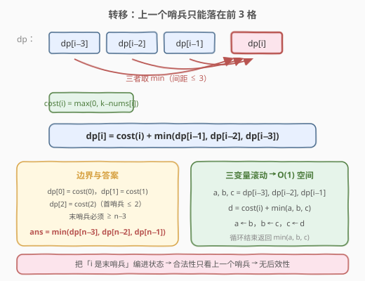
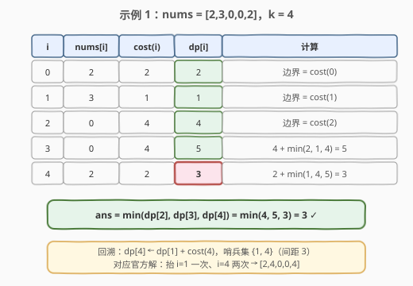

# 使数组变美的最小增量运算数

- **题目名称**：使数组变美的最小增量运算数
- **链接**：[2919. 使数组变美的最小增量运算数](https://leetcode.cn/problems/minimum-increment-operations-to-make-array-beautiful/)
- **难度**：中等
- **标签**：数组、动态规划

## 1. 题目概述

给你一个下标从 **0** 开始、长度为 $n$ 的整数数组 `nums` 和一个整数 $k$。你可以执行下述**递增**运算**任意**次（可以是 0 次）：

- 从范围 $[0, n-1]$ 中选择一个下标 $i$，并将 `nums[i]` 的值加 1。

如果数组中任何长度**大于等于 3** 的子数组，其**最大**元素都大于等于 $k$，则认为数组是一个**美丽数组**。以整数形式返回使数组变为美丽数组需要执行的**最小**递增运算数。

**子数组**是数组中的一个连续**非空**元素序列。

**示例 1**：

```text
输入：nums = [2,3,0,0,2], k = 4
输出：3
解释：对 i = 1 加 1 得 [2,4,0,0,2]，再对 i = 4 加两次得 [2,4,0,0,4]。
所有长度 ≥3 的子数组 [2,4,0]、[4,0,0]、[0,0,4]、[2,4,0,0]、[4,0,0,4]、[2,4,0,0,4]
的最大元素都等于 k = 4，故为美丽数组。可以证明最少需要 3 次运算。
```

**示例 2**：

```text
输入：nums = [0,1,3,3], k = 5
输出：2
解释：对 i = 2 加两次得 [0,1,5,3]，子数组 [0,1,5]、[1,5,3]、[0,1,5,3] 的最大元素均为 5。
```

**示例 3**：

```text
输入：nums = [1,1,2], k = 1
输出：0
解释：唯一长度 ≥3 的子数组 [1,1,2] 最大元素为 2 ≥ 1，无需任何操作。
```

**约束条件**：

- $3 \le n = nums.length \le 10^5$
- $0 \le nums[i] \le 10^9$
- $0 \le k \le 10^9$

---

## 2. 解题思路

### 2.1 暴力思路：组合爆炸，贪心有反例

每个元素「抬到 $\ge k$」是有代价的（$\max(0, k - nums[i])$），抬哪些位置是一个组合决策：所有长度 3 窗口都要被「已抬位置」覆盖。枚举子集是 $2^n$，不可行。

直觉贪心「从左到右扫描，遇到不满足的窗口就抬窗口最右端元素」也不对。反例：$nums = [0,4,0,0,4,0]$、$k = 5$：

- 贪心：窗口 $[0,4,0]$ 不满足 → 抬 $i=2$ 花 5；随后窗口 $[0,4,0]$（下标 2..4）仍不满足 → 抬 $i=5$ 花 5，共 **10** 次；
- 最优：只抬 $i=1$ 和 $i=4$（各花 1，$4 \to 5$），共 **2** 次即得 $[0,5,0,0,5,0]$。

**抬一个位置会同时影响至多 3 个窗口，决策相互耦合**，局部修补无法保证全局最优——需要动态规划。

### 2.2 核心观察：约束等价简化 + 「哨兵」线性 DP



**观察 1：只需检查长度恰好为 3 的子数组。** 任何长度 $\ge 3$ 的子数组必然包含某个长度恰为 3 的子数组，而大子数组的最大值 $\ge$ 其所含三元组的最大值。于是

$$\text{所有长度} \ge 3 \text{ 子数组 } \max \ge k \iff \text{任意连续 3 个元素中至少一个} \ge k$$

**观察 2：每个位置只有两种命运。** 要么被抬到 $\ge k$——抬到**恰好** $k$ 即可，再多纯属浪费；要么不动。称最终值 $\ge k$ 的位置为**哨兵**，代价 $cost(i) = \max(0,\ k - nums[i])$（本来就不小于 $k$ 的位置代价为 0，白送的哨兵）。

**观察 3：哨兵间距必须 $\le 3$。** 若相邻两个哨兵位于 $j < i$ 且中间无其他哨兵，则区间内的窗口 $[j+1,\ j+3]$ 存在（当 $i - j \ge 4$）且不含任何哨兵，违规。反之相邻间距 $\le 3$、首个哨兵下标 $\le 2$、末个哨兵下标 $\ge n-3$ 时，每个窗口 $[t, t+2]$ 必含某个哨兵。

把「末个哨兵是谁」编进状态，即得无后效性的转移：

$$dp[i] = \text{位置 } i \text{ 是哨兵，且 } [0, i] \text{ 内所有窗口均合法的最小总代价}$$

$$dp[i] = cost(i) + \min\big(dp[i-1],\ dp[i-2],\ dp[i-3]\big)$$

即「上一个哨兵」只能落在 $i-1, i-2, i-3$（间距 $\le 3$），取最小前缀代价。边界 $dp[0] = dp[1] = dp[2] = cost$（首个哨兵必须下标 $\le 2$）。由末哨兵 $\ge n-3$，答案为：

$$ans = \min\big(dp[n-3],\ dp[n-2],\ dp[n-1]\big)$$

> 💡 状态定义的妙处：不定义「前 $i$ 个元素合法」这种**全局**状态，而是定义「$i$ 是最后一个哨兵」这种**带附加信息**的状态——末哨兵身份正是转移所需的全部信息，间距约束因此变成对前 3 项的简单 `min`。

### 2.3 算法流程：三变量滚动



1. 计算 $cost(i) = \max(0, k - nums[i])$，初始化三个滚动变量 $a, b, c = dp[i-3], dp[i-2], dp[i-1] \leftarrow cost(0), cost(1), cost(2)$；
2. $i$ 从 3 到 $n-1$：$d = cost(i) + \min(a, b, c)$，随后 $a \leftarrow b,\ b \leftarrow c,\ c \leftarrow d$；
3. 返回 $\min(a, b, c)$（即 $dp[n-3], dp[n-2], dp[n-1]$ 的最小值）。

> ⚠️ **溢出**：$n \le 10^5$、$cost \le 10^9$，答案可达约 $\lceil n/3 \rceil \times 10^9 \approx 3.4 \times 10^{13}$，C++ 必须用 `long long`；`k - nums[i]` 虽在 `int` 范围内（$\le 10^9 < 2^{31}$），与 `0LL` 比较更稳妥。

### 2.4 示例演算



以示例 1 `nums = [2,3,0,0,2], k = 4` 为例，$cost = [2,1,4,4,2]$：

| $i$ | $nums[i]$ | $cost(i)$ | $dp[i]$ | 计算 |
|-----|-----------|-----------|---------|------|
| 0 | 2 | 2 | **2** | 边界，$= cost(0)$ |
| 1 | 3 | 1 | **1** | 边界，$= cost(1)$ |
| 2 | 0 | 4 | **4** | 边界，$= cost(2)$ |
| 3 | 0 | 4 | **5** | $4 + \min(2,1,4) = 5$ |
| 4 | 2 | 2 | **3** | $2 + \min(1,4,5) = 3$ |

答案 $= \min(dp[2], dp[3], dp[4]) = \min(4, 5, 3) = 3$ ✓

回溯路径：$dp[4]$ 由 $dp[1] + cost(4)$ 得到，哨兵集 $\{1, 4\}$（间距 3 ✓），对应官方解「抬 $i=1$ 一次、$i=4$ 两次」，最终数组 $[2,4,0,0,4]$。

---

## 3. 参考代码

### C++

```cpp
class Solution {
  public:
    long long minIncrementOperations(vector<int>& nums, int k) {
        auto cost = [&](int i) -> long long {
            return max(0LL, (long long)k - nums[i]);  // 抬到恰好 k 即可
        };
        long long a = cost(0);  // dp[i-3]
        long long b = cost(1);  // dp[i-2]
        long long c = cost(2);  // dp[i-1]
        for (int i = 3; i < (int)nums.size(); i++) {
            long long d = cost(i) + min({a, b, c});
            a = b; b = c; c = d;
        }
        return min({a, b, c});  // 末哨兵 ∈ {n-3, n-2, n-1}
    }
};
```

### Python

```python
class Solution:
    def minIncrementOperations(self, nums: List[int], k: int) -> int:
        a, b, c = (max(0, k - x) for x in nums[:3])  # dp[i-3], dp[i-2], dp[i-1]
        for x in nums[3:]:
            a, b, c = b, c, max(0, k - x) + min(a, b, c)
        return min(a, b, c)
```

---

## 4. 复杂度分析

| 维度 | 复杂度 | 说明 |
|------|--------|------|
| 时间复杂度 | $O(n)$ | 每个位置一次转移，转移为常数次比较与加法 |
| 空间复杂度 | $O(1)$ | 三个滚动变量；`cost` 即算即用，无需数组 |

---

## 5. 扩展：从打家劫舍到「间隔约束」家族

- **约束的对偶**：打家劫舍（198/213）是**排斥型**约束——相邻元素不能同选，转移依赖前 2 项；本题是**覆盖型**约束——相邻哨兵间距**至多** 3，转移同样依赖前 3 项。一个「不能太近」，一个「不能太远」，骨架却是同一个：**把约束对象（上一个决策位置）编进状态，转移退化为对固定窗口内的前缀最优取 min/max**。
- **窗口长度推广**：若要求「任意连续 $m$ 个元素至少一个 $\ge k$」，只需把间距上界 3 换成 $m$：$dp[i] = cost(i) + \min_{1 \le d \le m} dp[i-d]$，答案取最后 $m$ 项的 min。$m$ 很大时可用**单调队列**维护滑动窗口最小值，仍是 $O(n)$（同 239 滑动窗口最大值的 deque 套路）。
- **对偶变换视角**：本题也可看作「代价最小的支配集」——在路径图上选代价最小的点集，使每个长度 3 窗口被支配。DP 是路径图上这类问题的通用解法；图复杂时（树形结构）则升级为树形 DP。

---

## 6. 面试要点

1. **为什么只需检查长度恰好为 3 的子数组？**

   - 长度 $L \ge 3$ 的子数组必含某个长度恰为 3 的子数组，且 $\max(\text{长子数组}) \ge \max(\text{所含三元组})$
   - 所以「所有 $\ge 3$ 的子数组 $\max \ge k$」$\iff$「所有三元组 $\max \ge k$」$\iff$「任意连续 3 个元素至少一个 $\ge k$」——约束从 $O(n^2)$ 个子数组坍缩成 $O(n)$ 个窗口

2. **为什么每个位置抬到恰好 $k$ 就够，不会出现抬更高的最优解？**

   - 美丽条件只关心「最大元素 $\ge k$」，元素是否超过 $k$ 对合法性没有额外收益
   - 交换论证：任何把某位置抬超过 $k$ 的方案，把超出部分砍掉仍合法且代价更小

3. **DP 状态为什么定义成「$i$ 是哨兵」而不是「前 $i$ 个元素构成的数组美丽」？**

   - 后者是全局状态：要判断前 $i$ 个是否合法，必须知道**最后一个哨兵在哪**，不把这个信息编进状态就有后效性
   - 定义 $dp[i]$ = 「$i$ 是末哨兵」的最小代价后，转移只需上一个哨兵位置 $j \in \{i-1, i-2, i-3\}$，恰好覆盖间距约束的全部信息
   - 这是「状态 = 转移所需的充分统计量」的典型例子，与 740 按值域建桶后回归打家劫舍同属一族

4. **为什么答案是最后三个 dp 值的 min，而不是 $dp[n-1]$？**

   - 合法性只要求**末个哨兵下标 $\ge n-3$**：其后不再有完整的长度 3 窗口（窗口起点最大为 $n-3$）
   - 强制 $n-1$ 必须是哨兵会多做无用功——例如 $[5,0,0,5,0,0]$（$k=5$）中哨兵 $\{0, 3\}$ 已合法，末位无需再抬

5. **数据范围上有哪些坑？**

   - $nums[i], k \le 10^9$：$k - nums[i]$ 恰好贴着 `int` 上限的量级，C++ 中建议 `(long long)k - nums[i]` 或与 `0LL` 比较，杜绝隐式截断
   - 答案量级：最多 $\lceil n/3 \rceil \approx 3.4 \times 10^4$ 个哨兵、每个代价 $10^9$，总和约 $3.4 \times 10^{13}$，远超 `int`，返回值必须 `long long`（函数签名已提示）

---

## 7. 同类练习题

- [198. 打家劫舍](https://leetcode.cn/problems/house-robber/)（[题解](../0101-0200/198_打家劫舍.md)）：排斥型间隔约束的鼻祖（相邻不能同选，依赖前 2 项），与本题覆盖型约束（间距不能超 3，依赖前 3 项）互为镜像
- [213. 打家劫舍 II](https://leetcode.cn/problems/house-robber-ii/)（[题解](../0201-0300/213_打家劫舍II.md)）：环上打家劫舍的拆环技巧，对照本题线性 DP 的简洁性
- [740. 删除并获得点数](https://leetcode.cn/problems/delete-and-earn/)（[题解](../0701-0800/740_删除并获得点数.md)）：值域建桶后回归打家劫舍，体会「约束对象编进状态」的普适性
- [746. 使用最小花费爬楼梯](https://leetcode.cn/problems/min-cost-climbing-stairs/)（[题解](../0701-0800/746_使用最小花费爬楼梯.md)）：依赖前 2 项取 min 的入门线性 DP，本题的三变量滚动是它的直接推广
