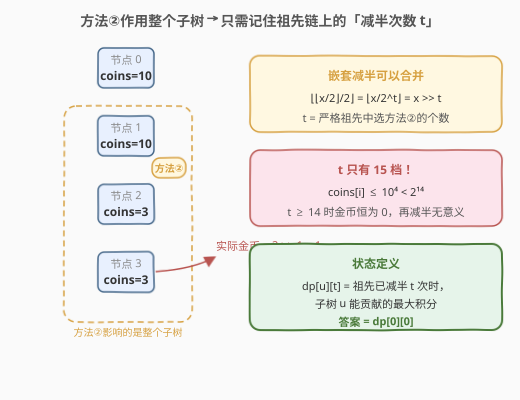
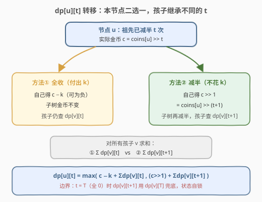
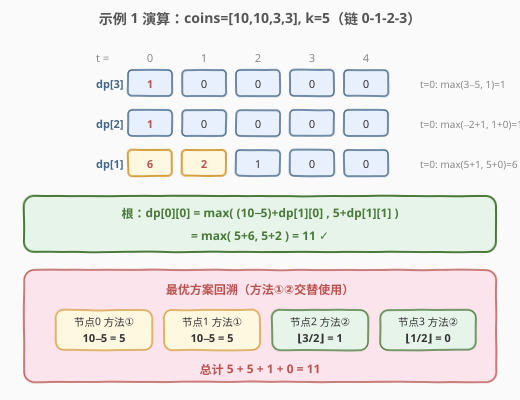

# 收集所有金币可获得的最大积分

- **题目名称**：收集所有金币可获得的最大积分
- **链接**：[2920. 收集所有金币可获得的最大积分](https://leetcode.cn/problems/maximum-points-after-collecting-coins-from-all-nodes/)
- **难度**：困难
- **标签**：树、动态规划、树形 DP

## 1. 题目概述

有一棵由 `n` 个节点组成的无向树，以 `0` 为根节点，节点编号从 `0` 到 `n - 1`。给你一个长度为 `n - 1` 的二维整数数组 `edges`，其中 `edges[i] = [ai, bi]` 表示节点 `ai` 和 `bi` 之间存在一条边。另给你一个下标从 **0** 开始、长度为 `n` 的数组 `coins` 和一个整数 `k`，其中 `coins[i]` 表示节点 `i` 处的金币数量。

从根节点开始，你必须收集**所有**金币。要想收集节点上的金币，必须先收集该节点的祖先节点上的金币。

节点 `i` 上的金币可以用下述方法**之一**进行收集：

- **方法①**：得到 `coins[i] - k` 点积分。如果 `coins[i] - k` 是负数，将会**失去** `abs(coins[i] - k)` 点积分；
- **方法②**：得到 `floor(coins[i] / 2)` 点积分。此时节点 `i` **子树中所有节点** `j` 的金币数减少至 `floor(coins[j] / 2)`。

返回收集所有树节点的金币之后可以获得的**最大积分**。

**示例 1**：

```text
输入：edges = [[0,1],[1,2],[2,3]], coins = [10,10,3,3], k = 5
输出：11
解释：节点 0、1 用方法①，各得 10−5 = 5 分；节点 2 用方法②，得 ⌊3/2⌋ = 1 分，
     且节点 3 的金币减为 ⌊3/2⌋ = 1；节点 3 再用方法②，得 ⌊1/2⌋ = 0 分。总计 5+5+1+0 = 11。
```

**示例 2**：

```text
输入：edges = [[0,1],[0,2]], coins = [8,4,4], k = 0
输出：16
解释：k = 0 时方法①不扣代价，全部用方法①：(8−0) + (4−0) + (4−0) = 16。
```

**约束条件**：

- $n == coins.length$
- $2 \le n \le 10^5$
- $0 \le coins[i] \le 10^4$
- $edges.length == n - 1$
- $0 \le edges[i][0], edges[i][1] < n$
- $0 \le k \le 10^4$

---

## 2. 解题思路

### 2.1 暴力思路：枚举每个节点的方法选择

每个节点都有方法①/②两种独立选择，共 $2^n$ 种组合——$n \le 10^5$ 时天文数字，**不可行**。

那贪心呢？也不行。方法②看似"免单"（不付出 $k$），却会把**整个子树**的金币减半，可能毁掉后代的一大笔金币；方法①保住子树金币，但可能立刻倒扣积分。两种代价一个"现在付"、一个"子孙付"，局部无法比较。看示例 1 的根节点：方法①得 $10-5=5$ 分、方法②也得 $\lfloor 10/2 \rfloor = 5$ 分，**局部打平**，但方法①保住了子节点 1 的 10 枚金币（子树最优 6 分），方法②却把它砍半（子树最优只剩 2 分），全局差距悬殊。决策相互纠缠 → 必须动态规划。

### 2.2 核心观察：祖先链上的「减半次数」是唯一需要记住的状态



方法②的作用范围是「$u$ 的整个子树」，而收集顺序自根向下，祖先永远先于子孙决策。于是对任意节点 $u$，它的**实际金币**只取决于一件事——**严格祖先中有多少个节点选了方法②**：

$$\text{effective}(u) = \left\lfloor \frac{\left\lfloor \frac{coins[u]}{2} \right\rfloor}{2} \right\rfloor \cdots = coins[u] \gg t$$

嵌套的向下取整除以 $2$ 可以**合并为一次右移**（$\lfloor \lfloor x/2 \rfloor /2 \rfloor = \lfloor x/2^2 \rfloor$，对非负整数成立），记 $t$ 为祖先选方法②的次数。

而 $coins[i] \le 10^4 < 2^{14}$，所以 $t \ge 14$ 时金币恒为 $0$，再减半毫无意义——**$t$ 只有 $0 \sim 14$ 共 15 个取值**！于是定义：

$$dp[u][t] = \text{当 } u \text{ 的严格祖先共选了 } t \text{ 次方法②时，子树 } u \text{ 能贡献的最大积分}$$

答案即 $dp[0][0]$（根没有祖先）。

> 💡 状态设计的关键一步是「**效果的压缩**」：方法②的影响看似是"一整棵子树的连续修改"，但沿任何一条根到节点的路径看，它退化为一个可加的计数器 $t$；又因为值域有限，$t$ 自动封顶在 $\log_2(\max coins)$。影响范围大 ≠ 状态必须复杂。

### 2.3 算法流程：自底向上合并 + 迭代防爆栈



记 $c = coins[u] \gg t$ 为 $u$ 的实际金币，转移方程：

$$dp[u][t] = \max\Big(\underbrace{(c - k) + \sum_{v} dp[v][t]}_{\text{方法①：孩子继承 } t},\ \underbrace{(coins[u] \gg (t{+}1)) + \sum_{v} dp[v][t{+}1]}_{\text{方法②：孩子继承 } t+1}\Big)$$

- **方法①**：自己得 $c - k$（可为负），子树金币不变，每个孩子 $v$ 仍按 $t$ 查表；
- **方法②**：自己得 $c \gg 1$（即 $coins[u] \gg (t{+}1)$），子树再整体减半，孩子按 $t+1$ 查表。

实现要点：

1. **状态上限**：取 $T = \mathrm{bit\_length}(\max coins) \le 14$，$t \in [0, T]$。当 $t = T$ 时所有金币已为 $0$，$dp[v][t+1]$ 用 $dp[v][T]$ 兜底（全零状态"自锁"，多减半不再变化）；
2. **迭代树形 DP**：$n \le 10^5$，链形树递归深度会爆栈（Python 必炸，C++ 也悬）。做法：从根 **BFS** 得到访问序与父节点，再**逆序**处理每个节点——逆 BFS 序保证处理 $u$ 时其所有孩子已算完，等价于后序自底向上合并；
3. 叶子节点两个求和项为 $0$，天然成为递归边界。

### 2.4 示例演算



以示例 1 `coins = [10,10,3,3], k = 5`（链 `0-1-2-3`，$T = \mathrm{bit\_length}(10) = 4$）为例，自底向上：

| 节点 | dp[t=0] | dp[t=1] | dp[t=2] | dp[t=3] | dp[t=4] |
|------|---------|---------|---------|---------|---------|
| 3（叶） | max(3−5, 1) = **1** | 0 | 0 | 0 | 0 |
| 2 | max(−2+1, 1+0) = **1** | 0 | 0 | 0 | 0 |
| 1 | max(5+1, 5+0) = **6** | max(0+0, 2+0) = **2** | 1 | 0 | 0 |
| 0 | **max(5+6, 5+2) = 11** | — | — | — | — |

最优方案回溯：节点 0、1 用方法①（各得 5），节点 2、3 用方法②（得 1、0），总计 $11$ ✓。

注意节点 1 在 $t=0$ 与 $t=1$ 两个状态下最优**方法不同**（前者方法①更优、后者方法②更优）——这正是必须把 $t$ 带进状态、不能"每点独立贪心"的直接证据。

---

## 3. 参考代码

### C++

```cpp
class Solution {
  public:
    int maximumPoints(vector<vector<int>>& edges, vector<int>& coins, int k) {
        int n = coins.size();
        int T = 0;                          // T = bit_length(max coins) ≤ 14
        for (int c : coins)
            if (c) T = max(T, 32 - __builtin_clz(c));

        vector<vector<int>> g(n);
        for (auto& e : edges) {
            g[e[0]].push_back(e[1]);
            g[e[1]].push_back(e[0]);
        }

        // BFS 定序：order 为自顶向下的访问序，parent 记录父节点
        vector<int> parent(n, -1), order;
        order.reserve(n);
        vector<char> seen(n, false);
        seen[0] = true;
        vector<int> q = {0};
        for (int i = 0; i < (int)q.size(); i++) {
            int u = q[i];
            order.push_back(u);
            for (int v : g[u]) {
                if (!seen[v]) {
                    seen[v] = true;
                    parent[v] = u;
                    q.push_back(v);
                }
            }
        }

        vector<vector<long long>> dp(n, vector<long long>(T + 1));
        for (int i = n - 1; i >= 0; i--) {          // 逆 BFS 序 = 自底向上
            int u = order[i];
            vector<long long> s1(T + 1, 0), s2(T + 1, 0);
            for (int v : g[u]) {
                if (v == parent[u]) continue;       // 跳过父边
                for (int t = 0; t <= T; t++) {
                    s1[t] += dp[v][t];              // 方法①：孩子继承 t
                    s2[t] += dp[v][min(t + 1, T)];  // 方法②：孩子继承 t+1（t=T 时自锁）
                }
            }
            for (int t = 0; t <= T; t++) {
                long long opt1 = (coins[u] >> t) - k + s1[t];
                long long opt2 = (coins[u] >> (t + 1)) + s2[t];
                dp[u][t] = max(opt1, opt2);
            }
        }
        return dp[0][0];
    }
};
```

### Python

```python
class Solution:
    def maximumPoints(self, edges: List[List[int]], coins: List[int], k: int) -> int:
        n = len(coins)
        T = max(coins).bit_length()          # ≤ 14

        g = [[] for _ in range(n)]
        for a, b in edges:
            g[a].append(b)
            g[b].append(a)

        parent = [-1] * n
        order = []
        seen = [False] * n
        seen[0] = True
        q = deque([0])
        while q:                              # BFS 定序
            u = q.popleft()
            order.append(u)
            for v in g[u]:
                if not seen[v]:
                    seen[v] = True
                    parent[v] = u
                    q.append(v)

        dp = [[0] * (T + 1) for _ in range(n)]
        for u in reversed(order):             # 逆 BFS 序 = 自底向上
            s1 = [0] * (T + 1)
            s2 = [0] * (T + 1)
            for v in g[u]:
                if v == parent[u]:
                    continue
                for t in range(T + 1):
                    s1[t] += dp[v][t]                   # 方法①：孩子继承 t
                    s2[t] += dp[v][min(t + 1, T)]       # 方法②：孩子继承 t+1
            for t in range(T + 1):
                opt1 = (coins[u] >> t) - k + s1[t]
                opt2 = (coins[u] >> (t + 1)) + s2[t]
                dp[u][t] = max(opt1, opt2)
        return dp[0][0]
```

> 💡 两个求和数组 `s1`/`s2` 在进入节点前重置为全 0，叶子节点天然取转移的"无求和项"版本；`min(t+1, T)` 的兜底依赖一个不变式：$t = T$ 时一切金币为 0，方法②得分 0 且不吃 $-k$，多减半状态不变。

---

## 4. 复杂度分析

| 维度 | 复杂度 | 说明 |
|------|--------|------|
| 时间复杂度 | $O(n \cdot \log(\max coins))$ | 每个节点转移 $T+1 \le 15$ 个状态；$n = 10^5$ 时约 $1.5 \times 10^6$ 次基本操作 |
| 空间复杂度 | $O(n \cdot \log(\max coins))$ | `dp` 表 $n \times 15$；邻接表与 BFS 序共 $O(n)$ |

---

## 5. 扩展：结构特例与套路迁移

- **$k = 0$ 的退化**：方法①得分 $coins[u] \gg t$ 恒不小于方法②的 $coins[u] \gg (t{+}1)$，且不触发子树减半，归纳可知**全选方法①最优**，答案 $= \sum coins[i]$（示例 2 正是如此）。可作为 $O(n)$ 特判，不过 DP 本身已覆盖。
- **「影响子树」型决策的通用压缩**：本题与 2646（最小化旅行的价格总和，节点可减半但相邻不能同时减半）是近亲——都含"减半"操作。2646 的减半**只作用于节点自身**，但要加"父子不同时减半"约束，套打家劫舍式两状态合并；本题的减半**作用于整个子树**，约束反而宽松，靠 $\log$ 值域把影响压成计数维度。两种减半、两种状态设计，对照食用风味最佳。
- **若把「减半」改成「减一」**：状态数将膨胀到 $coins$ 值域且不再能合并（嵌套减一仍可合并为减 $t$，但 $t$ 上界变成 $\max coins$ 而非 $\log$），需要完全不同的思路（如按值域分层贪心），提示我们**状态维度能否压缩取决于运算的可结合性**。

---

## 6. 面试要点

1. **为什么状态只需记录减半次数 $t$，而不用管具体是哪些祖先减了半？**

   - 减半的效果**与顺序无关、可交换**：嵌套 $\lfloor \cdot/2 \rfloor$ 合并为一次右移 $coins[u] \gg t$；
   - 祖先的决策对 $u$ 子树的影响**仅通过"当前实际金币"传导**（无后效性/马尔可夫性），"怎样到达 $t$"不影响子树内部后续最优值。

2. **$t$ 的上界为什么是 14？边界怎么处理？**

   - $coins[i] \le 10^4 < 2^{14}$，$t \ge 14$ 时实际金币恒为 0；实现取 $T = \mathrm{bit\_length}(\max coins)$；
   - $t = T$ 时孩子下标 $t+1$ 越界，用 $\min(t{+}1, T)$ 兜底——全零状态下方法②得分 0 且不再改变任何值，状态"自锁"，替换合法。

3. **为什么不能对每个节点独立贪心选方法？**

   - 反例就在示例 1 的根：两方法**局部得分相同**（都是 5），但方法①保住子树金币（子树最优 6 vs 2），全局差 4 分；
   - 方法①的代价"现在付"（$-k$）、方法②的代价"子孙付"（子树减半），两者不在同一时间尺度，局部比较无意义——必须让 DP 把子孙的反馈自底向上传回来。

4. **$n = 10^5$ 的链，递归写法会怎样？**

   - Python 默认递归深度 1000，必炸；C++ 每层帧约几十字节，$10^5$ 层逼近默认栈上限，同样危险；
   - 标准替代：**BFS 求访问序 + 逆序处理**。逆 BFS 序保证任意节点排在所有子孙之后，等价于后序遍历的合并顺序，两语言通吃。

5. **中间值会溢出吗？**

   - 每节点贡献绝对值 $\le \max(coins[i], k) \le 10^4$，总计 $\le 10^5 \times 10^4 = 10^9$，恰好落在 `int` 边界内；
   - 官方签名返回 `int`，但稳妥起见 C++ 用 `long long` 做累加、返回时截断，防御未来约束放宽。

---

## 7. 同类练习题

- [337. 打家劫舍 III](https://leetcode.cn/problems/house-robber-iii/)（[题解](../0301-0400/337_打家劫舍III.md)）：树形 DP 入门——每点"选/不选"两状态后序合并，本题的退化骨架
- [968. 监控二叉树](https://leetcode.cn/problems/binary-tree-cameras/)（[题解](../0901-1000/968_监控二叉树.md)）：树形 DP 状态机（三状态互相约束），体会状态维度设计的另一范式
- [2646. 最小化旅行的价格总和](https://leetcode.cn/problems/minimize-the-total-price-of-the-trips/)（[题解](../2601-2700/2646_最小化旅行的价格总和.md)）：同款「减半」操作 + 打家劫舍式合并，本题最近亲
- [2538. 最大价值和与最小价值和的差值](https://leetcode.cn/problems/difference-between-maximum-and-minimum-price-sum/)（[题解](../2501-2600/2538_最大价值和与最小价值和的差值.md)）：无根树上同时维护最大/最小的带权路径 DP，树形 DP 进阶
- [2246. 相邻字符不同的最长路径](https://leetcode.cn/problems/longest-path-with-different-adjacent-characters/)（[题解](../2201-2300/2246_相邻字符不同的最长路径.md)）：子树合并时维护"最大与次大"的经典手法，同样是逆序处理
