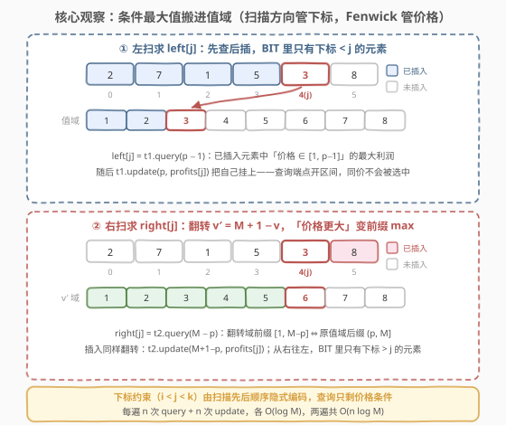
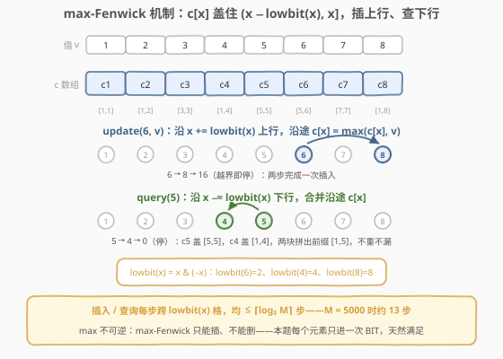
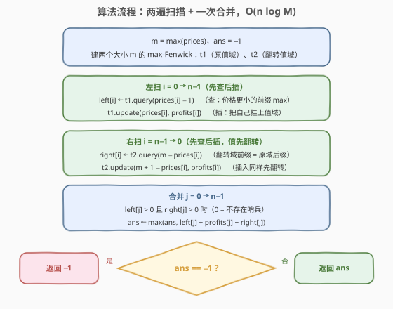
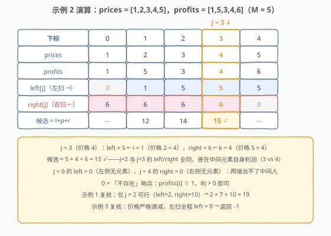

# 价格递增的最大利润三元组 II

- **题目名称**：价格递增的最大利润三元组 II
- **链接**：[2921. 价格递增的最大利润三元组 II](https://leetcode.cn/problems/maximum-profitable-triplets-with-increasing-prices-ii/)
- **难度**：困难
- **标签**：树状数组、线段树、数组

## 1. 题目概述

> ⚠️ 本题为 LeetCode 付费题，题意描述根据官方示例用例与 hints 重建，可能与官方题面有出入。

给定两个长度为 $n$ 的**下标从 0 开始**的数组 `prices` 和 `profits`。商店里有 $n$ 件商品，第 $i$ 件商品的价格为 `prices[i]`，利润为 `profits[i]`。

必须按以下条件选择**三件**商品：

- `prices[i] < prices[j] < prices[k]`，其中 `i < j < k`。

若选择的下标 $i, j, k$ 满足上述条件，则利润为 `profits[i] + profits[j] + profits[k]`。返回能得到的**最大利润**；若无法选出满足条件的三件商品，返回 `-1`。

**示例 1**：

```text
输入：prices = [10,2,3,4], profits = [100,2,7,10]
输出：19
解释：不能选下标 0 的商品（价格 10 全场最高，找不到满足条件的位置）。
唯一合法的三元组是下标 (1, 2, 3)：prices[1] < prices[2] < prices[3]，
利润为 2 + 7 + 10 = 19。
```

**示例 2**：

```text
输入：prices = [1,2,3,4,5], profits = [1,5,3,4,6]
输出：15
解释：价格严格递增，任何 i < j < k 都合法，挑利润和最大的三个：
下标 (1, 3, 4)，利润 5 + 4 + 6 = 15。
```

**示例 3**：

```text
输入：prices = [4,3,2,1], profits = [33,20,19,87]
输出：-1
解释：价格严格递减，不存在满足条件的三元组。
```

**约束条件**：

- $3 \le \text{prices.length} = \text{profits.length} \le 5 \times 10^4$
- $1 \le \text{prices}[i] \le 5000$
- $1 \le \text{profits}[i] \le 10^6$

> 💡 本题与 [2907. 价格递增的最大利润三元组 I](https://leetcode.cn/problems/maximum-profitable-triplets-with-increasing-prices-i/)（[题解](../2801-2900/2907_价格递增的最大利润三元组I.md)）题意完全相同，只是规模放大：$n$ 从 $2000$ 涨到 $5 \times 10^4$，I 版的 $O(n^2)$ 在这里要跑约 $2.5 \times 10^9$ 次，必然超时；同时价格上界从 $10^6$ 收紧到 $5000$——**小值域正是「直接开值域树状数组、无需离散化」的明示**。困难点不在建模（骨架照搬 I 版的「固定中间元素」），而在把两侧的「条件最大值查询」加速到 $O(\log M)$。

---

## 2. 解题思路

### 2.1 暴力思路：沿用 I 版的 O(n²) 枚举中间元素

I 版的做法：固定中间元素 $j$，左扫求 $\text{left}(j)$（左侧价格更小者的最大利润），右扫求 $\text{right}(j)$（右侧价格更大者的最大利润），两侧都有人则拼出候选 $\text{left} + \text{profits}[j] + \text{right}$，逐 $j$ 取 max。每次两侧查询是 $O(n)$ 线性扫描，总计 $O(n^2)$。

$n = 5 \times 10^4$ 时 $O(n^2) \approx 2.5 \times 10^9$：C++ 贴着时限挣扎，Python 必然超时。**瓶颈不在枚举骨架，而在「条件最大值」这个查询本身**——它被重复计算了 $n$ 遍，而相邻两次查询之间其实只差一个新元素进来。把「查询」从线性扫描变成数据结构操作，就是唯一的优化方向。

### 2.2 核心观察：把「条件最大值」搬进值域——max-Fenwick

沿用 I 版「固定 $j$、两侧解耦」的骨架，本步要加速的是两侧查询。两个洞察：

**洞察一：下标约束由扫描方向隐式编码。** 求 $\text{left}[j]$ 时从左往右扫，**先查后插**——查询发生时，BIT 里只有下标 $< j$ 的元素，`i < j` 不需要任何显式判断；求 $\text{right}[j]$ 时从右往左扫，同理 BIT 里只有下标 $> j$ 的元素。于是查询条件**只剩价格**。

**洞察二：价格条件是值域上的区间 max。** 「$\text{prices}[i] < p$」即「值域 $[1, p-1]$ 上已插入利润的最大值」——一个**前缀 max** 查询。用维护前缀最大值的树状数组（**max-Fenwick**）：单点插入、前缀查询均为 $O(\log M)$，其中 $M = \max(\text{prices}) \le 5000$。

右侧的「$\text{prices}[k] > p$」则是值域上的**后缀** max，而 Fenwick 天生只会前缀。**值域翻转**：令 $v' = M + 1 - v$，这是 $[1, M]$ 到自身的双射，且

$$v > p \iff v' < M + 1 - p$$

于是「原值域后缀 $(p, M]$」恰好镜像成「翻转值域前缀 $[1, M-p]$」——右侧也变成前缀 max，一个 BIT 模板通吃两个方向。



max-Fenwick 与普通求和树状数组同构，只是把合并运算从可逆的 $+$ 换成不可逆的 $\max$：

- `update(x, v)`：从 $x$ 出发沿 $x \mathrel{+}= \text{lowbit}(x)$ 上行，沿途 $c[x] = \max(c[x], v)$；
- `query(x)`：从 $x$ 出发沿 $x \mathrel{-}= \text{lowbit}(x)$ 下行，合并沿途的 $c[x]$，得到前缀 $[1, x]$ 的 max。

其中 $c[x]$ 恰好盖住值域区间 $(x - \text{lowbit}(x),\ x]$，插上行、查下行每步跨 $\text{lowbit}(x)$ 格，都是 $O(\log M)$ 步。



**正确性**：骨架与 I 版完全一致——最优三元组 $(i^*, j^*, k^*)$ 在 $j = j^*$ 处被左右两侧各自「够到」（$\text{left}(j^*) \ge \text{profits}[i^*]$、$\text{right}(j^*) \ge \text{profits}[k^*]$），且两侧元素分居 $j^*$ 两侧不会撞车。BIT 只是把线性扫描的「条件最大值」换成**语义完全相同**的值域查询：先查后插保证只看已插入元素，等价于扫描里的下标范围；查询端点 `query(p−1)` 是严格小于，同价元素不会被选中，「严格递增」得以保持。

### 2.3 算法流程图



**完整步骤**：

1. $m = \max(\text{prices})$，建两个大小 $m$ 的 max-Fenwick：$t_1$（原值域）、$t_2$（翻转值域）
2. 左扫 $i = 0 \to n-1$：$\text{left}[i] = t_1.\text{query}(\text{prices}[i] - 1)$，再 $t_1.\text{update}(\text{prices}[i], \text{profits}[i])$
3. 右扫 $i = n-1 \to 0$：$\text{right}[i] = t_2.\text{query}(m - \text{prices}[i])$，再 $t_2.\text{update}(m + 1 - \text{prices}[i], \text{profits}[i])$
4. $ans$ 初值 $-1$；对所有 $j$，若 $\text{left}[j] > 0$ 且 $\text{right}[j] > 0$，更新 $ans = \max(ans, \text{left}[j] + \text{profits}[j] + \text{right}[j])$
5. 返回 $ans$

**实现细节**：

- **哨兵用 0**：约束保证 $\text{profits}[i] \ge 1$，`left/right` 为 0 即「不存在」，判 `> 0` 足够。
- **同价同位**：多个同价格元素会 update 到值域同一位，max 合并自动保留最大利润；查询端点 `query(p−1)` 是开区间，**同价元素永远不会互相选中**，「价格严格递增」不会被破坏。
- **翻转只动值、不动利润**：$t_2$ 的插入与查询都先做 $v \mapsto m + 1 - v$，利润原样挂上。
- **无溢出**：三项之和最大 $3 \times 10^6$，`int` 装得下。

### 2.4 示例演算

以示例 2 `prices = [1,2,3,4,5]`，`profits = [1,5,3,4,6]`（$m = 5$）为例，左扫一遍、右扫一遍得到两张表：

| $j$ | prices[j] | profits[j] | left[j]（左扫：更便宜的最大利润） | right[j]（右扫：更贵的最大利润） | 候选 |
|:---:|:---:|:---:|:---|:---|:---:|
| 0 | 1 | 1 | 0（左侧无元素） | 6 | — |
| 1 | 2 | 5 | 1（i=0） | 6 | 12 |
| 2 | 3 | 3 | 5（i=1） | 6 | 14 |
| 3 | 4 | 4 | 5（i=1） | 6 | **15** ✓ |
| 4 | 5 | 6 | 5（i=1） | 0（右侧无元素） | — |

答案 $= 15$，对应 $i=1, j=3, k=4$（价格 $2 < 4 < 5$）。



右扫方向上顺手核对 $j=1$：从右往左插入时先插下标 4（价格 5），轮到 $j=1$ 时 BIT 里已有价格 $5, 4, 3$ 的元素，$\text{query}(m - p) = \text{query}(3)$ 在翻转域前缀 $[1,3]$ 上查到的正是原值域 $\{3,4,5\}$ 的最大利润 $6$ ✓。再用示例 1 复核：只有 $j=2$ 两侧非零（$\text{left}=2, \text{right}=10$），$2+7+10=19$ ✓；示例 3 价格严格递减，左扫全程 $\text{left}[j] = 0$（前面从没出现过更便宜的价格），返回 $-1$ ✓。

---

## 3. 参考代码

### C++

```cpp
class BIT {                                    // 维护前缀最大值的树状数组
    int n;
    vector<int> c;
public:
    BIT(int n) : n(n), c(n + 1, 0) {}
    void update(int x, int v) {                // 单点插入：c[x] = max(c[x], v)
        for (; x <= n; x += x & -x) c[x] = max(c[x], v);
    }
    int query(int x) const {                   // 前缀 [1, x] 的最大值
        int mx = 0;
        for (; x > 0; x -= x & -x) mx = max(mx, c[x]);
        return mx;
    }
};

class Solution {
public:
    int maxProfit(vector<int>& prices, vector<int>& profits) {
        int n = prices.size(), m = *max_element(prices.begin(), prices.end());
        vector<int> left(n), right(n);
        BIT t1(m), t2(m);                      // t1 原值域，t2 翻转值域
        for (int i = 0; i < n; i++) {          // 左扫：先查 [1, p-1] 再插入
            left[i] = t1.query(prices[i] - 1);
            t1.update(prices[i], profits[i]);
        }
        for (int i = n - 1; i >= 0; i--) {     // 右扫：翻转后缀 max 为前缀 max
            right[i] = t2.query(m - prices[i]);
            t2.update(m + 1 - prices[i], profits[i]);
        }
        int ans = -1;
        for (int j = 0; j < n; j++)            // 合并：两侧都在才有候选
            if (left[j] && right[j])
                ans = max(ans, left[j] + profits[j] + right[j]);
        return ans;
    }
};
```

### Python

```python
class BinaryIndexedTree:
    def __init__(self, n: int):
        self.n = n
        self.c = [0] * (n + 1)

    def update(self, x: int, v: int) -> None:  # 单点插入：c[x] = max(c[x], v)
        while x <= self.n:
            if v > self.c[x]:
                self.c[x] = v
            x += x & -x

    def query(self, x: int) -> int:            # 前缀 [1, x] 的最大值
        mx = 0
        while x:
            mx = max(mx, self.c[x])
            x -= x & -x
        return mx


class Solution:
    def maxProfit(self, prices: List[int], profits: List[int]) -> int:
        n, m = len(prices), max(prices)
        left, right = [0] * n, [0] * n
        t1, t2 = BinaryIndexedTree(m), BinaryIndexedTree(m)
        for i, p in enumerate(prices):          # 左扫：先查 [1, p-1] 再插入
            left[i] = t1.query(p - 1)
            t1.update(p, profits[i])
        for i in range(n - 1, -1, -1):          # 右扫：翻转后缀 max 为前缀 max
            p = prices[i]
            right[i] = t2.query(m - p)
            t2.update(m + 1 - p, profits[i])
        ans = -1
        for l, p, r in zip(left, profits, right):
            if l and r:
                ans = max(ans, l + p + r)
        return ans
```

> 💡 两个 BIT 的尺寸都是 $m$：原值 $v \in [1, m]$，翻转值 $m+1-v \in [1, m]$，都不越界。Python 版把插入写成「比较后再赋值」，省掉函数调用开销——两遍循环里这是最热的路径。

---

## 4. 复杂度分析

| 维度 | 复杂度 | 说明 |
|------|--------|------|
| **时间复杂度** | $O(n \log M)$ | 两遍扫描各 $n$ 次 query + $n$ 次 update，每次 $O(\log M)$；$n = 5\times10^4$、$M = 5000$ 时 $\log M \approx 13$，约 $2.6 \times 10^6$ 次基本操作——比 $O(n^2)$ 快三个数量级 |
| **空间复杂度** | $O(n + M)$ | `left/right` 数组 $O(n)$；两个 max-Fenwick 各 $O(M)$，$M \le 5000$ 直接开值域，无需离散化 |

> ⚠️ 注意复杂度里的 $M$ 是**值域上界**而非 $n$：本题 $M \le 5000 < n$，若值域远大于 $n$（如 $10^9$），就要先离散化（见第 5 节），复杂度变成 $O(n \log n)$。

---

## 5. 扩展：线段树、离散化与循环融合

- **线段树**：区间 max 是线段树的看家本领，右侧直接查 $[p+1, m]$，**无需值域翻转**。代价是代码量与常数都更大（约 $4M$ 空间 + 更长的查询逻辑）。面试被追问「Fenwick 只会前缀怎么办」时，值域翻转与线段树是两个标准答案。
- **离散化**：本题 $M \le 5000$，直接开数组最省事。若值域到 $10^9$（或像 I 版的 $10^6$）而 $n$ 只有 $10^5$ 量级，就把 `prices` 排序去重、映射到 $[1, n']$（$n'$ 为不同价格数），空间压到 $O(n)$。注意离散化后「严格小于 $p$」要找 $p$ 排名的前一位，等值判定不能错。
- **两遍并一趟**：left 依赖「过去」、right 依赖「未来」，看似必须两遍；但两个方向的指针互不干扰，可以在同一循环里同时推进 $i$（左端，喂 $t_1$）与 $n-1-i$（右端，喂 $t_2$），复杂度不变，纯粹省一次循环开销。
- **为什么 max-Fenwick 不能删除**：$\max$ 不可逆——知道某前缀 max 是 5、要删掉一个 5，无法还原次大值。本题每个元素只插入一次、查询只针对已插入部分，天然满足「只插不删」；若题目要求在线删除，就得换支持区间最值的线段树。

---

## 6. 面试要点

1. **从 $O(n^2)$ 到 $O(n \log M)$，关键一步是什么？**

   枚举骨架不变（固定中间 $j$、两侧解耦），把两侧的线性「条件最大值」扫描换成值域数据结构上的前缀 max 查询。关键是发现**下标约束不用显式维护**——由扫描方向（先查后插）隐式保证，于是查询条件只剩价格，而价格条件天然是值域上的区间 max。

2. **max-Fenwick 和普通树状数组有什么区别？为什么不能删除？**

   同构不同「运算」：普通 Fenwick 维护可逆的求和，支持加减对冲；max-Fenwick 把合并换成 $\max$，`update` 沿 lowbit 上行取 max，`query` 沿 lowbit 下行取 max。$\max$ 不可逆——删掉一个等于当前 max 的元素无法还原次大值——所以只能插、不能删，适合「只插不删」的离线扫描场景。

3. **右侧的后缀 max 怎么用「只会前缀」的 Fenwick 查？**

   值域翻转 $v' = M+1-v$ 是 $[1, M]$ 上的双射，且 $v > p \iff v' < M+1-p$。于是「原值域后缀 $(p, M]$」镜像成「翻转值域前缀 $[1, M-p]$」，查询 `query(M−p)`、插入 `update(M+1−v, profit)`，两侧统一成同一个前缀 max 模板。

4. **本题为什么不用离散化？什么时候必须离散化？**

   $M \le 5000$，值域数组开 5001 长度毫无压力，离散化纯属多余。当值域 $\gg n$（比如 $10^9$，或 I 版的 $10^6$ 但 $n$ 很大）时，直接开值域浪费空间，才需要排序去重把价格映射到 $[1, n']$；此时「严格小于」的端点要小心用排名推导。

5. **同一价格出现多次（不同下标）会出问题吗？**

   不会，两个层面都安全：多个同价元素 update 到值域同一位，max 合并自动保留其中最大利润（取谁都不会更差）；而查询端点是 `query(p−1)`（严格小于的开区间），同价元素永远不会被彼此选中，「价格严格递增」不被破坏。

> 💡 **一句话总结**：I 版的骨架照搬——固定中间 $j$、两侧各查一个条件最大值；规模放大后，把两侧查询搬进值域：左扫 max-Fenwick 查前缀，右扫翻转值域把后缀变前缀，两遍 $O(n \log M)$ 收工。

---

## 7. 同类练习题

- [2907. 价格递增的最大利润三元组 I](https://leetcode.cn/problems/maximum-profitable-triplets-with-increasing-prices-i/)（[题解](../2801-2900/2907_价格递增的最大利润三元组I.md)）：同题意小数据版（$n \le 2000$），$O(n^2)$ 枚举中间元素即可——本文骨架与正确性论证的出处
- [2909. 元素和最小的山形三元组 II](https://leetcode.cn/problems/minimum-sum-of-mountain-triplets-ii/)：同款「固定中间元素」骨架的山形约束（两侧都比中间小）求最小和，两侧查询用前后缀分解即可——对照体会「查询带值约束时才需要值域数据结构」
- [456. 132 模式](https://leetcode.cn/problems/132-pattern/)（[题解](../0401-0500/456_132模式.md)）：另一种三下标链式约束 $nums[i] < nums[k] < nums[j]$，同样靠「固定锚点 + 两侧信息」降维，对照体会锚点选择对解法的影响
- [1930. 长度为 3 的不同回文子序列](https://leetcode.cn/problems/unique-length-3-palindromic-subsequences/)：枚举中间字符、两侧各维护 26 个字母的出现信息——「固定中间元素」的小值域计数版
