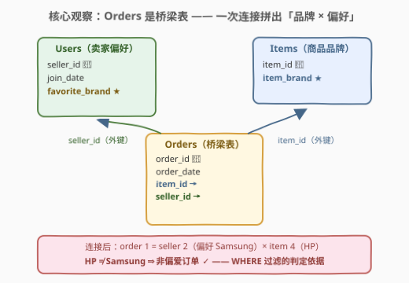
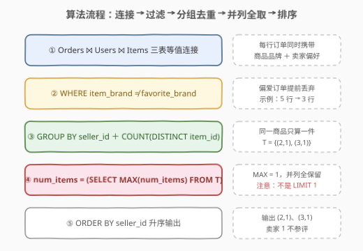
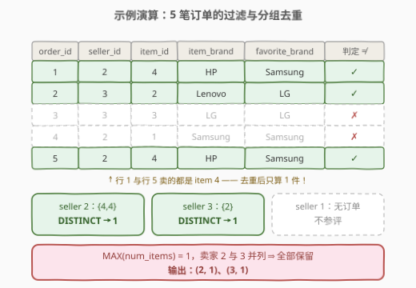

# 市场分析 III

- **题目名称**：市场分析 III
- **链接**：[2922. 市场分析 III](https://leetcode.cn/problems/market-analysis-iii/)
- **难度**：中等
- **标签**：SQL、多表连接、GROUP BY 聚合、COUNT(DISTINCT)、子查询、窗口函数

## 1. 题目概述

> ⚠️ 本题为 LeetCode 付费题，题意描述根据官方示例用例与 hints 重建，可能与官方题面有出入。

给定电商网站的 `Users`、`Items`、`Orders` 三张表。编写解决方案，找出售出「**品牌与自己偏好品牌 `favorite_brand` 不同**」的**去重商品（unique items）**数量最多的**最佳卖家（top seller）**；若多个卖家数量并列最多，则**全部返回**。结果按 `seller_id` **升序**排列。

**表结构**：

```text
Table: Users
+----------------+---------+
| Column Name    | Type    |
+----------------+---------+
| seller_id      | int     |  ← 唯一键
| join_date      | date    |
| favorite_brand | varchar |
+----------------+---------+

Table: Items
+---------------+---------+
| Column Name   | Type    |
+---------------+---------+
| item_id       | int     |  ← 唯一键
| item_brand    | varchar |
+---------------+---------+

Table: Orders
+---------------+---------+
| Column Name   | Type    |
+---------------+---------+
| order_id      | int     |  ← 唯一键
| order_date    | date    |
| item_id       | int     |  ← 外键 → Items.item_id
| seller_id     | int     |  ← 外键 → Users.seller_id
+---------------+---------+
```

**示例 1**：

```text
输入：
Users 表:
+-----------+------------+----------------+
| seller_id | join_date  | favorite_brand |
+-----------+------------+----------------+
| 1         | 2019-01-01 | Lenovo         |
| 2         | 2019-02-09 | Samsung        |
| 3         | 2019-01-19 | LG             |
+-----------+------------+----------------+

Orders 表:
+----------+------------+---------+-----------+
| order_id | order_date | item_id | seller_id |
+----------+------------+---------+-----------+
| 1        | 2019-08-01 | 4       | 2         |
| 2        | 2019-08-02 | 2       | 3         |
| 3        | 2019-08-03 | 3       | 3         |
| 4        | 2019-08-04 | 1       | 2         |
| 5        | 2019-08-04 | 4       | 2         |
+----------+------------+---------+-----------+

Items 表:
+---------+------------+
| item_id | item_brand |
+---------+------------+
| 1       | Samsung    |
| 2       | Lenovo     |
| 3       | LG         |
| 4       | HP         |
+---------+------------+

输出：
+-----------+-----------+
| seller_id | num_items |
+-----------+-----------+
| 2         | 1         |
| 3         | 1         |
+-----------+-----------+
```

**解释**：

| seller_id | 售出商品（品牌） | 偏好品牌 | 非偏爱订单 | 去重后计数 |
|-----------|------------------|----------|------------|------------|
| 1 | 无 | Lenovo | 0 笔 | 不参与统计 |
| 2 | HP、Samsung、HP | Samsung | 2 笔（都是 item 4/HP） | **1**（同一件商品只算一次） |
| 3 | Lenovo、LG | LG | 1 笔（item 2/Lenovo） | **1** |

- 卖家 2 售出 3 件商品，其中 2 笔订单不是偏好品牌，但两笔卖的都是 item 4（HP），去重后只有 **1** 件；
- 卖家 3 售出 2 件商品，其中 1 件（Lenovo）不是偏好品牌，计数 **1**；
- 卖家 2 与 3 并列最多（各 1 件），**全部输出**；卖家 1 没有任何订单，不参与评选。

**约束条件**：

- `Users.seller_id`、`Items.item_id`、`Orders.order_id` 均为唯一列
- `Orders.item_id` 外键指向 `Items`，`Orders.seller_id` 外键指向 `Users`
- 同一卖家可以多次售出**同一件商品**（订单数 ≠ 商品数，需去重）
- 输出列：`seller_id`、`num_items`，按 `seller_id` 升序；并列最多者全部返回

> 💡 本题是市场分析系列（[1158. 市场分析 I](../1101-1200/1158_市场分析I.md)、[1159. 市场分析 II](../1101-1200/1159_市场分析II.md)）的第三部，考点浓缩在题干的三个关键词上：**different**（跨表不等过滤——订单本身不带品牌，也不带卖家偏好，必须三表连接后才能判定）、**unique**（按 `item_id` 去重计数，`COUNT(DISTINCT)` 而非 `COUNT(*)`）、**并列全取**（取最大值的所有并列行，而非 `LIMIT 1`）。一条「连接 → 过滤 → 分组去重计数 → 取最大并列」的聚合流水线即可拿下。

---

## 2. 解题思路

### 2.1 暴力思路：相关子查询逐卖家计数

最直觉的写法是「逐个卖家问一遍」：对 `Users` 的每一行，用**相关子查询**去 `Orders` 里捞该卖家的订单、连上 `Items` 取品牌、筛掉偏好品牌、`COUNT(DISTINCT item_id)` 得到计数；再在结果外套一层筛出等于最大值的行：

```text
for each seller u in Users:
    cnt[u] = | { o.item_id : o in Orders, o.seller_id = u,
                 brand(o.item_id) != u.favorite_brand } |   # 集合去重
best = max(cnt)
output all (u, cnt[u]) where cnt[u] == best, sorted by u
```

用 SQL 表达就是每个卖家各扫一遍 `Orders`。若 `Orders` 有 $n$ 行、`Users` 有 $u$ 行，代价为 $O(u \cdot n)$——同一张订单表被反复扫描 $u$ 次，且「先算完所有人的计数、再回头找最大值」的逻辑套在相关子查询里写起来极其别扭。

> ⚠️ 暴力法的浪费在于：**每个卖家的计数都要独立全扫订单表**，而所有卖家的计数其实可以在**一次分组扫描**中同时完成——`GROUP BY seller_id` 正是「同时统计所有分组」的声明式表达。

### 2.2 核心观察：三表连接 + 去重计数 + 最大值并列全取



**问题本质**：对每位卖家 $s$，统计其「非偏爱商品」的去重件数，再取全局最大值的并列行。用集合语言写：

$$\text{num\_items}(s) = \left| \{\, o.\text{item\_id} \;:\; o \in \text{Orders},\ o.\text{seller\_id} = s,\ \text{brand}(o.\text{item\_id}) \neq \text{fav}(s) \,\} \right|$$

$$\text{答案} = \{\, (s, \text{num\_items}(s)) \;:\; \text{num\_items}(s) = \max_{s'} \text{num\_items}(s') \,\}$$

关键洞察有四：

1. **`Orders` 是桥梁表（事实表）**：订单行只带 `item_id` 和 `seller_id` 两个外键——「商品品牌」住在 `Items` 里，「卖家偏好」住在 `Users` 里。判定 `item_brand != favorite_brand` 必须先把三表连起来：`Orders JOIN Users USING (seller_id) JOIN Items USING (item_id)`，让每行订单同时携带两边的标签。

2. **先过滤后分组**：`WHERE item_brand != favorite_brand` 在 `GROUP BY` 之前执行，把「偏爱品牌」的订单提前丢掉——剩下进入分组的全部是「非偏爱订单」，聚合阶段不用再管条件。

3. **去重计数用 `COUNT(DISTINCT item_id)`**：这是本题最大的坑。示例中卖家 2 有 **2 笔**非偏爱订单（order 1 与 order 5，卖的都是 item 4），但「unique items」只算 **1 件**。误写成 `COUNT(*)` 会得到 `(2, 2), (3, 1)`，错误地只输出卖家 2。`item_id` 相同则品牌必相同（`Items.item_id` 唯一），故按 `item_id` 去重即可。

4. **「并列全取」不是 Top-1**：题目明说并列时全部返回，`ORDER BY num_items DESC LIMIT 1` 会漏掉并列行。标准姿势是把计数结果存成中间表 `T`，再用 `WHERE num_items = (SELECT MAX(num_items) FROM T)` 筛出所有冠军。

> 💡 **和 1159 市场分析 II 的关键差异**：1159 要求结果**包含所有用户**（不足 2 件也要输出 `no`），必须 `LEFT JOIN` 全保留；本题问的是「**冠军是谁**」，没卖出任何非偏爱商品的卖家（如示例中的卖家 1）压根不参与评选——内连接 `JOIN` + `WHERE` 过滤后这些卖家自然消失，**不需要**外连接。两题同表族，一个考「保全」，一个考「筛选」，对照着写一遍收获最大。

### 2.3 算法流程图



**逻辑执行步骤**：

| 步骤 | 操作 | 作用 |
|------|------|------|
| ① | `Orders JOIN Users USING (seller_id) JOIN Items USING (item_id)` | 每行订单同时携带 `favorite_brand` 与 `item_brand` |
| ② | `WHERE item_brand != favorite_brand` | 只留「非偏爱」订单（示例 5 行 → 3 行） |
| ③ | `GROUP BY seller_id` + `COUNT(DISTINCT item_id) AS num_items` | 每位卖家的去重件数，得到中间表 `T` |
| ④ | `WHERE num_items = (SELECT MAX(num_items) FROM T)` | 取最大值的所有并列行 |
| ⑤ | `ORDER BY seller_id` | 按 `seller_id` 升序输出 |

> 💡 **CTE 的作用**：③ 的聚合结果在 ④ 里要用两次（一次算 `MAX`、一次做比较），写法上用 `WITH T AS (...)` 把它命名固化，外层直接引用两次，比嵌套子查询可读得多。窗口函数写法（`RANK()`）则把 ④ 的「取最大并列」换成了「排名 = 1」，见参考代码解法 B。

### 2.4 示例演算

以示例 1 数据为例，逐步追踪整条流水线：



**步骤 ①：三表连接后的宽表（每行 = 一笔订单 + 两边标签）**

| order_id | seller_id | item_id | item_brand | favorite_brand | 判定 `brand != fav` |
|----------|-----------|---------|------------|----------------|---------------------|
| 1 | 2 | 4 | HP | Samsung | HP ≠ Samsung ✓ 留 |
| 2 | 3 | 2 | Lenovo | LG | Lenovo ≠ LG ✓ 留 |
| 3 | 3 | 3 | LG | LG | LG = LG ✗ 删 |
| 4 | 2 | 1 | Samsung | Samsung | Samsung = Samsung ✗ 删 |
| 5 | 2 | 4 | HP | Samsung | HP ≠ Samsung ✓ 留 |

**步骤 ②：`WHERE` 过滤后剩 3 行**（order 1、2、5）。

**步骤 ③：`GROUP BY seller_id` + `COUNT(DISTINCT item_id)`**

| seller_id | 留下的 item_id | DISTINCT 去重 | num_items |
|-----------|----------------|----------------|-----------|
| 2 | 4, 4 | {4} | **1** |
| 3 | 2 | {2} | **1** |

卖家 1 在过滤后一行都不剩，分组结果 `T` 中根本没有它——不参与评选。

**步骤 ④⑤：`MAX(num_items) = 1`，卖家 2 与 3 并列 → 全部保留，按 `seller_id` 升序输出 `(2, 1), (3, 1)`**，与预期输出一致。

> ⚠️ **注意卖家 2 的计数**：非偏爱订单有 2 笔，但两笔都是 item 4，`COUNT(DISTINCT item_id)` 只算 1 件。若误用 `COUNT(*)`，`T` 会变成 `(2, 2), (3, 1)`，`MAX = 2`，最终只输出 `(2, 2)`——卖家 3 被错误挤掉。「unique」二字就是本题埋的钩子。

---

## 3. 参考代码

### SQL（解法 A：CTE + 子查询 MAX，推荐）

```sql
# Write your MySQL query statement below
WITH T AS (
    SELECT seller_id, COUNT(DISTINCT item_id) AS num_items
    FROM Orders
    JOIN Users USING (seller_id)
    JOIN Items USING (item_id)
    WHERE item_brand != favorite_brand
    GROUP BY seller_id
)
SELECT seller_id, num_items
FROM T
WHERE num_items = (SELECT MAX(num_items) FROM T)
ORDER BY seller_id;
```

> 💡 **写法要点**：
> - **CTE `T`**：三表等值连接 → `WHERE` 过滤非偏爱 → 按卖家分组去重计数，一条子查询完成统计。
> - **`COUNT(DISTINCT item_id)`**：按商品去重，同一件商品卖多次只计 1 件——题眼所在。
> - **`USING (seller_id)` / `USING (item_id)`**：两表同名列的简写等值连接，等价于 `ON Orders.seller_id = Users.seller_id`；连接后同名列自动合并，`seller_id` 无歧义。
> - **`WHERE num_items = (SELECT MAX(num_items) FROM T)`**：标量子查询求全局最大值，等值比较天然「并列全取」。
> - **`ORDER BY seller_id`**：题目要求升序输出。
> - ✓ **最直白**：统计与筛选分两层，语义与题干一一对应，适合作为首选答案。

### SQL（解法 B：RANK() 窗口函数取并列第一）

```sql
# Write your MySQL query statement below
WITH T AS (
    SELECT seller_id, COUNT(DISTINCT item_id) AS num_items
    FROM Orders
    JOIN Users USING (seller_id)
    JOIN Items USING (item_id)
    WHERE item_brand != favorite_brand
    GROUP BY seller_id
)
SELECT seller_id, num_items
FROM (
    SELECT seller_id, num_items,
           RANK() OVER (ORDER BY num_items DESC) AS rk
    FROM T
) r
WHERE rk = 1
ORDER BY seller_id;
```

> 💡 **写法要点**：
> - **`RANK() OVER (ORDER BY num_items DESC)`**：按计数降序排名，最大值排名为 1；`RANK` 对并列同号——所有冠军都是 `rk = 1`，`WHERE rk = 1` 即「并列全取」。
> - **窗口函数不能进 `WHERE`**：`rk` 在 `SELECT` 阶段才计算，必须先包一层子查询再过滤（与 [1159. 市场分析 II](../1101-1200/1159_市场分析II.md) 的 `ROW_NUMBER` 同一个语法陷阱）。
> - **扩展性更好**：想取前 3 名就把 `rk = 1` 改成 `rk <= 3`，Top-K 需求一句切换；解法 A 的标量子查询只适合「取最大」这一种问法。
> - 若误用 `ROW_NUMBER()`，并列时只有一个 `rn = 1`，会**随机漏掉并列冠军**——「并列全取」必须用 `RANK`（`DENSE_RANK` 也行，取 Top-1 时二者等价）。

### Python（pandas）

```python
import pandas as pd

def market_analysis(users: pd.DataFrame, orders: pd.DataFrame, items: pd.DataFrame) -> pd.DataFrame:
    df = (
        orders.merge(users, on='seller_id')   # JOIN Users：带出 favorite_brand
              .merge(items, on='item_id')     # JOIN Items：带出 item_brand
    )
    df = df[df['item_brand'] != df['favorite_brand']]          # WHERE 非偏爱过滤
    t = df.groupby('seller_id')['item_id'].nunique().reset_index(name='num_items')  # COUNT(DISTINCT)
    return t[t['num_items'] == t['num_items'].max()].sort_values('seller_id')       # MAX 并列全取
```

> 💡 **pandas 对照**：`merge` 两次对应三表等值连接；布尔索引对应 `WHERE`；`groupby + nunique()` 恰好就是 `COUNT(DISTINCT item_id)`（`nunique` 天然去重，别误用 `count()`）；`t['num_items'].max()` 对应标量子查询 `MAX`。若过滤后 `df` 为空，`nunique()` 返回空表、`max()` 为 `NaN`、比较结果全 `False`，最终返回空 DataFrame——与 SQL 语义一致。

---

## 4. 复杂度分析

| 维度 | 复杂度 | 说明 |
|------|--------|------|
| **时间** | $O(n \log n)$ | 设 $n$ = `Orders` 行数：三表等值连接走主键索引/哈希连接 $O(n)$；`COUNT(DISTINCT)` 分组内去重需排序或哈希，$O(n \log n)$；对 `T` 求 `MAX` 与筛选 $O(u)$，$u$ = `Users` 行数 |
| **空间** | $O(n + u)$ | 连接中间结果 $O(n)$，分组计数表 `T` $O(u)$；CTE 物化后可被外层两次引用复用 |
| **结果行数** | $O(u)$ | 并列冠军数，最坏全体卖家并列（$u$ 行） |

> ⚠️ **解法 B 的窗口排序**：`RANK() OVER (ORDER BY num_items DESC)` 需对 $u$ 行再排一次 $O(u \log u)$，量级不影响主导项；但窗口函数版多一层物化子查询，常数略大。两种解法渐进复杂度相同，面试按「解法 A 直白、解法 B 好扩展」取舍即可。

---

## 5. 扩展：「最大值并列全取」的三种写法与 COUNT 家族

### 5.1 「并列全取」写法对比

| 写法 | 核心 | 示例（本题 `T` 已就绪） | 适用场景 |
|------|------|--------------------------|----------|
| **标量子查询 MAX** | `= (SELECT MAX(...))` | 解法 A | 只取最大值，最常用 |
| **RANK() 窗口** | `WHERE rk = 1` | 解法 B | 可推广 Top-K（`rk <= k`） |
| **NOT EXISTS 反查** | 不存在更大的 | `WHERE NOT EXISTS (SELECT 1 FROM T t2 WHERE t2.num_items > t1.num_items)` | 语义「没有更强者」，无嵌套聚合 |
| ~~`ORDER BY ... LIMIT 1`~~ | ✗ 错误 | —— | 并列时丢行，**禁止**用于并列全取 |

> 💡 这类「谁最多，并列都要」是 SQL 高频小抄题：[586. 订单最多的客户](../0501-0600/586_订单最多的客户.md)（订单数最多）、602（好友数最多）、1076（参与项目数最多）全是同一模板——`GROUP BY` 计数 + `MAX` 并列筛选。把本题的「计数」换成 `COUNT(DISTINCT)` 即是升级点。

### 5.2 COUNT 家族速查

| 写法 | 统计对象 | 本题示例（卖家 2 的非偏爱订单） |
|------|----------|--------------------------------|
| `COUNT(*)` | 行数（订单笔数） | 2 ✗ |
| `COUNT(item_id)` | 非 NULL 的 item_id 数 | 2 ✗ |
| `COUNT(DISTINCT item_id)` | 去重后的 item_id 数 | **1 ✓** |

> 💡 「unique items」→ `COUNT(DISTINCT item_id)`；「number of orders」→ `COUNT(*)`。读题时先确认统计的是**订单**还是**商品**，再选对应聚合函数——一字之差，答案完全不同。

### 5.3 边界变体：0 件卖家要不要参评？

本题标准语义下，没卖出任何非偏爱商品的卖家不出现在结果中（连接+过滤后无行，分组表 `T` 里没有它）。若业务改问「**全员都没卖过非偏爱商品时，返回所有卖家（计数 0）**」，只需把内连接换成「先按 `Users` 左连接再过滤」并补零：

```sql
WITH T AS (
    SELECT u.seller_id,
           COUNT(DISTINCT CASE WHEN i.item_brand != u.favorite_brand
                               THEN o.item_id END) AS num_items
    FROM Users u
    LEFT JOIN Orders o ON o.seller_id = u.seller_id
    LEFT JOIN Items  i ON o.item_id  = i.item_id
    GROUP BY u.seller_id
)
SELECT seller_id, num_items
FROM T
WHERE num_items = (SELECT MAX(num_items) FROM T)
ORDER BY seller_id;
```

> 💡 **`COUNT(DISTINCT CASE WHEN ... THEN ... END)`**：`CASE` 不满足时返回 `NULL`，而聚合函数天然忽略 `NULL`——把「过滤」折叠进「聚合」，等价于 `WHERE + COUNT` 但保留了左连接的全量分组。这是「外连接 + 条件计数」的标准技巧，面试提及即加分。

---

## 6. 面试要点

1. **`COUNT(DISTINCT item_id)` 和 `COUNT(*)` 差在哪？为什么本题必须用前者？**

   - `COUNT(*)` 数**订单行数**，`COUNT(DISTINCT item_id)` 数**去重后的商品件数**。题干「unique items」明示按商品去重：示例中卖家 2 有 2 笔非偏爱订单但都是 item 4，正确计数是 1 而非 2。误用 `COUNT(*)` 会算出 `(2,2),(3,1)`，最大值变 2、卖家 3 被挤掉，输出错误。同类陷阱：把「订单数」和「商品数」混为一谈是电商 SQL 最高频的口径事故。

2. **「并列全取」为什么不能用 `ORDER BY num_items DESC LIMIT 1`？怎么写才对？**

   - `LIMIT 1` 只取一行，并列冠军会被随机丢掉（顺序无保证时丢谁都不确定）。正确写法：① 标量子查询 `WHERE num_items = (SELECT MAX(num_items) FROM T)`；② `RANK() OVER (ORDER BY num_items DESC)` 取 `rk = 1`（注意不能用 `ROW_NUMBER`，它并列时只给一个 1）。前者直白、后者可推广 Top-K。

3. **为什么用内连接 `JOIN`，而不是像 1159 那样 `LEFT JOIN`？**

   - 1159 要求「结果包含所有用户」，必须左连接保全；本题问「**冠军是谁**」——没卖出任何非偏爱商品的卖家计数为 0，不参与评选（标准题解语义：结果按过滤后的分组表取最大，全 0 时分组表为空、结果为空）。内连接 + `WHERE` 过滤后这些卖家自然消失。若面试官追问「全 0 时要不要返回所有人」，给出 5.3 的 `LEFT JOIN + CASE 条件计数 + IFNULL` 变体即可——能说清两种语义的边界，正是加分点。

4. **SQL 里这条语句的子句执行顺序是什么？`WHERE` 和 `GROUP BY` 谁先谁后？**

   - 逻辑顺序：`FROM → ON → JOIN → WHERE → GROUP BY → HAVING → SELECT（含聚合与窗口）→ ORDER BY → LIMIT`。本题 `WHERE item_brand != favorite_brand` 过滤的是**连接后的订单行**，发生在 `GROUP BY` 之前——所以进入分组的已全是非偏爱订单，聚合阶段无需再判条件；而 `num_items`、`MAX(num_items)` 都要在 `SELECT`/外层才能引用，这就是 CTE 要分两层的原因。

5. **三表连接，连接顺序和索引怎么优化？**

   - `Orders` 是事实表（行数最大），`Users`/`Items` 是维表，两个连接键（`seller_id`、`item_id`）在维表侧都是唯一键（主键索引）——优化器通常以 `Orders` 为驱动表、对每行订单走两次主键点查，整体 $O(n)$；MySQL 8 也会把 `Users`/`Items` 构建为哈希连接。`WHERE` 的跨表谓词（`item_brand != favorite_brand`）必须连接后才能判定，无法下推到单表，但**不等过滤在分组前完成**已是最优次序：先瘦身再聚合，分组的数据量最小。

> 💡 **一句话总结**：2922 是「**三表连接 + 去重计数 + 最大值并列全取**」的聚合流水线招牌题——`Orders` 桥接 `Users`/`Items` 拿到「品牌 vs 偏好」，`WHERE` 先滤非偏爱，`GROUP BY seller_id` 配 `COUNT(DISTINCT item_id)` 数去重件数，最后 `= (SELECT MAX ...)` 并列全取。题眼三个词：**different（跨表过滤）、unique（DISTINCT 去重）、并列（MAX/RANK 全取）**，对照 586/602 的「最大值全取」与 1158/1159 的同表族写法，一次吃透电商统计 SQL 的一整套口径。

---

## 7. 同类练习题

- [1158. 市场分析 I](https://leetcode.cn/problems/market-analysis-i/)：同一套 `Users`/`Orders`/`Items` 表族——`LEFT JOIN` + `COUNT` 统计每位用户 2019 年订单数，对比本题理解「保全所有用户」与「只选冠军」的连接策略差异
- [1159. 市场分析 II](https://leetcode.cn/problems/market-analysis-ii/)：同表族姐妹题——`ROW_NUMBER` 窗口定位每位卖家第 2 件售出商品并判定品牌，对比本题的「分组聚合」理解「组内定位」类需求
- [586. 订单最多的客户](https://leetcode.cn/problems/customer-placing-the-largest-number-of-orders/)：最纯粹的「GROUP BY 计数 + MAX 并列全取」模板——本题去掉三表连接与 DISTINCT 后就是它
- [602. 好友申请 II：谁有最多的好友](https://leetcode.cn/problems/friend-requests-ii-who-has-the-most-friends/)：UNION ALL 双向展开后计数取最大并列——「并列全取」模板的又一变体
- [511. 游戏玩法分析 I](https://leetcode.cn/problems/game-play-analysis-i/)：`GROUP BY + MIN` 取每位玩家首次登录日期——同为「分组聚合 + 维表信息」的基础练习
