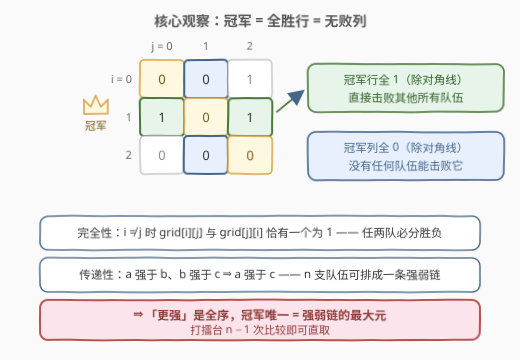
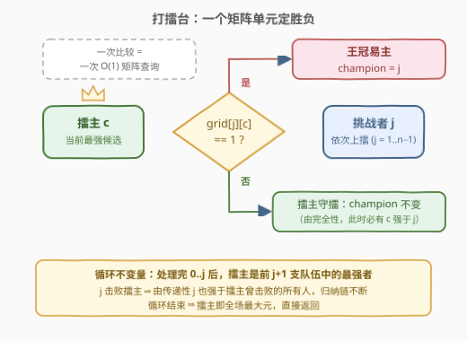
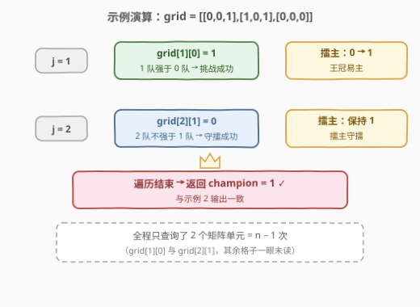

# 找到冠军 I

- **题目名称**：找到冠军 I
- **链接**：[2923. 找到冠军 I](https://leetcode.cn/problems/find-champion-i/)
- **难度**：简单
- **标签**：数组、矩阵

## 1. 题目概述

一场比赛中共有 $n$ 支队伍，按从 $0$ 到 $n - 1$ 编号。

给你一个下标从 **0** 开始、大小为 $n \times n$ 的二维布尔矩阵 `grid`。对于满足 $0 \le i, j \le n - 1$ 且 $i \ne j$ 的所有 $i, j$：如果 `grid[i][j] == 1`，那么 $i$ 队比 $j$ 队**强**；否则，$j$ 队比 $i$ 队**强**。

在这场比赛中，如果不存在某支强于 $a$ 队的队伍，则认为 $a$ 队将会是**冠军**。

返回这场比赛中将会成为冠军的队伍。

**示例 1**：

```text
输入：grid = [[0,1],[0,0]]
输出：0
解释：比赛中有两支队伍。
grid[0][1] == 1 表示 0 队比 1 队强。所以 0 队是冠军。
```

**示例 2**：

```text
输入：grid = [[0,0,1],[1,0,1],[0,0,0]]
输出：1
解释：比赛中有三支队伍。
grid[1][0] == 1 表示 1 队比 0 队强。
grid[1][2] == 1 表示 1 队比 2 队强。
所以 1 队是冠军。
```

**约束条件**：

- $n = \text{grid.length} = \text{grid}[i].\text{length}$
- $2 \le n \le 100$
- `grid[i][j]` 的值为 $0$ 或 $1$
- 对于所有 $i$，`grid[i][i]` 等于 $0$
- 对于满足 $i \ne j$ 的所有 $i, j$，`grid[i][j] != grid[j][i]` 均成立
- 生成的输入满足：如果 $a$ 队比 $b$ 队强，$b$ 队比 $c$ 队强，那么 $a$ 队比 $c$ 队强

> 💡 本题核心是「**全序关系 + 打擂台找最大元**」。约束里藏着两把钥匙：**完全性**（$i \ne j$ 时 `grid[i][j]` 与 `grid[j][i]` 恰有一个为 1，任两队必分胜负）与**传递性**（强于关系可传递）。二者合起来说明「更强」是一个**全序**——$n$ 支队伍能排成一条确定的强弱链，冠军就是链上的**最大元**。找最大元只需 $n - 1$ 次「比较」，而每次比较在这里就是一次 $O(1)$ 的矩阵查询：一趟扫描、只读 $n - 1$ 个格子即可出解。

---

## 2. 解题思路

### 2.1 暴力思路：逐队核验「全胜行」

最直白的理解：冠军**直接击败了其他所有队伍**——它的那一行除对角线外全是 1，行和恰为 $n - 1$：

```text
for i in 0..n-1:
    if sum(grid[i]) == n - 1:     # 行内除对角线外全为 1
        return i
```

时间 $O(n^2)$（每行扫一遍）。本题 $n \le 100$，最多 $10^4$ 次读取，**完全可以通过**——这是多数人拿到题后的第一反应写法。

> ⚠️ 暴力法的浪费在于：矩阵给了全部 $\binom{n}{2}$ 个两两比较结果，但「找出最大元」本质上只需要 $n - 1$ 次比较。整行整列地核验，等于把宝贵的信息浓缩能力丢掉了。

### 2.2 核心观察：全序关系 + 打擂台找最大元

关键观察来自**关系结构**：

1. **完全性**：约束保证 $i \ne j$ 时 `grid[i][j] != grid[j][i]` 且取值为 0/1，即恰有一个为 1——任两支队伍必分胜负。
2. **传递性**：约束明说「$a$ 强于 $b$、$b$ 强于 $c$ 则 $a$ 强于 $c$」。
3. 两者合成**全序**：$n$ 支队伍是一条确定的强弱链，**冠军唯一**，就是链上的最大元。等价地看矩阵——冠军的**行全 1**（击败所有人）、**列全 0**（无人击败它），两种视角互为转置。

找最大元的经典姿势是**打擂台**：维护当前擂主 `champion`，挑战者 $j$ 依次上擂，只问一个问题 `grid[j][champion] == 1?`——是则王冠易主，否则擂主守擂。



> 💡 **为什么打完擂台不用验证？** 循环不变量：处理完 $0..j$ 后，擂主是前 $j+1$ 支队伍中的最强者。归纳：新挑战者 $j+1$ 若击败擂主 $c$，由传递性它也强于 $c$ 曾击败的所有人，登擂合法；若被 $c$ 击败，$c$ 继续守住「前 $j+2$ 队最强」。全序保证这条归纳链不断——对比 [277. 搜寻名人](../0201-0300/277_搜寻名人.md)：那里的 `knows()` **没有传递性**，消除法得到的候选必须再花一轮验证；本题传递性白纸黑字给了，单趟即可收工。

### 2.3 算法流程图



**完整步骤**：

1. **初始化**：`champion = 0`（0 号队率先登擂）。
2. **遍历** $j$ **从** $1$ **到** $n - 1$：
   - **挑战判定**：若 `grid[j][champion] == 1`（挑战者更强），则 `champion = j`（王冠易主）；
   - 否则擂主不动（由完全性，此时擂主强于挑战者）。
3. **遍历结束**：返回 `champion`，即全场最强者、本题答案。

> 💡 整个过程只访问了 $n - 1$ 个矩阵单元（`grid[1][c], grid[2][c], ..., grid[n-1][c]`，且 $c$ 随擂台更替而变化），矩阵其余 $O(n^2)$ 个格子一眼都不用看——这正是全序信息被压缩到极限的体现。

### 2.4 示例演算

以 `grid = [[0,0,1],[1,0,1],[0,0,0]]` 为例：



| $j$ | 查询 | 含义 | 结果 | 擂主变化 |
|-----|------|------|------|----------|
| 1 | $\text{grid}[1][0] = 1$ | 1 队强于 0 队 | 挑战成功 | $0 \to 1$ |
| 2 | $\text{grid}[2][1] = 0$ | 2 队不强于 1 队 | 守擂成功 | 保持 $1$ |

最终返回 $1$，与示例 2 一致。全程只读了 2 个格子（$n - 1 = 2$）。

---

## 3. 参考代码

### C++

```cpp
class Solution {
public:
    int findChampion(vector<vector<int>>& grid) {
        int n = grid.size();
        int champion = 0;                          // 0 号率先登擂
        for (int j = 1; j < n; j++) {
            if (grid[j][champion] == 1) champion = j;   // 挑战者更强，王冠易主
        }
        return champion;                           // 全序最大元即冠军
    }
};
```

### Python

```python
class Solution:
    def findChampion(self, grid: List[List[int]]) -> int:
        champion = 0                               # 0 号率先登擂
        for j in range(1, len(grid)):
            if grid[j][champion] == 1:             # 挑战者更强，王冠易主
                champion = j
        return champion                            # 全序最大元即冠军
```

> 💡 两版逻辑完全一致：**一趟扫描 + 一次矩阵查询定胜负**。若追求极致短码，Python 里还有一个依赖同样性质的俏皮写法 `return grid.index(max(grid))`——冠军行逐位比较必然严格最大（对手行要么在对角线处先输，要么一路平到自己的对角线 0 处输），面试当彩蛋讲可以，工程上还是显式循环更清晰。

---

## 4. 复杂度分析

| 维度 | 复杂度 | 说明 |
|------|--------|------|
| **时间复杂度** | $O(n)$ | 一趟扫描 $n - 1$ 步，每步一次 $O(1)$ 矩阵查询；对比暴力 $O(n^2)$ 快了一个数量级 |
| **空间复杂度** | $O(1)$ | 仅维护 `champion` 一个下标 |

> ⚠️ 「时间 $O(n)$ 但矩阵有 $O(n^2)$ 个元素」并不矛盾——我们**没有读整个矩阵**，只沿擂台更替链读取了 $n - 1$ 个单元。若面试官追问下界：从 $n$ 个元素中确定最大元至少需要 $n - 1$ 次两两比较，打擂台恰好达到这个下界，不可能更快。

---

## 5. 扩展：从「矩阵」到「边集」与「名人问题」

本题的擂台解法依赖两条结构保证，去掉任何一条都会让问题变形：

- **去掉矩阵、改给边集**（[2924. 找到冠军 II](https://leetcode.cn/problems/find-champion-ii/)）：队伍间的胜负以有向边 $[\text{强}, \text{弱}]$ 给出且**可能残缺**（不是每两队都交过手）。打擂台失效，改用**入度计数**：冠军是唯一入度为 0 的队伍，多个则返回 $-1$。
- **去掉传递性**（[277. 搜寻名人](../0201-0300/277_搜寻名人.md)）：`knows()` 是任意布尔关系，消除法筛出的候选可能「强」得不明不白，必须再用 $2(n-1)$ 次查询**二次验证**——「排除 + 验证」两遍扫描的范式，与 [169. 多数元素](https://leetcode.cn/problems/majority-element/) 的 Boyer-Moore 投票同源。
- **入度视角的近亲**（[997. 找到小镇的法官](https://leetcode.cn/problems/find-the-town-judge/))：法官 = 入度 $n - 1$ 且出度 0，正是本题「列全 0 / 行全 1」的图计数版。

> 💡 一条主线贯穿：「胜负关系的**表示形式**（矩阵 / 边集 / 黑盒查询）× **结构保证**（完全性 / 传递性）」决定解法选型——全序矩阵用打擂台，残缺边集用入度，任意黑盒用消除 + 验证。面试中能主动铺开这条对比线，是加分项。

---

## 6. 面试要点

1. **为什么打擂台一趟就够，不需要二次验证？**

   - 循环不变量：处理完 $0..j$ 后擂主是前 $j+1$ 队的最强者。挑战者击败擂主时，由**传递性**它强于擂主曾击败的所有人；传递性是题目明给的结构保证。对比 277 名人问题：`knows()` 无传递性，消除法候选必须再验证一轮。

2. **冠军为什么唯一？代码为什么敢直接返回擂主？**

   - 完全性（任两队恰一个 1）+ 传递性合起来是**全序**：$n$ 队排成唯一强弱链，最大元唯一。等价地，冠军行全 1 / 冠军列全 0，这样的行、列各只有一条。

3. **$O(n)$ 解法真的没读整个矩阵，凭什么正确？**

   - 只沿擂台更替链读了 $n - 1$ 个单元，每次单元恰好回答「擂主与挑战者谁强」这一比较。从 $n$ 个元素确定最大元本就需要 $n - 1$ 次比较，已达信息论下界——矩阵其余格子对这个询问是冗余的。

4. **如果输入没有传递性保证会怎样？**

   - 可能出现「石头剪刀剪刀布」式的环，不存在全胜队伍，冠军无解（题意改变）。此时打擂台的幸存者只是**王**（king：直接或两跳胜过所有人），不保证全胜——一般锦标赛理论里才会讨论的退化情形。

5. **暴力行和判定为什么也是对的？什么时候必须放弃它？**

   - 行和 $= n - 1 \Leftrightarrow$ 除对角线外全 1 $\Leftrightarrow$ 直接击败所有人。$n \le 100$ 时 $O(n^2)$ 可过；若 $n$ 放大到 $10^5$（矩阵存不下、改为流式给比较结果），$O(n)$ 打擂台是唯一选择。

> 💡 **一句话总结**：2923 是「全序找最大元」的矩阵入门题——完全性 + 传递性把 $n$ 支队伍压成一条链，打擂台 $n - 1$ 次查询直取冠军，$O(n)$ / $O(1)$ 一趟出解。

---

## 7. 同类练习题

- [2924. 找到冠军 II](https://leetcode.cn/problems/find-champion-ii/)：同题面的边集版，胜负关系可能残缺，打擂台换成入度计数，多个入度 0 返回 $-1$
- [277. 搜寻名人](https://leetcode.cn/problems/find-the-celebrity/)：黑盒查询 + 无传递性，消除法候选必须二次验证，「排除 + 验证」两遍扫描范式
- [997. 找到小镇的法官](https://leetcode.cn/problems/find-the-town-judge/)：入度 $n - 1$ / 出度 0 计数判定，本题「列全 0 / 行全 1」的图论近亲
- [169. 多数元素](https://leetcode.cn/problems/majority-element/)：Boyer-Moore 多数投票，与打擂台同源的「消除 + (必要时)验证」家族
