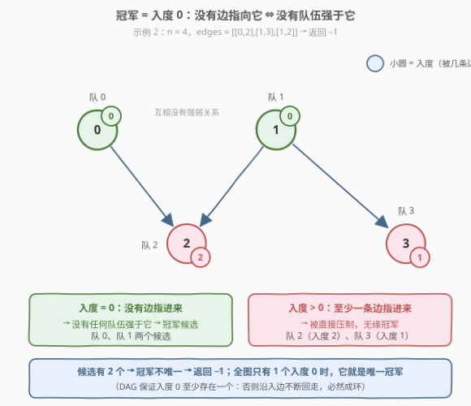
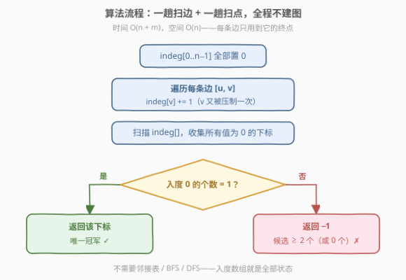
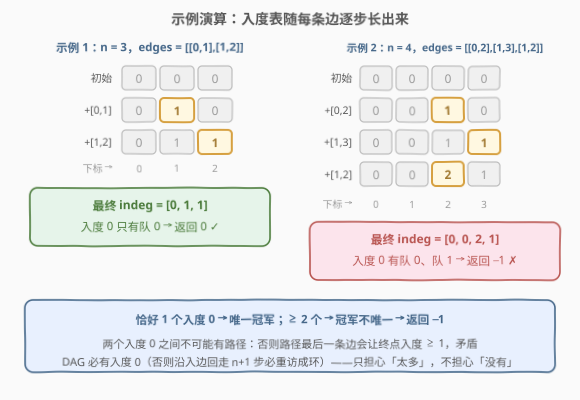

# 找到冠军 II

- **题目名称**：找到冠军 II
- **链接**：[2924. 找到冠军 II](https://leetcode.cn/problems/find-champion-ii/)
- **难度**：中等
- **标签**：图、拓扑排序

## 1. 题目概述

一场比赛中共有 $n$ 支队伍，按从 $0$ 到 $n-1$ 编号。每支队伍同时也是**有向无环图（DAG）**上的一个节点。

给你一个整数 $n$ 和一个下标从 0 开始、长度为 $m$ 的二维整数数组 `edges` 表示这个 DAG，其中 `edges[i] = [ui, vi]` 表示图中存在一条从 $u_i$ 队到 $v_i$ 队的有向边。

从 $a$ 队到 $b$ 队的有向边意味着 $a$ 队比 $b$ 队**强**（也就是 $b$ 队比 $a$ 队**弱**）。

在这场比赛中，如果**不存在某支强于 $a$ 队的队伍**，则认为 $a$ 队将会是**冠军**。如果这场比赛存在**唯一**一个冠军，则返回将会成为冠军的队伍；否则，返回 $-1$。

**示例 1**：

```text
输入：n = 3, edges = [[0,1],[1,2]]
输出：0
解释：1 队比 0 队弱。2 队比 1 队弱。所以冠军是 0 队。
```

**示例 2**：

```text
输入：n = 4, edges = [[0,2],[1,3],[1,2]]
输出：-1
解释：2 队比 0 队和 1 队弱。3 队比 1 队弱。
     但是 1 队和 0 队之间不存在强弱对比。所以答案是 -1。
```

**约束条件**：

- $1 \le n \le 100$
- $m == \text{edges.length}$
- $0 \le m \le n(n-1)/2$
- `edges[i].length == 2`，$0 \le \text{edges}[i][j] \le n-1$
- `edges[i][0] != edges[i][1]`（无自环）
- 生成的输入满足：如果 $a$ 队比 $b$ 队强，就不存在 $b$ 队比 $a$ 队强（无双向边）
- 生成的输入满足：如果 $a$ 队比 $b$ 队强、$b$ 队比 $c$ 队强，那么 $a$ 队比 $c$ 队强（**传递性**）

> 💡 一句话点破：冠军就是 DAG 上的「**源点**」——**入度为 0 的节点**。整道题只做一件事：数一数入度为 0 的队伍有几个，恰好 1 个就返回它，否则返回 $-1$。这是拓扑排序「只看第一层」的特例。

---

## 2. 解题思路

### 2.1 暴力思路：对每个队伍做可达性判定

按定义直译：队伍 $a$ 是冠军 ⟺ 没有任何队伍强于 $a$。由于「强于」具有**传递性**，$b$ 强于 $a$（无论是直接还是间接）⟺ 图中存在从 $b$ 到 $a$ 的路径。于是最朴素的做法是：

```text
for a in 0..n-1:                    # 枚举每支队伍
    beaten = false
    for b in 0..n-1, b != a:       # 从每个其他队伍出发
        if 可达(b → a):            # BFS / DFS / 建反图从 a 反向遍历
            beaten = true
            break
    if not beaten: 收集候选 a
候选恰好 1 个 → 返回它；否则 → -1
```

时间复杂度 $O(n \cdot (n + m))$，$n \le 100$、$m \le 4950$ 时约 $5 \times 10^5$ 次操作，完全可以 AC，但要建邻接表、写 BFS，代码量与出错面都偏大。也可以用 Floyd 传递闭包（bitset 优化 $O(n^3/64)$）把所有点的「祖先集」求出来再判定——同样能过，但更是杀鸡用牛刀。

> ⚠️ 暴力法的所有工作量都花在回答一个其实不需要回答的问题上：「**谁**强于 $a$」。本题只关心「**有没有人**强于 $a$」——而这件事，一条入边就足以否决一个点。

### 2.2 核心观察：冠军 = 入度 0 的节点



**观察 1（入度 $> 0$ ⇒ 必非冠军）**：若 $\text{indeg}(a) > 0$，则存在某条边 $u \to a$，即 $u$ **直接**强于 $a$，$a$ 直接被压制，无缘冠军。

**观察 2（入度 $= 0$ ⇒ 必是冠军）**：若 $\text{indeg}(a) = 0$，则**没有任何边指向 $a$**。用反证法：若有队伍 $b$ **间接**强于 $a$，即存在路径 $b \leadsto a$，那么这条路径的**最后一条边** $(x, a)$ 就是一条直接指向 $a$ 的边，与 $\text{indeg}(a)=0$ 矛盾。所以直接压制和间接压制被「入度 0」一次性全部排除。

**观察 3（冠军候选集非空）**：DAG 中**必存在**至少一个入度为 0 的节点。反证：若所有 $n$ 个节点入度都 $> 0$，从任意节点出发沿入边不断回走，走 $n+1$ 步由鸽巢原理必重访某个节点，形成一个**环**，与 DAG 前提矛盾。

三条观察合起来：

$$\text{冠军集合} = \{\, v : \text{indeg}(v) = 0 \,\},\qquad \text{唯一冠军} \iff \text{入度 0 的节点恰好 1 个}$$

> 💡 **间接压制为什么不用担心**：题目的传递性保证说明「间接强」在 DAG 上必然对应一条真实路径，而任何指向 $a$ 的路径其最后一条边都直接落在 $a$ 上——所以「没人直接强于我」自动升级为「没人（直接或间接）强于我」。入度这个小巧的局部量，编码了「无人压制」这个全局性质。

### 2.3 算法流程图



**完整步骤**：

1. **初始化**：`indeg[0..n-1]` 全部置 0。
2. **一趟扫边**：遍历每条边 `edges[i] = [u, v]`，执行 `indeg[v] += 1`——只认终点，起点是谁无关紧要。
3. **一趟扫点**：扫描 `indeg[]`，收集所有值为 0 的下标。
4. **判定**：恰好 1 个 → 返回该下标（唯一冠军）；$\ge 2$ 个 → 返回 $-1$（冠军不唯一）。

> 💡 注意流程里**没有建图**这一步：不需要邻接表、不需要 BFS/DFS/拓扑排序。我们需要的全部信息——「每个点被多少条边指向」——在扫边时顺路就收集完了。Kahn 拓扑排序的初始队列正是入度 0 的节点集合（第一层），本题只关心这一层的大小，后续的删边、分层全用不上。

### 2.4 示例演算

以两个官方示例为例，观察入度表如何随每条边「长出来」：



**示例 1**（$n = 3$，`edges = [[0,1],[1,2]]`）：

| 处理 | 操作 | indeg |
|------|------|-------|
| 初始 | 全部置 0 | $[0, 0, 0]$ |
| 边 $[0,1]$ | $\text{indeg}[1]{+}{=}1$ | $[0, 1, 0]$ |
| 边 $[1,2]$ | $\text{indeg}[2]{+}{=}1$ | $[0, 1, 1]$ |

入度 0 的下标只有 $0$ → 恰好一个候选 → **返回 0** ✓

**示例 2**（$n = 4$，`edges = [[0,2],[1,3],[1,2]]`）：

| 处理 | 操作 | indeg |
|------|------|-------|
| 初始 | 全部置 0 | $[0, 0, 0, 0]$ |
| 边 $[0,2]$ | $\text{indeg}[2]{+}{=}1$ | $[0, 0, 1, 0]$ |
| 边 $[1,3]$ | $\text{indeg}[3]{+}{=}1$ | $[0, 0, 1, 1]$ |
| 边 $[1,2]$ | $\text{indeg}[2]{+}{=}1$ | $[0, 0, 2, 1]$ |

入度 0 的下标有 $0$ 和 $1$ → 两个候选 → **返回 −1** ✓（队 0 与队 1 之间没有任何强弱关系，分不出冠军）

> 💡 为什么两个入度 0 的队伍之间**必然**没有强弱关系？若 $s$、$t$ 都入度 0 且存在路径 $s \leadsto t$，则路径最后一条边直接指向 $t$，即 $\text{indeg}(t) \ge 1$，矛盾。两个「无人压制」的队伍彼此也无法压制对方——这正是「冠军不唯一」的图论面目。

---

## 3. 参考代码

### C++

```cpp
class Solution {
public:
    int findChampion(int n, vector<vector<int>>& edges) {
        vector<int> indeg(n, 0);
        for (const auto& e : edges)          // 边 u → v：v 被指向一次
            indeg[e[1]]++;                   // 只认终点，起点是谁无所谓
        int champ = -1;
        for (int i = 0; i < n; i++) {
            if (indeg[i] == 0) {             // 冠军候选
                if (champ != -1) return -1;  // 第二个候选 → 冠军不唯一
                champ = i;
            }
        }
        return champ;
    }
};
```

### Python

```python
class Solution:
    def findChampion(self, n: int, edges: List[List[int]]) -> int:
        indeg = [0] * n
        for _, v in edges:                   # 只认终点 v
            indeg[v] += 1
        champs = [i for i, d in enumerate(indeg) if d == 0]
        return champs[0] if len(champs) == 1 else -1
```

> 💡 两版逻辑一致，只是收集方式不同：C++ 用「遇到第二个候选立即返回 −1」的提前退出，Python 用列表推导一次收齐再判长度。$n \le 100$ 下两者没有性能差异，选顺手的写即可。

---

## 4. 复杂度分析

| 维度 | 复杂度 | 说明 |
|------|--------|------|
| **时间复杂度** | $O(n + m)$ | 一趟扫边累加入度（$m$ 次）+ 一趟扫点数候选（$n$ 次） |
| **空间复杂度** | $O(n)$ | 仅一个入度数组，不需要邻接表 |

> ⚠️ 这个复杂度是**信息量下界意义上的最优**：每条边都可能改变某个终点的入度，每支队伍的入度都必须被看一眼才能判定候选，任何正确算法至少要读完整个输入，$\Omega(n + m)$ 不可再降。相比暴力法 $O(n(n+m))$，提升来自「把可达性的全局问题，换成入度的局部统计」。

---

## 5. 扩展：布尔标记版与两个进阶视角

### 5.1 入度只需要「是否为 0」——布尔标记版

回看判定逻辑，我们其实从不关心 $a$ 被**几条**边指向，只关心**有没有**被指向过。于是入度数组可以退化成布尔数组：

```python
class Solution:
    def findChampion(self, n: int, edges: List[List[int]]) -> int:
        beaten = [False] * n                 # beaten[v] = True ⇔ 有队伍强于 v
        for _, v in edges:
            beaten[v] = True
        champ = -1
        for i in range(n):
            if not beaten[i]:
                if champ != -1:
                    return -1
                champ = i
        return champ
```

两版等价；计数版的优点是**语义直观、可扩展**（比如题目追问「被压制次数最少的队伍」，计数数组直接复用），布尔版的优点是省下自增、意图更直白地对应「是否被压制」。面试中先写计数版、再主动指出可退化成布尔版，是很好的加分动作。

### 5.2 与 2923 找到冠军 I 的对照：完全 vs 稀疏

| | [2923 找到冠军 I](https://leetcode.cn/problems/find-champion-i/) | 2924 找到冠军 II（本题） |
|---|---|---|
| 输入 | $n \times n$ 矩阵，**两两必有胜负** | 稀疏边表，**强弱关系可以缺失** |
| 结构 | 完全竞赛图 + 传递性 | 一般 DAG |
| 冠军 | 必存在且唯一 | 可能不唯一 → 返回 $-1$ |
| 判定 | 找「全 0 列」（没有任何 $i$ 使 $\text{grid}[i][j]=1$，即无人强于 $j$） | 数「入度 0」的个数 |

2923 中 $\text{grid}[i][j] = 1$ 表示 $i$ 强于 $j$，冠军 $j$ 的特征是第 $j$ **列**全 0——「全 0 列」正是矩阵语言里的「入度 0」。两题是同一件事的稠密/稀疏两种编码：矩阵版扫行列，边表版统计入度。

### 5.3 唯一冠军的另一张面孔：全图最强

若 DAG 只有唯一入度 0 的节点 $s$，那么 $s$ 必能**到达图中所有节点**——即 $s$ 间接强于所有人。反证：若 $s$ 到不了 $t$，考虑所有能到达 $t$ 的节点构成的子图，它是非空 DAG，必有自己的入度 0 节点 $s'$；而 $s'$ 在原图中的入度若为 0 则 $s'=s$（唯一性），但 $s$ 到不了 $t$、$s'$ 能到 $t$，矛盾，故 $s'$ 在原图中入度 $>0$，即子图外有边指向 $s'$，但该边的起点也该属于「能到达 $t$」的子图，矛盾。

所以「唯一冠军」有两个等价刻画：**没人强于它**（入度 0 唯一）⟺ **它强于所有人**（唯一源点可达全网）。这也解释了为什么这样的队伍配得上「冠军」之名——它不只是没输过，而是赢了所有人。

---

## 6. 面试要点

1. **为什么「入度 0」等价于「没人强于它」？间接压制怎么办？**

   - 入度 $>0$：存在直接指向它的边，被直接压制。入度 $=0$：反证，若有 $b$ 间接强于它，则存在路径 $b \leadsto a$，路径**最后一条边**直接指向 $a$，与入度 0 矛盾。传递性保证「间接强」必对应真实路径，而路径最后一步必是直接边——所以入度 0 同时排除直接与间接压制。

2. **入度 0 的节点会不会一个都没有？**

   - 不会。DAG 必有入度 0 节点：若全部入度 $>0$，从任一点沿入边回走 $n+1$ 步，鸽巢原理保证重访某点成环，与无环矛盾。所以答案只有「恰好 1 个」和「$\ge 2$ 个」两种情形；即使输入违规含有环（出现 0 个候选），返回 $-1$ 的代码行为也恰好合理。

3. **为什么不用拓扑排序 / BFS / DFS？会不会更稳妥？**

   - 本题需要的信息只有「每点被指向次数」，一趟扫边即可全数获得；邻接表、队列、分层删边都是冗余。拓扑排序的**初始队列**（第一层）恰好就是入度 0 集合，本题只问这一层的大小，不问后面的层次——是拓扑排序的「只看第一步」特例。写 BFS 反而引入建图代码和出错面。

4. **与 997 找到小镇的法官有什么异同？**

   - 都是「特殊节点 + 度数条件」的签到图论题，但方向相反：法官要求**入度 $n-1$、出度 0**（被所有人信任、不信任任何人），冠军要求**入度 0**（压制别人、不被压制）。997 需要同时统计入度和出度并检查存在性；本题 DAG 前提保证候选非空，只需数入度 0 的个数。

5. **如果题目改成「返回所有冠军（可能多个）」怎么改？**

   - 把「遇到第二个候选就返回 −1」删掉，直接返回收集到的入度 0 下标列表即可；Python 版的 `champs` 列表已经是答案本身。进阶追问「唯一冠军是否必然强于所有人」时，可引用 5.3 的可达性论证（唯一源点必可达全网）。

> 💡 **一句话总结**：2924 是「入度统计」的招牌题——冠军即 DAG 的源点，边 $u \to v$ 只需记 `indeg[v]++`；数出入度 0 的个数，恰好 1 个返回它、$\ge 2$ 个返回 $-1$，全程不建图、不搜索，$O(n+m)$ 一次扫边直达信息量下界。

---

## 7. 同类练习题

- [2923. 找到冠军 I](https://leetcode.cn/problems/find-champion-i/)：本题的矩阵版姊妹题，「全 0 列」= 矩阵语言里的入度 0，完全竞赛图保证冠军必唯一
- [997. 找到小镇的法官](https://leetcode.cn/problems/find-the-town-judge/)：度数条件判定特殊节点的镜像题——法官要入度 $n-1$、出度 0，与冠军的入度 0 方向相反
- [207. 课程表](https://leetcode.cn/problems/course-schedule/)：入度数组 + Kahn 拓扑排序的完整版，本题是其「只看初始队列」的第一步
- [1791. 找出星型图的中心节点](https://leetcode.cn/problems/find-center-of-star-graph/)：数度数即可定位特殊节点（度 $n-1$ 的中心），同为「统计边就能出答案」的签到图论
- [1971. 寻找图中是否存在路径](https://leetcode.cn/problems/find-if-path-exists-in-graph/)：图遍历基础题，巩固 2.1 暴力思路中「可达性判定」那条路的建图与 BFS/DFS 写法
