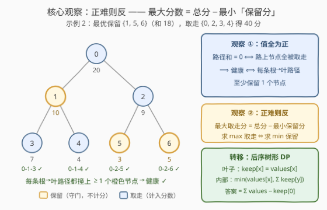
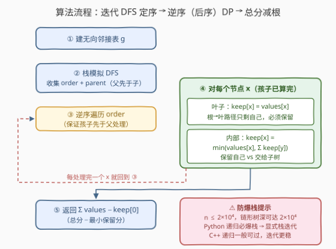
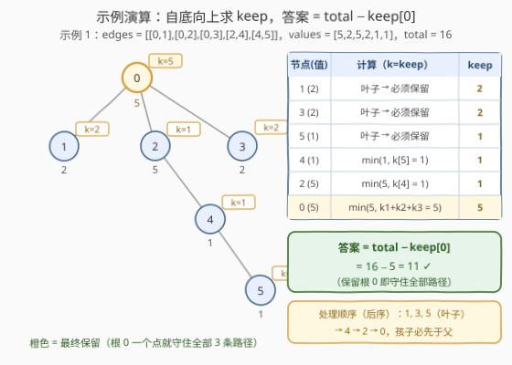

# 在树上执行操作以后得到的最大分数

- **题目名称**：在树上执行操作以后得到的最大分数
- **链接**：[2925. 在树上执行操作以后得到的最大分数](https://leetcode.cn/problems/maximum-score-after-applying-operations-on-a-tree/)
- **难度**：中等
- **标签**：树、深度优先搜索、动态规划、树形 DP

## 1. 题目概述

有一棵 $n$ 个节点的无向树，节点编号 $0$ 到 $n-1$，根节点为 $0$，`edges` 给出全部 $n-1$ 条边，`values[i]` 表示第 $i$ 个节点的值。

一开始分数为 0，每次操作可以：

1. 选择节点 $i$；
2. 把 `values[i]` 加入分数；
3. 把 `values[i]` 变为 0。

如果从根节点出发、到任意叶子节点经过路径上的**节点值之和都不等于 0**，则称这棵树是**健康的**。可以对树执行任意次操作，但要求执行完全部操作后树仍保持健康，求能获得的**最大分数**。

**示例 1**：

```text
输入：edges = [[0,1],[0,2],[0,3],[2,4],[4,5]], values = [5,2,5,2,1,1]
输出：11
解释：选择节点 1、2、3、4、5（得分 2+5+2+1+1 = 11）。
只保留根节点 0（值非 0），每条根到叶路径的和都不为 0，树是健康的。
```

**示例 2**：

```text
输入：edges = [[0,1],[0,2],[1,3],[1,4],[2,5],[2,6]], values = [20,10,9,7,4,3,5]
输出：40
解释：选择节点 0、2、3、4（得分 20+9+7+4 = 40）。
保留节点 1、5、6：0→3、0→4 的路径上有保留点 1，0→5、0→6 的路径上有保留点 5、6，树是健康的。
```

**约束条件**：

- $2 \le n \le 2 \times 10^4$
- $1 \le \text{values[i]} \le 10^9$
- `edges` 构成一棵合法的树

> 💡 一句话：**正难则反**——最大化「取走」之和 = 总和 − 最小化「保留」之和；又因节点值全为正，「健康」等价于**每条根到叶路径至少保留一个节点**（守门员），于是问题化作一道经典的「最小权路径击中」**树形 DP**。

---

## 2. 解题思路

### 2.1 暴力思路：枚举取走集合

每个节点只有「取走 / 保留」两种终态，共 $2^n$ 种组合；对每种组合遍历所有根到叶路径检查健康性需 $O(n)$，总量 $O(2^n \cdot n)$，在 $n \le 2\times10^4$ 下完全不可行。

更麻烦的是，「直接最大化取走」这个方向**天然缺乏子结构**：某个节点能不能取走，取决于整条路径上其他节点的选择，约束在路径维度上全局耦合。直觉上应该换个视角，让约束「下放」到子树内部独立求解。

### 2.2 核心观察：正难则反 + 路径击中 + 树形 DP

**观察 ①（健康 ⟺ 每条根到叶路径至少保留一个节点）**：由约束 $1 \le values[i] \le 10^9$，所有值**全为正数**。一条路径上若干正数之和为 0，当且仅当**所有**加数都是 0，即路径上的节点**全部被取走**。于是：

$$\text{健康} \iff \text{保留集合击中每一条根到叶路径（每条路径上} \ge 1 \text{ 个未取走节点）}$$

**观察 ②（正难则反）**：取走节点的分数之和 = $\sum values$ − 保留节点的值和。最大化前者 ⟺ **最小化后者**。问题转化为：选一个**权和最小**的节点集合，击中所有根到叶路径——一个最小权「守门员」配置问题。

**观察 ③（最优子结构，自底向上合并）**：只考察以 $x$ 为根的子树，需要被击中的是「$x$ 到子树内每个叶子的路径」——完整根到叶路径在 $x$ 之上的部分由祖先负责，与子树内部无关。定义 $keep[x]$ 为该子树内保留节点的最小权和：

- **$x$ 是叶子**：这条路径只有 $x$ 自己，不保留它路径就归零 → $keep[x] = values[x]$；
- **$x$ 是内部节点**，孩子为 $y_1, \dots, y_k$，二选一：
  - **保留 $x$**：所有路径在 $x$ 处已被击中，子树其余节点可全部取走 → 代价 $values[x]$；
  - **不保留 $x$**：每条经过 $x$ 的路径必须在某个孩子子树内被击中，各子树**独立**承担 → 代价 $\sum_j keep[y_j]$。

$$keep[x] = \min\Big(values[x],\ \sum_{j=1}^{k} keep[y_j]\Big)$$

最终答案：

$$\text{ans} = \sum values - keep[0]$$



> 💡 一句话：**全正 ⟹ 健康 = 每条根到叶路径配一个「守门员」**；**正难则反 ⟹ 最小化守门员总权重**；**守门只看子树 ⟹ 后序树形 DP**，转移就一行 $\min$。

### 2.3 算法流程图



**完整步骤**：

1. 由 `edges` 建无向邻接表 `g`；
2. 从根 0 出发用**显式栈** DFS，收集先序数组 `order`（父必先于子）及 `parent` 数组；
3. **逆序遍历** `order`（孩子必先于父处理，天然等价于后序）；
4. 对每个节点 $x$：叶子则 $keep[x] = values[x]$，否则 $keep[x] = \min(values[x],\ \sum keep[\text{孩子}])$；
5. 返回 $\sum values - keep[0]$。

### 2.4 示例演算

以示例 1 为例：`values = [5,2,5,2,1,1]`，$\text{total} = 16$，按后序自底向上算 `keep`（$k$ 为 keep 缩写）：

| 处理顺序 | 节点（值） | 计算 | keep |
|:--:|:--:|:--|:--:|
| 1 | 5 (1) | 叶子 → 必须保留 | 1 |
| 2 | 1 (2) | 叶子 → 必须保留 | 2 |
| 3 | 3 (2) | 叶子 → 必须保留 | 2 |
| 4 | 4 (1) | $\min(1,\ keep[5]{=}1)$ | 1 |
| 5 | 2 (5) | $\min(5,\ keep[4]{=}1)$ | 1 |
| 6 | 0 (5) | $\min(5,\ 2{+}1{+}2{=}5)$ | **5** |

答案 $= 16 - 5 = 11$ ✓。注意 $keep[0]$ 出现**平局**：保留根 0 一个点，或改保留 $\{1, 4, 3\}$（代价同为 5），两种守门方案都最优，官方示例取的是前者。



示例 2 简算：$keep[1] = \min(10, 7{+}4) = 10$（保留 1 自己），$keep[2] = \min(9, 3{+}5) = 8$（不保留 2、保留两片叶子），$keep[0] = \min(20, 10{+}8) = 18$ → 答案 $58 - 18 = 40$ ✓。

---

## 3. 参考代码

### C++

```cpp
class Solution {
public:
    long long maximumScoreAfterOperations(vector<vector<int>>& edges, vector<int>& values) {
        int n = values.size();
        vector<vector<int>> g(n);
        for (auto& e : edges) {
            g[e[0]].push_back(e[1]);
            g[e[1]].push_back(e[0]);
        }

        vector<int> vis(n);
        // dfs(x)：以 x 为根的子树内，击中所有「x 到叶子」路径的最小保留和
        function<long long(int)> dfs = [&](int x) {
            vis[x] = 1;
            long long childKeep = 0;
            bool isLeaf = true;
            for (int y : g[x]) {
                if (vis[y]) continue;                     // 无向边：父节点已访问，跳过
                isLeaf = false;
                childKeep += dfs(y);
            }
            if (isLeaf) return (long long)values[x];      // 叶子：路径只剩自己，必须保留
            return min((long long)values[x], childKeep);  // 保留自己 vs 交给子树
        };

        long long total = accumulate(values.begin(), values.end(), 0LL);
        return total - dfs(0);
    }
};
```

### Python

```python
class Solution:
    def maximumScoreAfterOperations(self, edges: List[List[int]], values: List[int]) -> int:
        n = len(values)
        g = [[] for _ in range(n)]
        for a, b in edges:
            g[a].append(b)
            g[b].append(a)

        # ① 显式栈先序收集 order（父先于子），记录 parent
        order, parent = [], [-1] * n
        stack = [0]
        while stack:
            x = stack.pop()
            order.append(x)
            for y in g[x]:
                if y != parent[x]:
                    parent[y] = x
                    stack.append(y)

        # ② 逆序遍历 = 后序（孩子必先于父），逐点转移
        keep = [0] * n
        for x in reversed(order):
            children = [y for y in g[x] if y != parent[x]]
            if not children:                              # 叶子：路径只剩自己，必须保留
                keep[x] = values[x]
            else:                                         # 保留自己 vs 交给子树
                keep[x] = min(values[x], sum(keep[y] for y in children))

        return sum(values) - keep[0]
```

> 💡 两版逻辑一致。注意三点：① 建的是**无向**邻接表，遍历时用「已访问 / 父节点」跳过来路；② 叶子（无孩子）必须保留自己，这是唯一需要特判的分支；③ $n \le 2\times10^4$、值至多 $10^9$，总分至多 $2\times10^{13}$，必须用 `long long` / Python 天然大整数。**Python 版刻意用显式栈迭代**：链形树深达 $2\times10^4$，默认递归上限 1000 必然 `RecursionError`；C++ 递归一般能过（每帧很小、栈约 8MB），介意时可套用 Python 的「先序收集 + 逆序处理」写法。

---

## 4. 复杂度分析

| 维度 | 复杂度 | 说明 |
|------|--------|------|
| **时间复杂度** | $O(n)$ | 建图 $O(n)$；DFS 每个节点进出一次，转移中对孩子的求和均摊到每条边一次，总计线性 |
| **空间复杂度** | $O(n)$ | 邻接表 $O(n)$ + `parent`/`keep`/`order` 数组 $O(n)$；递归版另有 $O(h)$ 调用栈（链形树退化为 $O(n)$） |

---

## 5. 扩展：官方 hint 的「正向取走」dp 视角

官方 hint 给出对偶的正向定义：$dp[i]$ 为子树 $i$ 在**自身满足健康约束**前提下能取得的最大分，$sum[i]$ 为子树总值：

- 叶子：$dp[\text{leaf}] = 0$（取走唯一节点会让这条路径归零，只能不取）；
- 内部节点：$dp[x] = \max\big(values[x] + \sum dp[y],\ \sum sum[y]\big)$——取走 $x$（各子树必须自身健康）vs 不取 $x$（约束下放到子树，子树可整体全取）。

两个视角**逐点对偶**：可归纳证明对任意 $x$ 恒有

$$dp[x] + keep[x] = sum[x] \quad (\text{子树总值} = \text{取走} + \text{保留})$$

叶子处 $0 + values = values$ 成立；内部处「$keep$ 取 $values[x]$ ⟺ $\sum keep[y] \ge values[x]$ ⟺ $dp$ 取第二分支 $\sum sum[y]$」，两分支一一对应。故 $dp[0] = total - keep[0]$，殊途同归。写作时推荐「最小化保留」视角——**「守门员」直觉比「取分但要留后路」直白**，转移也更短。

> ⚠️ 「值全为正」是整个建模的命门：若允许负值或 0，「路径和为 0」不再等价于「节点全被取走」（正负可以抵消），观察 ① 与两套转移方程全部失效，需要围绕「路径和是否恰为 0」重新设计状态。

---

## 6. 面试要点

1. **为什么「健康」等价于「每条根到叶路径至少保留一个节点」？**

   - 值全为正 ⟹ 路径和为 0 ⟺ 路径上所有节点都被取走（全部加数为 0）。取逆否命题：路径和 ≠ 0 ⟺ 路径上至少一个节点未取走。

2. **为什么转成最小化「保留」而不是直接最大化「取走」？**

   - 「取走」的可行性约束（每条路径不能全取走）在路径维度全局耦合，没有子结构；反过来「保留集合击中所有路径」可以按子树分解——路径在 $x$ 之上的部分归祖先管，子树内只需击中「$x$ 到叶子」的路径，才具备最优子结构做树形 DP。这正是「正难则反」的典型落点。

3. **转移方程里 $\min$ 的两个分支各是什么含义？叶子为什么要特判？**

   - 分支一：保留 $x$ 当守门员，代价 $values[x]$，子树其余全部可取；分支二：不保留 $x$，各孩子子树独立守门，代价 $\sum keep[y]$。叶子无孩子，路径只剩自己，只能保留（此时套公式会错算成 $\min(values[x], 0)$）。

4. **$n$ 达 $2\times10^4$，递归有什么坑？**

   - 链形树递归深 $2\times10^4$：Python 默认上限 1000 直接 `RecursionError`（调大上限也可能压爆 C 栈），应改成显式栈迭代——「先序收集 order + 逆序处理」两段式最稳；C++ 递归通常可过，但面试可主动提迭代版加分。

5. **与打家劫舍 III、监控二叉树的异同？**

   - 三者都是「选 / 不选」决策的树形 DP：打家劫舍 III 约束父子不相邻（两状态）；监控二叉树要覆盖所有节点（三状态：装/被子看/被孙看）；本题要击中所有根到叶路径（两状态 + 叶子强制保留）。约束对象不同，但「后序自底向上、按孩子状态聚合」的骨架完全一致。

> 💡 **一句话总结**：全正 ⟹ 健康 = 每条根到叶路径配一个守门员；正难则反 ⟹ 最小化守门员权重；后序 DP 一行 $\min$（叶子强制保留自己），答案 = 总分 − 根的 `keep`。工程上记住：大 $n$ 树形 DP，Python 用「先序收集 + 逆序处理」的迭代套路防爆栈。

---

## 7. 同类练习题

- [337. 打家劫舍 III](https://leetcode.cn/problems/house-robber-iii/)（[题解](../0301-0400/337_打家劫舍III.md)）：树形 DP 入门，「选 / 不选」两状态的后序转移模板，本题的决策结构与其同源
- [968. 监控二叉树](https://leetcode.cn/problems/binary-tree-cameras/)（[题解](../0901-1000/968_监控二叉树.md)）：最小代价放置摄像头覆盖全部节点，与本题「最小权集合击中所有路径」同款最小覆盖思想（三状态版）
- [543. 二叉树的直径](https://leetcode.cn/problems/diameter-of-binary-tree/)（[题解](../0501-0600/543_二叉树的直径.md)）：后序 DFS 自底向上合并子树信息的基石套路，树形 DP 的热身题
- [834. 树中距离之和](https://leetcode.cn/problems/sum-of-distances-in-tree/)（[题解](../0801-0900/834_树中距离之和.md)）：一般树上先一次后序再一次前序的换根 DP，作为树形 DP 的进阶练习
