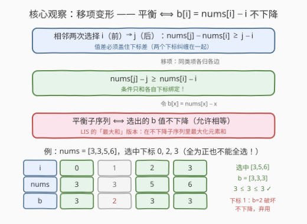
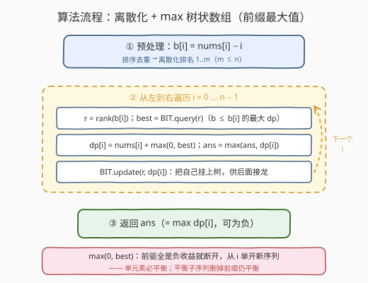
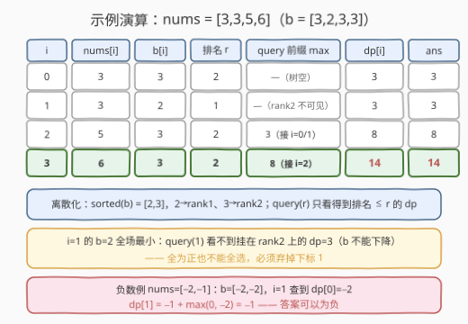

# 平衡子序列的最大和

- **题目名称**：平衡子序列的最大和
- **链接**：[2926. 平衡子序列的最大和](https://leetcode.cn/problems/maximum-balanced-subsequence-sum/)
- **难度**：困难
- **标签**：树状数组、线段树、动态规划、二分查找

## 1. 题目概述

给你一个下标从 **0** 开始的整数数组 `nums`。

`nums` 一个长度为 `k` 的**子序列**指的是选出 `k` 个**下标** $i_0 < i_1 < \dots < i_{k-1}$，如果这个子序列满足以下条件，我们说它是**平衡的**：

- 对于范围 $[1, k-1]$ 内的所有 $j$，$nums[i_j] - nums[i_{j-1}] \ge i_j - i_{j-1}$ 都成立。

`nums` 长度为 `1` 的**子序列**是平衡的。

请你返回一个整数，表示 `nums` **平衡**子序列里面的**最大元素和**。

一个数组的**子序列**指的是从原数组中删除一些元素（**也可能一个元素也不删除**）后，剩余元素保持相对顺序得到的**非空**新数组。

**示例 1**：

```text
输入：nums = [3,3,5,6]
输出：14
解释：选择子序列 [3,5,6]，下标为 0，2 和 3 的元素被选中。
nums[2] - nums[0] >= 2 - 0。
nums[3] - nums[2] >= 3 - 2。
所以，这是一个平衡的子序列，且它的和是所有平衡子序列里最大的。
包含下标 1，2 和 3 的子序列也是一个平衡的子序列。
最大平衡子序列和为 14。
```

**示例 2**：

```text
输入：nums = [5,-1,-3,8]
输出：13
解释：选择子序列 [5,8]，下标为 0 和 3 的元素被选中。
nums[3] - nums[0] >= 3 - 0。
所以，这是一个平衡的子序列，且它的和是所有平衡子序列里最大的。
最大平衡子序列和为 13。
```

**示例 3**：

```text
输入：nums = [-2,-1]
输出：-1
解释：选择子序列 [-1]。
这是一个平衡的子序列，而且它的和是 nums 所有平衡子序列里最大的。
```

**约束条件**：

- $1 \le nums.length \le 10^5$
- $-10^9 \le nums[i] \le 10^9$

---

## 2. 解题思路

### 2.1 暴力思路：O(n²) 接龙 DP

「子序列 + 相邻约束 + 求最值」是典型的接龙型 DP：定义 $dp[i]$ 为**以下标 $i$ 结尾**的平衡子序列的最大和，枚举上一个接上的下标 $j$：

$$dp[i] = nums[i] + \max\Big(0,\ \max\{dp[j] : j < i,\ nums[i] - nums[j] \ge i - j\}\Big)$$

两个细节先想清楚：

- **与 $0$ 取 max 的含义是「断开重来」**：单元素子序列天然平衡；而且把平衡子序列的开头删掉仍然平衡（相邻不等式逐段相加即可验证），所以前驱若是负收益就不接，从 $i$ 单开；
- **`nums` 含负数**：$dp[i]$ 与答案都不设非负下限，全负数组的答案就是最大的那个单元素（示例 3 的 $-1$）。

转移要扫一遍前缀，$O(n^2) = 10^{10}$，在 $n = 10^5$ 下必然超时。瓶颈在于：**「值差 ≥ 下标差」这个把两个下标纠缠在一起的二维条件，让挑合法前驱这件事退化成了逐个枚举**。

### 2.2 核心观察：移项变形 —— b[i] = nums[i] − i 不下降



条件里 $i_j$、$i_{j-1}$ 两个下标各自出现在两边，但移项后立刻清爽：

$$nums[i_j] - nums[i_{j-1}] \ge i_j - i_{j-1} \iff \underbrace{nums[i_j] - i_j}_{b[i_j]} \ge \underbrace{nums[i_{j-1}] - i_{j-1}}_{b[i_{j-1}]}$$

**每个下标的合法性只和自己绑定**！定义 $b[i] = nums[i] - i$，则：

> 子序列平衡 ⟺ 选出的 $b$ 值**不下降**（允许相等）

问题瞬间变成经典模型：**在 $b$ 的不下降子序列中，最大化对应元素之和** —— LIS 的「最大和」版本。对比家族成员：300 求长度、673 求个数、1626 排序后求和、本题是带负数的求和版。注意示例 1 的警示：`nums` 全为正也不能全选——下标 1 的 $b=2$ 破坏了不下降，必须弃掉。

### 2.3 算法流程：离散化 + max 树状数组



2.2 的 DP 现在是 $dp[i] = nums[i] + \max\big(0,\ \max\{dp[j] : j < i,\ b[j] \le b[i]\}\big)$，前驱条件变成了**一维偏序** $b[j] \le b[i]$——这正是树状数组/线段树的主场：

1. **离散化**：$b[i]$ 值域宽达 $2 \times 10^9$，先排序去重映射成排名 $1..m$（$m \le n$）；
2. **从左到右扫 $i$**：
   - `r = rank(b[i])`（`lower_bound` 定位，**含相等**——条件带等号）；
   - `best = BIT.query(r)`：$b$ 值排名 $\le r$（即 $b[j] \le b[i]$）的最大 $dp$，前缀最大值查询；
   - $dp[i] = nums[i] + \max(0, best)$，更新答案；
   - `BIT.update(r, dp[i])`：把自己挂到树上，供后面的下标接龙；
3. 答案为所有 $dp[i]$ 的最大值。

> 💡 max 树状数组与计数版同构，只是把「前缀求和」换成「前缀取 max」。它天然只支持**值被抬高**的单点更新——而本题 `update` 恰好只做 max，完美契合，不需要线段树的懒标记与下推。

### 2.4 示例演算



以示例 1 `nums = [3,3,5,6]` 为例，$b = [3,2,3,3]$，离散化 `sorted(b) = [2,3]`（$2 \to$ rank1，$3 \to$ rank2）：

| i | nums[i] | b[i] | 排名 r | query(r) 前缀 max | dp[i] | ans |
|---|---------|------|--------|-------------------|-------|-----|
| 0 | 3 | 3 | 2 | —（树空） | 3 | 3 |
| 1 | 3 | 2 | 1 | —（rank2 不可见） | 3 | 3 |
| 2 | 5 | 3 | 2 | 3（接 i=0 或 i=1） | 8 | 8 |
| 3 | 6 | 3 | 2 | 8（接 i=2） | **14** | **14** ✓ |

注意 $i=1$ 这一步：$b=2$ 是全场最小排名，`query(1)` 看不见 $i=0$ 挂在 rank2 上的 $dp=3$——这正是「$b$ 不能下降」在数据结构层面的体现。

---

## 3. 参考代码

### C++

```cpp
class Solution {
  public:
    long long maxBalancedSubsequenceSum(vector<int>& nums) {
        int n = nums.size();
        // b[i] = nums[i] - i：平衡 ⟺ 选出的 b 不下降
        vector<long long> b(n);
        for (int i = 0; i < n; i++) b[i] = (long long)nums[i] - i;

        // 离散化：值域 ±2e9 → 排名 1..m
        vector<long long> sortedB(b);
        sort(sortedB.begin(), sortedB.end());
        sortedB.erase(unique(sortedB.begin(), sortedB.end()), sortedB.end());
        int m = sortedB.size();

        // max 树状数组：单点抬高 + 前缀最大值查询，树上存 dp 值
        vector<long long> tree(m + 1, LLONG_MIN);
        auto update = [&](int i, long long v) {
            for (; i <= m; i += i & (-i)) tree[i] = max(tree[i], v);
        };
        auto query = [&](int i) {  // max{dp[j] : rank(b[j]) <= i}
            long long res = LLONG_MIN;
            for (; i > 0; i -= i & (-i)) res = max(res, tree[i]);
            return res;
        };

        long long ans = LLONG_MIN;
        for (int i = 0; i < n; i++) {
            int r = lower_bound(sortedB.begin(), sortedB.end(), b[i]) - sortedB.begin() + 1;
            long long best = query(r);               // b 更小/相等的最大 dp
            long long dp = nums[i] + max(0LL, best); // 负收益就断开，从 i 单开
            ans = max(ans, dp);
            update(r, dp);
        }
        return ans;
    }
};
```

### Python

```python
class Solution:
    def maxBalancedSubsequenceSum(self, nums: List[int]) -> int:
        n = len(nums)
        b = [nums[i] - i for i in range(n)]     # 平衡 ⟺ b 不下降
        sorted_b = sorted(set(b))               # 离散化：排名 1..m
        m = len(sorted_b)
        tree = [-inf] * (m + 1)                 # max 树状数组，树上存 dp 值

        def update(i: int, v: int) -> None:
            while i <= m:
                if v > tree[i]:
                    tree[i] = v
                i += i & (-i)

        def query(i: int) -> int:               # max{dp[j] : rank(b[j]) <= i}
            res = -inf
            while i > 0:
                if tree[i] > res:
                    res = tree[i]
                i -= i & (-i)
            return res

        ans = -inf
        for i in range(n):
            r = bisect_left(sorted_b, b[i]) + 1
            dp = nums[i] + max(0, query(r))     # 查空(-inf)或负收益 → 从 i 单开
            ans = max(ans, dp)
            update(r, dp)
        return ans
```

> 💡 两处易踩坑：① $\sum |nums[i]|$ 可达 $10^{14}$，C++ 必须用 `long long`，且 `b[i] = nums[i] - i` 里减法也要在 64 位下做；② Python 的 `max(0, -inf)` 结果是 `0`（int），落空查询天然被「断开重来」吸收，无需特判。

---

## 4. 复杂度分析

| 维度 | 复杂度 | 说明 |
|------|--------|------|
| 时间复杂度 | $O(n \log n)$ | 离散化排序 $O(n \log n)$；每个元素一次二分定位 + 一次前缀查询 + 一次单点更新，各 $O(\log n)$ |
| 空间复杂度 | $O(n)$ | 离散化数组与树状数组，共 $O(n)$ |

---

## 5. 扩展：线段树写法与「max 接龙」通用范式

- **线段树版**：单点改 + 区间 $[1, r]$ 最大值，同样 $O(n \log n)$，常数略大。但若约束升级为**任意区间**——如 2407 要求相邻增长不超过 $k$，查询的是 $b$ 值落在 $[b[i]-k,\ b[i]]$ 的最大 $dp$——max-BIT 只会前缀、做不了「前缀减前缀」，就必须换线段树。
- **通用范式**：一切形如 $dp[i] = w[i] + \max\{dp[j] : j < i,\ key[j] \le key[i]\}$ 的接龙 DP，只要 $key$ 可离散化，都能套「离散化 + max-BIT/线段树」这套加速骨架。300（长度版）、673（计数版，树上存「长度 + 个数」双信息）、1626（排序后求和版）、2407（区间版）、本题（带负数求和版）是同一骨架的五个变体——面试里认出这个形状，剩下的只是选数据结构。

---

## 6. 面试要点

1. **平衡条件怎么和 LIS 挂上钩的？**

   - 移项：$nums[j] - nums[i] \ge j - i \iff nums[j] - j \ge nums[i] - i$，把纠缠的两个下标解耦成各自的单点属性 $b$
   - 平衡 ⟺ 选出的 $b$ 不下降（含相等），题目即「最大和不下降子序列」，直接进入 LIS 加速赛道

2. **`nums` 有负数，DP 怎么处理？**

   - $dp[i] = nums[i] + \max(0, best)$：前驱接龙若是负收益就断开、从 $i$ 单开——单元素必平衡，且平衡子序列删掉前缀仍平衡（不等式逐段相加可证）
   - $dp$ 与答案都不设非负下限；全负数组答案是最大单元素（示例 3 输出 $-1$），「至少选一个」由答案取 max over dp 保证

3. **为什么 max 树状数组就够，不用线段树？**

   - 查询是前缀 $[1, r]$、更新只做取 max（值只会被抬高），正是 BIT「前缀 max + 单点抬高」的原生形状，无需区间修改/懒标记
   - 若约束变成任意区间（如 2407 的 $[b[i]-k, b[i]]$），BIT 前缀无法相减，才需要线段树

4. **离散化时相等的 $b$ 怎么处理？**

   - 条件带等号，$b[j] = b[i]$ 的前驱合法；排名用 `lower_bound` 定位、查询含自身排名，前缀 $[1, r]$ 恰好把相等者圈进来
   - 若误用「严格小于」的查询（`r-1`），示例 1 里 $i=3$ 就接不上 $i=2$（$b$ 同为 3），只能退而接 $i=1$ 得 9，错失正确答案 14

5. **溢出与边界？**

   - $n \times 10^9 = 10^{14}$：C++ 用 `long long`；`b[i] = nums[i] - i` 的减法也在 64 位下做
   - `query` 落空（树空或排名最小）返回哨兵 $-\infty$，经 $\max(0, \cdot)$ 归零，天然等价于「无前驱、单开」

---

## 7. 同类练习题

- [300. 最长递增子序列](https://leetcode.cn/problems/longest-increasing-subsequence/)（[题解](../0201-0300/300_最长递增子序列.md)）：同一接龙骨架的「长度版」，DP + 二分入门参照
- [673. 最长递增子序列的个数](https://leetcode.cn/problems/number-of-longest-increasing-subsequence/)（[题解](../0601-0700/673_最长递增子序列的个数.md)）：计数版，树状数组需同时维护「最长长度 + 方案数」双信息
- [1626. 无冲突的最佳球队](https://leetcode.cn/problems/best-team-with-no-conflicts/)（[题解](../1601-1700/1626_无冲突的最佳球队.md)）：按年龄/得分排序后即最大和递增子序列，全正数的 O(n²) 版
- [2407. 最长递增子序列 II](https://leetcode.cn/problems/longest-increasing-subsequence-ii/)（[题解](../2401-2500/2407_最长递增子序列II.md)）：约束升级为区间查询（增长 ≤ k），必须上线段树的姊妹题
- [315. 计算右侧小于当前元素的个数](https://leetcode.cn/problems/count-of-smaller-numbers-after-self/)（[题解](../0301-0400/315_计算右侧小于当前元素的个数.md)）：离散化 + BIT 计数的经典应用，对照 max 版理解 BIT 的两种姿势
