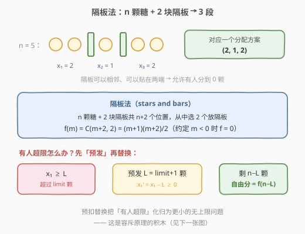
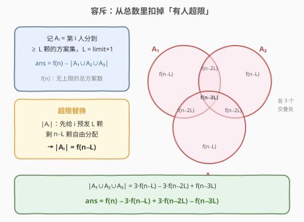
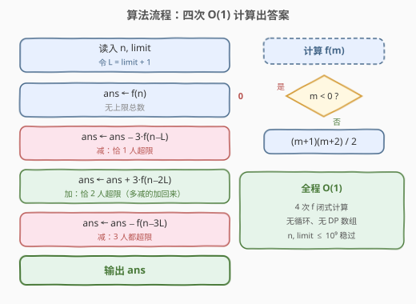
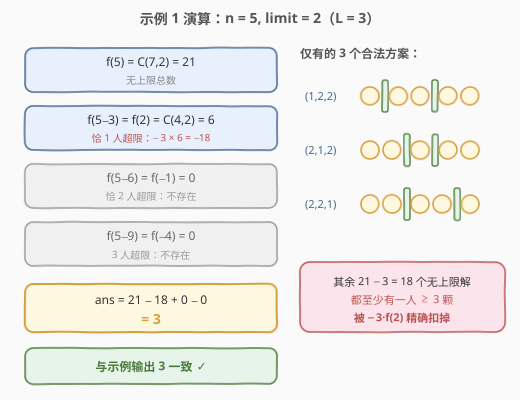

# LeetCode 给小朋友们分糖果 III 题解

## 1. 题目概述

- **标题 / 题号**：给小朋友们分糖果 III（#2927，hard）
- **链接**：https://leetcode.cn/problems/distribute-candies-among-children-iii/
- **难度**：困难
- **标签**：数学、组合数学、容斥原理、隔板法

> ⚠️ 本题为 LeetCode 付费题，题意描述根据官方示例用例与 hints 重建，可能与官方题面有出入。

**题意**：给你两个正整数 `n` 和 `limit`。请你将 `n` 颗糖果分给 `3` 位小朋友，**每位小朋友得到的糖果数都不超过 `limit`**，返回满足该条件的总方案数。两种分法不同，当且仅当至少一位小朋友得到的糖果数不同。

**示例 1**：

```text
输入：n = 5, limit = 2
输出：3
解释：总共有 3 种方法分配 5 颗糖果，且每位小朋友的糖果数不超过 2：(1, 2, 2)，(2, 1, 2) 和 (2, 2, 1)。
```

**示例 2**：

```text
输入：n = 3, limit = 3
输出：10
解释：总共有 10 种方法分配 3 颗糖果，且每位小朋友的糖果数不超过 3：(0, 0, 3)，(0, 1, 2)，(0, 2, 1)，(0, 3, 0)，(1, 0, 2)，(1, 1, 1)，(1, 2, 0)，(2, 0, 1)，(2, 1, 0) 和 (3, 0, 0)。
```

**约束条件**（按系列难度递进重建）：

- $1 \le n \le 10^9$
- $1 \le limit \le 10^9$

**系列三连**——同题面、数据范围递增，本题是「逼出 O(1) 公式」的困难版：

| 题号 | 难度 | 数据范围 | 通行解法 |
|------|------|----------|----------|
| 2928. 分糖果 I | 简单 | $n, limit \le 50$ | 双重循环 $O(n^2)$ 暴力 |
| 2929. 分糖果 II | 中等 | $n, limit \le 10^6$ | 枚举第一人 $O(n)$ |
| **2927. 分糖果 III（本题）** | 困难 | $n, limit \le 10^9$ | **隔板法 + 容斥 $O(1)$** |

## 2. 解题思路

把分糖写成方程：

$$x_1 + x_2 + x_3 = n, \quad 0 \le x_i \le limit$$

求满足条件的整数解个数。

### 2.1 暴力思路：枚举

- **三重循环**枚举 $(x_1, x_2, x_3)$：$O(n^3)$，连 2928 的 $n \le 50$ 都嫌大；
- **双重循环**：枚举 $x_1, x_2$，则 $x_3 = n - x_1 - x_2$ 唯一确定，只需检查 $0 \le x_3 \le limit$：$O(n^2)$，2928 的标准暴力；
- **单层循环**：只枚举 $x_1 \in [\max(0,\ n - 2\,limit),\ \min(limit, n)]$，剩余 $m = n - x_1$ 分给两人，两人方案数为 $\min(limit, m) - \max(0,\ m - limit) + 1$（结果非负时）：$O(n)$，2929 的通行解法。

但本题 $n$ 高达 $10^9$，$O(n)$ 循环（尤其 Python）不可行——必须把「求和」也消掉，导出闭式公式。

> 💡 从 I → II → III 的演进正是算法设计的经典路径：**暴力 → 降维枚举 → 数学闭式**，数据范围每放大一个数量级，就逼出一层优化。

### 2.2 核心观察一：隔板法——无上限方案数



先假装没有 `limit`：把 $n$ 颗糖果排成一排，插入 **2 块隔板**分成 3 段，第 $i$ 段的糖果数就是小朋友 $i$ 分到的数量。糖果与隔板共占 $n + 2$ 个位置，其中选 2 个位置放隔板（隔板可以相邻、也可以贴在两端，恰好对应「有人分到 0 颗」），所以：

$$f(m) = \binom{m+2}{2} = \frac{(m+1)(m+2)}{2}$$

表示把 $m$ 颗糖**自由**（无上限）分给 3 人的方案数；约定 $m < 0$ 时 $f(m) = 0$。

无上限时的答案就是 $f(n)$；本题只需再处理「每人不超过 $limit$」的约束。

### 2.3 核心观察二：容斥原理——扣掉超限方案



记 $L = limit + 1$（「超过 $limit$」即 $\ge L$）。设 $A_i$ = 「小朋友 $i$ 分到 $\ge L$ 颗」的方案集合，答案为：

$$\text{ans} = f(n) - |A_1 \cup A_2 \cup A_3|$$

**超限替换**是关键一招：$A_i$ 中 $x_i \ge L$，不妨先给小朋友 $i$ **预发** $L$ 颗（令 $x_i' = x_i - L \ge 0$），剩下 $n - L$ 颗自由分配——这正好是规模更小的无上限问题：

$$|A_i| = f(n - L)$$

同理，两人同时超限时预发两份：$|A_i \cap A_j| = f(n - 2L)$；三人同时超限：$|A_1 \cap A_2 \cap A_3| = f(n - 3L)$。代入容斥展开（单个 $|A_i|$ 有 $3$ 个、两两交有 $\binom{3}{2} = 3$ 个）：

$$|A_1 \cup A_2 \cup A_3| = 3\,f(n-L) - 3\,f(n-2L) + f(n-3L)$$

最终得到一行公式：

$$\boxed{\ \text{ans} = f(n) - 3\,f(n-L) + 3\,f(n-2L) - f(n-3L), \quad L = limit + 1\ }$$

> 💡 **多项式视角的巧合**：该式恰是 $f$ 关于步长 $L$ 的三阶差分，而 $f$ 是二次多项式——所以当 $n \ge 3L$（糖多到必然有人超限）时四项恰好抵消为 $0$，与「$n > 3 \cdot limit$ 无解」的直觉完全吻合。

### 2.4 算法流程



1. 令 $L = limit + 1$；
2. 定义 $f(m) = \begin{cases} \dfrac{(m+1)(m+2)}{2} & m \ge 0 \\[4pt] 0 & m < 0 \end{cases}$；
3. 计算 $\text{ans} = f(n) - 3f(n-L) + 3f(n-2L) - f(n-3L)$；
4. 返回 `ans`。

共 4 次 $O(1)$ 的 $f$ 调用，无循环、无 DP 数组。

> ⚠️ **溢出检查**：$n \le 10^9$ 时 $f(n) \approx \frac{(10^9)^2}{2} = 5 \times 10^{17}$，中间项 $3f(\cdot) \le 1.5 \times 10^{18}$，均在 `long long`（上限约 $9.2 \times 10^{18}$）安全范围内；C++ 参数用 `int` 装得下 $10^9$，计算时提升为 64 位即可，Python 天然大数无此虑。

### 2.5 示例演算



以示例 1（$n=5,\ limit=2,\ L=3$）为例：

| 项 | 计算 | 值 | 含义 |
|----|------|-----|------|
| $f(5)$ | $\binom{7}{2} = 21$ | $21$ | 无上限总数 |
| $-3\,f(5-3)$ | $-3 \times \binom{4}{2} = -3 \times 6$ | $-18$ | 恰一人超限 |
| $+3\,f(5-6)$ | $3 \times f(-1)$ | $0$ | 恰两人超限（不可能） |
| $-f(5-9)$ | $-f(-4)$ | $0$ | 三人超限（不可能） |

$\text{ans} = 21 - 18 + 0 - 0 = 3$ ✓，与示例 1 仅有的三个方案 $(1,2,2), (2,1,2), (2,2,1)$ 一致。

示例 2（$n=3,\ limit=3,\ L=4$）：$f(3) = \binom{5}{2} = 10$，而 $f(-1) = f(-5) = f(-9) = 0$，答案即 $10$ ✓——$limit \ge n$ 时上限形同虚设，退化为纯隔板法。

## 3. 参考代码

### C++

```cpp
class Solution {
  public:
    long long distributeCandies(int n, int limit) {
        long long L = (long long)limit + 1;
        auto f = [](long long m) -> long long {
            return m < 0 ? 0 : (m + 1) * (m + 2) / 2;
        };
        return f(n) - 3 * f(n - L) + 3 * f(n - 2 * L) - f(n - 3 * L);
    }
};
```

### Python

```python
class Solution:
    def distributeCandies(self, n: int, limit: int) -> int:
        def f(m: int) -> int:
            return (m + 1) * (m + 2) // 2 if m >= 0 else 0

        L = limit + 1
        return f(n) - 3 * f(n - L) + 3 * f(n - 2 * L) - f(n - 3 * L)
```

> 💡 两份代码都是「翻译公式」：把 2.3 的容斥式逐项照抄即可。若担心手滑写错某一项，可改写成 $\sum_{k=0}^{3} (-1)^k \binom{3}{k} f(n - kL)$ 的循环形式，与推导一一对应更不易错。

## 4. 复杂度分析

| 维度 | 复杂度 | 说明 |
|------|--------|------|
| 时间复杂度 | $O(1)$ | 4 次闭式计算，无循环 |
| 空间复杂度 | $O(1)$ | 仅常数个变量 |

## 5. 扩展

- **推广到 $k$ 位小朋友**：$\text{ans} = \sum_{j=0}^{k} (-1)^j \binom{k}{j} f_k(n - jL)$，其中 $f_k(m) = \binom{m+k-1}{k-1}$（插 $k-1$ 块隔板）。变量个数与上界个数都固定时才有闭式；对照 2902（子多重集有界和）变量个数不受限，只能退回滑动窗口 DP——**「变量个数少」正是本题能 O(1) 的本质**。
- **「每人至少 1 颗」变体**：先给每人预发 1 颗，转化为 $n-3$ 颗、上界 $limit - 1$ 的原问题（与「超限替换」互为镜像的预扣操作）。
- **等差求和的另一条 O(1) 路**：沿 2.1 的单层枚举，对 $x_1$ 的取值区间分段（每段内两人方案数是 $x_1$ 的线性函数），用等差数列求和同样 $O(1)$——与容斥殊途同归，但容斥推导更短、更易推广。
- **模意义下的推广**：若 $n$ 进一步放大（如 $10^{18}$）且要求对质数 $p$ 取模，$\frac{(m+1)(m+2)}{2}$ 中的除 2 需换成乘 $2^{-1} \bmod p$（乘法逆元）——组合计数取模的标准善后。

## 6. 面试要点

1. **为什么无上限方案数是 $\binom{n+2}{2}$？**

   - $n$ 颗糖 + 2 块隔板排成一排，等价于在 $n+2$ 个位置中选 2 个放隔板
   - 隔板相邻 ↔ 有人得 0 颗；隔板贴两端 ↔ 有人独得全部——天然覆盖全部非负解
   - 一般地 $k$ 人分 $n$ 颗：$\binom{n+k-1}{k-1}$（stars and bars）

2. **容斥公式里的 $L$ 为什么是 $limit+1$ 而不是 $limit$？**

   - 「超过 $limit$」的最小取值是 $limit+1$，预发的门槛必须与之对齐
   - 代换 $x_i' = x_i - L \ge 0$ 后剩余 $n-L$ 颗自由分配，严格对应无上限子问题 $f(n-L)$

3. **系数 3、3、1 分别是什么？**

   - $\binom{3}{1} = 3$（选谁超限）、$\binom{3}{2} = 3$（选哪两人超限）、$\binom{3}{3} = 1$
   - 符号「奇负偶正」正是容斥 $|A_1 \cup A_2 \cup A_3|$ 展开的交替和

4. **约定 $f(m) = 0\ (m < 0)$ 起什么作用？**

   - $n - kL < 0$ 说明「$k$ 人同时超限」物理上不可能，该项自动消失
   - 统一在 $f$ 内判零，主公式无需分支；且当 $n \ge 3L$ 时三项修正恰好抵消（$f$ 的三阶差分为 0），答案自动归零

5. **C++ 为什么必须 `long long`？会不会溢出？**

   - $f(n) \le \frac{(10^9+1)(10^9+2)}{2} \approx 5 \times 10^{17}$，`int` 必然溢出
   - 中间项 $3f(\cdot) \le 1.5 \times 10^{18} < 9.2 \times 10^{18}$（`LLONG_MAX`），全程安全

6. **面试官追问「改成 $k$ 人怎么办」？**

   - 换 $f_k(m) = \binom{m+k-1}{k-1}$，容斥层数扩到 $k$：$\sum_j (-1)^j \binom{k}{j} f_k(n - jL)$
   - 若人数不定或各人上界不同，闭式失效，回到 2902 式的 DP——识别「何时闭式可行」本身就是考点

## 同类练习题

| # | 题目 | 与本题的关联 |
|---|------|-------------|
| 2928 | [给小朋友们分糖果 I](https://leetcode.cn/problems/distribute-candies-among-children-i/) | 同题面小范围版（$n, limit \le 50$），双重循环暴力即可，感受「数据范围决定解法」 |
| 2929 | [给小朋友们分糖果 II](https://leetcode.cn/problems/distribute-candies-among-children-ii/) | 同题面中等范围版（$\le 10^6$），单层枚举 $O(n)$，是逼出本题 $O(1)$ 公式的前一站 |
| 1641 | [统计字典序元音字符串的数目](https://leetcode.cn/problems/count-sorted-vowel-strings/)（[题解](../1601-1700/1641_统计字典序元音字符串的数目.md)） | 无上限隔板法计数 $\binom{n+4}{4}$，stars and bars 入门 |
| 1735 | [生成乘积数组的方案数](https://leetcode.cn/problems/count-ways-to-make-array-with-product/)（[题解](../1701-1800/1735_生成乘积数组的方案数.md)） | 质因数分解后各组独立做隔板法，隔板计数的进阶实战 |
| 2400 | [恰好移动 k 步到达某一位置的方法数目](https://leetcode.cn/problems/number-of-ways-to-reach-a-position-after-exactly-k-steps/)（[题解](../2301-2400/2400_恰好移动k步到达某一位置的方法数目.md)） | 路径计数转组合数 $\binom{k}{r}$，无上界约束的近亲 |
