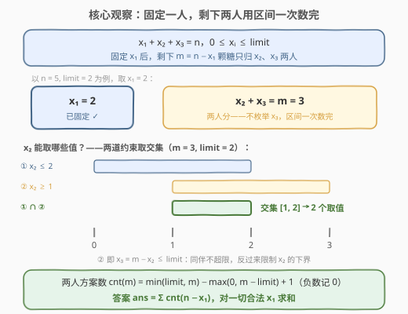
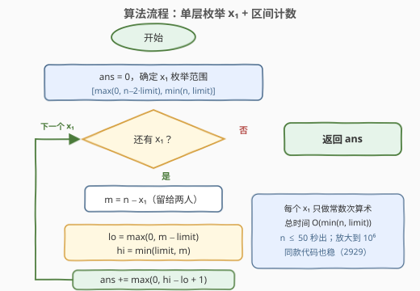
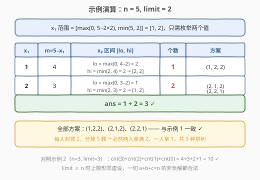

# 给小朋友们分糖果 I

- **题目名称**：给小朋友们分糖果 I
- **链接**：[2928. 给小朋友们分糖果 I](https://leetcode.cn/problems/distribute-candies-among-children-i/)
- **难度**：简单
- **标签**：数学、组合数学、枚举

## 1. 题目概述

给你两个正整数 `n` 和 `limit`。请你将 `n` 颗糖果分给 `3` 位小朋友，确保**没有任何小朋友得到超过 `limit` 颗糖果**，请你返回满足此条件下的**总方案数**。

**示例 1**：

```text
输入：n = 5, limit = 2
输出：3
解释：总共有 3 种方法分配 5 颗糖果，且每位小朋友的糖果数不超过 2：(1, 2, 2)，(2, 1, 2) 和 (2, 2, 1)。
```

**示例 2**：

```text
输入：n = 3, limit = 3
输出：10
解释：总共有 10 种方法分配 3 颗糖果，且每位小朋友的糖果数不超过 3：(0, 0, 3)，(0, 1, 2)，(0, 2, 1)，(0, 3, 0)，(1, 0, 2)，(1, 1, 1)，(1, 2, 0)，(2, 0, 1)，(2, 1, 0) 和 (3, 0, 0)。
```

**约束条件**：

- $1 \le n \le 50$
- $1 \le limit \le 50$

> 💡 本题是「分糖果三连」的入门版，三题**题面一字不差**、数据范围逐题放大，数据范围每放大一个数量级就逼出一层优化。本文主讲可原样平移到 II 版的 $O(n)$「枚举一人 + 区间计数」解法；$O(1)$ 闭式公式的完整推导见 [2927. 给小朋友们分糖果 III 题解](2927_给小朋友们分糖果III.md)。
>
> | 题号 | 难度 | 数据范围 | 通行解法 |
> |------|------|----------|----------|
> | **2928. 分糖果 I（本题）** | 简单 | $n, limit \le 50$ | 双重循环 $O(n^2)$ 足够，单循环更优 |
> | 2929. 分糖果 II | 中等 | $n, limit \le 10^6$ | 单层循环 $O(n)$（本文解法原样平移） |
> | 2927. 分糖果 III | 困难 | $n, limit \le 10^9$ | 隔板法 + 容斥 $O(1)$ |

---

## 2. 解题思路

把分糖写成方程：

$$x_1 + x_2 + x_3 = n, \quad 0 \le x_i \le limit$$

求满足约束的整数解个数。三位小朋友**有区别**：$(1,2,2)$ 与 $(2,1,2)$ 是不同方案。

### 2.1 暴力思路：从三重循环到双重循环

官方 hint 明示了最朴素的解法：三重循环枚举 $(x_1, x_2, x_3)$，检查方程与上界，$O(n^3)$。$n \le 50$ 时至多 $51^3 \approx 1.3 \times 10^5$ 组合，轻松通过。

但注意：**一旦固定 $x_1, x_2$，方程已经把 $x_3 = n - x_1 - x_2$ 唯一确定**——第三层循环是纯浪费，只需检查 $0 \le x_3 \le limit$：

```cpp
int distributeCandies(int n, int limit) {
    int ans = 0;
    for (int x1 = 0; x1 <= min(n, limit); x1++)
        for (int x2 = 0; x2 <= min(n - x1, limit); x2++)
            if (n - x1 - x2 <= limit)      // x₃ 由方程唯一确定
                ans++;
    return ans;
}
```

$O(n^2) \approx 2600$ 次迭代，又快一个数量级。其实内层循环同样可以省掉——两人方案数能用**区间**一次算出。

### 2.2 核心观察：固定一人，剩下两人用区间一次数完



固定 $x_1$，记 $m = n - x_1$ 为留给后两人的糖数。$x_2$ 必须同时满足两道约束：

1. **自身上界**：$0 \le x_2 \le limit$；
2. **同伴上界**：$x_3 = m - x_2$ 也要落在 $[0, limit]$ 内，即 $m - limit \le x_2 \le m$。

两个区间取交集，得到 $x_2$ 的可行区间：

$$[\,lo,\ hi\,] = \big[\max(0,\ m - limit),\ \min(limit,\ m)\,\big]$$

区间内每个整数恰对应一个方案（$x_3$ 随之导出），于是两人的方案数一式算完：

$$\text{cnt}(m) = \max\big(0,\ \min(limit,\ m) - \max(0,\ m - limit) + 1\big)$$

> 💡 $\max(0,\cdot)$ 兜底「区间为空」的情形——例如 $m > 2\,limit$ 时后两人怎么分都会有人超限，方案数为 $0$。

同理，$x_1$ 自己的枚举范围也由「给后面留多少」决定：$x_1 \ge n - 2\,limit$（否则剩下的糖超过两人的总容量），再叠加自身上界与总量：

$$x_1 \in \big[\max(0,\ n - 2\,limit),\ \min(n,\ limit)\big]$$

### 2.3 算法流程



1. `ans = 0`；
2. 在 $[\max(0, n - 2\,limit),\ \min(n, limit)]$ 内枚举 $x_1$；
3. 令 $m = n - x_1$，计算 $lo = \max(0, m - limit)$，$hi = \min(limit, m)$；
4. `ans += max(0, hi − lo + 1)`；
5. 枚举结束返回 `ans`。

### 2.4 示例演算



以示例 1（$n=5,\ limit=2$）为例。先定 $x_1 \in [\max(0, 1), \min(5, 2)] = [1, 2]$，逐个计算：

| $x_1$ | $m = 5-x_1$ | $lo = \max(0, m-2)$ | $hi = \min(2, m)$ | 个数 | 方案 |
|-------|------------|--------------------|-------------------|------|------|
| 1 | 4 | 2 | 2 | 1 | (1, 2, 2) |
| 2 | 3 | 1 | 2 | 2 | (2, 1, 2), (2, 2, 1) |

$\text{ans} = 1 + 2 = 3$ ✓，与示例 1 一致。

示例 2（$n=3,\ limit=3$）：$x_1 \in [0, 3]$，四个 $m$ 对应 $\text{cnt}(3)+\text{cnt}(2)+\text{cnt}(1)+\text{cnt}(0) = 4+3+2+1 = 10$ ✓——$limit \ge n$ 时上界形同虚设，一切 $a+b+c=3$ 的非负解都合法。

---

## 3. 参考代码

### C++

```cpp
class Solution {
public:
    int distributeCandies(int n, int limit) {
        int ans = 0;
        for (int x1 = max(0, n - 2 * limit); x1 <= min(n, limit); x1++) {
            int m = n - x1;
            int lo = max(0, m - limit), hi = min(limit, m);
            ans += max(0, hi - lo + 1);
        }
        return ans;
    }
};
```

### Python

```python
class Solution:
    def distributeCandies(self, n: int, limit: int) -> int:
        ans = 0
        for x1 in range(max(0, n - 2 * limit), min(n, limit) + 1):
            m = n - x1
            lo, hi = max(0, m - limit), min(limit, m)
            ans += max(0, hi - lo + 1)
        return ans
```

> 💡 若嫌 lo/hi 容易写错，直接交 2.1 的双重循环也完全够用（$n \le 50$，$O(n^2)$ 毫无压力）。单循环版的真正价值在于：**一字不改提交 2929（$n \le 10^6$）同样通过**。

---

## 4. 复杂度分析

| 维度 | 复杂度 | 说明 |
|------|--------|------|
| 时间复杂度 | $O(\min(n, limit))$ | $x_1$ 至多取 $\min(n, limit)+1 \le 51$ 个值，每个值常数次算术 |
| 空间复杂度 | $O(1)$ | 仅常数个变量 |

---

## 5. 扩展：同一道题，三个数量级的数据

| 解法 | 复杂度 | 2928（$n \le 50$） | 2929（$n \le 10^6$） | 2927（$n \le 10^9$） |
|------|--------|-------------------|----------------------|----------------------|
| 三重循环枚举 | $O(n^3)$ | ✅ | ❌ 超时 | ❌ 超时 |
| 双重循环（2.1） | $O(n^2)$ | ✅ | ❌ 超时 | ❌ 超时 |
| 枚举一人 + 区间计数（本文） | $O(n)$ | ✅ | ✅ | ❌ 超时（Python 尤其吃力） |
| 隔板法 + 容斥闭式 | $O(1)$ | ✅ | ✅ | ✅ |

$O(1)$ 闭式（完整推导见 [2927 题解](2927_给小朋友们分糖果III.md)）：令 $f(m) = \binom{m+2}{2}$（$m<0$ 时记 0），$L = limit + 1$，则

$$\text{ans} = f(n) - 3\,f(n-L) + 3\,f(n-2L) - f(n-3L)$$

代示例 1（$L=3$）：$f(5) - 3f(2) + 3f(-1) - f(-4) = 21 - 18 = 3$ ✓。闭式对三个数据范围通吃，但推导门槛高；**枚举法好想、好验、好推广**——比如「三人上界各不相同 $limit_1, limit_2, limit_3$」时闭式立刻失效，而把 2.2 的区间端点改成对应上界即可。认识两条路线、按数据范围选择，才是这组系列题的考点。

---

## 6. 面试要点

1. **为什么固定两个变量就能消掉一层循环？**

   - 方程 $x_1+x_2+x_3=n$ 对第三个变量是**唯一确定**而非自由选择
   - 枚举的本质是枚举方案空间：$(x_1, x_2)$ 定了，方案就定了，合法性只需检查 $x_3$ 是否在界内

2. **$x_1$ 的范围为什么是 $[\max(0, n-2\,limit),\ \min(n, limit)]$？**

   - 上端 $\min(n, limit)$：自身不超过 $limit$，也不超过总糖数 $n$
   - 下端 $n - 2\,limit$：后两人总容量 $2\,limit$，$x_1$ 太小则糖分不完，方案数恒为 0——提前剪掉可少跑循环，也保证区间计数不白算

3. **$\min(limit, m) - \max(0, m-limit) + 1$ 的每一项分别是什么？**

   - $hi = \min(limit, m)$：「$x_2 \le limit$」与「$x_2 \le m$（保证 $x_3 \ge 0$）」的右端取小
   - $lo = \max(0, m-limit)$：「$x_2 \ge 0$」与「$x_3 = m - x_2 \le limit$」的左端取大
   - 闭区间点数要 $+1$；外面套 $\max(0, \cdot)$ 处理区间为空的情况

4. **区间什么时候会为空？**

   - $m > 2\,limit$（两人装不下）或 $m < 0$（糖数负）
   - 本题 $x_1$ 的枚举范围已排除前者，$\max(0,\cdot)$ 属于双保险——若把 $x_1$ 范围写错成 $[0, \min(n,limit)]$，兜底能让答案不出错，只是多跑无效迭代

5. **面试官追问「$n$ 放大到 $10^9$ 怎么办」？**

   - 循环全废，上隔板法 + 容斥的 $O(1)$ 闭式（见 2927）
   - 若上界互不相同或人数 $k$ 不定，闭式失效，退回 DP（对照 2902 有界子多重集计数）——「何时闭式可行」本身就是考点

> 💡 **一句话总结**：固定 $x_1$ 后，$x_2$ 的可行域是两道上界约束的区间交集，个数 $hi - lo + 1$ 一式算完；$O(\min(n, limit))$ 顺手通过本题，原样平移即过 2929。

---

## 7. 同类练习题

- [2929. 给小朋友们分糖果 II](https://leetcode.cn/problems/distribute-candies-among-children-ii/)（[题解](2929_给小朋友们分糖果II.md)）：同题面中等版（$n \le 10^6$），本文 $O(n)$ 代码一字不改直接通过，体会「数据范围决定解法」
- [2927. 给小朋友们分糖果 III](https://leetcode.cn/problems/distribute-candies-among-children-iii/)（[题解](2927_给小朋友们分糖果III.md)）：同题面困难版（$n \le 10^9$），隔板法 + 容斥 $O(1)$ 闭式的完整推导
- [1641. 统计字典序元音字符串的数目](https://leetcode.cn/problems/count-sorted-vowel-strings/)（[题解](../1601-1700/1641_统计字典序元音字符串的数目.md)）：无上界隔板法计数 $\binom{n+4}{4}$，分糖系列「去掉 limit」的近亲
- [1735. 生成乘积数组的方案数](https://leetcode.cn/problems/count-ways-to-make-array-with-product/)（[题解](../1701-1800/1735_生成乘积数组的方案数.md)）：质因数分解后各组独立做隔板法，有界计数与闭式公式的进阶实战
- [2400. 恰好移动 k 步到达某一位置的方法数目](https://leetcode.cn/problems/number-of-ways-to-reach-a-position-after-exactly-k-steps/)（[题解](../2301-2400/2400_恰好移动k步到达某一位置的方法数目.md)）：路径计数转组合数 $\binom{k}{r}$，方案计数的无上界版本
