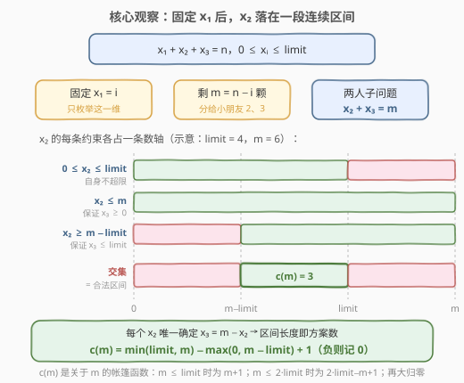
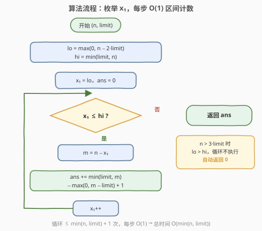
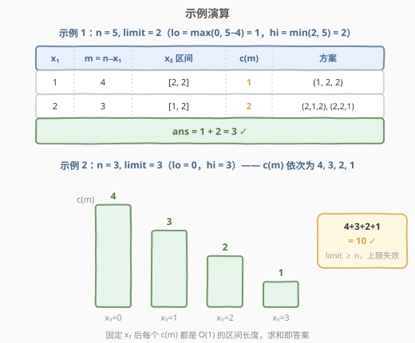

# LeetCode 给小朋友们分糖果 II 题解

## 1. 题目概述

- **标题 / 题号**：给小朋友们分糖果 II（#2929，medium）
- **链接**：https://leetcode.cn/problems/distribute-candies-among-children-ii/
- **难度**：中等
- **标签**：数学、组合数学、枚举

**题意**：给你两个正整数 `n` 和 `limit`。请你将 `n` 颗糖果分给 `3` 位小朋友，确保没有任何小朋友得到超过 `limit` 颗糖果，请你返回满足此条件下的**总方案数**。

**示例 1**：

```text
输入：n = 5, limit = 2
输出：3
解释：总共有 3 种方法分配 5 颗糖果，且每位小朋友的糖果数不超过 2：(1, 2, 2)，(2, 1, 2) 和 (2, 2, 1)。
```

**示例 2**：

```text
输入：n = 3, limit = 3
输出：10
解释：总共有 10 种方法分配 3 颗糖果，且每位小朋友的糖果数不超过 3：(0, 0, 3)，(0, 1, 2)，(0, 2, 1)，(0, 3, 0)，(1, 0, 2)，(1, 1, 1)，(1, 2, 0)，(2, 0, 1)，(2, 1, 0) 和 (3, 0, 0)。
```

**约束**：

- $1 \le n \le 10^6$
- $1 \le limit \le 10^6$

**系列三连**——同题面、数据范围递增，本题是「逼出降维枚举」的中等版：

| 题号 | 难度 | 数据范围 | 通行解法 |
|------|------|----------|----------|
| 2928. 分糖果 I | 简单 | $n, limit \le 50$ | 双重循环 $O(n^2)$ 暴力 |
| **2929. 分糖果 II（本题）** | 中等 | $n, limit \le 10^6$ | **枚举第一人 $O(n)$** |
| 2927. 分糖果 III | 困难 | $n, limit \le 10^9$ | 隔板法 + 容斥 $O(1)$ |

## 2. 解题思路

把分糖写成方程：

$$x_1 + x_2 + x_3 = n, \quad 0 \le x_i \le limit$$

求满足条件的整数解个数。**计数题只数不列**——不需要真的枚举出每个三元组，找到「一段取值区间 ↔ 一批方案」的对应即可批量计数。

### 2.1 暴力思路：从 $O(n^3)$ 到 $O(n^2)$

- **三重循环**枚举 $(x_1, x_2, x_3)$ 再验证和为 $n$：$O(n^3)$，最笨的写法；
- **双重循环**：枚举 $x_1, x_2$，则 $x_3 = n - x_1 - x_2$ **唯一确定**，只需检查 $0 \le x_3 \le limit$：$O(n^2)$，2928（$n \le 50$）的标准暴力；
- 本题 $n \le 10^6$，$O(n^2)$ 高达 $10^{12}$ 次操作必然超时——但离目标只差一步：**再消掉一重循环**。

> 💡 从 I → II → III 的演进正是算法设计的经典路径：**暴力 → 降维枚举 → 数学闭式**，数据范围每放大一个数量级，就逼出一层优化。

### 2.2 核心观察：枚举一人 + 区间计数



只枚举 $x_1 = i$。一旦 $i$ 固定，剩下 $m = n - i$ 颗糖分给小朋友 2、3，这是一个**两人子问题**，可以 $O(1)$ 数出来：

$$x_2 + x_3 = m, \quad 0 \le x_2, x_3 \le limit$$

枚举 $x_2$（$x_3 = m - x_2$ 随之唯一确定），合法性翻译成两条不等式：

- $x_2 \le limit$（自己不超限），且 $x_2 \le m$（保证 $x_3 \ge 0$）→ 上界 $\min(limit,\ m)$；
- $x_2 \ge 0$，且 $x_2 \ge m - limit$（保证 $x_3 \le limit$）→ 下界 $\max(0,\ m - limit)$。

于是 $x_2$ 的合法取值是**一段连续区间**，区间长度就是方案数：

$$c(m) = \min(limit,\ m) - \max(0,\ m - limit) + 1 \quad (\text{结果取} \ge 0)$$

按 $m$ 的取值展开，$c(m)$ 是一个**帐篷函数**（先升后降的三角形）：

| $m$ 的范围 | $c(m)$ | 含义 |
|-----------|--------|------|
| $0 \le m \le limit$ | $m + 1$ | 糖少，瓶颈是「不够分」而非上限，$x_2$ 可取 $0 \sim m$ |
| $limit < m \le 2\,limit$ | $2\,limit - m + 1$ | 糖多，两端各被一个上限卡住，越接近 $2\,limit$ 越少 |
| $m > 2\,limit$ | $0$ | 两人装不下，无解 |

**收紧 $x_1$ 的枚举范围**：要使子问题有解，需 $m = n - x_1 \le 2\,limit$，再加上 $0 \le x_1 \le limit$、$x_1 \le n$，得：

$$x_1 \in [\,\max(0,\ n - 2\,limit),\ \min(limit,\ n)\,]$$

区间内 $c(m) \ge 1$ 恒成立，无需再判零；若 $n > 3\,limit$（糖多到三人也装不下），区间为空，循环自然一次不执行，答案 $0$——边界无需特判。

### 2.3 算法流程图



1. 计算 $\text{lo} = \max(0,\ n - 2\,limit)$，$\text{hi} = \min(limit,\ n)$；
2. $x_1$ 从 $\text{lo}$ 枚举到 $\text{hi}$，每个 $x_1$ 令 $m = n - x_1$；
3. 累加 $c(m) = \min(limit, m) - \max(0, m - limit) + 1$；
4. 返回累加和。

共 $\text{hi} - \text{lo} + 1 \le \min(n, limit) + 1$ 次迭代，每步 $O(1)$。

> ⚠️ **溢出检查**：$n \le 10^6$ 时总方案数上界为 $\binom{n+2}{2} \approx 5 \times 10^{11}$，超出 `int`（约 $2.1 \times 10^9$），C++ 必须用 `long long` 累加；Python 天然大数无此虑。

### 2.4 示例演算



**示例 1**（$n=5,\ limit=2$）：$\text{lo} = \max(0, 5-4) = 1$，$\text{hi} = \min(2, 5) = 2$：

| $x_1$ | $m = n - x_1$ | $x_2$ 区间 $[\max(0, m-2),\ \min(2, m)]$ | $c(m)$ | 对应方案 |
|-------|---------------|------------------------------------------|--------|----------|
| $1$ | $4$ | $[2, 2]$ | $1$ | $(1, 2, 2)$ |
| $2$ | $3$ | $[1, 2]$ | $2$ | $(2, 1, 2), (2, 2, 1)$ |

$\text{ans} = 1 + 2 = 3$ ✓

**示例 2**（$n=3,\ limit=3$）：$\text{lo} = 0$，$\text{hi} = 3$，四个 $x_1$ 的 $c(m)$ 依次为 $4, 3, 2, 1$（帐篷的下降段），$\text{ans} = 4 + 3 + 2 + 1 = 10$ ✓——$limit \ge n$ 时上限形同虚设，答案是完整的 $\binom{3+2}{2} = 10$。

## 3. 参考代码

### C++

```cpp
class Solution {
  public:
    long long distributeCandies(int n, int limit) {
        long long ans = 0;
        for (int x1 = max(0, n - 2 * limit); x1 <= min(limit, n); x1++) {
            int m = n - x1;
            ans += min(limit, m) - max(0, m - limit) + 1;
        }
        return ans;
    }
};
```

### Python

```python
class Solution:
    def distributeCandies(self, n: int, limit: int) -> int:
        ans = 0
        for x1 in range(max(0, n - 2 * limit), min(limit, n) + 1):
            m = n - x1
            ans += min(limit, m) - max(0, m - limit) + 1
        return ans
```

> 💡 两份代码结构一致：先算紧的循环边界，再套 2.2 的区间计数公式。中间量 $m - limit$、$n - 2\,limit$ 的绝对值都不超过 $10^6$，`int` 装得下；只有累加和必须 64 位。

## 4. 复杂度分析

| 维度 | 复杂度 | 说明 |
|------|--------|------|
| 时间复杂度 | $O(\min(n, limit))$ | 循环长度 $\text{hi} - \text{lo} + 1 \le \min(n, limit) + 1 \le 10^6 + 1$，每步 $O(1)$ |
| 空间复杂度 | $O(1)$ | 仅常数个变量 |

## 5. 扩展

- **$O(1)$ 容斥公式**（2927 的正解）：无上限时 $f(m) = \binom{m+2}{2}$，令 $L = limit + 1$，则 $\text{ans} = f(n) - 3f(n-L) + 3f(n-2L) - f(n-3L)$，对本题同样成立且更快——本题数据范围没逼到这一步，但面试中常被顺势追问，详见 2927 题解。
- **等差数列求和的另一条 $O(1)$ 路**：沿本题的枚举，$c(n - x_1)$ 关于 $x_1$ 分段线性（帐篷的升/降段各是一段等差数列），两段分别套等差求和公式同样 $O(1)$——与容斥殊途同归。
- **推广到 $k$ 位小朋友**：枚举 $k-1$ 人是 $O(n^{k-2})$，人数一多就失效；变量个数固定时仍可走容斥闭式（$\sum_j (-1)^j \binom{k}{j} f_k(n - jL)$，$f_k(m) = \binom{m+k-1}{k-1}$），变量个数不受限时回到 2902 式的滑动窗口 DP。
- **「每人至少 1 颗」变体**：先给每人预发 1 颗，转化为 $n - 3$ 颗、上界 $limit - 1$ 的原问题，枚举照常。

## 6. 面试要点

1. **为什么枚举一人后是 $O(1)$ 计数？**

   - 固定 $x_1$ 后 $x_2 + x_3 = m$ 中 $x_3$ 由 $x_2$ 唯一确定，只剩单变量 $x_2$
   - 合法条件 $0 \le x_2 \le limit$ 与 $0 \le m - x_2 \le limit$ 联立，得 $x_2$ 落在连续区间 $[\max(0, m - limit),\ \min(limit, m)]$
   - 计数题只数不列——区间长度即方案数，无需逐个枚举

2. **$x_1$ 的循环范围为什么能收紧到 $[\max(0, n - 2\,limit),\ \min(limit, n)]$？**

   - 子问题有解需 $m = n - x_1 \le 2\,limit$（两人容量上限），否则 $c(m) = 0$ 白跑
   - 收紧后区间内 $c(m) \ge 1$ 恒成立，公式无需 $\max(0, \cdot)$ 兜底；不收紧也能做，只是慢一点、多一个取零细节

3. **什么时候答案为 0？需要特判吗？**

   - $n > 3\,limit$ 时三人全部拿满也装不下，方案数为 0
   - 此时 $\text{lo} > \text{hi}$，循环一次不执行，累加和天然为 0——**边界被循环边界自动吸收，无需特判**

4. **C++ 为什么返回 `long long`？**

   - 最坏 $n = 10^6,\ limit = 10^6$ 时答案约 $\binom{10^6+2}{2} \approx 5 \times 10^{11}$，超出 `int`
   - 累加器一步越界就错，函数签名也必须是 64 位

5. **$c(m)$ 的形状是什么？有什么用？**

   - 关于 $m$ 的帐篷函数：$[0, limit]$ 上是 $m + 1$ 递增，$[limit, 2\,limit]$ 上是 $2\,limit - m + 1$ 递减，之后归零
   - 认出「分段线性」就能用等差求和把整个循环 $O(1)$ 化，这正是 2927 数据范围逼出的下一步

6. **面试官追问「数据范围放大到 $10^9$ 怎么办」？**

   - $O(n)$ 循环（尤其 Python）不可行，走隔板法 + 容斥闭式：$f(n) - 3f(n-L) + 3f(n-2L) - f(n-3L)$
   - 识别「数据范围决定解法层级」：$O(n^2) \to O(n) \to O(1)$ 每一步都是被范围逼出来的

## 同类练习题

| # | 题目 | 与本题的关联 |
|---|------|-------------|
| 2928 | [给小朋友们分糖果 I](https://leetcode.cn/problems/distribute-candies-among-children-i/) | 同题面小范围版（$n, limit \le 50$），双重循环暴力即可，感受「数据范围决定解法」 |
| 2927 | [给小朋友们分糖果 III](https://leetcode.cn/problems/distribute-candies-among-children-iii/)（[题解](../2901-3000/2927_给小朋友们分糖果III.md)） | 同题面大范围版（$\le 10^9$），隔板法 + 容斥 $O(1)$，是本题枚举的下一步进化 |
| 1641 | [统计字典序元音字符串的数目](https://leetcode.cn/problems/count-sorted-vowel-strings/)（[题解](../1601-1700/1641_统计字典序元音字符串的数目.md)） | 无上限隔板法计数 $\binom{n+4}{4}$，与本题「先算无上限、再处理上限」同源 |
| 1735 | [生成乘积数组的方案数](https://leetcode.cn/problems/count-ways-to-make-array-with-product/)（[题解](../1701-1800/1735_生成乘积数组的方案数.md)） | 质因数分解后各组独立做隔板法，隔板计数的进阶实战 |
| 2400 | [恰好移动 k 步到达某一位置的方法数目](https://leetcode.cn/problems/number-of-ways-to-reach-a-position-after-exactly-k-steps/)（[题解](../2301-2400/2400_恰好移动k步到达某一位置的方法数目.md)） | 组合计数中先枚举一维再闭式计数的近亲套路 |
