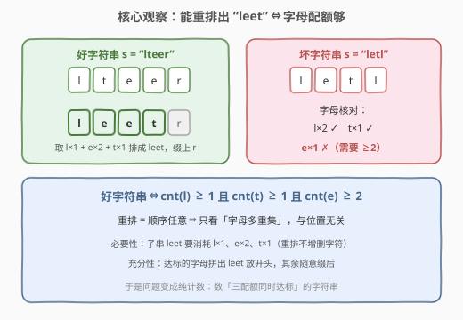
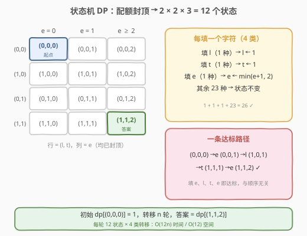
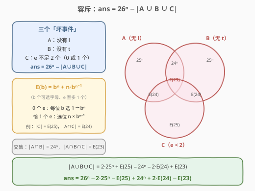
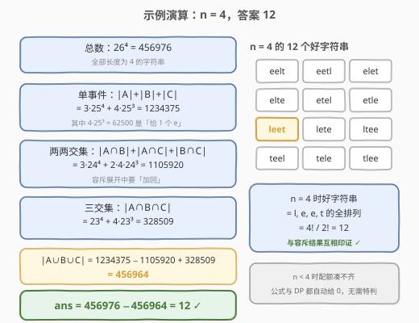

# LeetCode 重新排列后包含指定子字符串的字符串数目 题解

## 1. 题目概述

- **标题 / 题号**：重新排列后包含指定子字符串的字符串数目（#2930，medium）
- **链接**：https://leetcode.cn/problems/number-of-strings-which-can-be-rearranged-to-contain-substring/
- **难度**：中等
- **标签**：数学、动态规划、组合数学、容斥原理

**题意**：给你一个整数 `n`。如果一个字符串 `s` **只包含小写英文字母**，且将 `s` 的字符**重新排列**后，新字符串包含**子字符串** `"leet"`，那么称 `s` 是一个**好字符串**。比方说：

- `"lteer"` 是好字符串，因为重新排列后可以得到 `"leetr"`（含 `"leet"`）；
- `"letl"` 不是好字符串，因为无法重新排列并得到子串 `"leet"`。

请你返回长度为 `n` 的好字符串**总**数目。由于答案可能很大，将答案对 $10^9 + 7$ **取余**后返回。

> **子字符串**是一个字符串中一段连续的字符序列。

**示例 1**：

```text
输入：n = 4
输出：12
解释：总共 12 个字符串重排后包含子串 "leet"："eelt"，"eetl"，"elet"，"elte"，"etel"，"etle"，"leet"，"lete"，"ltee"，"teel"，"tele" 和 "tlee"。
```

**示例 2**：

```text
输入：n = 10
输出：83943898
解释：长度为 10 的方案数为 526083947580，对 10^9 + 7 取余得 83943898。
```

**约束**：

- $1 \le n \le 10^5$

## 2. 解题思路

### 2.1 暴力思路

最直接的做法是枚举全部 $26^n$ 个字符串再逐一检查——$n = 4$ 时已有 $456976$ 个，$n = 10$ 时约 $1.4 \times 10^{14}$ 个，指数级爆炸。

退一步用 DP 计数：若状态里记录 `l`/`t`/`e` 的**真实出现次数**，状态数 $O(n^3)$，$n = 10^5$ 同样不可行。突破口有二：先把「重排条件」**等价转化**（2.2），再对计数**封顶**（2.3）。

### 2.2 核心观察：重排条件 ⇔ 字母配额



**「重新排列后能包含 `leet`」⇔「`s` 中至少有 1 个 `l`、1 个 `t`、2 个 `e`」**：

- **必要性**：子串 `"leet"` 本身要消耗 $l \times 1$、$e \times 2$、$t \times 1$，而重排不增删字符；
- **充分性**：任取 1 个 `l`、2 个 `e`、1 个 `t` 排成 `"leet"` 放在开头，其余字符随意缀在其后。

于是问题转化为纯计数：**统计长度为 $n$ 的字符串中 $\text{cnt}(l) \ge 1$、$\text{cnt}(t) \ge 1$、$\text{cnt}(e) \ge 2$ 同时成立的个数**。位置与顺序完全无关——这是「重排」二字送给我们的礼物。

### 2.3 解法一：状态机 DP（12 个状态）



计数只关心**是否达标**，不关心超出多少——把三个配额封顶：

| 配额 | 取值 | 档数 |
|------|------|------|
| $l$ | 0（未出现）/ 1（已出现） | 2 |
| $t$ | 0 / 1 | 2 |
| $e$ | 0 / 1 / ≥2（封顶） | 3 |

状态空间 $2 \times 2 \times 3 = 12$。逐位填字符，每步 26 种选择按字符归成 4 类：

| 新字符 | 方案数 | 状态变化 |
|--------|--------|----------|
| `l` | 1 | $l \leftarrow 1$ |
| `t` | 1 | $t \leftarrow 1$ |
| `e` | 1 | $e \leftarrow \min(e+1,\ 2)$ |
| 其余 23 个字母 | 23 | 不变 |

初始 $\text{dp}[(0,0,0)] = 1$，转移 $n$ 轮后答案为 $\text{dp}[(1,1,2)]$。

> 💡 与 [526. 优美的排列](https://leetcode.cn/problems/beautiful-arrangement/)（[题解](../0501-0600/526_优美的排列.md)）的 bitmask 同族：**达标即封顶**，把无界计数压成有限状态机。每轮 $O(12 \times 4)$，总复杂度 $O(n)$，$n = 10^5$ 轻松通过。

### 2.4 解法二：容斥原理——正难则反



直接数「三条件同时成立」要处理条件间的耦合；反过来数「至少一条不成立」再从总数扣除，每一项都是无脑幂次。设三个坏事件：

- $A$ = 没有 `l`；$B$ = 没有 `t`；$C$ = `e` 的个数不足 2（0 个或恰 1 个）

$$\text{ans} = 26^n - |A \cup B \cup C|$$

每个（交）集合都是「禁掉若干字母 + `e` 至多 1 个」的简单计数。记 $E(b) = b^n + n \cdot b^{n-1}$（每位从 $b$ 个可选字母中选、且 `e` 至多 1 个：0 个 `e` 的 $b^n$，加上恰 1 个 `e` 的 $n \cdot b^{n-1}$）：

| 集合 | 方案数 | 说明 |
|------|--------|------|
| $\|A\|$、$\|B\|$ | $25^n$ | 每位禁掉 1 个字母 |
| $\|C\|$ | $E(25)$ | 不禁字母、`e` 至多 1 个 |
| $\|A \cap B\|$ | $24^n$ | 禁 `l`、`t` 两个字母 |
| $\|A \cap C\|$、$\|B \cap C\|$ | $E(24)$ | 禁 1 个字母 + `e` 至多 1 个 |
| $\|A \cap B \cap C\|$ | $E(23)$ | 禁 `l`、`t` + `e` 至多 1 个 |

代入 $|A \cup B \cup C| = |A| + |B| + |C| - |A \cap B| - |A \cap C| - |B \cap C| + |A \cap B \cap C|$，整理得一行闭式：

$$\text{ans} = 26^n - 3 \cdot 25^n - n \cdot 25^{n-1} + 3 \cdot 24^n + 2n \cdot 24^{n-1} - 23^n - n \cdot 23^{n-1}$$

> ⚠️ 上式对 $n < 4$ **自动给出 0**（$n = 1, 2, 3$ 时各项恰好相消，可代入验证），无需特判；实现时只需保证快速幂在指数 $n - 1 = 0$ 时正确返回 1。

### 2.5 示例演算：n = 4



| 步骤 | 计算 | 值 |
|------|------|-----|
| 总数 | $26^4$ | $456976$ |
| $\|A\|+\|B\|+\|C\|$ | $3 \times 25^4 + 4 \times 25^3$ | $1234375$ |
| 两两交集 | $3 \times 24^4 + 2 \times 4 \times 24^3$ | $1105920$ |
| 三交集 | $23^4 + 4 \times 23^3$ | $328509$ |
| $\|A \cup B \cup C\|$ | $1234375 - 1105920 + 328509$ | $456964$ |
| **ans** | $456976 - 456964$ | $\boxed{12}$ ✓ |

交叉验证：$n = 4$ 时好字符串必须恰好由 $\{l, e, e, t\}$ 组成，即 $\dfrac{4!}{2!} = 12$ 个互异排列——与示例 1 列举的 12 个字符串完全一致。示例 2（$n = 10$）代入闭式得 $526083947580 \bmod (10^9 + 7) = 83943898$ ✓。

## 3. 参考代码

### 解法一：状态机 DP —— O(n)

C++：

```cpp
class Solution {
    static constexpr long long MOD = 1'000'000'007LL;

  public:
    int stringCount(int n) {
        array<array<array<long long, 3>, 2>, 2> dp{};
        dp[0][0][0] = 1;
        for (int i = 0; i < n; ++i) {
            array<array<array<long long, 3>, 2>, 2> ndp{};
            for (int l = 0; l < 2; ++l)
                for (int t = 0; t < 2; ++t)
                    for (int e = 0; e < 3; ++e) {
                        long long c = dp[l][t][e];
                        if (c == 0) continue;
                        ndp[l][t][e] = (ndp[l][t][e] + 23 * c) % MOD;
                        ndp[1][t][e] = (ndp[1][t][e] + c) % MOD;
                        ndp[l][1][e] = (ndp[l][1][e] + c) % MOD;
                        int e2 = e < 2 ? e + 1 : 2;
                        ndp[l][t][e2] = (ndp[l][t][e2] + c) % MOD;
                    }
            dp = std::move(ndp);
        }
        return (int)dp[1][1][2];
    }
};
```

Python：

```python
from collections import defaultdict


class Solution:
    def stringCount(self, n: int) -> int:
        MOD = 10 ** 9 + 7
        dp = {(0, 0, 0): 1}
        for _ in range(n):
            ndp = defaultdict(int)
            for (l, t, e), c in dp.items():
                ndp[(l, t, e)] = (ndp[(l, t, e)] + 23 * c) % MOD
                ndp[(1, t, e)] = (ndp[(1, t, e)] + c) % MOD
                ndp[(l, 1, e)] = (ndp[(l, 1, e)] + c) % MOD
                ndp[(l, t, min(e + 1, 2))] = (ndp[(l, t, min(e + 1, 2))] + c) % MOD
            dp = ndp
        return dp.get((1, 1, 2), 0)
```

### 解法二：容斥闭式 —— O(log n)

C++：

```cpp
class Solution {
    static constexpr long long MOD = 1'000'000'007LL;

    static long long qpow(long long b, long long e) {
        long long r = 1;
        for (; e > 0; e >>= 1, b = b * b % MOD)
            if (e & 1) r = r * b % MOD;
        return r;
    }

  public:
    int stringCount(int n) {
        long long N = n;
        auto P = [&](long long b) { return qpow(b, N); };
        auto Q = [&](long long b) { return N * qpow(b, N - 1) % MOD; };
        long long pos = (P(26) + 3 * P(24) + 2 * Q(24)) % MOD;
        long long neg = (3 * P(25) + Q(25) + P(23) + Q(23)) % MOD;
        return (int)((pos - neg + MOD) % MOD);
    }
};
```

Python：

```python
class Solution:
    def stringCount(self, n: int) -> int:
        MOD = 10 ** 9 + 7
        P = lambda b: pow(b, n, MOD)
        Q = lambda b: n * pow(b, n - 1, MOD) % MOD
        return (P(26) - 3 * P(25) - Q(25)
                + 3 * P(24) + 2 * Q(24) - P(23) - Q(23)) % MOD
```

> 💡 Python 的 `pow(b, e, mod)` 三参数内置快速幂自带取模，且 `%` 对负数结果也落在 $[0, \text{MOD})$，无需像 C++ 那样手动 `+MOD` 修正。

## 4. 复杂度分析

| 解法 | 时间复杂度 | 空间复杂度 | 说明 |
|------|-----------|-----------|------|
| 状态机 DP | $O(n)$ | $O(1)$ | 每轮 12 个状态 × 4 类转移，滚动覆盖 |
| 容斥闭式 | $O(\log n)$ | $O(1)$ | 7 次快速幂，常数级 |

## 5. 扩展

- **$n$ 更大怎么办（如 $n \le 10^{18}$）**：线性 DP 失效，容斥闭式 $O(\log n)$ 依然秒杀；若连公式都没推出来，还可对 12 个状态写 $12 \times 12$ 转移矩阵做矩阵快速幂，$O(12^3 \log n)$——三种做法的适用边界值得主动比较。
- **子串换成 `"code"`（c、o、d、e 各需 1 个）**：配额变成 4 个「≥1」，DP 状态 $2^4 = 16$ 个；容斥则对 4 个坏事件展开 $2^4 = 16$ 项。一般地，第 $i$ 种字母需 $c_i$ 个时：DP 状态数 $\prod_i (c_i + 1)$，容斥项数 $2^k$（$k$ 为字母种类数）。
- **不许重排、要求原串含子串 `"leet"`**：条件从「多重集配额」退回「位置相关」，需用 KMP 前缀自动机 + 矩阵快速幂计数——正好反衬出本题「重排 ⇒ 只看多重集」的本质。

## 6. 面试要点

1. **为什么「能重排出 leet」等价于「l≥1、t≥1、e≥2」？**

   - 必要性：`leet` 子串本身消耗 l×1、e×2、t×1，重排不增删字符
   - 充分性：达标的字母拼成 `leet` 放开头，其余字符随意缀后
   - 一句话：重排 ⇒ 顺序无关 ⇒ 只看字母多重集

2. **DP 状态为什么只有 12 个？封顶为什么不影响正确性？**

   - 只关心「是否达标」，超出配额的数量对后续转移没有任何影响
   - $\min(e+1, 2)$ 把无界计数截断在达标线，与 526 的 bitmask「已用集合」同思想

3. **容斥中 $|C|$ 为什么是 $25^n + n \cdot 25^{n-1}$？**

   - $C$ = `e` 不足 2 个 = 0 个 `e` **或** 恰 1 个 `e`
   - 0 个：每位从非 `e` 的 25 个字母选，$25^n$
   - 恰 1 个：$n$ 个位置选一个放 `e`，其余 $n-1$ 位各 25 选，$n \cdot 25^{n-1}$

4. **$n < 4$ 需要特判吗？**

   - 不需要：DP 天然给 0（状态到不了 $(1,1,2)$）
   - 容斥式代入 $n = 1, 2, 3$ 逐项相消也恰好为 0，公式自带边界

5. **两种解法怎么选？**

   - $n \le 10^5$ 都轻松通过；DP 好想好写，容斥更快更优雅
   - 面试路径建议：先讲 2.2 的等价转化（本题真正的考点），再按面试官口味展开 DP 或容斥

## 同类练习题

| # | 题目 | 与本题的关联 |
|---|------|-------------|
| 2927 | [给小朋友们分糖果 III](https://leetcode.cn/problems/distribute-candies-among-children-iii/)（[题解](../2901-3000/2927_给小朋友们分糖果III.md)） | 隔板法 + 容斥的 O(1) 计数，容斥实战的近亲 |
| 357 | [统计各位数字都不同的数字个数](https://leetcode.cn/problems/count-numbers-with-unique-digits/)（[题解](../0301-0400/357_统计各位数字都不同的数字个数.md)） | 正难则反 + 排列计数入门 |
| 1012 | [至少有 1 位重复的数字](https://leetcode.cn/problems/numbers-with-repeated-digits/)（[题解](../1001-1100/1012_至少有1位重复的数字.md)） | 总数减去「无重复」的数位 DP，同款减法套路 |
| 2376 | [统计特殊整数](https://leetcode.cn/problems/count-special-integers/)（[题解](../2301-2400/2376_统计特殊整数.md)） | 数位 DP + 状态压缩计数进阶 |
| 526 | [优美的排列](https://leetcode.cn/problems/beautiful-arrangement/)（[题解](../0501-0600/526_优美的排列.md)） | bitmask 记「已达标集合」，状态封顶思想的源头 |
