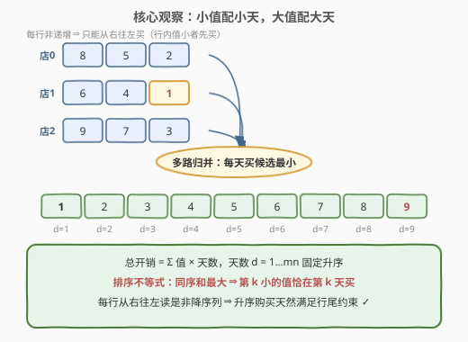
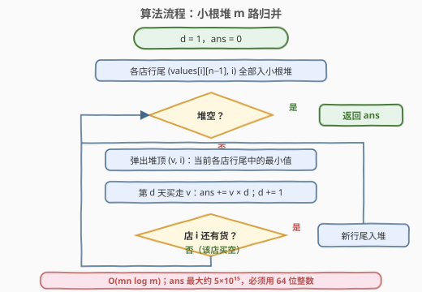
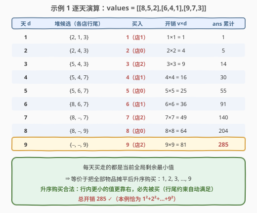

# LeetCode 购买物品的最大开销 题解

## 1. 题目概述

- **标题 / 题号**：购买物品的最大开销（#2931，hard）
- **链接**：https://leetcode.cn/problems/maximum-spending-after-buying-items/
- **难度**：困难
- **标签**：贪心、数组、矩阵、排序、堆（优先队列）

**题意**：给你一个下标从 **0** 开始大小为 $m \times n$ 的整数矩阵 `values`，表示 $m$ 个不同商店里 $m \times n$ 件不同的物品。每个商店有 $n$ 件物品，第 $i$ 个商店的第 $j$ 件物品的价值为 $values[i][j]$。每个商店的物品已按价值**非递增**排好序（$values[i][j] \ge values[i][j+1]$）。

每一天你可以在一个商店里购买一件物品。在第 $d$ 天，你可以：

- 选择商店 $i$；
- 购买该商店中**还没购买过的物品里下标最大**的那件 $j$（即剩余物品中最右边的），开销为 $values[i][j] \times d$。

所有物品视为不同（不同商店的同下标物品互不影响）。请返回购买**所有** $m \times n$ 件物品的最大总开销。

**示例 1**：

```text
输入：values = [[8,5,2],[6,4,1],[9,7,3]]
输出：285
解释：九天的购买顺序为 1,2,3,4,5,6,7,8,9（依次取各店行尾的最小候选），
      总开销 = 1×1 + 2×2 + 3×3 + … + 9×9 = 285。
```

**示例 2**：

```text
输入：values = [[10,8,6,4,2],[9,7,5,3,2]]
输出：386
解释：升序购买 2,2,3,4,5,6,7,8,9,10，
      总开销 = 2×1+2×2+3×3+4×4+5×5+6×6+7×7+8×8+9×9+10×10 = 386。
```

**约束**：

- $1 \le m = values.length \le 10$
- $1 \le n = values[i].length \le 10^4$
- $1 \le values[i][j] \le 10^6$
- $values[i]$ 按非递增顺序排序

## 2. 解题思路

### 2.1 暴力思路：枚举购买顺序

每天买一件、必须买完，一个购买方案就是 $m \times n$ 件物品的一个排列；合法方案必须满足"每行内下标大的（值小的）先买"。合法排列数约为 $\frac{(mn)!}{(n!)^m}$——$mn$ 可达 $10^5$，天文数字，**不可行**。

朴素的 DP 也不好看：天数 $d$ 是乘数权重，"前 $d$ 天买了哪些物品"的状态无法压缩（各店进度组合 $\binom{m+n}{m}$ 在 $n=10^4$ 时同样爆炸）。

换个角度想：直觉上应该**把便宜的早点买、贵的留到天数大的再买**（开销 = 值 × 天数，大数配大乘数）。下面证明这个直觉不但是最优的，而且与"只能买行尾"的约束**天然兼容**。

### 2.2 核心观察：排序不等式 + 约束天然兼容



把问题重写：设第 $d$ 天买走的物品价值为 $v_d$，总开销 $= \sum_{d=1}^{mn} v_d \cdot d$。天数固定为 $1, 2, \dots, mn$ 升序，唯一自由度是**给哪个值配哪个天**。

**第一步（下界即上界）**：由**排序不等式（重排不等式）**——两个序列的乘积和在**同序**排列时最大：

$$\sum_{d=1}^{mn} v_d \cdot d \;\le\; \sum_{k=1}^{mn} v_{(k)} \cdot k$$

其中 $v_{(1)} \le v_{(2)} \le \dots \le v_{(mn)}$ 是全体物品的升序排列。即**第 $k$ 小的值恰好在第 $k$ 天被买**时总开销最大。这是任何购买方案（无论是否合法）都无法逾越的上界。

**第二步（上界可达）**：这个上界恰好是一个**合法**方案！关键在两条事实的配合：

1. 行非递增 ⇒ 每行**从右往左读是非降序列**（行内值小的总在值大的右边）；
2. "行尾约束"要求：行内下标大的（值小的）必须先买。

把全体物品摊平后**升序购买**：行内任意两个物品 $a$（下标大、值小）与 $b$（下标小、值大），$a \le b$ 保证 $a$ 在升序序列中不排在 $b$ 之后——**行内保序自动满足**，行尾约束从未被违反。

> 💡 于是最优方案就是"全体物品升序购买"。而每行已经有序，无需真的摊平排序：**$m$ 路归并**即可——每天在 $m$ 个商店的行尾候选中取最小者买走，取到的恰好就是全局剩余最小值（它只可能藏在某个行尾，因为每行剩余部分的最小值就是行尾）。

### 2.3 算法流程：小根堆 m 路归并



用一个小根堆维护 $m$ 个行尾候选 $(值, 店号)$：

1. **初始化**：$d = 1$，每个非空商店的行尾 $(values[i][n-1], i)$ 入堆；
2. **循环**：弹出堆顶 $(v, i)$（当前各店行尾中的最小值 = 全局剩余最小值），累加 $ans \mathrel{+}= v \times d$，$d{+}{=}1$；若店 $i$ 还有货，则其新行尾入堆；
3. 堆空时所有物品买完，返回 $ans$。

实现细节：

- 值相等时堆按店号 tie-break，先买哪家都不影响结果（开销相同、合法性都满足）；
- **溢出**：$mn \le 10^5$、$v \le 10^6$，$ans \le 10^6 \times \frac{10^5 \cdot (10^5+1)}{2} \approx 5 \times 10^{15}$，超出 32 位整数范围，C++ 必须 `long long`（Python 天然大数）。

### 2.4 示例演算



以示例 1 `values = [[8,5,2],[6,4,1],[9,7,3]]` 为例，堆中候选（各店行尾）与购买过程：

| 天 d | 堆候选（店0, 店1, 店2 行尾） | 买入 | 开销 $v \times d$ | ans 累计 |
|------|------------------------------|------|-------------------|----------|
| 1 | {2, **1**, 3} | 1（店1） | 1 | 1 |
| 2 | {**2**, 4, 3} | 2（店0） | 4 | 5 |
| 3 | {5, 4, **3**} | 3（店2） | 9 | 14 |
| 4 | {5, **4**, 7} | 4（店1） | 16 | 30 |
| 5 | {**5**, 6, 7} | 5（店0） | 25 | 55 |
| 6 | {8, **6**, 7} | 6（店1） | 36 | 91 |
| 7 | {8, −, **7**} | 7（店2） | 49 | 140 |
| 8 | {**8**, −, 9} | 8（店0） | 64 | 204 |
| 9 | {−, −, **9**} | 9（店2） | 81 | **285** |

每天买走的都是当前全局剩余最小值，购买序列恰为 $1,2,\dots,9$ 升序，总计 $285$ ✓（本例值恰好是 $1\sim9$，答案即 $\sum k^2$）。

## 3. 参考代码

### C++

```cpp
class Solution {
  public:
    long long maxSpending(vector<vector<int>>& values) {
        int m = values.size();
        priority_queue<tuple<int, int>, vector<tuple<int, int>>, greater<>> pq;
        for (int i = 0; i < m; i++) {
            pq.emplace(values[i].back(), i);        // 各店行尾入堆
        }

        long long ans = 0;
        int d = 0;
        while (!pq.empty()) {
            auto [v, i] = pq.top();
            pq.pop();                               // 当前候选中的最小值
            d++;
            ans += (long long)v * d;                // 第 d 天买走 v
            values[i].pop_back();                   // 行尾出店
            if (!values[i].empty()) {
                pq.emplace(values[i].back(), i);    // 新行尾入堆
            }
        }
        return ans;
    }
};
```

### Python

```python
class Solution:
    def maxSpending(self, values: List[List[int]]) -> int:
        heap = [(row[-1], i) for i, row in enumerate(values)]
        heapq.heapify(heap)

        ans = d = 0
        while heap:
            v, i = heapq.heappop(heap)      # 当前各店行尾中的最小值
            d += 1
            ans += v * d
            row = values[i]
            row.pop()                       # 行尾出店
            if row:
                heapq.heappush(heap, (row[-1], i))   # 新行尾入堆
        return ans
```

## 4. 复杂度分析

| 维度 | 复杂度 | 说明 |
|------|--------|------|
| 时间复杂度 | $O(mn \log m)$ | $mn$ 次堆操作，每次 $O(\log m)$（堆大小 $\le m \le 10$）；$mn = 10^5$ 时极快 |
| 空间复杂度 | $O(m)$ | 小根堆中至多 $m$ 个候选（原地 `pop_back`，不复制数据） |

> 💡 若直接摊平排序（见下节），时间 $O(mn \log (mn))$、空间 $O(mn)$，在本题规模下同样轻松通过；堆版胜在**利用了每行已有序的性质**，是"不破坏输入结构"的归并式写法。

## 5. 扩展：一行流——摊平排序的等价写法

2.2 节已证明"全体物品升序购买"就是最优方案，于是最直接的实现是摊平 + 排序：

```python
class Solution:
    def maxSpending(self, values: List[List[int]]) -> int:
        a = sorted(v for row in values for v in row)
        return sum(v * d for d, v in enumerate(a, 1))
```

它没有显式检查行尾约束，因为约束**自动满足**：行内值小的物品必在升序序列中更靠前（或与相等值相邻），先被买走。

两版对比的启发：

- **归并版（主解）**：只依赖"每行剩余的最小值在行尾"这一事实，$O(mn \log m)$，当 $m \ll mn$ 时更优；
- **排序版（扩展）**：证明最短、代码最短，$O(mn \log (mn))$——当行数 $m$ 很小而每行很长时，归并的优势（$\log$ 项从 $\log(mn) \approx 17$ 降到 $\log m \approx 4$）才体现出来。

顺带一提：若把行内顺序打乱（不再非递增），"升序购买"不再合法（行内保序会被破坏），但**堆解法依然正确**吗？不——堆解法每次弹出的是"各店行尾的最小值"，行无序时它不等于"全局剩余最小值"，贪心也就不再显然最优。本题的贪心正确性**同时依赖**行有序与排序不等式，两者缺一不可。

## 6. 面试要点

1. **为什么"每天买候选最小"是最优的？**

   - 总开销 $= \sum v_d \cdot d$，天数固定升序，由排序不等式，同序（值也升序）时和最大；
   - 而行非递增保证升序购买满足行尾约束，上界可达 → 升序购买即最优；
   - 每天取 $m$ 个行尾候选的最小者，等价于按升序购买（行尾一定藏着全局剩余最小值）。

2. **"行尾约束"为什么不会挡住升序购买？**

   - 行内值小者在行内更靠右、必须先买；升序序列中它也排在前面——两个"先后关系"完全一致，永不冲突；
   - 值相等时顺序任意，开销不变。

3. **会溢出吗？怎么估上界？**

   - $ans \le 10^6 \times \sum_{d=1}^{10^5} d = 10^6 \times \frac{10^5(10^5+1)}{2} \approx 5 \times 10^{15}$；
   - 超 `int32`（约 $2.1 \times 10^9$）三个数量级，C++/Java 必须 64 位；仍在 `int64`（约 $9.2 \times 10^{18}$）安全范围内。

4. **堆里存什么？为什么不需要存下标？**

   - 存 $(值, 店号)$ 二元组：值用于比较，店号用于买空后定位下一件；
   - 下一件物品永远是该店剩余的最后一个（行尾），直接 `pop_back` 取新行尾即可，无需单独记下标 $j$。

5. **和 23 题（合并 K 个升序链表）是什么关系？**

   - 完全同构的 $m$ 路归并骨架：小根堆维护 $m$ 个序列的"当前头元素"，每次弹出全局最小；
   - 区别在于消费方式：23 题把弹出的序列拼成结果链表，本题把弹出的值乘上天数 $d$ 累加——归并顺序本身就承载了收益。

## 同类练习题

| # | 题目 | 与本题的关联 |
|---|------|-------------|
| 23 | [合并 K 个升序链表](https://leetcode.cn/problems/merge-k-sorted-lists/)（[题解](../0001-0100/23_合并K个升序链表.md)） | 小根堆 $m$ 路归并的模板母题，本题的归并骨架 |
| 378 | [有序矩阵中第 K 小的元素](https://leetcode.cn/problems/kth-smallest-element-in-a-sorted-matrix/)（[题解](../0301-0400/378_有序矩阵中第K小的元素.md)） | 在行有序结构上"堆逐步取最小"的另一应用（可对照二分值域解法） |
| 630 | [课程表 III](https://leetcode.cn/problems/course-schedule-iii/)（[题解](../0601-0700/630_课程表III.md)） | 贪心 + 堆的交换论证经典，体会"何时交换不会更差" |
| 2136 | [全部开花的最早一天](https://leetcode.cn/problems/earliest-possible-day-of-full-bloom/)（[题解](../2101-2200/2136_全部开花的最早一天.md)） | 排序不等式式贪心配对（小配小、大配大）的姊妹题 |
| 1648 | [销售价值减少的颜色球](https://leetcode.cn/problems/sell-diminishing-valued-colored-balls/)（[题解](../1601-1700/1648_销售价值减少的颜色球.md)） | 逐层取最小的贪心 + 大数取模处理，与本题的溢出估算互相印证 |
