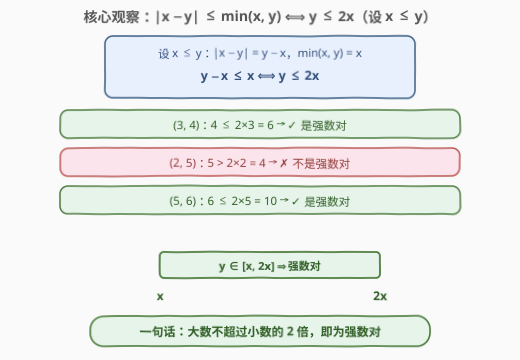
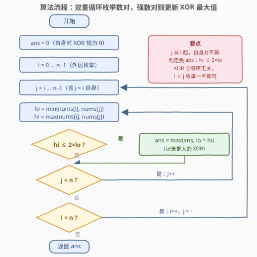
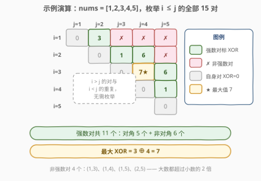

# LeetCode 找出强数对的最大异或值 I 题解

## 1. 题目概述

- **标题 / 题号**：找出强数对的最大异或值 I（#2932，easy）
- **链接**：https://leetcode.cn/problems/maximum-strong-pair-xor-i/
- **难度**：简单
- **标签**：位运算、数组、枚举、字典树

**题意**：给你一个下标从 **0** 开始的整数数组 `nums`。如果一对整数 $x$ 和 $y$ 满足以下条件，则称其为**强数对**：

- $|x - y| \le \min(x, y)$

你需要从 `nums` 中选出两个整数，且满足：这两个整数可以形成一个强数对，并且它们的按位异或（`XOR`）值是在该数组**所有强数对中**的**最大值**。

返回数组 `nums` 所有可能的强数对中的**最大**异或值。

**注意**，你可以选择**同一个整数两次**来形成一个强数对。

**示例 1**：

```text
输入：nums = [1,2,3,4,5]
输出：7
解释：数组 nums 中有 11 个强数对：(1,1), (1,2), (2,2), (2,3), (2,4), (3,3),
(3,4), (3,5), (4,4), (4,5) 和 (5,5)。
这些强数对中的最大异或值是 3 XOR 4 = 7。
```

**示例 2**：

```text
输入：nums = [10,100]
输出：0
解释：数组 nums 中只有 (10,10) 和 (100,100) 两个强数对，
最大异或值是 10 XOR 10 = 0（100 XOR 100 同样为 0）。
```

**示例 3**：

```text
输入：nums = [5,6,25,30]
输出：7
解释：强数对共 6 个：(5,5), (5,6), (6,6), (25,25), (25,30), (30,30)。
最大异或值是 25 XOR 30 = 7；另一个异或值非零的数对是 (5,6)，值为 3。
```

**约束**：

- $1 \le \text{nums.length} \le 50$
- $1 \le \text{nums}[i] \le 100$

> 💡 本题核心是「**枚举数对 + 条件判定**」的签到题——$n \le 50$，$O(n^2)$ 双重循环最多 $2500$ 对，官方 hint 也明说暴力可过。真正值得带走的是强数对条件的**等价变形** $y \le 2x$：它既让判定免掉绝对值，也是 II 版 [2935. 找出强数对的最大异或值 II](https://leetcode.cn/problems/maximum-strong-pair-xor-ii/) 中「排序 + 滑动窗口 + 0-1 字典树」解法的入口。

## 2. 解题思路

### 2.1 暴力思路：枚举所有数对（本题正解）

按定义直译：双重循环枚举所有 $(i, j)$ 对（$i \le j$，含 $i = j$ 自身配对），先判定强数对，再更新异或最大值：

```text
ans = 0
for i in 0..n-1:
    for j in i..n-1:                 # j 从 i 起：允许同一整数选两次
        lo = min(nums[i], nums[j])
        hi = max(nums[i], nums[j])
        if hi - lo <= lo:            # 即 |x − y| ≤ min(x, y)
            ans = max(ans, lo ^ hi)
return ans
```

时间 $O(n^2)$。本题 $n \le 50$，最多 $\binom{50}{2} + 50 = 1275$ 对（含自身对），**轻松通过**——这正是 I 版的预期解法。

> ⚠️ 与多数「I 版」题目不同（如 [2903](https://leetcode.cn/problems/find-indices-with-index-and-value-difference-i/) 需要在线性解法上体现理解），本题的 $O(n^2)$ 就是最终提交的正解，代码量最小、正确性最直观。但**面试中要能答出数据放大后的出路**：II 版 [2935](https://leetcode.cn/problems/maximum-strong-pair-xor-ii/) 把约束拉到 $n \le 5 \times 10^4$、$\text{nums}[i] < 2^{20}$，$O(n^2) = 2.5 \times 10^9$ 必然超时，需升级为第 5 节的 $O(n \log C)$ 解法。

### 2.2 核心观察：强数对 ⟺ 大数不超过小数的两倍



**观察 1（等价变形）**：设 $x \le y$，则 $|x - y| = y - x$，$\min(x, y) = x$，于是

$$|x - y| \le \min(x, y) \iff y - x \le x \iff y \le 2x$$

绝对值、最小值全部消失，判定只剩**一次比较**：先取 $\text{lo} = \min$、$\text{hi} = \max$，再看 $\text{hi} \le 2 \times \text{lo}$ 是否成立。

**观察 2（值域窗口结构）**：把数组**排序**后，能与 $x$ 构成强数对的数全部落在值域区间 $[x,\ 2x]$ 内。随着 $x$ 增大，窗口的左右端点都**单调右移**——这是标准的**滑动窗口**结构，也是 II 版解法的入口（见第 5 节）。

**观察 3（最高位约束）**：设 $x$ 的最高有效位是第 $k$ 位（$2^k \le x < 2^{k+1}$），则 $y \le 2x < 2^{k+2}$ 且 $y \ge x \ge 2^k$，故 $y$ 的最高有效位**只能是第 $k$ 位或第 $k+1$ 位**——强数对的两个数要么同量级、要么恰差一倍量级。这条「按最高位分组」的观察可以把配对范围大幅收窄，同样服务于 II 版。

> 💡 三条观察层层递进：**观察 1** 服务于本题主解（判定简化），**观察 2/3** 服务于 II 版（窗口 + 字典树）。写 I 版题解时把它们备好，数据一放大就是完整的进阶方案——这也是 LeetCode 双题号（I/II）系列的典型出题套路。

### 2.3 算法流程图



**完整步骤**：

1. **初始化**：`ans = 0`。任何 $(x, x)$ 都是强数对（$|x - x| = 0 \le x$，因 $x \ge 1$）且异或值为 $0$，所以初值 $0$ 天然安全，答案必然非负。
2. **外层**枚举 $i$ 从 $0$ 到 $n-1$；**内层**枚举 $j$ 从 $i$ 到 $n-1$（$j$ 从 $i$ 而非 $i+1$ 起步，覆盖「同一整数选两次」）。
3. **判定**：取 $\text{lo} = \min(\text{nums}[i], \text{nums}[j])$，$\text{hi} = \max(\text{nums}[i], \text{nums}[j])$；若 $\text{hi} \le 2 \times \text{lo}$，则是强数对，用 $\text{ans} = \max(\text{ans},\ \text{lo} \oplus \text{hi})$ 更新。
4. **收尾**：所有数对枚举完毕，返回 `ans`。

> 💡 由于 $i \le j$ 只枚举了一半数对，正确性依赖一个不变式：**强数对与异或都和顺序无关**——$(x, y)$ 与 $(y, x)$ 同为强数对且异或值相同，枚举 $i \le j$ 恰好不重不漏。

### 2.4 示例演算

以 `nums = [1,2,3,4,5]` 为例（即示例 1），枚举全部 $i \le j$ 的 $15$ 对：



| 数对 $(x \le y)$ | 判定 $y \le 2x$ | 强数对？ | XOR 值 |
|------------------|-----------------|----------|--------|
| $(1, 2)$ | $2 \le 2$ ✓ | ✓ | $3$ |
| $(1, 3), (1, 4), (1, 5)$ | $3 > 2$ ✗ | ✗ | — |
| $(2, 3)$ | $3 \le 4$ ✓ | ✓ | $1$ |
| $(2, 4)$ | $4 \le 4$ ✓ | ✓ | $6$ |
| $(2, 5)$ | $5 > 4$ ✗ | ✗ | — |
| $(3, 4)$ | $4 \le 6$ ✓ | ✓ | $\mathbf{7}$ ★ |
| $(3, 5)$ | $5 \le 6$ ✓ | ✓ | $6$ |
| $(4, 5)$ | $5 \le 8$ ✓ | ✓ | $1$ |
| 对角 $(x, x)$ | $x \le 2x$ 恒真 | ✓ | $0$ |

最终返回 $\max = 3 \oplus 4 = 7$，与示例 1 一致。注意 $(2,5)$ 虽然异或值高达 $2 \oplus 5 = 7$，但因 $5 > 2 \times 2 = 4$ **不是强数对**而被跳过——条件判定必须在更新异或值**之前**完成。

> 💡 这正体现了本题的考点：**异或值大**与**是强数对**是两个独立的约束，必须同时满足。漏掉判定条件、只顾追异或最大值，是最常见的错误。

## 3. 参考代码

### C++

```cpp
class Solution {
public:
    int maximumStrongPairXor(vector<int>& nums) {
        int n = nums.size(), ans = 0;
        for (int i = 0; i < n; i++) {
            for (int j = i; j < n; j++) {          // j 从 i 起：允许同一整数选两次
                int lo = min(nums[i], nums[j]);
                int hi = max(nums[i], nums[j]);
                if (hi <= 2 * lo)                  // 强数对 ⟺ 大数 ≤ 小数 × 2
                    ans = max(ans, nums[i] ^ nums[j]);
            }
        }
        return ans;
    }
};
```

### Python

```python
class Solution:
    def maximumStrongPairXor(self, nums: List[int]) -> int:
        ans = 0
        for i, a in enumerate(nums):
            for b in nums[i:]:                     # 切片含 a 自身，天然覆盖 j = i
                if max(a, b) <= 2 * min(a, b):     # 强数对判定
                    ans = max(ans, a ^ b)
        return ans
```

> 💡 两版逻辑一致。判定用 `hi <= 2 * lo` 替代 `abs(x - y) <= min(x, y)`：一次乘法比较，语义直白且省去绝对值与符号讨论。由于异或满足交换律，`lo ^ hi` 与 `nums[i] ^ nums[j]` 等价，写哪个都对。

## 4. 复杂度分析

| 维度 | 复杂度 | 说明 |
|------|--------|------|
| **时间复杂度** | $O(n^2)$ | 枚举全部 $i \le j$ 数对（约 $n^2/2$ 对），每对 $O(1)$ 判定 + 更新 |
| **空间复杂度** | $O(1)$ | 仅常数个变量，原地枚举 |

> ⚠️ 本题 $n \le 50$，$O(n^2)$ 绰绰有余。但在 $n \le 5 \times 10^4$ 的 [2935. 找出强数对的最大异或值 II](https://leetcode.cn/problems/maximum-strong-pair-xor-ii/) 中，$O(n^2)$ 约 $1.25 \times 10^9$ 对必然超时——必须利用观察 2 的滑动窗口结构 + 0-1 字典树，把复杂度降到 $O(n \log C)$（见下节）。

## 5. 扩展：II 版（2935）——排序 + 滑动窗口 + 0-1 字典树

把约束放大到 $n \le 5 \times 10^4$、$\text{nums}[i] < 2^{20}$ 后，$O(n^2)$ 枚举失效。利用 **2.2 节的三条观察**可以拼出 $O(n \log C)$ 的正解：

1. **排序**，枚举 $\text{nums}[i]$ 作为数对中**较大**的一方；
2. **滑动窗口**：维护左界 `left`，当 $2 \times \text{nums}[left] < \text{nums}[i]$ 时右移 `left`。于是窗口 $[\text{left},\ i)$ 内的每个数 $a$ 都满足 $a \le \text{nums}[i] \le 2a$——**与 $\text{nums}[i]$ 两两构成强数对**（窗口内任意两数也互为强数对，因为 $b \le \text{nums}[i] \le 2\,\lceil \text{nums}[i]/2 \rceil \le 2a$）；
3. **0-1 字典树**维护窗口内的所有数，支持**插入 / 删除（计数）**与**查询与 $x$ 异或最大的值**：从高位向低位贪心，优先走与 $x$ 当前位**相反**的分支（高位翻出 1 的价值 $2^k$ 大于低位全部之和 $2^k - 1$）。

```cpp
class Solution {
    struct Trie {
        Trie* ch[2] = {nullptr, nullptr};
        int cnt = 0;
    };
    Trie* root = new Trie();

    void insert(int x, int d) {                       // d = +1 插入 / −1 删除
        Trie* o = root;
        for (int i = 19; i >= 0; i--) {
            int b = x >> i & 1;
            if (!o->ch[b]) o->ch[b] = new Trie();
            o = o->ch[b];
            o->cnt += d;
        }
    }
    int query(int x) {                                // 树中与 x 异或最大的结果
        Trie* o = root;
        int r = 0;
        for (int i = 19; i >= 0; i--) {
            int b = x >> i & 1;
            if (o->ch[b ^ 1] && o->ch[b ^ 1]->cnt) {  // 优先走相反位
                r |= 1 << i;
                o = o->ch[b ^ 1];
            } else {
                o = o->ch[b];
            }
        }
        return r;
    }

public:
    int maximumStrongPairXor(vector<int>& nums) {
        sort(nums.begin(), nums.end());
        int n = nums.size(), ans = 0;
        for (int i = 0, left = 0; i < n; i++) {
            while (2 * nums[left] < nums[i])          // 移出不再构成强数对的
                insert(nums[left++], -1);
            if (left < i)                             // 窗口非空才查询
                ans = max(ans, query(nums[i]));
            insert(nums[i], +1);
        }
        return ans;
    }
};
```

每个数进出窗口各一次（$O(\log C)$ 步），每次查询 $O(\log C)$，总计 $O(n \log C)$、$C = 2^{20}$。字典树的「插入 / 查询与 $x$ 异或最大」正是母题 [421. 数组中两个数的最大异或值](../0401-0500/421_数组中两个数的最大异或值.md) 的内容；本题在其之上新增了**计数删除**（支持窗口左移）与**滑窗结构**两个组件。

> 💡 II 版还有一条按位贪心 + 哈希的路线（从高位到低位确定答案，用哈希集合判定存在性），以及利用观察 3「按最高位分组」缩小配对范围的写法。共同的思想都是：**把 $O(n^2)$ 的两两配对，降为每个元素 $O(\log C)$ 的结构化查询**。

## 6. 面试要点

1. **强数对条件怎么化简？为什么等价于 $y \le 2x$？**

   - 设 $x \le y$，则 $|x - y| = y - x$、$\min(x, y) = x$，条件 $y - x \le x$ 移项即 $y \le 2x$。判定时先取 lo/hi 再比较 `hi <= 2 * lo`，一次比较完成，无需绝对值。

2. **内层 $j$ 为什么要从 $i$ 开始而不是 $i + 1$？**

   - 题目明说「可以选择同一个整数两次」，$(x, x)$ 是合法强数对。有趣的是：由于 $(x,x)$ 的异或值恒为 $0$、而答案初值也是 $0$，**漏掉自身对在本题恰好不改变数值结果**——但这是依赖异或自消为零的巧合，语义上仍应从 $i$ 起枚举，否则换成「求最大 AND/OR」类变形就会出错。

3. **为什么异或最大化「偏爱」高位不同？**

   - 第 $k$ 位翻出 1 的贡献是 $2^k$，大于低位全部翻 1 的总和 $2^k - 1$。所以字典树查询从高位向低位贪心，优先走与查询数当前位**相反**的分支；这是 0-1 Trie 一切「最大异或」类问题的公共基石。

4. **数据放大到 $n = 5 \times 10^4$ 怎么办（即 II 版 2935）？**

   - 排序 + 滑动窗口（窗口 $[x, 2x]$，左右端点单调）+ 带计数删除的 0-1 Trie，每个元素进出窗口各一次，总计 $O(n \log C)$。核心是把「两两配对」降为「每个元素一次结构化查询」。

5. **窗口 $[\text{left},\ i)$ 内任意两数为什么互为强数对？**

   - 设窗口内 $a \le b$。由排序有 $b \le \text{nums}[i]$；由窗口条件有 $a \ge \lceil \text{nums}[i]/2 \rceil \ge \text{nums}[i]/2$。两式相乘式衔接得 $b \le \text{nums}[i] \le 2a$，即 $b \le 2a$——正是强数对条件。这个「窗口内两两合法」的性质保证了查询结果全部有效。

> 💡 **一句话总结**：2932 是「枚举数对 + 条件判定」的签到题——$O(n^2)$ 直接过；但强数对条件的变形 $y \le 2x$（大数不超过小数两倍）串起了从暴力到滑窗 + 0-1 Trie 的完整进阶链路，是 I/II 双题系列中「小题大做」的典型样本。

## 同类练习题

| # | 题目 | 与本题的关联 |
|---|------|-------------|
| 2935 | [找出强数对的最大异或值 II](https://leetcode.cn/problems/maximum-strong-pair-xor-ii/) | 同题面大 $n$ 版（$n \le 5 \times 10^4$），暴力超时，第 5 节的滑窗 + 0-1 Trie 原样适用 |
| 421 | [数组中两个数的最大异或值](https://leetcode.cn/problems/maximum-xor-of-two-numbers-in-an-array/) | 0-1 字典树求最大异或的母题，无强数对约束的纯净版 |
| 1707 | [与数组中元素的最大异或值](https://leetcode.cn/problems/maximum-xor-with-an-element-from-array/) | 0-1 Trie + 排序离线 + 条件约束（$\le \text{num}[i]$）的组合，对照本题的值域窗口约束 |
| 1803 | [统计异或值在范围内的数对有多少](https://leetcode.cn/problems/count-pairs-with-xor-in-a-range/) | 0-1 Trie 从「求最大」变「按区间计数」，同一棵树的另一种查询 |
