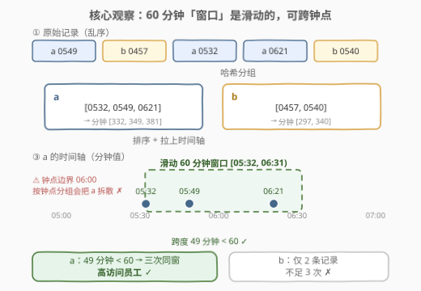
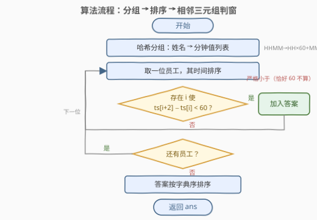
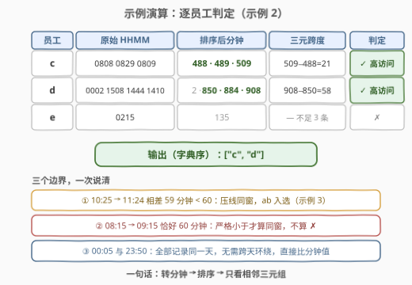

# LeetCode 高访问员工 题解

## 1. 题目概述

- **标题 / 题号**：高访问员工（#2933，medium）
- **链接**：https://leetcode.cn/problems/high-access-employees/
- **难度**：中等
- **标签**：数组、哈希表、字符串、排序

**题意**：给你一个长度为 $n$、下标从 **0** 开始的二维字符串数组 `access_times`。对于每个 $i$（$0 \le i \le n-1$），`access_times[i][0]` 表示某位员工的姓名，`access_times[i][1]` 表示该员工的访问时间。`access_times` 中的**所有条目都发生在同一天内**。

访问时间用**四位**数字表示，符合 **24 小时制**，例如 `"0800"` 或 `"2250"`。

如果员工在**同一小时内**访问系统**三次或更多**，则称其为**高访问**员工。

题目对「同一小时」给了两条精确的边界澄清：

- 时间间隔**恰好相差一小时**不算同一小时内，例如 `"0815"` 和 `"0915"` 不属于同一小时内；
- 一天开始和结束时的访问时间不算同一小时内，例如 `"0005"` 和 `"2350"` 不属于同一小时内——即**不存在跨天环绕**。

以列表形式、按任意顺序，返回所有**高访问**员工的姓名。

**示例 1**：

```text
输入：access_times = [["a","0549"],["b","0457"],["a","0532"],["a","0621"],["b","0540"]]
输出：["a"]
解释："a" 在时间段 [05:32, 06:31] 内有三条访问记录，时间分别为 05:32、05:49 和 06:21。
但是 "b" 的访问记录只有两条。
因此，答案是 ["a"]。
```

**示例 2**：

```text
输入：access_times = [["d","0002"],["c","0808"],["c","0829"],["e","0215"],["d","1508"],["d","1444"],["d","1410"],["c","0809"]]
输出：["c","d"]
解释："c" 在时间段 [08:08, 09:07] 内有三条访问记录，时间分别为 08:08、08:09 和 08:29。
"d" 在时间段 [14:10, 15:09] 内有三条访问记录，时间分别为 14:10、14:44 和 15:08。
然而，"e" 只有一条访问记录，因此不能包含在答案中，最终答案是 ["c","d"]。
```

**示例 3**：

```text
输入：access_times = [["cd","1025"],["ab","1025"],["cd","1046"],["cd","1055"],["ab","1124"],["ab","1120"]]
输出：["ab","cd"]
解释："ab" 在时间段 [10:25, 11:24] 内有三条访问记录，时间分别为 10:25、11:20 和 11:24。
"cd" 在时间段 [10:25, 11:24] 内有三条访问记录，时间分别为 10:25、10:46 和 10:55。
因此，答案是 ["ab","cd"]。
```

**约束**：

- $1 \le \text{access\_times.length} \le 100$
- $\text{access\_times}[i].\text{length} = 2$
- $1 \le \text{access\_times}[i][0].\text{length} \le 10$
- `access_times[i][0]` 仅由小写英文字母组成
- $\text{access\_times}[i][1].\text{length} = 4$
- `access_times[i][1]` 采用 24 小时制表示时间，仅由数字 `'0'` 到 `'9'` 组成

> 💡 本题核心是「**哈希分组 + 排序 + 相邻三元组判窗**」。最关键的读题点：「同一小时」**不是钟点对齐的一小时**（如 05:00–06:00），而是**任意滑动的 60 分钟窗口**——示例 1 中 `a` 的三条记录 05:32 / 05:49 / 06:21 跨了两个钟点小时，却依然是高访问员工。把每人的时间转成分钟、排序后，只需检查**相邻三元组**的跨度是否**严格小于** 60 即可。

## 2. 解题思路

### 2.1 暴力思路与一个典型错误

**直观暴力**：对每位员工的 $m$ 条时间记录，枚举所有 $\binom{m}{3}$ 个三元组，检查「最大时间 − 最小时间 < 60」；或者双重循环枚举每个起点，数一数 60 分钟窗口内有几次访问。每人 $O(m^2)$ 或 $O(m^3)$，总量 $n \le 100$，自然能过，但完全是多余的——排序后一遍扫描就够（见 2.2）。

**⚠️ 一个更危险的典型错误**：把「同一小时」理解成**钟点小时**，于是按 `HH` 前两位分桶、统计每个钟点内的访问次数 $\ge 3$。这个做法会被示例 1 直接打脸：`a` 的记录 05:32、05:49、06:21 分属「05 时」和「06 时」两个钟点桶（各 2 次和 1 次），却因为落在滑动窗口 $[05{:}32, 06{:}31)$ 内而是高访问员工。**窗口是滑动的，不对齐钟点**——这是本题的第一读题陷阱。

### 2.2 核心观察：分组归约 + 排序后只查相邻三元组

**观察一：员工之间彼此独立。** 判定「是否高访问」只取决于该员工自己的时间序列，与其他员工无关。于是用**哈希表**按姓名分组，把一个大问题拆成若干个单人子问题——分组这步把「混合的打卡流水」规约成「每人的有序时间序列」。

**观察二：60 分钟窗口是滑动的。** 如上所述，窗口 $[t, t+60)$ 可以从任意分钟开始，跨钟点边界。三次访问同窗 $\iff$ **最早与最晚相差严格小于 60 分钟**（半开窗口保证 `0815` 与 `0915` 恰好 60 分钟时不算）。

**观察三：排序后，最优三元组必相邻。** 这是本题的核心加速。**夹逼论证**：设排序后为 $ts_0 \le ts_1 \le \cdots \le ts_{m-1}$，若存在某 60 分钟窗口内至少三次访问，即存在 $i < j$（$j \ge i+2$）使 $ts_j - ts_i < 60$，那么由 $ts_{i+2} \le ts_j$ 得：

$$ts_{i+2} - ts_i \;\le\; ts_j - ts_i \;<\; 60$$

即**跨度最小的三元组一定取在相邻的三个位置上**。反之相邻三元组满足条件显然能构成一个窗口。于是 $O(m)$ 扫一遍 `ts[i+2] - ts[i] < 60` 即完成判定，无需枚举组合。

**观察四：HHMM 必须转成分钟，且无跨天环绕。** `"HHMM"` 不是 60 进制的纯数值——`"0910" − "0850"` 按数值算是 60，实际却只差 20 分钟，直接拿四位数字做差**必然判错**。正确度量是 $HH \times 60 + MM$。又因题目保证所有记录**同一天内**，`"0005"` 与 `"2350"` 不需要环绕处理，分钟值直接比较即可（这是与 [539. 最小时间差](https://leetcode.cn/problems/minimum-time-difference/) 最大的差异——那边要考虑首尾环绕）。



### 2.3 算法流程图



**完整步骤**：

1. **哈希分组**：遍历 `access_times`，把每条记录的时间 `"HHMM"` 转成分钟值 $HH \times 60 + MM$，追加到以姓名为 key 的哈希表中。
2. **逐员工判定**：对哈希表中每位员工：
   - 对其分钟列表**排序**；
   - 扫描 $i$ 从 2 到 $m-1$，若存在 $ts[i] - ts[i-2] < 60$（**严格小于**），该员工为高访问员工，**命中即定型**（`break`，不必再看后面的三元组）。
3. **收集输出**：所有高访问员工姓名按**字典序**排序后返回（题目允许任意顺序，但排好序与示例一致、也便于判重核对）。

### 2.4 示例演算

以示例 2 为例，逐员工走一遍流程：



| 员工 | 原始 HHMM | 排序后（分钟） | 最小相邻三元跨度 | 判定 |
|------|-----------|----------------|------------------|------|
| `c` | `0808 0829 0809` | `488 · 489 · 509` | $509 - 488 = 21 < 60$ | ✓ 高访问 |
| `d` | `0002 1508 1444 1410` | `2 · 850 · 884 · 908` | $908 - 850 = 58 < 60$ | ✓ 高访问 |
| `e` | `0215` | `135` | 不足 3 条，无法构成三元组 | ✗ |

注意 `d` 的扫描细节：排序后为 $[2, 850, 884, 908]$，第一个三元组 $884 - 2 = 882$ 远超 60，但第二个三元组 $908 - 850 = 58$ 命中——**任意一个**相邻三元组满足即可，这正是「存在性」判定。最终输出字典序 `["c", "d"]`。

三个边界再用示例核一遍：

- **压线同窗**（示例 3 的 `ab`）：$10{:}25 \to 11{:}24$ 相差 $59 < 60$，入窗 ✓；
- **恰好 60 不算**：`0815` 与 `0915` 相差恰好 60，条件是**严格小于**，不算同窗 ✗；
- **无跨天环绕**：`0005`（5 分钟）与 `2350`（1430 分钟）直接比较差值 1425，不做 mod 1440 的环绕。

## 3. 参考代码

### C++

```cpp
class Solution {
public:
    vector<string> findHighAccessEmployees(vector<vector<string>>& access_times) {
        unordered_map<string, vector<int>> g;                    // 姓名 -> 分钟值列表
        for (auto& rec : access_times) {
            const string& t = rec[1];
            g[rec[0]].push_back(stoi(t.substr(0, 2)) * 60 + stoi(t.substr(2)));
        }
        vector<string> ans;
        for (auto& [name, ts] : g) {
            sort(ts.begin(), ts.end());                          // 每人独立排序
            for (size_t i = 2; i < ts.size(); ++i) {
                if (ts[i] - ts[i - 2] < 60) {                    // 严格小于 60 分钟
                    ans.push_back(name);
                    break;                                       // 命中即定型
                }
            }
        }
        sort(ans.begin(), ans.end());                            // 字典序输出
        return ans;
    }
};
```

### Python

```python
class Solution:
    def findHighAccessEmployees(self, access_times: List[List[str]]) -> List[str]:
        g = defaultdict(list)                       # 姓名 -> 分钟值列表
        for name, t in access_times:
            g[name].append(int(t[:2]) * 60 + int(t[2:]))
        ans = []
        for name, ts in g.items():
            ts.sort()                               # 每人独立排序
            if any(ts[i] - ts[i - 2] < 60 for i in range(2, len(ts))):
                ans.append(name)                    # 存在跨度 < 60 的相邻三元组
        return sorted(ans)                          # 字典序输出
```

> 💡 两版逻辑完全一致。两个实现细节：① **转分钟**必须在比较前完成（`HHMM` 数值差不是分钟差）；② 判定是**存在性**问题，`break` / `any` 短路即可，没必要统计具体次数。题目允许任意顺序返回，这里顺手 `sort` 成字典序，与三个示例的输出保持一致。

## 4. 复杂度分析

| 维度 | 复杂度 | 说明 |
|------|--------|------|
| **时间复杂度** | $O(n \log n)$ | 分组 $O(n)$；各组排序合计 $O(n \log n)$（由 $\sum m_k \log m_k \le n \log n$ 放缩）；每人一趟扫描 $O(n)$ 合计 |
| **空间复杂度** | $O(n)$ | 哈希表存储全部 $n$ 个分钟值（不含返回值） |

> 💡 能否干掉排序的 $\log$？可以——分钟值域只有一天 1440 个，对每位员工可用**计数排序**（桶计数后顺序收集），单组 $O(m + 1440)$；甚至可以按值域桶直接数「任意 60 分钟窗口内的最大次数」。但 $n \le 100$ 时纯属杀鸡用牛刀，面试口述一句即可证明你看到值域这个维度。

## 5. 扩展：三个变体追问

- **变体一（跨天环绕）**：若打卡记录可跨天、或值班表首尾相接（`23:50` 与次日 `00:05` 相差仅 15 分钟），窗口判定就需要环绕处理：把排序后的分钟数组整体 $+1440$ 拼接在尾部，再扫一遍相邻三元组即可——思想同 [539. 最小时间差](https://leetcode.cn/problems/minimum-time-difference/) 的首尾环绕。本题题面用 `0005`/`2350` 特意排除了这种情形。
- **变体二（求最大窗口次数）**：若要求每人 60 分钟窗口内的**最多**访问次数（而非只判 $\ge 3$），用双指针滑窗：右端点 $r$ 尽量右移，保持 $ts[r] - ts[l] < 60$，每步更新 $r - l + 1$ 的最大值，$O(m)$ 一趟完成。
- **变体三（流式在线判定）**：若打卡记录流式到达、需要实时报警，可维护 1440 个分钟桶的计数与前缀和（$O(1)$ 查询任意 60 分钟窗口），或用有序多重集合维护最近一小时的记录并随时检查窗口内计数。

## 6. 面试要点

1. **「同一小时」是钟点小时吗？最典型的错误做法是什么？**

   - 不是。窗口是**任意滑动的 60 分钟** $[t, t+60)$，不对齐钟点。典型错误是按 `HH` 前两位分桶计数——会被示例 1 直接证伪（`a` 的 05:32 / 05:49 / 06:21 跨两个钟点桶却同窗）。

2. **为什么排序后只检查相邻三元组 `ts[i+2] - ts[i]` 就够了？**

   - 夹逼论证：若存在 $i < j$（$j \ge i+2$）使 $ts_j - ts_i < 60$，则 $ts_{i+2} \le ts_j$，故 $ts_{i+2} - ts_i \le ts_j - ts_i < 60$。跨度最小的三元组必在相邻位置取到，存在性判定只需 $O(m)$ 一趟。

3. **`"HHMM"` 字符串能直接转数值做差吗？**

   - 不能。`"0910" − "0850" = 60`（数值），但实际只差 20 分钟——HHMM 不是 60 进制的连续数值，跨钟点时进位错位。必须转成 $HH \times 60 + MM$。（顺带一提：**排序**倒是可以直接按字符串比——定长四位数字的字典序等于数值序；但**判窗**必须用分钟值。）

4. **恰好相差 60 分钟算不算同窗？`0005` 和 `2350` 呢？**

   - 恰好 60 **不算**：条件是严格小于 60（`0815` 与 `0915` 题面明说不同窗），等价于半开窗口 $[t, t+60)$。`0005` 与 `2350` 也不算：所有记录同一天，**无跨天环绕**，分钟值直接做差即可，不需要 mod 1440。

5. **复杂度是多少？如果数据量放大到千万级打卡记录，方案要怎么变？**

   - 本解 $O(n \log n)$ / $O(n)$。数据量大时：值域只有 1440 分钟，可换**计数排序**消掉 $\log$；若记录已按时间到达（流式），连排序都可以省——哈希表 + 每人一个 60 分钟的滑动计数即可在线判定（见第 5 节变体三）。

> 💡 **一句话总结**：2933 是「哈希分组 + 排序判窗」的模拟签到题——HHMM 转分钟、每人排序后只查相邻三元组跨度是否**严格小于** 60，$O(n \log n)$ 出解；读题的胜负手在于识破「同一小时 = 滑动 60 分钟窗口，非钟点对齐」。

## 同类练习题

| # | 题目 | 与本题的关联 |
|---|------|-------------|
| 49 | [字母异位词分组](https://leetcode.cn/problems/group-anagrams/) | 哈希按 key 分组再逐组处理的入门套路，本题第一步「按姓名归桶」的纯模板版 |
| 539 | [最小时间差](https://leetcode.cn/problems/minimum-time-difference/) | 同样是时间串转分钟 + 排序看相邻差，但它必须处理 00:00 与 23:59 的首尾环绕——正好是本题题面明确排除的情形，对照着记 |
| 219 | [存在重复元素 II](https://leetcode.cn/problems/contains-duplicate-ii/) | 窗口内条件判定（下标差 $\le k$ 且值相等）的滑动窗口入门题，与本题「时间差 $< 60$」的窗口条件同构 |
| 1200 | [最小绝对差](https://leetcode.cn/problems/minimum-absolute-difference/) | 排序后最优配对必在相邻元素间产生——与「排序后只查相邻三元组」是同一个原理 |
