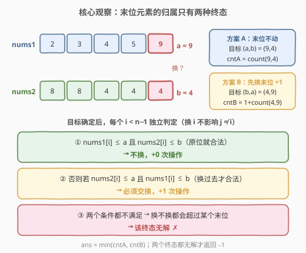
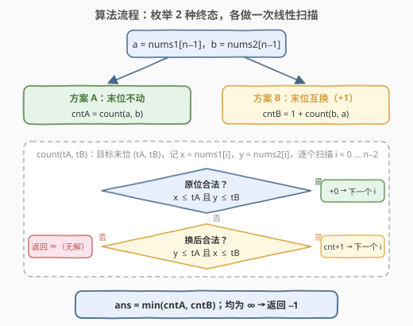
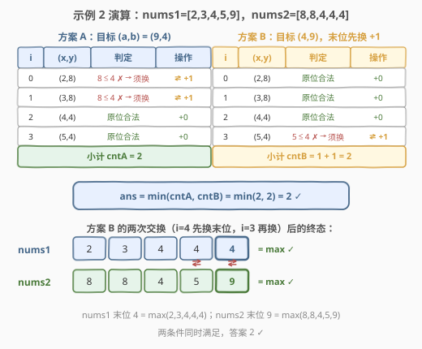

# LeetCode 最大化数组末位元素的最少操作次数 题解

## 1. 题目概述

- **标题 / 题号**：最大化数组末位元素的最少操作次数（#2934，medium）
- **链接**：https://leetcode.cn/problems/minimum-operations-to-maximize-last-elements-in-arrays/
- **难度**：中等
- **标签**：数组、枚举、贪心

**题意**：给你两个下标从 **0** 开始的整数数组 `nums1` 和 `nums2`，两个数组的长度都是 `n`。

你可以执行一系列**操作（可能不执行）**。在每次操作中，你可以选择一个下标 $i \in [0, n-1]$，并**交换** `nums1[i]` 和 `nums2[i]` 的值。

你的任务是找到满足以下两个条件所需的**最小**操作次数：

- `nums1[n-1]` 等于 `nums1` 中所有元素的**最大值**；
- `nums2[n-1]` 等于 `nums2` 中所有元素的**最大值**。

若无法同时满足两个条件，返回 `-1`。

**示例 1**：

```text
输入：nums1 = [1,2,7], nums2 = [4,5,3]
输出：1
解释：选择下标 i = 2 执行一次操作。交换后 nums1 = [1,2,3]，nums2 = [4,5,7]，两条件同时满足。
```

**示例 2**：

```text
输入：nums1 = [2,3,4,5,9], nums2 = [8,8,4,4,4]
输出：2
解释：先交换 i = 4（末位），再交换 i = 3。最终 nums1 = [2,3,4,4,4]，nums2 = [8,8,4,5,9]。
```

**示例 3**：

```text
输入：nums1 = [1,5,4], nums2 = [2,5,3]
输出：-1
解释：无法同时满足两个条件。
```

**约束**：

- $1 \le n = \text{nums1.length} = \text{nums2.length} \le 1000$
- $1 \le \text{nums1}[i], \text{nums2}[i] \le 10^9$

## 2. 解题思路

### 2.1 暴力思路：枚举每个位置换 / 不换

每个下标 $i$ 最终要么保持原位、要么与另一数组的同位元素互换——共 $2^n$ 种终态组合。逐一模拟检查两个「末位 = 最大值」条件，取操作数最小者：

- 时间复杂度 $O(2^n \cdot n)$，$n \le 1000$ 时完全不可行；
- 换个视角做 BFS 状态搜索，状态空间同样是指数级，无济于事。

> 💡 突破口在于发现**位置之间互不耦合**：交换下标 $i$ 不影响其他任何位置上的值对，所以每个位置可以**独立判定、独立计价**——总代价就是「被交换的位置个数」。

### 2.2 核心观察一：把「末位 = 最大值」拆成逐位判定



「`nums1[n-1]` 是 `nums1` 的最大值」等价于：

$$\forall\, i < n-1:\ \text{nums1}[i] \le \text{nums1}[n-1]$$

即**每个前缀位置的值都不超过末位**——根本不需要真的求 max，逐位比较即可。于是整个问题变成：为每个位置决定「换 / 不换」，使所有逐位约束同时成立，且被换的位置最少。

### 2.3 核心观察二：末位归属只有两种终态

设 $a = \text{nums1}[n-1]$，$b = \text{nums2}[n-1]$。这对值最终只有两种去向：

- **方案 A（末位不动）**：目标上界为 $(a, b)$，代价 $\text{cntA} = \text{count}(a, b)$；
- **方案 B（末位互换）**：目标上界为 $(b, a)$，末位互换本身消耗 $1$ 次操作，代价 $\text{cntB} = 1 + \text{count}(b, a)$。

其中 $\text{count}(t_a, t_b)$ 表示「最终 `nums1` 末位为 $t_a$、`nums2` 末位为 $t_b$」时，前 $n-1$ 个位置所需的最少交换次数。对每个 $i < n-1$（记 $x = \text{nums1}[i]$，$y = \text{nums2}[i]$）只有三种情况：

1. $x \le t_a$ 且 $y \le t_b$：**原位合法**，不换，$+0$；
2. 否则若 $y \le t_a$ 且 $x \le t_b$：**换后才合法**，必须换，$+1$；
3. 两个条件都不满足：换不换都超过某个末位，**该终态无解**。

$$\boxed{\ \text{ans} = \min\big(\text{count}(a,b),\ 1 + \text{count}(b,a)\big)\ }$$

两个终态都无解时返回 $-1$。

> 💡 **贪心正确性**：位置之间无耦合，所以「能不换就不换」在每个位置上独立最优；而末位的值对 $(a,b)$ 决定了所有位置的判定上界，其归属只有「不动 / 互换」两种，枚举即完备。注意判定式 $y \le t_a$ 已经显式检查了「换过来的元素是否会压过末位」，不会漏判。

### 2.4 算法流程



1. 读入 $a = \text{nums1}[n-1]$，$b = \text{nums2}[n-1]$；
2. 调用 $\text{count}(a, b)$ 得方案 A 的代价；
3. 调用 $\text{count}(b, a)$ 并 $+1$ 得方案 B 的代价；
4. 取两者最小值；均为无解则返回 $-1$。

### 2.5 示例演算



以示例 2（`nums1 = [2,3,4,5,9]`，`nums2 = [8,8,4,4,4]`，$a=9$，$b=4$）为例：

| 方案 | 目标 $(t_a, t_b)$ | 各位置判定 | 小计 |
|------|------------------|-----------|------|
| A：末位不动 | $(9, 4)$ | $i=0$：$8 \le 4$ ✗，换后 $8\le9$ 且 $2\le4$ ✓ → 换；$i=1$ 同理 → 换；$i=2,3$ 原位合法 | $2$ |
| B：末位互换 | $(4, 9)$ | $i=0,1,2$ 原位合法；$i=3$：$5 \le 4$ ✗，换后 $4\le4$ 且 $5\le9$ ✓ → 换 | $1 + 1 = 2$ |

$\text{ans} = \min(2, 2) = 2$ ✓。

示例 3（`nums1 = [1,5,4]`，`nums2 = [2,5,3]`）：$i=1$ 处值对为 $(5,5)$，方案 A 目标 $(4,3)$ 下 $5 \le 4$ ✗、换后仍 $5 \le 4$ ✗，无解；方案 B 目标 $(3,4)$ 下同样无解——两终态皆死，返回 $-1$ ✓。

## 3. 参考代码

### C++

```cpp
class Solution {
  public:
    int minOperations(vector<int>& nums1, vector<int>& nums2) {
        int n = nums1.size();
        // count(tA, tB)：目标末位 nums1→tA、nums2→tB 时，
        // 前 n-1 个位置的最少交换次数；无解返回 INT_MAX
        auto count = [&](int tA, int tB) -> int {
            int cnt = 0;
            for (int i = 0; i + 1 < n; i++) {
                int x = nums1[i], y = nums2[i];
                if (x <= tA && y <= tB) continue;  // 原位合法，不换
                if (y <= tA && x <= tB) cnt++;     // 只能交换
                else return INT_MAX;               // 换不换都超目标
            }
            return cnt;
        };

        int a = nums1[n - 1], b = nums2[n - 1];
        int cA = count(a, b);   // 方案 A：末位不动
        int cB = count(b, a);   // 方案 B：末位互换
        int best = INT_MAX;
        if (cA < best) best = cA;
        if (cB != INT_MAX && cB + 1 < best) best = cB + 1;
        return best == INT_MAX ? -1 : best;
    }
};
```

### Python

```python
class Solution:
    def minOperations(self, nums1: List[int], nums2: List[int]) -> int:
        n = len(nums1)

        def count(ta: int, tb: int) -> int:
            """目标末位 nums1→ta、nums2→tb 时，前 n-1 位的最少交换次数；无解返回 -1"""
            cnt = 0
            for i in range(n - 1):
                x, y = nums1[i], nums2[i]
                if x <= ta and y <= tb:      # 原位合法
                    continue
                if y <= ta and x <= tb:      # 交换后合法
                    cnt += 1
                else:                        # 换不换都超目标
                    return -1
            return cnt

        cA = count(nums1[-1], nums2[-1])     # 方案 A：末位不动
        cB = count(nums2[-1], nums1[-1])     # 方案 B：末位互换（+1）
        ans = -1
        if cA >= 0:
            ans = cA
        if cB >= 0 and (ans == -1 or cB + 1 < ans):
            ans = cB + 1
        return ans
```

> 💡 两份代码都注意了**无解哨兵的溢出**：C++ 中 `cB + 1` 只在 `cB != INT_MAX` 时计算，避免溢出；Python 用 `-1` 作哨兵天然安全。$n = 1$ 时循环不执行，方案 A 返回 $0$，答案正确（末位即唯一元素，条件自动满足）。

## 4. 复杂度分析

| 维度 | 复杂度 | 说明 |
|------|--------|------|
| 时间复杂度 | $O(n)$ | 两次线性扫描（方案 A、B 各一次），每位置 $O(1)$ 判定 |
| 空间复杂度 | $O(1)$ | 仅常数个变量，原地判定 |

## 5. 扩展

- **与 801（使序列递增的最小交换次数）的关系**：两题都是「同下标交换、每位置换 / 不换」。本题的合法性只与**固定目标** $(t_a, t_b)$ 比较，位置之间无耦合，可独立贪心；若把条件改成「两数组均严格递增」，相邻位置立刻产生约束，独立贪心失效，必须用状态机 DP（`dp[i][0/1]` 表示第 $i$ 位换 / 不换）——识别「约束是否耦合相邻位置」正是选贪心还是 DP 的分水岭。
- **为什么不用真的求 max**：条件「末位 = 最大值」与「所有前缀位置 ≤ 末位」逻辑等价，后者把全局聚合拆成了逐位判定——这是很多「最值条件」问题的通用改写手法。
- **同一位置交换多次**：交换是自反操作，换两次等于没换，最优解中每个位置至多换一次，故按「换 / 不换」计数即可。
- **若允许交换任意两个位置（跨数组任意 i, j）**：问题的独立性被破坏（一次操作可同时影响两个位置），需要重新建模，本题的逐位判定不再适用。

## 6. 面试要点

1. **为什么「末位 = 最大值」可以逐位判定？**

   - 「$a$ 是最大值」⇔「所有其他元素 $\le a$」，全局聚合条件与逐位比较等价
   - 拆成逐位后，每个位置的合法性只依赖自己的值对与目标上界，无需维护前缀 max

2. **为什么末位只需枚举两种终态？**

   - 末位值对 $(a, b)$ 的最终去向只有「留在原数组」或「互换到对方数组」两种
   - 末位归属一旦确定，其余所有位置的判定上界 $(t_a, t_b)$ 随之确定，方案即完备

3. **`count` 里「先查不换、再查换」的贪心为什么正确？**

   - 位置之间零耦合：换 $i$ 不改变 $j \ne i$ 的值对，也不改变末位上界
   - 每位置代价独立为 0/1，能不换就不换即该终态下的全局最小交换数

4. **判定式为什么不会漏掉「换过来的元素压过末位」的情况？**

   - 交换后 `nums1[i]` 变为 $y$，判定式显式包含 $y \le t_a$；两个方向（原位 / 换后）都查双数组，无遗漏

5. **什么情况返回 $-1$？某个位置换不换都违规意味着什么？**

   - 意味着该位置的值对中，较大值 $> \max(a, b)$，无论放哪边都会压过某个末位
   - 两个终态下都出现（或任一出现于唯一可行终态）即无解；示例 3 中 $(5,5)$ 对目标 $(4,3)$、$(3,4)$ 均违规

6. **为什么不用 DP 或并查集之类更重的结构？**

   - $n \le 1000$ 允许 $O(n^2)$，但本题结构性约束（独立判定 + 终态只有 2 种）使 $O(n)$ 一次扫描即可
   - 面试中能论证「无耦合 ⇒ 贪心完备」比堆高级结构更加分

## 同类练习题

| # | 题目 | 与本题的关联 |
|---|------|-------------|
| 801 | [使序列递增的最小交换次数](https://leetcode.cn/problems/minimum-swaps-to-make-sequences-increasing/) | 同下标交换的姊妹题，条件改为「严格递增」后相邻位置产生耦合，独立贪心升级为状态机 DP——对比理解「何时贪心够用」 |
| 1827 | [最少操作使数组递增](https://leetcode.cn/problems/minimum-operations-to-make-the-array-increasing/) | 同样把全局条件拆成逐位独立判定、逐位贪心修补，无耦合是共同本质 |
| 1247 | [交换字符使得字符串相同](https://leetcode.cn/problems/minimum-swaps-to-make-strings-equal/) | 两串间的交换操作最小化，按「不匹配对」分类计数贪心，计数视角的交换题 |
| 1151 | [最少交换次数来组合所有的 1](https://leetcode.cn/problems/minimum-swaps-to-group-all-1s-together/) | 交换次数最小化的另一经典形态（定长窗口 + 计数），拓宽「最少交换」套路面 |
