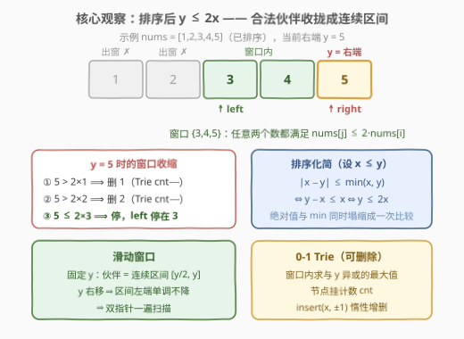
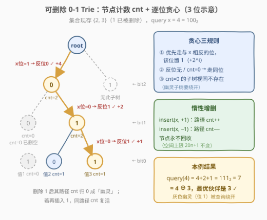
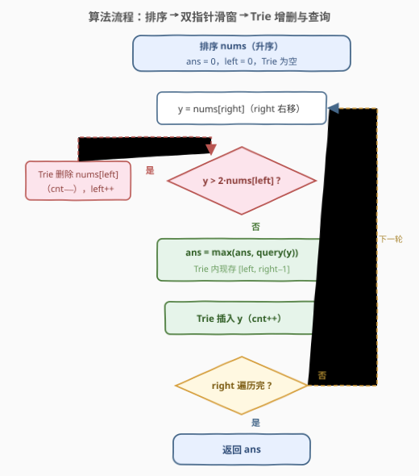
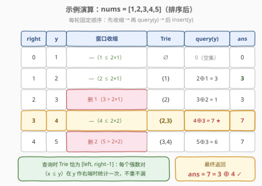

# 找出强数对的最大异或值 II

- **题目名称**：找出强数对的最大异或值 II
- **链接**：[2935. 找出强数对的最大异或值 II](https://leetcode.cn/problems/maximum-strong-pair-xor-ii/)
- **难度**：困难
- **标签**：位运算、字典树（0-1 Trie）、数组、滑动窗口

## 1. 题目概述

给你一个下标从 **0** 开始的整数数组 `nums`。如果一对整数 $x$ 和 $y$ 满足以下条件，则称其为**强数对**：

$$|x - y| \le \min(x, y)$$

你需要从 `nums` 中选出两个整数，且满足：这两个整数可以形成一个强数对，并且它们的按位异或（`XOR`）值是在该数组所有强数对中的**最大值**。

返回数组 `nums` 所有可能的强数对中的**最大**异或值。

**注意**，你可以选择同一个整数两次来形成一个强数对。

**示例 1**：

```text
输入：nums = [1,2,3,4,5]
输出：7
解释：数组 nums 中有 11 个强数对：(1,1), (1,2), (2,2), (2,3), (2,4),
(3,3), (3,4), (3,5), (4,4), (4,5) 和 (5,5)。
这些强数对中的最大异或值是 3 XOR 4 = 7。
```

**示例 2**：

```text
输入：nums = [10,100]
输出：0
解释：数组 nums 中有 2 个强数对：(10,10) 和 (100,100)。
这些强数对中的最大异或值是 10 XOR 10 = 0，数对 (100,100) 的异或值也是 0。
```

**示例 3**：

```text
输入：nums = [500,520,2500,3000]
输出：1020
解释：数组 nums 中有 6 个强数对：(500,500), (500,520), (520,520),
(2500,2500), (2500,3000) 和 (3000,3000)。
这些强数对中的最大异或值是 500 XOR 520 = 1020。
```

**约束条件**：

- $1 \le \text{nums.length} \le 5 \times 10^4$
- $1 \le \text{nums}[i] \le 2^{20} - 1$

> 💡 本题是三件套的合体：**排序化简约束**（把带绝对值和 min 的条件变成一次比较）+ **滑动窗口**（把合法伙伴收拢成一段连续区间）+ **0-1 Trie**（区间内求最大异或）。其中 Trie 需要支持**删除**——这是与 421 那种「全量插入再查询」的最大区别，也是本题定为困难的核心考点。

---

## 2. 解题思路

### 2.1 暴力思路：枚举所有数对

按定义直译：枚举所有有序对 $(x, y)$，先验证 $|x - y| \le \min(x, y)$，再维护异或值的最大值：

```text
ans = 0
for x in nums:
    for y in nums:
        if abs(x - y) <= min(x, y):
            ans = max(ans, x ^ y)
return ans
```

时间 $O(n^2)$。本题 $n \le 5 \times 10^4$，最坏 $2.5 \times 10^9$ 对，远超时限。而姊妹题 [2932. 找出强数对的最大异或值 I](https://leetcode.cn/problems/maximum-strong-pair-xor-i/) 把 $n$ 放宽到 $\le 100$，就是这个暴力——两题题面完全相同，只在数据范围上分出 I / II。

> ⚠️ 注意两个易漏的细节：其一，$(x, x)$ 恒为强数对（$0 \le x$ 恒真），所以**答案天然 $\ge 0$**，`ans` 初始化为 0 是安全的；其二，强数对条件是对称的，枚举有序对不会漏解，只是每对被算两遍。

### 2.2 核心观察：排序化简 + 滑动窗口 + 可删除 0-1 Trie



**观察 1（条件化简：排序后变成一次比较）**：将数组**排序**，设 $x \le y$，则 $|x - y| = y - x$、$\min(x, y) = x$，于是

$$|x - y| \le \min(x, y) \iff y - x \le x \iff y \le 2x$$

带绝对值、带 $\min$ 的双变量条件，在有序假设下塌缩成**一次乘法比较**。这是排序带来的第一个红利。

**观察 2（合法伙伴是一段连续区间 → 滑动窗口）**：排序后固定较大者 $y = \text{nums}[r]$，合法伙伴 $x$ 需满足 $y/2 \le x \le y$——在有序数组上是一段**连续区间** $[l, r]$。且随着 $r$ 右移（$y$ 变大），区间左端点 $l$ **单调不降**。这正是滑动窗口的单调性要求：

$$\text{窗口不变式：} \forall\, i, j \in [l, r],\ i \le j \Rightarrow \text{nums}[j] \le 2 \cdot \text{nums}[i]$$

只要保证 $\text{nums}[r] \le 2 \cdot \text{nums}[l]$，窗口内**任意两个元素都互为强数对**（$j \le r \Rightarrow \text{nums}[j] \le \text{nums}[r] \le 2\,\text{nums}[l] \le 2\,\text{nums}[i]$）。

**观察 3（窗口内求最大异或 = 0-1 Trie 逐位贪心，但需要「删除」）**：现在是经典子问题——给定一个**动态变化**的集合，求 $y$ 与集合中所有元素异或的最大值。用 0-1 Trie（[421. 数组中两个数的最大异或值](https://leetcode.cn/problems/maximum-xor-of-two-numbers-in-an-array/) 的母题套路）：从最高位到最低位，**优先走与 $y$ 当前位相反的分支**，能走通就把答案的这一位置 1。

与 421 的关键区别：本题的集合是滑窗，**左端元素要出窗**。物理删除节点很麻烦，标准做法是**给每个节点挂一个计数 `cnt`**：

- 插入 $x$：`insert(x, +1)`，路径上每个节点 `cnt += 1`；
- 删除 $x$：`insert(x, -1)`，路径上每个节点 `cnt -= 1`（**惰性删除**，节点不回收）；
- 查询时只有 `cnt > 0` 的子节点才视为「存在」。



> 💡 为什么惰性删除不炸空间？每个元素至多被插入一次、删除一次，路径长度都是 20，所以 Trie 节点数的上限始终是 $n \times 20 + 1$，与删除多少次无关——删除只是把计数减回去，从不新建节点。`cnt = 0` 的子树成了「幽灵子树」，查询时绕开即可。

### 2.3 算法流程图



**完整步骤**：

1. **排序** `nums`（升序），初始化空 Trie、`ans = 0`、`left = 0`。
2. **枚举右端** `right` 从 $0$ 到 $n-1$，记 $y = \text{nums}[right]$：
   - **收缩窗口**：只要 $y > 2 \cdot \text{nums}[left]$，执行 `insert(nums[left], -1)` 把 `nums[left]` 从 Trie 删除，`left++`；
   - **查询**：`ans = max(ans, query(y))`——Trie 中现存的是 $\text{nums}[left..right-1]$，它们与 $y$ 全部构成强数对；
   - **插入**：`insert(y, +1)`，把 $y$ 纳入集合，供后续右端使用。
3. **收尾**：返回 `ans`。

> 💡 顺序不能颠倒：必须**先收缩、再查询、后插入**。查询时 Trie 里恰好是 $[\text{left}, \text{right}-1]$——都是 $\le y$ 的元素，保证「以较小者为窗口内元素、较大者为 $y$」的不重不漏：每个强数对 $(x, y)$（$x \le y$）恰好在 $y$ 作为右端时被查询一次。

### 2.4 示例演算

以 `nums = [1,2,3,4,5]`（已排序）为例：



| right | $y$ | 窗口收缩（$y > 2\,\text{nums}[l]$？） | Trie 内容 | query($y$) | ans |
|-------|-----|----------------------------------------|-----------|------------|-----|
| 0 | 1 | 无（$1 \le 2 \times 1$） | $\varnothing$ | —（空集，返回 0） | 0 |
| 1 | 2 | 无（$2 \le 2 \times 1$） | $\{1\}$ | $2 \oplus 1 = 3$ | **3** |
| 2 | 3 | $3 > 2$：删除 1，$l$→1 | $\{2\}$ | $3 \oplus 2 = 1$ | 3 |
| 3 | 4 | 无（$4 \le 2 \times 2$） | $\{2, 3\}$ | $4 \oplus 3 = 7$ | **7** |
| 4 | 5 | $5 > 4$：删除 2，$l$→2 | $\{3, 4\}$ | $5 \oplus 3 = 6$ | 7 |

最终返回 $7 = 3 \oplus 4$，与示例 1 一致。注意 `right=4` 时 5 出局的判定是 $5 > 2 \times 2$（而非 $5 > 2 \times 3$）——收缩的**循环条件**始终拿 `nums[right]` 与 `nums[left]` 比，删完 2 之后 $5 \le 2 \times 3$ 成立才停。

---

## 3. 参考代码

### C++

```cpp
// 排序 + 滑动窗口 + 可删除 0-1 Trie，O(n log n + 20n) / O(20n)
class Solution {
    static constexpr int B = 20;                  // nums[i] <= 2^20 - 1
    struct Trie {
        vector<array<int, 2>> ch = { {0, 0} };    // ch[u] = 两个子节点编号，0 表示空（0 号是根）
        vector<int> cnt = { 0 };                  // 惰性删除：节点计数，0 视为不存在
        void insert(int x, int d) {               // d = +1 插入 / -1 删除
            int u = 0;
            for (int i = B - 1; i >= 0; i--) {
                int b = x >> i & 1;
                if (!ch[u][b]) {                  // 首次经过才建节点
                    ch.push_back({0, 0});
                    cnt.push_back(0);
                    ch[u][b] = (int)ch.size() - 1;
                }
                u = ch[u][b];
                cnt[u] += d;
            }
        }
        int query(int x) {                        // 返回 x 与集合内元素的最大异或值
            int u = 0, res = 0;
            for (int i = B - 1; i >= 0; i--) {
                int b = x >> i & 1;
                int v = ch[u][b ^ 1];             // 优先走「相反位」分支
                if (v && cnt[v] > 0) {
                    res |= 1 << i;                // 该位能异或出 1
                    u = v;
                } else {
                    u = ch[u][b];                 // 只能走同位分支（该位贡献 0）
                }
            }
            return res;
        }
    };
public:
    int maximumStrongPairXor(vector<int>& nums) {
        sort(nums.begin(), nums.end());           // 观察窗 1：排序后条件变为 y <= 2x
        Trie t;
        int ans = 0, left = 0;
        for (int right = 0; right < (int)nums.size(); right++) {
            while (nums[right] > 2 * nums[left])  // 观察窗 2：收缩，出窗元素惰性删除
                t.insert(nums[left++], -1);
            ans = max(ans, t.query(nums[right])); // 观察窗 3：Trie 内是 [left, right-1]
            t.insert(nums[right], 1);             // y 入集合，供后续右端查询
        }
        return ans;
    }
};
```

### Python

```python
class Solution:
    def maximumStrongPairXor(self, nums: List[int]) -> int:
        nums.sort()                               # 观察窗 1：排序后条件变为 y <= 2x
        B = 20                                    # nums[i] <= 2^20 - 1
        ch = [[0, 0]]                             # 0 号是根，子编号 0 表示空
        cnt = [0]

        def insert(x: int, d: int) -> None:       # d = +1 插入 / -1 删除
            u = 0
            for i in range(B - 1, -1, -1):
                b = x >> i & 1
                if ch[u][b] == 0:
                    ch.append([0, 0])
                    cnt.append(0)
                    ch[u][b] = len(ch) - 1
                u = ch[u][b]
                cnt[u] += d

        def query(x: int) -> int:                 # x 与集合内元素的最大异或值
            u, res = 0, 0
            for i in range(B - 1, -1, -1):
                b = x >> i & 1
                v = ch[u][b ^ 1]                  # 优先走「相反位」分支
                if v and cnt[v] > 0:
                    res |= 1 << i
                    u = v
                else:
                    u = ch[u][b]                  # 只能走同位分支
            return res

        ans, left = 0, 0
        for y in nums:                            # 观察窗 2/3：滑窗 + Trie 增删
            while y > 2 * nums[left]:
                insert(nums[left], -1)
                left += 1
            ans = max(ans, query(y))
            insert(y, 1)
        return ans
```

> 💡 两个实现细节：其一，`query` 在 Trie 为空时也安全——循环里所有子节点都不存在，`u` 始终停在根，返回 0；其二，`ch[u][b] == 0` 能当「空指针」用，是因为根节点固定占住编号 0，任何真实节点的编号都 $\ge 1$。

---

## 4. 复杂度分析

| 维度 | 复杂度 | 说明 |
|------|--------|------|
| **时间复杂度** | $O(n \log n + 20n)$ | 排序 $O(n \log n)$；每个元素一次插入 + 一次查询各走 20 层，出窗元素合计至多删除 $n$ 次，每条路径 20 步 |
| **空间复杂度** | $O(20n)$ | Trie 节点数上限 $20n + 1$（插入 $n$ 个数 × 路径长 20；惰性删除不新建节点） |

> ⚠️ $20$ 来自约束 $\text{nums}[i] \le 2^{20} - 1$（最高有效位是第 19 位）。写成 $O(n \log C)$（$C$ 为值域上界 $2^{20}$）是同一含义。若值域升到 $2^{31}$，把常量换成 31 即可，逻辑零改动。

---

## 5. 扩展：位长分桶——不用滑动窗口的另一条路

官方 hints 2/3 给了一条绕开 Trie 删除的路线，核心是一个漂亮的观察：**同一「位长」桶内的任意两数自动构成强数对**。

设 $x, y \in [2^k, 2^{k+1})$（二进制都是 $k+1$ 位），则

$$y < 2^{k+1} = 2 \cdot 2^k \le 2x$$

最后一步用了 $x \ge 2^k$。于是**桶内问题退化为无约束的最大异或**——正是 [421](https://leetcode.cn/problems/maximum-xor-of-two-numbers-in-an-array/)，可用「从高位到低位枚举答案前缀 + 哈希表判定」的经典解法，无需任何删除。剩下的只有**跨桶**情形：$x$ 是 $k$ 位、$y$ 是 $k+1$ 位时，$y \le 2x$ 才是真正的约束（此时 $y$ 的最高位是 1、$x$ 的最高位是 0，异或的最高位必然是 1，反而对「最大化」有利）。这条路线总复杂度也是 $O(20n)$，但跨桶部分需要数位 DP 式的分类讨论，实现远比「滑窗 + 可删除 Trie」繁琐——面试中记住主解法，把分桶观察当作**验证答案的第二个视角**更有价值。

> 💡 再看「可删除 Trie」这个组件的通用性：它本质是把集合的**增删**与**最大异或查询**解耦成 $O(\log C)$ 的原子操作。凡是「伙伴集合随扫描动态变化」的最大异或题都能套用——树上版本就是 [1938. 查询最大基因差](https://leetcode.cn/problems/maximum-genetic-difference-query/)（DFS 进出栈时增删），区间版本配上前缀和思想就是可持久化 Trie。掌握了本题，这一族题就通了。

---

## 6. 面试要点

1. **为什么排序后强数对条件变成 $y \le 2x$？**

   - 设 $x \le y$，有序性让 $|x - y| = y - x$、$\min(x, y) = x$ 同时塌缩，条件化为 $y - x \le x$，即 $y \le 2x$。绝对值和 $\min$ 都只在「不知道谁大」时才难，排序就是花 $O(n \log n)$ 买掉这个不确定性。

2. **为什么窗口内任意两个元素都互为强数对？**

   - 窗口不变式是 $\text{nums}[r] \le 2 \cdot \text{nums}[l]$。对窗口内任意 $i \le j$：$\text{nums}[j] \le \text{nums}[r] \le 2\,\text{nums}[l] \le 2\,\text{nums}[i]$，链式传递即得。所以查询 $y$ 时 Trie 里放整个窗口，不用逐个验证条件。

3. **Trie 怎么支持删除？为什么不物理回收节点？**

   - 每个节点挂计数 `cnt`：插入 +1、删除 −1，查询只认 `cnt > 0` 的子节点。物理回收需要维护父指针并处理「删一半的路径」，复杂易错；而惰性删除的节点数上限是 $20n + 1$（插入 $n$ 次封顶），空间不变，只是留下 `cnt = 0` 的「幽灵子树」，查询时绕开即可。

4. **`query` 里只判断 `ch[u][b^1]` 非空行不行？为什么还要 `cnt > 0`？**

   - 不行。被删除的路径节点还在（子指针非空），但 `cnt = 0` 表示子树已空；不检查 `cnt` 会走进幽灵子树，把已经出窗的元素当作候选，算出非法的异或值。同理 else 分支走同位子节点时，若整个 Trie 非空则该节点必有 `cnt > 0`（计数守恒：进入 $u$ 的 `cnt[u]` 个数必经两个子节点之一）。

5. **本题和 421 的本质区别是什么？**

   - 421 的候选集合是**全量静态**的：全部插入后逐个查询，一遍哈希或 Trie 就完事。本题每个 $y$ 的合法伙伴集合是 $[y/2, y]$ 的**动态区间**，必须边扫边增删。一句话：421 是「集合固定求最值」，2935 是「集合随指针移动求最值」——后者多考一层滑窗建模与 Trie 删除的实现功力。

> 💡 **一句话总结**：排序把 $|x-y| \le \min(x,y)$ 化成 $y \le 2x$，滑动窗口把合法伙伴收拢成连续区间，可删除 0-1 Trie 在 $O(20)$ 内回答「区间内与 $y$ 异或的最大值」——三件套拼起来就是 $O(n \log n + 20n)$ 的正解。

---

## 7. 同类练习题

- [421. 数组中两个数的最大异或值](https://leetcode.cn/problems/maximum-xor-of-two-numbers-in-an-array/)（[题解](../0401-0500/421_数组中两个数的最大异或值.md)）：0-1 Trie 求最大异或的母题——集合静态全量插入，本题去掉滑窗与删除即是它
- [1707. 与数组中元素的最大异或值](https://leetcode.cn/problems/maximum-xor-with-an-element-from-array/)（[题解](../1701-1800/1707_与数组中元素的最大异或值.md)）：伙伴约束是「值 $\le$ 上界」而非倍数关系，离线排序 + Trie 的同族范式
- [1803. 统计异或值在范围内的数对有多少](https://leetcode.cn/problems/count-pairs-with-xor-in-a-range/)（[题解](../1801-1900/1803_统计异或值在范围内的数对有多少.md)）：同一棵 0-1 Trie 从「求最大」换成「按位计数」，体会节点计数信息的两种用法
- [1938. 查询最大基因差](https://leetcode.cn/problems/maximum-genetic-difference-query/)（[题解](../1901-2000/1938_查询最大基因差.md)）：树上路径集合的动态增删 Trie（DFS 进出栈），本题滑窗增删的树上近亲
- [2932. 找出强数对的最大异或值 I](https://leetcode.cn/problems/maximum-strong-pair-xor-i/)：本题的暴力版（$n \le 100$），题面相同仅数据范围不同，正好拿来对拍验证 II 的正解
