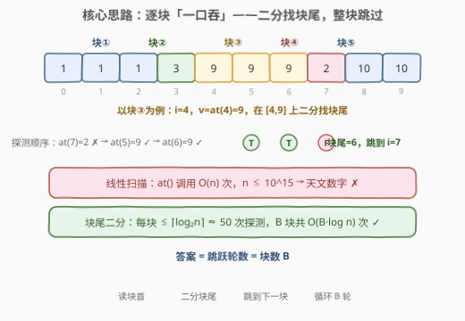
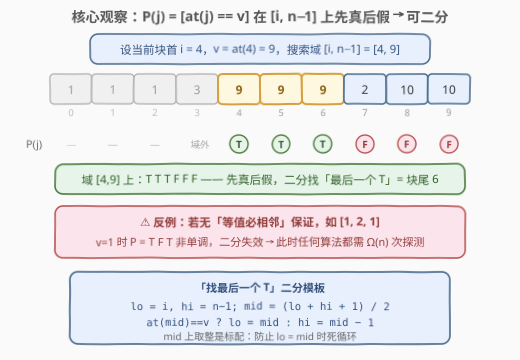
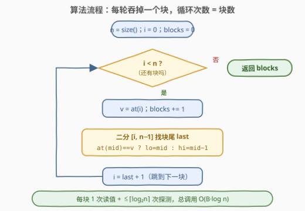
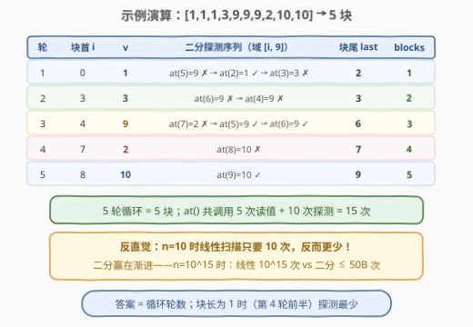

# LeetCode 包含相等值数字块的数量 题解

## 1. 题目概述

- **标题 / 题号**：包含相等值数字块的数量（#2936，medium）
- **链接**：https://leetcode.cn/problems/number-of-equal-numbers-blocks/
- **难度**：中等
- **标签**：数组、二分查找、交互（Interactive）

> ⚠️ 本题为 LeetCode 付费题，题意描述根据官方示例用例与 hints 重建，可能与官方题面有出入。

**题意**：给你一个**巨大**的整数数组 `nums`——长度可达 $10^{15}$，既无法直接读到它的内容，也无法直接拿到它的长度。它被封装成抽象数据类型 `BigArray`，你只能调用两个接口：

- `nums.at(index)`：返回下标 `index`（从 0 开始）处的元素；
- `nums.size()`：返回数组长度 `n`。

数组满足一个关键保证：**相等的数字总是连续出现**。也就是说，数组由若干「数字块」首尾拼接而成——每块内部所有数字相等，相邻两块的数字必不相同。一块 = 一段连续且相等的数字。

返回数组中**数字块的数量**。

> ⚠️ `at()` 调用代价极高，评测对调用次数有严格限制（远小于 $n$）。本题真正的复杂度度量是 **`at()` 的调用次数**，而非常规的时间复杂度——线性扫描会被判定为超出调用限制。

**示例 1**：

```text
输入：nums = [3,3,3,3,3]
输出：1
解释：整个数组就是一个块 [3,3,3,3,3]。
```

**示例 2**：

```text
输入：nums = [1,1,1,3,9,9,9,2,10,10]
输出：5
解释：块划分为 [1,1,1] / [3] / [9,9,9] / [2] / [10,10]，共 5 块。
```

**示例 3**：

```text
输入：nums = [1,2,3,4,5,6,7]
输出：7
解释：每个元素自成一块。
```

**约束条件**（重建，以官方题面为准）：

- $1 \le n = \text{nums.size()} \le 10^{15}$
- 数组由等值块拼接（相等的数字必相邻）
- `at()` 调用次数受限，$O(n)$ 次调用的算法不可行

> 💡 示例 2 揭示了一个易被忽略的陷阱：数组**整体无序**（9 后面跟着 2）！不能想当然套「有序数组二分」——单调性必须从「等值必相邻」这个保证重新推导，这正是本题作为二分教学题的精妙之处。

## 2. 解题思路

### 2.1 暴力思路：线性扫描数「变化点」

常规做法：扫描整个数组，统计相邻元素发生变化的位置：

```text
blocks = 1
for i in 1 .. size() - 1:
    if at(i) != at(i - 1):
        blocks += 1
```

正确，但要调用 `at()` 共 $n-1$ 次。$n \le 10^{15}$——哪怕一次调用只要 1 纳秒，也要跑将近 12 天；在评测的调用次数限制下直接出局。

> 💡 交互题的「复杂度货币」是**接口调用次数**。凡是 $O(n)$ 次调用的算法，在 $n = 10^{15}$ 的设定下都等价于不可行——必须把调用次数压到 $n$ 的对数量级。

### 2.2 核心观察：谓词单调 → 块尾二分，整块跳跃



**观察 1（等值块的跳跃结构）**：既然相等数字必连续，数组天然是 $B$ 个等值块的拼接。数块数根本不需要看每个元素——只需要知道**每块的首尾下标**，块与块之间可以整段跳过。

**观察 2（块尾可以二分定位）**：设当前块从下标 $i$ 开始，取 $v = \text{at}(i)$。在搜索域 $[i, n-1]$ 上定义谓词：

$$P(j) = [\,\text{at}(j) = v\,]$$

由「等值必相邻」，$v$ 只出现在以 $i$ 开头的这一块里，于是 $P$ 在 $[i, n-1]$ 上是**先真后假**的 0/1 单调序列：块内全 $T$，块外全 $F$。「最后一个 $T$」的位置就是块尾——这正是**二分找边界**的标准场景，$\lceil \log_2 n \rceil \approx 50$ 次探测内锁定。



> ⚠️ 单调性完全依赖「等值必相邻」这个保证。若允许等值分离（如 $[1,2,1]$，$v=1$ 时 $P = T,F,T$），谓词非单调，二分失效——而且此时**任何**算法都退化为 $\Omega(n)$ 次探测（每个未读位置都可能藏着新块）。换句话说，这个保证是本题可解性的命门。搜索域取 $[i, n-1]$ 而非 $[0, n-1]$ 还有个朴素好处：$P(i) \equiv T$ 恒成立，「`lo` 处恒 $T$」的二分不变式自始至终成立，无需任何前置检查。

**观察 3（整块吞掉，答案 = 跳跃轮数）**：从 $i=0$ 出发，每轮执行「读块首值 → 二分找块尾 `last` → 跳到 `last + 1`」，循环恰好执行 $B$ 轮（每块一轮），`blocks` 计数器就是答案。

### 2.3 算法流程图



**完整步骤**：

1. `n = size()`，`i = 0`，`blocks = 0`；
2. 若 `i == n`，结束，返回 `blocks`；
3. `v = at(i)`，`blocks += 1`；
4. 在 $[i, n-1]$ 上二分找最大的 `last` 使 `at(last) == v`；
5. `i = last + 1`，回到步骤 2。

二分采用「找最后一个 $T$」模板：`mid = (lo + hi + 1) / 2`（**上取整**），命中 $T$ 则 `lo = mid`，否则 `hi = mid - 1`，循环结束时 `lo == hi == 块尾`。

### 2.4 示例演算

以 `nums = [1,1,1,3,9,9,9,2,10,10]`（$n=10$）为例：



| 轮 | 块首 $i$ | $v$ | 二分探测序列（域 $[i, 9]$） | 块尾 `last` | blocks |
|----|----------|-----|-----------------------------|-------------|--------|
| 1 | 0 | 1 | at(5)=9 ✗ → at(2)=1 ✓ → at(3)=3 ✗ | 2 | 1 |
| 2 | 3 | 3 | at(6)=9 ✗ → at(4)=9 ✗ | 3 | 2 |
| 3 | 4 | 9 | at(7)=2 ✗ → at(5)=9 ✓ → at(6)=9 ✓ | 6 | 3 |
| 4 | 7 | 2 | at(8)=10 ✗ | 7 | 4 |
| 5 | 8 | 10 | at(9)=10 ✓ | 9 | 5 |

5 轮循环 = 5 块，`at()` 共调用 $5$ 次读值 $+ 10$ 次探测 $= 15$ 次。

> 💡 一个反直觉的细节：$n=10$ 时线性扫描只需 10 次调用，反而更少！二分跳跃赢的是**渐进**——$n = 10^{15}$ 时线性要 $10^{15}$ 次，而块尾二分只需约 $50B$ 次（$B$ 为块数）。小数据上「高级算法」更贵是常态，本题考的是在 $n$ 大到无法遍历的设定下生存。

## 3. 参考代码

### C++

```cpp
/**
 * 本题为交互题，BigArray 由评测机提供：
 *   int at(long long index);   // 返回下标 index 处的元素
 *   long long size();          // 返回数组长度
 */
class Solution {
public:
    int countBlocks(BigArray* nums) {
        long long n = nums->size();            // n 可达 1e15，必须 long long
        int blocks = 0;
        long long i = 0;
        while (i < n) {                        // 每轮吞掉一整个块
            blocks++;
            int v = nums->at(i);               // 块首值
            long long lo = i, hi = n - 1;      // 在 [i, n-1] 上找最后一个等于 v 的下标
            while (lo < hi) {
                long long mid = lo + (hi - lo + 1) / 2;   // 上取整，防死循环
                if (nums->at(mid) == v) lo = mid;         // T：块尾在 mid 或其右
                else                    hi = mid - 1;     // F：块尾在 mid 左侧
            }
            i = lo + 1;                        // 跳到下一块首
        }
        return blocks;
    }
};
```

### Python

```python
# """
# This is BigArray's API interface.
# You should not implement it, or speculate about its implementation.
# """
# class BigArray:
#     def at(self, index: int) -> int:
#     def size(self) -> int:

class Solution:
    def countBlocks(self, nums: 'BigArray') -> int:
        n = nums.size()
        blocks = 0
        i = 0
        while i < n:                        # 每轮吞掉一整个块
            blocks += 1
            v = nums.at(i)                  # 块首值
            lo, hi = i, n - 1               # 在 [i, n-1] 上找最后一个等于 v 的下标
            while lo < hi:
                mid = (lo + hi + 1) // 2    # 上取整，防死循环
                if nums.at(mid) == v:       # T：块尾在 mid 或其右
                    lo = mid
                else:                       # F：块尾在 mid 左侧
                    hi = mid - 1
            i = lo + 1                      # 跳到下一块首
        return blocks
```

> 💡 三个实现细节：其一，C++ 中下标与 $n$ 必须 `long long`（$10^{15}$ 溢出 `int`）；Python 原生大整数无此顾虑。其二，`mid` 上取整是「找最后一个 $T$」模板的标配——若写成下取整且 `lo = mid`，当 `lo + 1 == hi` 时 `mid == lo` 会原地踏步死循环。其三，块长为 1 时（`lo == hi`）内层循环一次都不执行，块尾直接确认为块首，零次探测。

## 4. 复杂度分析

设 $n$ 为数组长度，$B$ 为块数（即答案），$L_k$ 为第 $k$ 块的长度。

| 维度 | 复杂度 | 说明 |
|------|--------|------|
| **at() 调用次数** | $O\!\left(\sum_{k=1}^{B} \log_2 L_k\right) \le O(B \log n)$ | 每块 1 次读块首 + 至多 $\lceil \log_2 L_k \rceil$ 次探测；$n = 10^{15}$ 时 $\log_2 n \approx 50$ |
| **时间复杂度** | $O(B \log n)$ | 接口调用即主要耗时，与调用次数同阶 |
| **空间复杂度** | $O(1)$ | 只维护 `i / lo / hi / v / blocks` 几个变量 |

> ⚠️ 本题的复杂度契约是「调用次数」而非「时间」——交互题常见陷阱是只分析渐进时间而忽略接口调用预算。线性扫描的时间也是 $O(n)$「看起来能过」，但 $10^{15}$ 次调用直接超限。另外 $O(B \log n)$ 中的对数因子几乎已是最优：在单调 0/1 序列上定位一个边界，任何算法最坏都需要 $\lceil \log_2(L+1) \rceil$ 次探测，二分是信息论意义上的最优策略。

## 5. 扩展：倍增找块尾——短块场景的进一步优化

内层二分的搜索域是 $[i, n-1]$，即使块长只有 1，最坏也要 $\log_2 n \approx 50$ 次探测才能确认。如果**块普遍很短**，可以换成**倍增（galloping）**找上界：

```text
step = 1
while at(i + step) == v:        # 跨大步试探，直到跨出块
    last = i + step
    step *= 2
# 块尾在 (i + step/2, i + step) 之间，再二分收尾
```

步长 $1, 2, 4, \ldots$ 指数扩张，首个失败步 $2^k \le 2L$（$L$ 为块长），随后只在长度 $O(L)$ 的窗口内二分——块长为 $L$ 的探测次数约 $2\log_2 L$，**与总长 $n$ 无关**。当 $B$ 个块都很短（如 $L = O(1)$）时，总调用从 $50B$ 降到约 $2B$；块都很长时两者相近。代价是代码多几行，且最坏上界仍为 $O(B \log n)$。

相关变体与同源题：

- **LintCode 2436**（Number of Equal Numbers Blocks）与本题为同一道题，可作为无 LeetCode 会员时的练习入口；
- [702. 搜索长度未知的有序数组](https://leetcode.cn/problems/search-in-a-sorted-array-of-unknown-size/)（[题解](../0701-0800/702_搜索长度未知的有序数组.md)）：同样拿不到数组长度，倍增探上界 + 二分定位——把本题的「块尾」换成「目标值位置」；
- 若去掉「等值必相邻」保证，问题退化为 $\Omega(n)$：每个位置都必须探测才能判断是否开新块——对比之下更能体会该保证的可解性价值。

## 6. 面试要点

1. **本题的复杂度度量是什么？为什么线性扫描不行？**

   - `at()` 的**调用次数**。$n \le 10^{15}$，线性扫描需要约 $10^{15}$ 次调用，远超评测限制（数千到数万次量级）。拿到交互题先问「预算花在哪」，再谈算法。

2. **二分的正确性依据是什么？单调性从哪来？**

   - 「等值必相邻」保证值 $v$ 只出现在当前块内，故 $P(j) = [\text{at}(j) = v]$ 在 $[i, n-1]$ 上先真后假。注意单调性来自**该保证**而非「数组有序」——示例 2 的数组整体无序。若无此保证（如 $[1,2,1]$），$P$ 形如 $T,F,T$，二分失效且问题退化为 $\Omega(n)$。

3. **为什么 mid 要上取整？**

   - 「找最后一个 $T$」的分支写法是 `lo = mid`；若 `mid = (lo + hi) // 2` 且 `lo + 1 == hi`，则 `mid == lo`，`lo = mid` 原地踏步死循环。上取整保证 `mid > lo`。对称地，「找第一个 $F$」用下取整 + `hi = mid`。

4. **块长为 1、最后一块等边界怎么处理？**

   - 块长 1：`lo == hi` 进入内层即退出，`last = i`，零探测。最后一块：$\text{at}(n-1) = v$，二分自然收敛到 $n-1$，`i` 跳到 $n$ 结束。`hi` 初始化为 $n-1$ 而非 $n$，天然避免越界。$n \ge 1$ 保证数组非空，无需特判。

5. **C++ 实现最容易翻车的点？**

   - 类型：$n$ 与下标可达 $10^{15}$，必须 `long long`（`int` 上限约 $2.1 \times 10^9$）。`mid` 用 `lo + (hi - lo + 1) / 2` 是防御式写法；本题量级下 `(lo + hi + 1)` 最大约 $2 \times 10^{15}$，`long long`（上限约 $9.2 \times 10^{18}$）并不会溢出，但习惯性写法可以规避一切意外。

> 💡 **一句话总结**：「等值必相邻」让 $[\text{at}(j) = v]$ 在块首右侧成为先真后假的单调谓词，于是每块只需 $O(\log n)$ 次 `at()` 探测就能定位块尾、整块跳过——答案即跳跃轮数，总调用 $O(B \log n)$。

## 同类练习题

| # | 题目 | 与本题的关联 |
|---|------|-------------|
| 704 | [二分查找](https://leetcode.cn/problems/binary-search/)（[题解](../0701-0800/704_二分查找.md)） | 闭区间二分模板母题，本题内层「找块尾」的模板出处 |
| 34 | [在排序数组中查找元素的第一个和最后一个位置](https://leetcode.cn/problems/find-first-and-last-position-of-element-in-sorted-array/)（[题解](../0001-0100/34_在排序数组中查找元素的第一个和最后一个位置.md)） | 有序数组中找「最后一个等于 x」的原型，本题把它搬到交互接口与巨长数组上 |
| 278 | [第一个错误的版本](https://leetcode.cn/problems/first-bad-version/)（[题解](../0201-0300/278_第一个错误的版本.md)） | 单调 0/1 谓词找首个 true，与本题「找最后一个 true」互为镜像 |
| 702 | [搜索长度未知的有序数组](https://leetcode.cn/problems/search-in-a-sorted-array-of-unknown-size/)（[题解](../0701-0800/702_搜索长度未知的有序数组.md)） | 同样「拿不到完整数组」的交互式二分，倍增探上界再二分定位 |
| 875 | [爱吃香蕉的珂珂](https://leetcode.cn/problems/koko-eating-bananas/)（[题解](../0801-0900/875_爱吃香蕉的珂珂.md)） | 二分答案 + 谓词验证，对照体会「二分位置」与「二分答案」两种姿势 |
