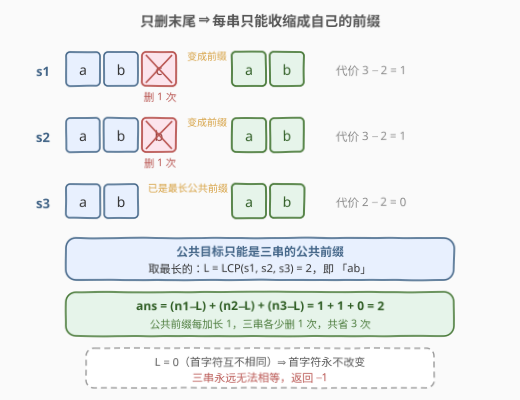
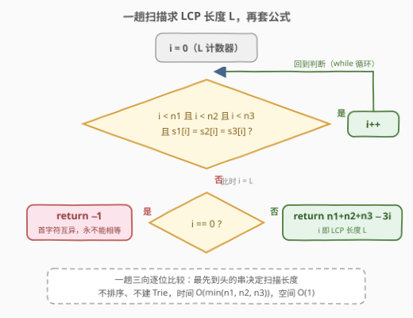
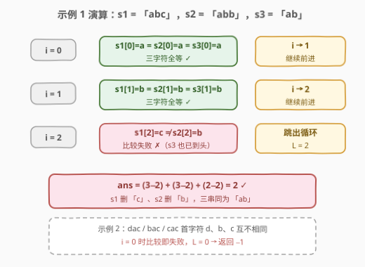

# 使三个字符串相等

- **题目名称**：使三个字符串相等
- **链接**：[2937. 使三个字符串相等](https://leetcode.cn/problems/make-three-strings-equal/)
- **难度**：简单
- **标签**：字符串、最长公共前缀

## 1. 题目概述

给你三个字符串 `s1`、`s2` 和 `s3`。你可以对这三个字符串执行以下操作**任意次数**：

> 在每次操作中，你可以选择其中一个**长度至少为 `2`** 的字符串，并删除其**最右位置上**的字符。

如果存在某种方法能够使这三个字符串相等，请返回使它们相等所需的**最小**操作次数；否则，返回 `-1`。

**示例 1**：

```text
输入：s1 = "abc", s2 = "abb", s3 = "ab"
输出：2
解释：对 s1 和 s2 各进行一次操作后，可以得到三个相等的字符串。
可以证明，不可能用少于两次操作使它们相等。
```

**示例 2**：

```text
输入：s1 = "dac", s2 = "bac", s3 = "cac"
输出：-1
解释：因为 s1 和 s2 的最左位置上的字母不相等，
所以无论进行多少次操作，它们都不可能相等。因此答案是 -1。
```

**约束条件**：

- $1 \le s1.length, s2.length, s3.length \le 100$
- `s1`、`s2` 和 `s3` 仅由小写英文字母组成

> 💡 读题先抓两个**不变量**：① 操作只动**最右边**的字符——首字符永远不会变，左侧永远是原串的前缀；② 长度至少为 2 才能删——字符串最短只能缩到 1 个字符，**永远删不成空串**。这两条直接框定了答案的形态：本题披着「模拟操作」的外衣，内核其实是**最长公共前缀（LCP）**。

---

## 2. 解题思路

### 2.1 暴力思路：模拟操作 / 枚举目标

最直白的做法是把「操作」当真，对状态 $(s_1, s_2, s_3)$ 做 **BFS**：每步任选一个长度 $\ge 2$ 的串删掉末字符，第一次到达三串相等的状态就是最小操作数。状态空间是三串前缀长度的笛卡尔积，最多 $100^3 = 10^6$ 个状态——本题能过，但纯属杀鸡用牛刀。

更收敛的暴力：先想清楚「最终相等的那个串长什么样」。既然每串只能删末尾，每串**唯一能变成的东西就是自己的各个前缀**。于是枚举目标 $t$ 取 $s_1$ 的每个前缀（长度 $k$ 从大到小），检查 $t$ 是否同时是 $s_2$、$s_3$ 的前缀，命中即返回 $n_1+n_2+n_3-3k$；全不命中返回 $-1$。这已经是 $O(n^2)$，而且摸到了正解的门口——**目标串是三串的公共前缀，且越长越省操作**。

### 2.2 核心观察：只删末尾 ⇒ 目标必是公共前缀



三条性质一环扣一环：

1. **可达集是前缀集**：每次操作只删最右字符，所以任意时刻每个串都是原串的某个前缀 $s_i[:k_i]$。三串要相等，共同的终点必须是三串的**公共前缀**。
2. **公共前缀越长越优**：若目标取长度为 $k$ 的公共前缀，操作数恰为
   $$(n_1 - k) + (n_2 - k) + (n_3 - k) = n_1 + n_2 + n_3 - 3k$$
   $k$ 每加 1，三串各少删一次，共省 3 次操作。所以 $k$ 取最大值，即**最长公共前缀**长度 $L$。
3. **判无解只需看首字符**：操作永远不改变首字符（也永远删不到空串）。若三串首字符不全相同，即 $L = 0$，则永远无法相等，返回 $-1$。

$$\boxed{\ \text{ans} = \begin{cases} -1 & L = 0 \\ n_1 + n_2 + n_3 - 3L & L \ge 1 \end{cases}, \quad L = \mathrm{LCP}(s_1, s_2, s_3)\ }$$

> 💡 「删得越少越好」与「前缀留得越长越好」在这里是同一件事：操作数随目标长度严格单调递减，所以最优化直接退化成「求 LCP 长度」——一次线性扫描。

### 2.3 算法流程图



**完整步骤**：

1. **初始化**：`i = 0`，作为 LCP 长度计数器；
2. **循环推进**：只要 `i` 同时小于三串长度，且 `s1[i] == s2[i] == s3[i]`，就 `i++`；任一条件失配即跳出——此时 `i` 就是 $L$；
3. **收尾**：`i == 0` 返回 `-1`（首字符互异），否则返回 `n1 + n2 + n3 - 3 * i`。

> ⚠️ 循环条件里的**越界检查必须放在字符比较之前**（短路求值）：`i = 2` 时 `s3` 已到头，若先取 `s3[2]` 会越界。这也是 2.4 中示例 1 停在 `i = 2` 的原因之一。

### 2.4 示例演算



以示例 1（`s1 = "abc"`, `s2 = "abb"`, `s3 = "ab"`）为例，逐位三向比较：

| $i$ | $s_1[i]$ | $s_2[i]$ | $s_3[i]$ | 三者相等？ | $i$ 变化 |
|-----|----------|----------|----------|-----------|----------|
| 0 | a | a | a | ✓ | $i \to 1$ |
| 1 | b | b | b | ✓ | $i \to 2$ |
| 2 | c | b | （已越界） | ✗ | 停止 |

循环结束时 $L = 2$，答案 $= 3 + 3 + 2 - 3 \times 2 = 2$ ✓——对 `s1` 删 `c`、对 `s2` 删 `b`，三串同为 `"ab"`。

示例 2（`"dac"`, `"bac"`, `"cac"`）：$i = 0$ 时 $d \ne b$ 即失配，$L = 0$，返回 $-1$ ✓。

---

## 3. 参考代码

### C++

```cpp
class Solution {
  public:
    int findMinimumOperations(string s1, string s2, string s3) {
        int n1 = s1.size(), n2 = s2.size(), n3 = s3.size();
        int i = 0;
        while (i < n1 && i < n2 && i < n3 && s1[i] == s2[i] && s2[i] == s3[i]) {
            i++;
        }
        return i == 0 ? -1 : n1 + n2 + n3 - 3 * i;
    }
};
```

### Python

```python
class Solution:
    def findMinimumOperations(self, s1: str, s2: str, s3: str) -> int:
        i = 0
        while i < len(s1) and i < len(s2) and i < len(s3) and s1[i] == s2[i] == s3[i]:
            i += 1
        return -1 if i == 0 else len(s1) + len(s2) + len(s3) - 3 * i
```

> 💡 Python 有个冷知识彩蛋：`os.path.commonprefix` 虽然住在 `os.path` 里，实际却是**逐字符比较**的通用实现，对任意字符串列表都适用（并不理解路径语义）——`L = len(os.path.commonprefix([s1, s2, s3]))`，面试当彩蛋讲可以，工程上显式循环更清晰。

---

## 4. 复杂度分析

| 维度 | 复杂度 | 说明 |
|------|--------|------|
| 时间复杂度 | $O(\min(n_1, n_2, n_3))$ | 一趟三向逐位比较，最先到头的串决定扫描长度 |
| 空间复杂度 | $O(1)$ | 仅下标 `i` 与三个长度变量 |

> ⚠️ 常见疑问：三串总长 $300$，为什么不是 $O(n_1 + n_2 + n_3)$？因为扫描在**最短串**到头（或字符失配）时立即停止，实际读取的字符数 $\le 3 \min(n_1, n_2, n_3)$。最坏情形（三串完全相同）必须读完最短串全部字符才能确认 $L$，所以 $O(\min n)$ 已是读取下界。

---

## 5. 扩展：可达集的形态决定问题难度

本题的一切简单都源于「只删末尾」——它把每串的可达集限制成了**前缀**。把操作改一改，问题立刻变味：

- **推广到 $k$ 个字符串**：LCP 一趟扫描照旧，答案变为 $\sum_i n_i - kL$。若 $k$ 很大（如数组版 LCP，[3043. 最长公共前缀的长度](https://leetcode.cn/problems/find-the-length-of-the-longest-common-prefix/)），把数字转成字符串建 **Trie**，沿无分叉路径下探即得 $L$——本题的多串泛化。
- **首尾都能删**：可达集从「前缀」变成「连续子串」，最优目标变为三串**最长公共子串**——经典的 DP/后缀自动机问题，难度陡增。
- **任意位置都能删**：可达集变成「子序列」，最优目标是三串**最长公共子序列**（LCS），需要三维 DP。
- **只删末尾但要求「最少操作使两两相等」**：本题本身；若改为「至多 $k$ 次操作能否相等」，则只需判 $n_1+n_2+n_3-3L \le k$——同一套 LCP 框架换问法。

> 💡 一条主线：**可达集 = 前缀（一次扫描）→ 子串（DP）→ 子序列（多维 DP）**，约束越松、可达集越大，问题越难。面试中主动铺开这条对比线，比单写一题更有说服力。

---

## 6. 面试要点

1. **为什么最终相等的串一定是三串的公共前缀？**

   - 不变量：操作只删最右字符 ⇒ 任意时刻每个串都是原串的某个前缀
   - 三串相同时的公共值必然同时是三串的前缀，即**公共前缀**——与操作顺序无关

2. **为什么取最长公共前缀，而不是任意一个公共前缀？**

   - $\text{ans} = n_1+n_2+n_3-3k$ 关于目标长度 $k$ 严格单调递减
   - $k$ 每加 1，三串各少删一次，共省 3 次操作 ⇒ $k = L$ 时最优

3. **$L = 0$ 时为什么返回 $-1$？两种论证都要会说。**

   - **不变量论证**：首字符在操作下永不改变，首字符不全相同 ⇒ 永远无法相等
   - **可达性论证**：公共前缀只剩空串，而长度 $\ge 2$ 才能删 ⇒ 最短剩 1 个字符，空串不可达

4. **三串已经相等 / 一串恰为公共前缀等边界，代码需要特判吗？**

   - 三串相等：$L = n_1 = n_2 = n_3$，答案自动为 $0$，无需特判
   - 示例 1 中 `s3 = "ab"` 恰是最长公共前缀：`i` 到 2 时越界条件先失配，$L$ 被最短串自然截断——越界检查写对就全自动

5. **循环条件里五个判断的顺序有讲究吗？**

   - 三个越界检查必须放在字符比较**之前**（C++ 依赖 `&&` 短路，Python 依赖 `and` 短路）
   - 否则 `i` 越过某串末尾时下标访问是未定义行为 / 抛 `IndexError`

> 💡 **一句话总结**：只删末尾 ⇒ 只能变成自己的前缀 ⇒ 三串相等的终点必是公共前缀 ⇒ 取最长公共前缀 $L$，答案 $n_1+n_2+n_3-3L$，$L=0$ 返回 $-1$——一次线性扫描的小题，考的是把「模拟操作」翻译成「不变量」的洞察。

---

## 7. 同类练习题

- [14. 最长公共前缀](https://leetcode.cn/problems/longest-common-prefix/)（[题解](../0001-0100/14_最长公共前缀.md)）：LCP 本体母题，纵向逐位比较正是本题循环的来源
- [1961. 检查字符串是否为数组前缀](https://leetcode.cn/problems/check-if-string-is-a-prefix-of-array/)（[题解](../1901-2000/1961_检查字符串是否为数组前缀.md)）：前缀判定的直接练习，本题暴力思路里「检查 $t$ 是否为前缀」的拆解
- [2185. 统计包含给定前缀的字符串](https://leetcode.cn/problems/counting-words-with-a-given-prefix/)（[题解](../2101-2200/2185_统计包含给定前缀的字符串.md)）：`startswith` 批量计数，前缀家族的入门应用
- [3043. 最长公共前缀的长度](https://leetcode.cn/problems/find-the-length-of-the-longest-common-prefix/)：数组版 LCP——数字转字符串建 Trie 求多串公共前缀，本题的多串泛化
- [3042. 统计前后缀下标对 I](https://leetcode.cn/problems/count-prefix-and-suffix-pairs-i/)：前后缀双重判定，前缀功夫的进阶实战
