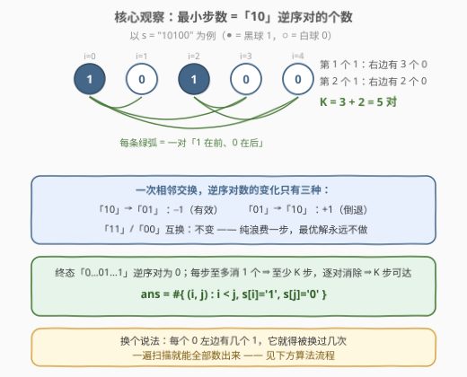
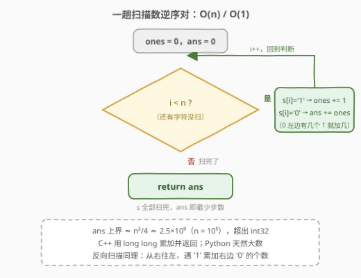
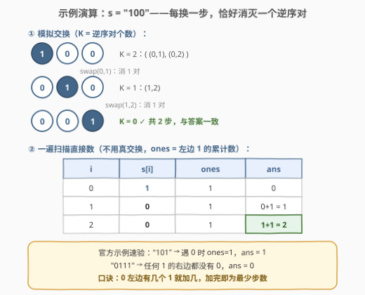

# 区分黑球与白球

- **题目名称**：区分黑球与白球
- **链接**：[2938. 区分黑球与白球](https://leetcode.cn/problems/separate-black-and-white-balls/)
- **难度**：中等
- **标签**：贪心、双指针、字符串

## 1. 题目概述

桌上有 `n` 个球，每个球的颜色不是黑色，就是白色。给你一个长度为 `n`、下标从 **0** 开始的二进制字符串 `s`，其中 `1` 和 `0` 分别代表黑色和白色的球。

在每一步中，你可以选择两个相邻的球并交换它们。

返回「将所有黑色球都移到右侧，所有白色球都移到左侧所需的 **最小步数**」。

**示例 1**：

```text
输入：s = "101"
输出：1
解释：我们可以按以下方式将所有黑色球移到右侧：
- 交换 s[0] 和 s[1]，s = "011"。
最开始，1 没有都在右侧，需要至少 1 步将其移到右侧。
```

**示例 2**：

```text
输入：s = "100"
输出：2
解释：我们可以按以下方式将所有黑色球移到右侧：
- 交换 s[0] 和 s[1]，s = "010"。
- 交换 s[1] 和 s[2]，s = "001"。
可以证明所需的最小步数为 2。
```

**示例 3**：

```text
输入：s = "0111"
输出：0
解释：所有黑色球都已经在右侧。
```

**约束条件**：

- $1 \le n = |s| \le 10^5$
- $s[i]$ 不是 `'0'` 就是 `'1'`。

---

## 2. 解题思路

终态是唯一的：「0…01…1」。要求的只是**最少交换几次相邻球**——步数能直接算出来，根本不必真的模拟交换。

### 2.1 暴力思路：冒泡模拟

最直接的做法是把 `s` 当数组跑冒泡排序：反复从左到右扫描，凡遇到相邻的「10」就交换并计数，直到某一趟再无交换。正确性没问题，但最坏情况（如 `"1…10…0"` 各占一半）要交换约 $n^2/4 = 2.5 \times 10^9$ 次，且每趟扫描本身还有 $O(n)$ 开销，$n = 10^5$ 必然超时。

> 💡 暴力慢在「把每一步交换都真做了一遍」。若能一步到位算出总步数，一次扫描就够——这正是下面的核心观察。

### 2.2 核心观察：最小步数 =「10」逆序对的个数



把一对下标 $(i, j)$（$i < j$，$s[i]=1$，$s[j]=0$）称为一个**逆序对**——一个黑球挡在一个白球前面。三条事实合起来直接锁定答案：

1. **终态逆序对为 0**：「0…01…1」中所有 0 都在 1 左边，不存在任何「10」对；
2. **一次相邻交换至多消除一个逆序对**：交换只改变被交换两球的相对顺序。「10」→「01」恰 $-1$；「01」→「10」是 $+1$（倒退）；「11」「00」互换则不变——纯浪费一步；
3. **逐对消除可行**：只要还有逆序对，串里必有相邻的「10」（若处处没有相邻「10」，则任何 1 的右边都没有 0，逆序对已是 0），交换它就精确消除一个逆序对。

设初始逆序对共 $K$ 个：事实 1 + 2 给出**下界** $\text{ans} \ge K$，事实 3 给出**可达** $\text{ans} \le K$，两边夹住：

$$\text{ans} = K = \#\{(i, j) : i < j,\ s[i] = 1,\ s[j] = 0\}$$

直觉版说法：**每个 0 左边有几个 1，它就至少要被换过几次**；而每对「1,0」只被计入一次、消除时也只花一步，一一对应、互不冲突。于是问题从「模拟交换」退化为「数对」，一遍扫描即可：

- 从左到右扫，维护计数器 `ones`（目前累计遇到的 1 的个数）；
- 遇到 `'0'` 时 `ans += ones`——这个 0 与左边的每个 1 各构成一个逆序对。

### 2.3 算法流程图



> ⚠️ **溢出检查**：$n \le 10^5$ 时 $K$ 最大约 $n^2/4 = 2.5 \times 10^9$，超出 `int32`（约 $2.1 \times 10^9$）。C++ 必须全程用 `long long` 累加并返回（本题函数签名已是 64 位，别在中途用 `int` 接）；Python 天然大数无此虑。

### 2.4 示例演算



**s = "100"**——模拟交换与一遍扫描两条路对照：

| $i$ | $s[i]$ | 动作 | `ones` | `ans` |
|-----|--------|------|--------|-------|
| $0$ | `1` | `ones += 1` | $1$ | $0$ |
| $1$ | `0` | `ans += ones` | $1$ | $0 + 1 = 1$ |
| $2$ | `0` | `ans += ones` | $1$ | $1 + 1 = 2$ |

模拟侧：`"100"` --swap(0,1)--> `"010"` --swap(1,2)--> `"001"`，每步恰好消灭一个逆序对（$K: 2 \to 1 \to 0$），共 2 步，与扫描计数一致 ✓。

**s = "101"**：唯一的 0 左边只有 1 个 1，`ans = 1` ✓。
**s = "0111"**：任何 1 的右边都没有 0，`ans = 0` ✓。

---

## 3. 参考代码

### C++

```cpp
class Solution {
  public:
    long long minimumSteps(string s) {
        long long ans = 0, ones = 0;
        for (char c : s) {
            if (c == '1') {
                ones++;
            } else {
                ans += ones;
            }
        }
        return ans;
    }
};
```

### Python

```python
class Solution:
    def minimumSteps(self, s: str) -> int:
        ans = ones = 0
        for c in s:
            if c == '1':
                ones += 1
            else:
                ans += ones
        return ans
```

> 💡 与官方提示一致的等价写法是**反向扫描**：从右往左维护 `zeros`，遇到 `'1'` 时 `ans += zeros`——「每个 1 右边有几个 0 就换几次」，两种方向数出来的是同一批对。

---

## 4. 复杂度分析

| 维度 | 复杂度 | 说明 |
|------|--------|------|
| 时间复杂度 | $O(n)$ | 一趟扫描，每个字符 $O(1)$ 分支与累加 |
| 空间复杂度 | $O(1)$ | 仅 `ones` / `ans` 两个计数器 |

---

## 5. 扩展

- **目标位置求和视角**：同类球互换是纯浪费，故最优解可保持同色球相对顺序不变，于是第 $k$ 个 1（从左数）的最终位置确定为 $n - \text{cnt}_1 + k - 1$。每个 1 需向右移动的步数恰等于它要越过的 0 的个数，求和仍是逆序对数——与 2.2 殊途同归，可作为第二证法在面试中兜底。
- **通用逆序对计数**：本题值域只有 $\{0, 1\}$，逆序对可 $O(n)$ 直接数；若值域任意，需归并排序或树状数组 $O(n \log n)$ 计数（见 315 / 493 题解）——本题可视为其退化特例。
- **换成任意位置交换**：若每步允许交换**任意**两个球（而非相邻），问题变成「把 1 聚成一段的最少交换」，用滑窗/错位计数可解（见 1151 / 2134）。⚠️ 相邻交换数的是「逆序对」，任意交换数的是「错位」，两套计数逻辑不要混淆。
- **方向翻转变体**：若要求黑球全在左、白球全在右，答案 =「01」对个数，把 1/0 的角色互换再数即可。

---

## 6. 面试要点

1. **为什么最小步数恰好等于逆序对数？**

   - 下界：终态逆序对为 0，而每次相邻交换至多消 1 个，初始 $K$ 个 ⇒ 至少 $K$ 步
   - 可达：只要还有逆序对，必存在相邻「10」，每步精确消 1 个 ⇒ $K$ 步内必达
   - 两个方向夹出 $\text{ans} = K$——「下界 + 构造」是证明最优性的标准范式

2. **为什么同类球之间永远不用交换？**

   - 交换两个 1（或两个 0）不改变串，纯浪费一步
   - 更强的结论：最优解可保持同色球相对顺序不变，因此每个球的最终位置都是确定的

3. **遇到 '0' 时为什么加的是「左边 1 的个数」？**

   - 这个 0 与左边每个 1 各构成一个逆序对，每对都迟早要被消除
   - 每次相邻交换（1 越过 0）恰好服务其中一对，一一对应，不会重复计数

4. **$n = 10^5$ 时为什么会溢出？**

   - 最坏 `"1…10…0"`（各半）逆序对 $(n/2)^2 = 2.5 \times 10^9 > 2.1 \times 10^9$（int32 上限）
   - C++ 累加器与返回值必须 64 位；函数签名已给 `long long`，中间量也别落回 `int`

5. **追问「允许交换任意两个球，答案怎么求」？**

   - 计数对象从「逆序对」换成「错位」：把 1 聚成连续一段，最少交换 = 各 1 到滑窗目标的错位数（1151 / 2134）
   - 追问「值域不止 0/1 的逆序对」则升级为归并排序 / 树状数组（315 / 493）

---

## 7. 同类练习题

- [315. 计算右侧小于当前元素的个数](https://leetcode.cn/problems/count-of-smaller-numbers-after-self/)（[题解](../0301-0400/315_计算右侧小于当前元素的个数.md)）：逆序对计数的按位置分解版（归并/树状数组），是本题「总逆序对」的通用化
- [493. 翻转对](https://leetcode.cn/problems/reverse-pairs/)（[题解](../0401-0500/493_翻转对.md)）：逆序对变体（$i<j$ 且 $\text{nums}[i] > 2\,\text{nums}[j]$），归并排序内计数的进阶实战
- [1151. 最少交换次数来组合所有的 1](https://leetcode.cn/problems/minimum-swaps-to-group-all-1s-together/)（[题解](../1101-1200/1151_最少交换次数来组合所有的1.md)）：任意位置交换把 1 聚一起，与本题「相邻交换数逆序对」的计数逻辑对照
- [2134. 最少交换次数来组合所有的 1 II](https://leetcode.cn/problems/minimum-swaps-to-group-all-1s-together-ii/)（[题解](../2101-2200/2134_最少交换次数来组合所有的1II.md)）：1151 的环形版（定长滑窗），同属 01 串最少交换主题
- [995. K 连续位的最小翻转次数](https://leetcode.cn/problems/minimum-number-of-k-consecutive-bit-flips/)（[题解](../0901-1000/995_K连续位的最小翻转次数.md)）：01 串贪心进阶，固定长度翻转的差分技巧
