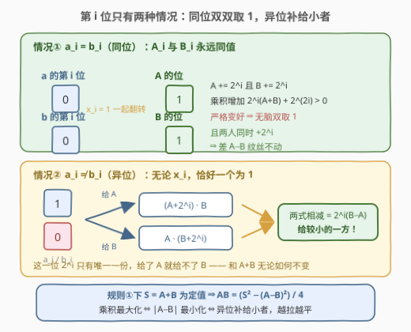
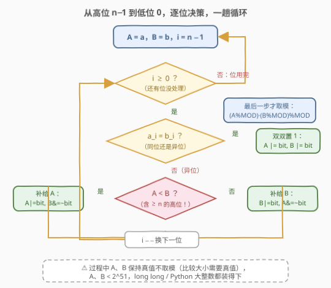
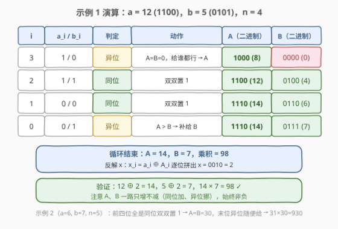

# 最大异或乘积

- **题目名称**：最大异或乘积
- **链接**：[2939. 最大异或乘积](https://leetcode.cn/problems/maximum-xor-product/)
- **难度**：中等
- **标签**：贪心、位运算、数学

## 1. 题目概述

给你三个整数 `a`、`b` 和 `n`，请你返回 $(a \oplus x) \times (b \oplus x)$ 的**最大值**，且 $x$ 需要满足 $0 \le x < 2^n$。

由于答案可能会很大，返回它对 $10^9 + 7$ **取余**后的结果。

**注意**，$\oplus$ 是按位异或操作。

**示例 1**：

```text
输入：a = 12, b = 5, n = 4
输出：98
解释：当 x = 2 时，(a XOR x) = 14 且 (b XOR x) = 7。
所以 (a XOR x) * (b XOR x) = 98，是所有满足 0 <= x < 2^n 的最大值。
```

**示例 2**：

```text
输入：a = 6, b = 7, n = 5
输出：930
解释：当 x = 25 时，(a XOR x) = 31 且 (b XOR x) = 30，乘积 930 为最大值。
```

**示例 3**：

```text
输入：a = 1, b = 6, n = 3
输出：12
解释：当 x = 5 时，(a XOR x) = 4 且 (b XOR x) = 3，乘积 12 为最大值。
```

**约束条件**：

- $0 \le a, b < 2^{50}$
- $0 \le n \le 50$

> 💡 读题先抓**结构**：$x < 2^n$ 意味着 $x$ 只能触碰 $a$、$b$ 的**低 $n$ 位**，更高的位一律原样保留。也就是说，把 $A = a \oplus x$、$B = b \oplus x$ 看成两个"成品"，它们在第 $i$ 位（$i < n$）上如何取值是**逐位独立**的决策——这正是逐位贪心的温床。约束 $n \le 50$ 而非 $10^5$ 量级，也是明示。

---

## 2. 解题思路

### 2.1 暴力思路：枚举 x

最直接的做法是枚举 $x \in [0, 2^n)$，逐个计算 $(a \oplus x)(b \oplus x)$ 取最大。但 $n \le 50$ 时候选集大小可达 $2^{50} \approx 10^{15}$，铁定超时。

退一步想：$x$ 的**每一位** $x_i$（$i < n$）才是真正的自由度，共 $n \le 50$ 个，每个只有 0/1 两种选择——问题其实是**在 50 个布尔变量上做优化**。于是自然转向：能否从高位到低位，每一位**单独**定下来？

### 2.2 核心观察：逐位贪心——同位双取 1，异位补给小者



记 $A = a \oplus x$，$B = b \oplus x$。逐位考察第 $i$ 位（$i$ 从 $n-1$ 到 $0$），只有两种情况：

**情况①（同位）$a_i = b_i$**：此时 $A_i$ 与 $B_i$ **永远同值**（一起等于 $a_i$ 或一起翻转）。若当前双双为 0，把 $x_i$ 翻成 1，则 $A$、$B$ 各增加 $2^i$，乘积变化

$$(A + 2^i)(B + 2^i) - AB = 2^i(A + B) + 2^{2i} > 0$$

**严格变大**——不管其他位怎么选都成立。所以最优解中所有同位必为双双 1，无脑取满。顺带一个关键副产物：两人同时 $+2^i$，**差 $A - B$ 纹丝不动**，同位决策完全不影响后续的大小比较。

**情况②（异位）$a_i \ne b_i$**：此时 $A_i$、$B_i$ **恰好一个为 1**，与 $x_i$ 无关（$x_i$ 只是决定 1 落在谁头上）。所以这一份 $2^i$ 只有一份，给谁都行，但给法有讲究——直接作差比较两种给法：

$$(A + 2^i) \cdot B - A \cdot (B + 2^i) = 2^i(B - A)$$

$A < B$ 时左边更大，即**把 $2^i$ 补给较小的一方**不吃亏；$A = B$ 时两种给法乘积相同。更深的视角是：异位上 $A + B$ **恒定不变**（恰有一人拿 $2^i$），于是

$$AB = \frac{(A+B)^2 - (A-B)^2}{4} = \frac{S^2 - D^2}{4}$$

$S$ 是常数，最大化乘积 $\Leftrightarrow$ **最小化 $|A - B|$**——把每一份 $2^i$ 给较小者，正是在把两人往"一样大"拉。

**贪心顺序**：必须**从高位往低位**处理。当前位的权值 $2^i$ 大于剩余所有低位权值之和（$\le 2^i - 1$），高位先定、每步向"平衡"走，低位之后无论怎么补都翻不了案；反过来先定低位，高位的决策可能把辛苦拉平的差距重新拉开。

$$\boxed{\ \text{从 } i = n-1 \text{ 到 } 0：\quad \begin{cases} a_i = b_i & \Rightarrow \text{双双置 } 1 \\ a_i \ne b_i & \Rightarrow \text{把 } 2^i \text{ 补给当前较小的那个} \end{cases}\ }$$

> ⚠️ 比较大小必须用**完整当前值** $A$、$B$（含 $\ge n$ 的固定高位）。反例：$a = 2^{49}$，$b = 1$，$n = 1$——异位 $i=0$ 上 $A$ 高位压倒性大，这份 $2^0$ 必须给 $B$；若只比较低 $n$ 位会得出 $A=B=0$、"给谁都行"的错误结论。

### 2.3 算法流程图



**完整步骤**：

1. **初始化**：`A = a`，`B = b`（真值，不取模）；
2. **循环** $i$ 从 $n-1$ 降到 $0$，令 `bit = 1 << i`：
   - 若 $(a \gg i) \& 1 == (b \gg i) \& 1$（同位）：`A |= bit`，`B |= bit`（双双置 1）；
   - 否则（异位）：若 `A < B` 则 `A |= bit, B &= ~bit`；否则 `B |= bit, A &= ~bit`；
3. **收尾**：返回 `(A % MOD) * (B % MOD) % MOD`。

> ⚠️ **取模时机**是本题的第二陷阱：循环里要比较 $A$、$B$ 真实大小，**过程中绝不能取模**；$A, B < 2^{51}$，`long long` 装得下，最后一步再取模（$10^9 \times 10^9 < 2^{63}$，也不溢出）。

### 2.4 示例演算



以示例 1（$a = 12 = 1100_2$，$b = 5 = 0101_2$，$n = 4$）为例：

| $i$ | $a_i / b_i$ | 判定 | 动作 | $A$ | $B$ |
|-----|------------|------|------|-----|-----|
| 3 | 1 / 0 | 异位 | $A = B = 0$，给谁都行 → 给 $A$ | 1000 (8) | 0000 (0) |
| 2 | 1 / 1 | 同位 | 双双置 1 | 1100 (12) | 0100 (4) |
| 1 | 0 / 0 | 同位 | 双双置 1 | 1110 (14) | 0110 (6) |
| 0 | 0 / 1 | 异位 | $A > B$ → 补给 $B$ | 1110 (14) | 0111 (7) |

最终 $A = 14$，$B = 7$，乘积 $98$ ✓。反解 $x_i = a_i \oplus A_i$ 得 $x = 0010_2 = 2$，验证 $12 \oplus 2 = 14$、$5 \oplus 2 = 7$。

示例 2（$a = 6$，$b = 7$，$n = 5$）：低 5 位中前四位全是同位（双双置 1 后 $A = B = 30$），末位异位给谁都行 → $31 \times 30 = 930$ ✓。示例 3（$a=1$，$b=6$，$n=3$）三个异位依次给 $A$、$B$、$B$ → $4 \times 3 = 12$ ✓。

---

## 3. 参考代码

### C++

```cpp
class Solution {
  public:
    int maximumXorProduct(long long a, long long b, int n) {
        const long long MOD = 1'000'000'007;
        long long A = a, B = b;                 // 真值参与比较，过程不取模
        for (int i = n - 1; i >= 0; i--) {
            long long bit = 1LL << i;
            if (((a >> i) & 1) == ((b >> i) & 1)) {
                A |= bit;                        // 同位：双双置 1
                B |= bit;
            } else if (A < B) {
                A |= bit;                        // 异位：补给较小者
                B &= ~bit;
            } else {
                B |= bit;
                A &= ~bit;
            }
        }
        return (A % MOD) * (B % MOD) % MOD;     // 最后一步才取模
    }
};
```

### Python

```python
class Solution:
    def maximumXorProduct(self, a: int, b: int, n: int) -> int:
        MOD = 10**9 + 7
        A, B = a, b                     # 真值参与比较，过程不取模
        for i in range(n - 1, -1, -1):
            bit = 1 << i
            if (a >> i) & 1 == (b >> i) & 1:
                A |= bit                # 同位：双双置 1
                B |= bit
            elif A < B:
                A |= bit                # 异位：补给较小者
                B &= ~bit
            else:
                B |= bit
                A &= ~bit
        return A % MOD * (B % MOD) % MOD
```

> 💡 异位分支里的 `A |= bit; B &= ~bit` 同时做了"置一"与"清零"：bit 本来就在其中一人头上，这两句合起来等价于"把这一份 $2^i$ 挪到较小者头上"，不用再单独判断 bit 当前在谁那里。

---

## 4. 复杂度分析

| 维度 | 复杂度 | 说明 |
|------|--------|------|
| 时间复杂度 | $O(n)$ | 从第 $n-1$ 位到第 $0$ 位一趟扫描，每位 $O(1)$，$n \le 50$ |
| 空间复杂度 | $O(1)$ | 仅 `A`、`B`、`bit` 等常数个变量 |

---

## 5. 扩展：换个目标函数，贪心还成立吗？

本题的贪心结构值得拆开回味，换个问法立刻能检验是否真懂了：

- **改成最大化 $A + B$**：同位规则不变（双取 1 让两人各赚 $2^i$）；异位上 $A + B$ **恒定**，怎么给都一样——答案直接就是"同位全取 1"，连比较都不需要。可见"平衡补给"完全是**乘积目标**逼出来的。
- **改成最小化 $AB$**：对非负的 $A$、$B$，最小乘积要么是 0（把一人按到最小），要么在边界取到——贪心方向反转（异位补给较大者、同位尽量取 0），本质是同一套逐位分析换个单调方向。
- **"和定积最大"的均值不等式视角**：$S = A + B$ 固定时 $AB \le (S/2)^2$，等号当且仅当 $A = B$。本题中由于异位恰有一人得 1，$D = A - B$ 的可达值未必包含 0（受 $a \oplus b$ 的位分布约束），贪心求的是可达范围内**最接近平衡**的点——这也是它与"任意拆分和"类问题的微妙差别。
- **与 Trie 系最大异或的对照**：[421. 数组中两个数的最大异或值](https://leetcode.cn/problems/maximum-xor-of-two-numbers-in-an-array/) 同样是"从高位到低位、每步贪心选对立位"，只是那里用 Trie 存候选集、这里候选集就是 $\{a, b\}$ 两个数本身——思想同源，数据结构按需裁剪。

---

## 6. 面试要点

1. **为什么同位可以无脑双双置 1？**

   - 翻转 $x_i$ 使 $A$、$B$ 各 $+2^i$，乘积增量 $2^i(A+B) + 2^{2i} > 0$，**与其它位的选择无关**（交换论证）
   - 副产物：两人同时加同一个数，$A - B$ 不变，同位决策不影响任何后续比较

2. **异位为什么补给较小者？两种说法都要会。**

   - **作差**：$(A+2^i)B - A(B+2^i) = 2^i(B-A)$，$A < B$ 时给 $A$ 严格更优
   - **守恒**：异位上 $A + B$ 恒定，$AB = \frac{S^2 - (A-B)^2}{4}$，最大化乘积 $\Leftrightarrow$ 最小化 $|A-B|$

3. **为什么必须从高位往低位处理？**

   - 当前位 $2^i$ **一枚压过全部低位**（剩余权和 $\le 2^i - 1$）
   - 高位先定，每步向平衡走；若先定低位，高位的后续决策可能把差距重新拉开，低位无法翻案

4. **比较 $A$、$B$ 时要不要带上 $\ge n$ 的高位？**

   - 要！$x$ 够不到高位，但高位**参与大小比较**：$a = 2^{49}$，$b = 1$，$n = 1$ 时异位 $2^0$ 必须给 $B$（否则 $B = 0$ 乘积归零）
   - 代码里 `A`、`B` 从 $a$、$b$ 初值出发，天然带着高位，不要自作聪明先 `& ((1<<n)-1)` 掩掉

5. **什么时候取模？$n = 0$ 怎么办？**

   - 循环中**不取模**（比较需要真值），$A, B < 2^{51}$ 不溢出 `long long`；最后 `(A%MOD)*(B%MOD)%MOD`
   - $n = 0$：$x$ 只能取 0，循环体不执行，答案即 $a \cdot b \bmod p$，代码自然覆盖无需特判

> 💡 **一句话总结**：$x$ 只动低 $n$ 位 ⇒ 逐位独立决策——同位翻 $x_i$ 让双双变 1（严格赚），异位把唯一一份 $2^i$ 补给较小者（和守恒、积随平衡最大）；从高位往低位一趟扫完，$O(n)$ 收工，真值比较、末尾取模。

---

## 7. 同类练习题

- [421. 数组中两个数的最大异或值](https://leetcode.cn/problems/maximum-xor-of-two-numbers-in-an-array/)：同为"从高位到低位贪心构造最优异或"，Trie 版母题，本题是它的两数特化
- [2935. 找出强数对的最大异或值 II](https://leetcode.cn/problems/maximum-strong-pair-xor-ii/)（[题解](../2901-3000/2935_找出强数对的最大异或值II.md)）：排序 + 滑窗内按位统计求最大异或，位运算贪心家族的统计版
- [1707. 与数组中元素的最大异或值](https://leetcode.cn/problems/maximum-xor-with-an-element-from-array/)：离线排序 + Trie 逐位贪心，421 加了约束的进阶版
- [371. 两整数之和](https://leetcode.cn/problems/sum-of-two-integers/)（[题解](../0301-0400/371_两整数之和.md)）：异或=无进位加法的位运算基本功
- [29. 两数相除](https://leetcode.cn/problems/divide-two-integers/)（[题解](../0001-0100/29_两数相除.md)）：移位翻倍按位构造答案，与逐位贪心同一套"位权从高到低"的节奏
