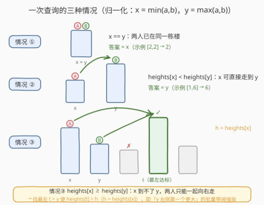
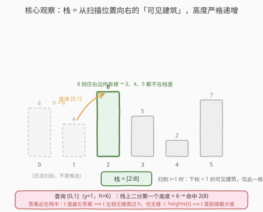
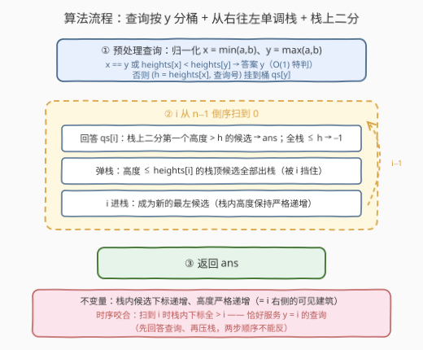
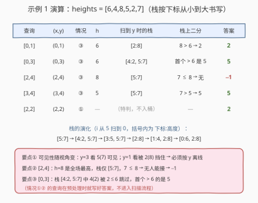

# 找到 Alice 和 Bob 可以相遇的建筑

- **题目名称**：找到 Alice 和 Bob 可以相遇的建筑
- **链接**：[2940. 找到 Alice 和 Bob 可以相遇的建筑](https://leetcode.cn/problems/find-building-where-alice-and-bob-can-meet/)
- **难度**：困难
- **标签**：单调栈、二分查找、离线查询、线段树、堆（优先队列）

## 1. 题目概述

给你一个下标从 **0** 开始的正整数数组 `heights`，其中 `heights[i]` 表示第 `i` 栋建筑的高度。

如果一个人在建筑 `i`，且存在 `i < j` 的建筑 `j` 满足 `heights[i] < heights[j]`，那么这个人可以移动到建筑 `j`。注意：**只能向右移动**，且目标楼必须**严格更高**。

给你另外一个数组 `queries`，其中 `queries[i] = [a_i, b_i]`。第 `i` 个查询中，Alice 在建筑 `a_i`，Bob 在建筑 `b_i`。

请你返回一个数组 `ans`，其中 `ans[i]` 是第 `i` 个查询中，Alice 和 Bob 可以相遇的**最左边的建筑**的下标；如果两人不能相遇，令 `ans[i]` 为 `-1`。

**示例 1**：

```text
输入：heights = [6,4,8,5,2,7], queries = [[0,1],[0,3],[2,4],[3,4],[2,2]]
输出：[2,5,-1,5,2]
解释：
- [0,1]：两人都能到建筑 2（heights[0]=6 < 8 且 heights[1]=4 < 8）；
- [0,3]：两人都能到建筑 5（6 < 7 且 5 < 7）；
- [2,4]：Alice 在高度 8 的楼顶，右侧没有任何楼更高 → -1；
- [3,4]：两人都能到建筑 5（5 < 7 且 2 < 7）；
- [2,2]：两人已在同一栋楼 → 2。
```

**示例 2**：

```text
输入：heights = [5,3,8,2,6,1,4,6], queries = [[0,7],[3,5],[5,2],[3,0],[1,6]]
输出：[7,6,-1,4,6]
```

**约束条件**：

- $1 \le heights.length \le 5 \times 10^4$
- $1 \le heights[i] \le 10^9$
- $1 \le queries.length \le 5 \times 10^4$
- $queries[i] = [a_i, b_i]$，$0 \le a_i, b_i \le heights.length - 1$

---

## 2. 解题思路

### 2.1 暴力思路：逐查询向右扫

先看清「移动」的语义：从 $i$ 能到 $j$（$i<j$）当且仅当 $heights[i] < heights[j]$——即使允许中途换乘，由于每步高度必须严格递增，可达性还是由首尾两栋楼直接决定。

于是每个查询独立处理：取两人中**靠右**的位置 $y$，从 $y+1$ 向右找第一栋 $heights[t] > \max(heights[a], heights[b])$ 的楼。单次查询 $O(n)$，总计 $O(nq) = 2.5 \times 10^9$，必然超时。

瓶颈在于：**「某位置右侧第一个更高」被成千上万个查询反复计算**，而且每个查询的阈值还各不相同——这是经典的「下一个更大元素」批量带阈值版，需要数据结构。

### 2.2 核心观察：查询归一化 + 可见建筑单调栈



先把每个查询归一化：令 $x = \min(a, b)$、$y = \max(a, b)$（按**位置**取，不是按高度），则只有三种情况：

1. **$x = y$**：两人已在同一栋楼，答案 $x$；
2. **$heights[x] < heights[y]$**：$x$ 在左且更矮，可直接走到 $y$，答案 $y$；
3. **$heights[x] \ge heights[y]$**：$x$ 到不了 $y$（右侧的 $y$ 也无法向左走），两人只能**一起向右**，找最左的 $t > y$ 满足 $heights[t] > \max(heights[x], heights[y])$。此时 $h = \max(\cdot) = heights[x]$。

> 💡 情况①② 是 $O(1)$ 特判，本体只剩情况③：**求 $y$ 右侧第一个高度 $> h$ 的下标**（$h$ 逐查询给定）。

接下来是全题最关键的一步——**答案一定落在「可见建筑」里**：

> 若 $t$ 是情况③的最左答案，则 $y < t$ 之间不存在高度 $> h$ 的楼（否则那栋更左且同样合法），也不存在高度 $\ge heights[t]$ 的楼（否则它自身就 $> h$，轮不到 $t$）。所以 $t$ 是区间 $[y, n-1]$ 从左往右的**前缀最大值**——即从 $y$ 向右眺望时「**可见**」的建筑。

从右往左扫描位置 $i$，用**单调栈**维护 $i$ 右侧的全部可见建筑：栈内候选**下标从小到大、高度严格递增**。新楼 $i$ 进栈前，把高度 $\le heights[i]$ 的候选全部弹出——它们从此被 $i$ 永久挡住，不可能再成为任何查询的最左答案（$i$ 更左且不矮）。



把情况③的查询按 $y$ **从大到小**离线分桶，与扫描同步处理：当扫描进行到 $i = y$（$i$ 尚未进栈）时，栈中候选下标全部 $> y$、高度严格递增——**二分**找第一个高度 $> h$ 的候选即为答案；若全栈 $\le h$，答案 $-1$。

### 2.3 算法流程



1. **预处理**：每个查询归一化 $(x, y)$；情况①②直接写答案；情况③把 $(h, qi)$ 挂到桶 $qs[y]$；
2. **倒序扫描** $i$ 从 $n-1$ 到 $0$：
   - 回答所有 $qs[i]$：在单调栈上二分第一个高度 $> h$ 的候选；
   - 弹出栈中高度 $\le heights[i]$ 的候选（被 $i$ 挡住），然后 $i$ 进栈；
3. 返回 `ans`。

### 2.4 示例演算



以示例 1 `heights = [6,4,8,5,2,7]` 为例（栈按「下标从小到大」书写，即从查询位置向右看的顺序）：

| 查询 | $(x,y)$ | 情况 | 阈值 $h$ | 扫到 $y$ 时的栈 | 栈上二分 | 答案 |
|------|---------|------|----------|-----------------|----------|------|
| [0,1] | (0,1) | ③ | 6 | [2:8] | 8 > 6 → 下标 2 | **2** |
| [0,3] | (0,3) | ③ | 6 | [4:2, 5:7] | 首个 > 6 的是 5 | **5** |
| [2,4] | (2,4) | ③ | 8 | [5:7] | 7 ≤ 8，无 | **-1** |
| [3,4] | (3,4) | ③ | 5 | [5:7] | 7 > 5 → 下标 5 | **5** |
| [2,2] | (2,2) | ① | — | （特判，不入桶） | — | **2** |

> ⚠️ 注意「可见性」随视角变化：从 $y=3$ 看，下标 5（高 7）可见；从 $y=1$ 看，它被下标 2（高 8）挡住。**栈只维护「当前扫描位置」的视角**，所以查询必须按 $y$ 从大到小与扫描同步处理——这正是「离线」的由来。

---

## 3. 参考代码

### C++

```cpp
class Solution {
  public:
    vector<int> leftmostBuildingQueries(vector<int>& heights, vector<vector<int>>& queries) {
        int n = heights.size(), q = queries.size();
        vector<int> ans(q, -1);
        // 情况③的查询按 y 分桶：qs[y] = [(阈值 h, 查询编号 qi)]
        vector<vector<pair<int, int>>> qs(n);
        for (int i = 0; i < q; i++) {
            int a = queries[i][0], b = queries[i][1];
            if (a > b) swap(a, b);                  // 归一化 x ≤ y
            if (a == b || heights[a] < heights[b])
                ans[i] = b;                         // 情况①②：O(1) 特判
            else
                qs[b].push_back({heights[a], i});   // 情况③：h = heights[x]
        }

        // 单调栈：back() 是最靠左的候选；高度从 front 到 back 严格递减
        vector<int> st;
        for (int i = n - 1; i >= 0; i--) {
            // 此时栈内下标全 > i，回答 max 端点 y = i 的查询
            for (auto& [h, qi] : qs[i]) {
                // lower_bound 找第一个高度 ≤ h 的位置，其前一个 = 最左的 > h 候选
                auto it = lower_bound(st.begin(), st.end(), h,
                                      [&](int idx, int v) { return heights[idx] > v; });
                if (it != st.begin()) ans[qi] = *prev(it);
            }
            // i 进栈：弹掉被 i 挡住的矮候选（高度 ≤ heights[i]）
            while (!st.empty() && heights[st.back()] <= heights[i]) st.pop_back();
            st.push_back(i);
        }
        return ans;
    }
};
```

### Python

```python
from bisect import bisect_right
from collections import deque

class Solution:
    def leftmostBuildingQueries(self, heights: List[int], queries: List[List[int]]) -> List[int]:
        n = len(heights)
        ans = [-1] * len(queries)
        qs = [[] for _ in range(n)]              # qs[y] = [(阈值 h, 查询编号)]
        for i, (a, b) in enumerate(queries):
            if a > b:
                a, b = b, a                      # 归一化 x ≤ y
            if a == b or heights[a] < heights[b]:
                ans[i] = b                       # 情况①②：O(1) 特判
            else:
                qs[b].append((heights[a], i))    # 情况③：h = heights[x]

        st = deque()   # 从左到右存候选：下标递增、高度严格递增（向右的可见建筑）
        for i in range(n - 1, -1, -1):
            for h, qi in qs[i]:                  # 栈内下标全 > i，直接二分
                p = bisect_right(st, h, key=lambda j: heights[j])
                ans[qi] = st[p] if p < len(st) else -1
            while st and heights[st[0]] <= heights[i]:   # 被 i 挡住的矮候选出栈
                st.popleft()
            st.appendleft(i)
        return ans
```

> 💡 三处易踩坑：
> ① 情况②的条件是**严格**小于——移动要求目标严格更高，$heights[x] = heights[y]$ 时 $x$ 到不了 $y$，属于情况③；
> ② 弹栈条件用 $\le$——等高的楼互相挡住（谁也不是对方的合法目标），弹掉才能保证栈内高度**严格**递增，二分才有唯一落点；
> ③ 两个语言的栈方向相反：C++ 的 `vector` 以 `back()` 为最左候选（高度递减，`lower_bound` 后取 `prev`），Python 的 `deque` 以左端为最左候选（高度递增，`bisect_right` 直接命中）——写二分前先想清楚自己维护的是哪个方向。

---

## 4. 复杂度分析

| 维度 | 复杂度 | 说明 |
|------|--------|------|
| 时间复杂度 | $O(n + q \log n)$ | 分桶 $O(n + q)$；每个下标进栈/出栈各一次，摊还 $O(n)$；每个离线查询一次栈上二分 $O(\log n)$ |
| 空间复杂度 | $O(n + q)$ | 单调栈 $O(n)$ + 查询分桶 $O(q)$ |

---

## 5. 扩展：在线线段树二分与小根堆离线

**线段树版（在线，无需排序）**：对 `heights` 建区间最大值线段树，情况③的查询即「后缀 $[y+1, n-1]$ 内第一个 $> h$ 的下标」——从根**下沉**：左子树区间最大值 $> h$ 才进入，失败再试右子树。由于「全覆盖节点一旦最大值 $> h$ 就必能命中」，下沉只走一条链，单次查询 $O(\log n)$。查询保持在线，代价是代码量和常数都更大：

```cpp
class Solution {
    int n;
    vector<int> mx;

    void build(const vector<int>& h, int p, int l, int r) {
        if (l == r) { mx[p] = h[l]; return; }
        int mid = (l + r) / 2;
        build(h, 2 * p, l, mid);
        build(h, 2 * p + 1, mid + 1, r);
        mx[p] = max(mx[2 * p], mx[2 * p + 1]);
    }
    // [ql, qr] 内第一个值 > h 的下标，无则 -1
    int firstGreater(int p, int l, int r, int ql, int qr, int h) {
        if (qr < l || r < ql || mx[p] <= h) return -1;
        if (l == r) return l;
        int mid = (l + r) / 2;
        int res = firstGreater(2 * p, l, mid, ql, qr, h);
        return res != -1 ? res : firstGreater(2 * p + 1, mid + 1, r, ql, qr, h);
    }

  public:
    vector<int> leftmostBuildingQueries(vector<int>& heights, vector<vector<int>>& queries) {
        n = heights.size();
        mx.assign(4 * n, 0);
        build(heights, 1, 0, n - 1);
        vector<int> ans;
        for (auto& qr : queries) {
            int a = qr[0], b = qr[1];
            if (a > b) swap(a, b);
            if (a == b || heights[a] < heights[b]) ans.push_back(b);
            else ans.push_back(firstGreater(1, 0, n - 1, b + 1, n - 1, heights[a]));
        }
        return ans;
    }
};
```

**小根堆版（离线，反向扫描）**：把情况③的查询按 $y$ **升序**分桶，从左往右扫楼 $i$：先激活桶 $y = i-1$ 中的查询 $(h, qi)$ 入小根堆；再检查堆顶，凡 $h < heights[i]$ 的查询弹出并回答 $i$。它把「找右边第一个更高」反过来看成「等左边第一栋够高的楼来认领」，每个查询入堆/出堆各一次，总计 $O(n + q \log q)$，与单调栈解法互为镜像。

---

## 6. 面试要点

1. **为什么相遇点只可能是 $y$ 或 $y$ 右侧高过两人的楼？**

   - 位于右侧的 $y$ 无法向左移动；若 $x$ 能一步到 $y$（$heights[x] < heights[y]$）答案即 $y$；
   - 否则 $x$ 到不了 $y$，中间位置 $x < t < y$ 对 $y$ 不可达，两人只能同时向右，公共目标须满足 $heights[t] > \max(heights[x], heights[y])$。

2. **为什么答案一定在单调栈里？**

   - 最左答案 $t$ 的左侧（$y$ 右侧）既没有高度 $> h$ 的楼（否则有更左的合法解），也没有高度 $\ge heights[t]$ 的楼（否则它自己就 $> h$）；
   - 所以 $t$ 是前缀最大值 = 从 $y$ 向右的「可见建筑」= 扫描到 $y$ 时栈中恰好维护的候选集合。

3. **弹栈条件为什么是 $\le$ 而不是 $<$？**

   - 目标要求严格更高：等高的两栋楼互相不可达、也互相挡视线；
   - 弹掉高度 $\le heights[i]$ 的候选后，栈内高度严格递增——既保证二分有序，也保证被弹元素永不可能是后续查询的最左答案（$i$ 更左且不矮，能替代它们）。

4. **为什么查询必须按 $y$ 从大到小离线处理？**

   - 栈的语义绑定「当前扫描位置」：扫到 $i$ 时栈内只有下标 $> i$ 的可见建筑，正好服务 $y = i$ 的查询；
   - 可见性随视角变化（示例 1 中下标 5 从 $y=3$ 看可见、从 $y=1$ 看被下标 2 挡住），所以必须让 $y$ 大的查询先处理。若要求在线（查询逐个到达），就换线段树区间最大值 + 自根下沉。

5. **栈上二分怎么写才不容易错？**

   - 认准目标：**下标最小**的高度 $> h$ 候选；
   - Python `deque` 左端即最左候选、高度递增，`bisect_right(..., key=...)` 一步到位；C++ `vector` 的 `back()` 才是最左候选、高度递减，`lower_bound` 找到第一个 $\le h$ 的位置后要 **`prev`** 一下——两套方向别混用。

---

## 7. 同类练习题

- [739. 每日温度](https://leetcode.cn/problems/daily-temperatures/)（[题解](../0701-0800/739_每日温度.md)）：单调栈求「右侧第一个更大」的单查询版，本题是其批量带阈值泛化
- [1944. 队列中可以看到的人数](https://leetcode.cn/problems/number-of-visible-people-in-a-queue/)（[题解](../1901-2000/1944_队列中可以看到的人数.md)）：同一套「从右往左维护可见建筑」单调栈的姊妹题，顺带练习计数
- [2454. 下一个更大元素 IV](https://leetcode.cn/problems/next-greater-element-iv/)（[题解](../2401-2500/2454_下一个更大元素 IV.md)）：求「第二个更大」元素，单调栈 + 懒删除小根堆，从另一个角度处理批量「下一个更大」
- [2736. 最大和查询](https://leetcode.cn/problems/maximum-sum-queries/)（[题解](../2701-2800/2736_最大和查询.md)）：离线排序 + 单调栈上二分回答二维支配查询，与本题同一副骨架
- [239. 滑动窗口最大值](https://leetcode.cn/problems/sliding-window-maximum/)（[题解](../0201-0300/239_滑动窗口最大值.md)）：单调队列版「弹掉被支配元素」，对照理解单调结构不变量的维护手法
