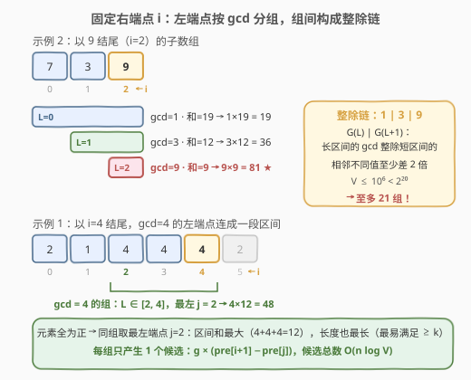
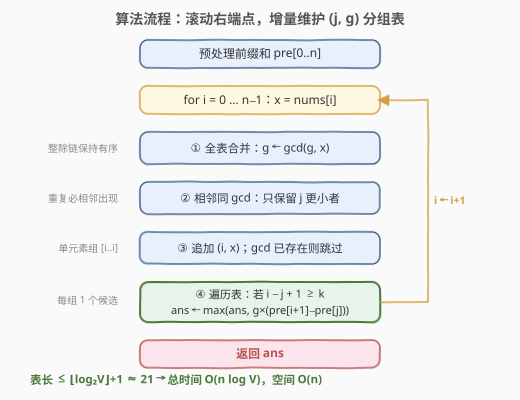
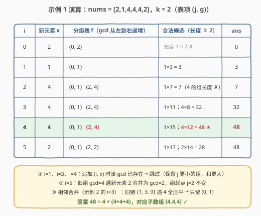

# 子数组的最大GCD-Sum

- **题目名称**：子数组的最大GCD-Sum
- **链接**：[2941. 子数组的最大 GCD-Sum](https://leetcode.cn/problems/maximum-gcd-sum-of-a-subarray/)
- **难度**：困难
- **标签**：数组、数学、数论、最大公约数、二分查找

## 1. 题目概述

> ⚠️ 本题为 LeetCode 付费题，题意描述根据官方示例用例与 hints 重建，可能与官方题面有出入。

给定一个**正整数**数组 `nums` 和一个整数 `k`。数组 `a` 的 **gcd-sum** 定义为：

- 设 $s$ 为 `a` 的所有元素之和；
- 设 $g$ 为 `a` 的所有元素的**最大公约数**（GCD）；
- 则 `a` 的 gcd-sum 等于 $s \times g$。

返回 `nums` 中**至少包含 `k` 个元素**的子数组的**最大 gcd-sum**。

**示例 1**：

```text
输入：nums = [2,1,4,4,4,2], k = 2
输出：48
解释：选择子数组 [4,4,4]，其 gcd-sum 为 4 × (4+4+4) = 48。
```

**示例 2**：

```text
输入：nums = [7,3,9,4], k = 1
输出：81
解释：选择子数组 [9]，其 gcd-sum 为 9 × 9 = 81。
```

**约束条件**：

- $n = nums.length$
- $1 \le n \le 10^5$
- $1 \le nums[i] \le 10^6$
- $1 \le k \le n$

> 💡 答案上界约为 $10^5 \times 10^6 \times 10^6 = 10^{17}$，必须用 64 位整数（官方签名返回 `long long`）。

---

## 2. 解题思路

### 2.1 暴力思路：枚举所有子数组

枚举左端点 $L$，向右扩张右端点 $R$，增量维护 $g \leftarrow \gcd(g, nums[R])$ 与区间和 $s$，长度 $\ge k$ 时用 $g \times s$ 更新答案。双重循环 $O(n^2)$——$n = 10^5$ 时约 $5 \times 10^9$ 次迭代，**超时**。

「那滑动窗口呢？」不行：窗口收缩时 gcd 没有**逆操作**（左端点右移后 gcd 无法 $O(1)$ 恢复），且 gcd-sum 也不具备双指针所需的单调性。ST 表固然能 $O(1)$ 回答任意区间 gcd，但区间本身就有 $O(n^2)$ 个——**减少候选子数组的数量**才是破局点。

### 2.2 核心观察：整除链 + 正数放缩



**观察①（整除链——候选的数量级）**：固定右端点 $i$，记 $G(L) = \gcd(nums[L..i])$。区间越长 gcd 只小不大，且长区间的 gcd 是短区间 gcd 的**约数**：

$$G(L) = \gcd(nums[L],\ G(L{+}1)) \implies G(L) \mid G(L{+}1)$$

于是 $G(0), G(1), \ldots, G(i)$ 构成一条**整除链**，相邻的**不同**值每往右一级至少翻倍。由 $G(0) \ge 1$、$G(i) \le V \le 10^6 < 2^{20}$，链上不同值至多 $\lfloor \log_2 V \rfloor + 1 \le 21$ 个——左端点按 gcd 值划分成**至多 21 组连续区间**。示例 2 中以 9 结尾的三个子数组恰是三级链 $1 \mid 3 \mid 9$。

**观察②（正数放缩——组内唯一候选）**：元素全为正，同组（gcd 相同、右端点相同）内左端点越靠左，区间和**越大**、子数组**越长**。因此每组只需检查**最左端点** $j$：组内任何其他候选 $(L, g)$ 都被 $(j, g)$ 支配。配合前缀和，单个候选 $O(1)$ 可得：

$$\text{cand} = g \times \big(\,pre[i{+}1] - pre[j]\,\big)$$

> 💡 两个观察合起来，把候选子数组从 $O(n^2)$ 压缩到 $O(n \log V) \approx 21n$ 个——这就是本题的复杂度底座。

### 2.3 算法流程：滚动右端点 + 分组表增量维护



关键在于：固定 $i$ 的分组表**无需重新计算**，可由 $i-1$ 的表 $O(\log V)$ 增量推出。维护一张表 `f`，每项 $(j, g)$ 表示「$\gcd(nums[j..i]) = g$，且 $j$ 是该组的**最左**端点」，表按 $j$ 递增、$g$ 严格递增排列。右端点从 $i-1$ 移到 $i$（新元素 $x = nums[i]$）时：

1. **全表合并**：每项 $g \leftarrow \gcd(g, x)$——整除链保持，顺序不变；
2. **相邻去重**：合并后相邻组的 gcd 可能相同（旧链上若干级被 $x$「压平」），保留 **$j$ 更小**的组（观察②：它支配被删的组）；
3. **追加单元素组** $(i, x)$：合并后所有旧组的 gcd 都是 $x$ 的约数，与 $x$ 相等的只可能是最后一项——此时跳过追加（$j$ 更小的组已支配它）；
4. **更新答案**：遍历表，$i - j + 1 \ge k$ 时用 $g \times (pre[i{+}1] - pre[j])$ 更新 $ans$。

对比官方 hints 给出的另一条路（见第 5 节）：ST 表预处理后**固定左端点、二分找同 gcd 段的右边界**，复杂度 $O(n \log V \log n)$。本写法把「找段」摊还进表的滚动维护，省去二分的 $\log n$ 与整张 ST 表。

### 2.4 示例演算



以示例 1 `nums = [2,1,4,4,4,2], k = 2` 为例，表项写作 $(j, g)$：

| i | 新元素 x | 分组表 f | 合法候选（长度 ≥ 2） | ans |
|---|---------|----------|---------------------|-----|
| 0 | 2 | (0, 2) | 长度 1 < 2 ✗ | 0 |
| 1 | 1 | (0, 1) | 1×3 = 3 | 3 |
| 2 | 4 | (0, 1) (2, 4) | 1×7 = 7（(2,4) 长度 1 ✗） | 7 |
| 3 | 4 | (0, 1) (2, 4) | 1×11；4×8 = 32 | 32 |
| 4 | 4 | (0, 1) (2, 4) | 1×15；**4×12 = 48 ★** | **48** |
| 5 | 2 | (0, 1) (2, 2) | 1×17；2×14 = 28 | 48 |

几处值得留意的变化：$i=1,3,4$ 追加单元素组时该 gcd 已存在 → 跳过（保留 $j$ 更小的组）；$i=5$ 时旧组 $g=4$ 与新元素 2 合并成 $g=2$，组起点 $j=2$ 不变。最终答案 $48 = 4 \times 12$，对应子数组 $[4,4,4]$ ✓。

---

## 3. 参考代码

### C++

```cpp
class Solution {
  public:
    long long maxGcdSum(vector<int>& nums, int k) {
        int n = nums.size();
        vector<long long> pre(n + 1);              // 前缀和
        for (int i = 0; i < n; i++) pre[i + 1] = pre[i] + nums[i];

        vector<pair<int, int>> f;                  // (j, g)：gcd(nums[j..i]) == g，j 为组内最左端点
        long long ans = 0;
        for (int i = 0; i < n; i++) {
            int x = nums[i];
            vector<pair<int, int>> nf;
            for (auto& [j, g] : f) {
                int ng = gcd(g, x);                // ① 全表合并
                if (!nf.empty() && nf.back().second == ng)
                    continue;                      // ② 相邻同 gcd → 保留 j 更小者
                nf.emplace_back(j, ng);
            }
            if (nf.empty() || nf.back().second != x)
                nf.emplace_back(i, x);             // ③ 追加单元素组（已存在则跳过）
            f = move(nf);

            for (auto& [j, g] : f)                 // ④ 每组只查 1 个候选
                if (i - j + 1 >= k)
                    ans = max(ans, (pre[i + 1] - pre[j]) * g);
        }
        return ans;
    }
};
```

### Python

```python
from math import gcd

class Solution:
    def maxGcdSum(self, nums: List[int], k: int) -> int:
        n = len(nums)
        pre = [0] * (n + 1)                        # 前缀和
        for i, x in enumerate(nums):
            pre[i + 1] = pre[i] + x

        f = []                                     # (j, g)：gcd(nums[j..i]) == g，j 为组内最左端点
        ans = 0
        for i, x in enumerate(nums):
            nf = []
            for j, g in f:
                ng = gcd(g, x)                     # ① 全表合并
                if nf and nf[-1][1] == ng:
                    continue                       # ② 相邻同 gcd → 保留 j 更小者
                nf.append((j, ng))
            if not nf or nf[-1][1] != x:
                nf.append((i, x))                  # ③ 追加单元素组（已存在则跳过）
            f = nf

            for j, g in f:                         # ④ 每组只查 1 个候选
                if i - j + 1 >= k:
                    ans = max(ans, (pre[i + 1] - pre[j]) * g)
        return ans
```

> 💡 去重时「保留 $j$ 更小者」是正确性的关键：被删组对应的候选，都被保留组在**同 gcd、同右端点、更左端点**（和更大且长度更长）下支配。

---

## 4. 复杂度分析

| 维度 | 复杂度 | 说明 |
|------|--------|------|
| 时间复杂度 | $O(n \log V)$ | 每步表长 $\le \lfloor \log_2 V \rfloor + 1 = 21$，每组一次 gcd；$n = 10^5$ 时约 $2 \times 10^6$ 次 gcd |
| 空间复杂度 | $O(n)$ | 前缀和数组 $O(n)$；分组表仅 $O(\log V) \approx 21$ 项 |

其中 $V = \max(nums) \le 10^6$。若把单次 gcd 计为 $O(\log V)$ 次位运算，更细的界是 $O(n \log^2 V)$，实践中远跑不满。

---

## 5. 扩展：ST 表 + 二分（官方 hints 路线）与套路迁移

- **ST 表 + 固定左端点二分**：官方 hints 的路线——先预处理区间 gcd 的稀疏表（$O(n \log n)$），再对每个左端点 $L$：当前段 gcd 为 $g$ 时，**二分**最大的 $R$ 使 $\gcd(nums[L..R]) = g$（固定 $L$ 时 gcd 随 $R$ 增大单调不增，可二分），该段候选为 $g \times (pre[R{+}1] - pre[L])$，随后跳到 $R{+}1$ 继续找下一段。整除链保证段数 $\le \log V$，总复杂度 $O(n \log V \log n)$。第 2.3 节的滚动维护正是它的**摊还版本**：用「表跟着右端点连续滚动」代替「每个左端点重新二分」。
- **位或版（898）**：把 gcd 换成按位或，「整除链」变成「or 值单调不减、每变一次至少多置一个二进制位」——同样至多 $\log_2 V$ 个不同值，同款滚动分组表直接迁移。1521 在此基础上改求与 target 的最近距离。
- **若允许负数/零**：观察②立即失效（组内最左端点不再保证和最大）。需要在每个组区间上另求最大子段和（前缀和 + ST 表/单调栈），套路大变——面试中先确认元素符号，再决定能否套本模板。

---

## 6. 面试要点

1. **为什么固定右端点后，左端点的 gcd 至多 21 种？**

   - $G(L) \mid G(L{+}1)$：长区间的 gcd 整除短区间的 gcd，不同值构成**整除链**；
   - 相邻不同值每级至少翻倍，$V \le 10^6 < 2^{20}$，故链上不同值 $\le \lfloor \log_2 V \rfloor + 1 = 21$ 个。

2. **为什么每组只需检查最左端点 $j$？「支配」怎么论证？**

   - 同组同 gcd 同右端点；元素全正 → $j$ 最左时区间和最大（前缀差最大）且子数组最长（最易满足 $\ge k$）；
   - 组内任一 $(L, g)$ 的值 $g \times \text{sum}(L..i) \le g \times \text{sum}(j..i)$，且 $[j..i]$ 的合法性不弱于 $[L..i]$ → 被支配。

3. **右端点右移一步，表如何更新？为什么去重时重复一定相邻？**

   - 每项 $g \leftarrow \gcd(g, x)$（保序、保整除链），再追加 $(i, x)$；
   - 合并后各值仍是链（旧值互相整除，与 $x$ 取 gcd 不破坏整除关系），相等的值只可能在链上**相邻**出现 → 顺序扫一遍去重即可，保留 $j$ 小者。

4. **会溢出吗？返回类型怎么选？**

   - $\text{sum} \le 10^5 \times 10^6 = 10^{11}$，$\text{gcd-sum} \le 10^{11} \times 10^6 = 10^{17} < 2^{63} \approx 9.2 \times 10^{18}$；
   - C++ 前缀和与答案都必须 `long long`（`int` 上限约 $2.1 \times 10^9$，必炸）；Python 天然大整数无虞。

5. **与 ST 表 + 二分路线相比，滚动维护好在哪？**

   - 时间：$O(n \log V)$ vs $O(n \log V \log n)$，省掉每个左端点的二分；
   - 空间：$O(n)$ vs ST 表的 $O(n \log n)$；
   - 代价是表必须随右端点**连续单向**滚动；若问题变成任意/离线的区间 gcd 查询，ST 表更通用。

---

## 7. 同类练习题

- [898. 子数组按位或操作](https://leetcode.cn/problems/bitwise-ors-of-subarrays/)（[题解](../0801-0900/898_子数组按位或操作.md)）：把「gcd 整除链」换成「or 值只增不减、每次至少多一个 1 位」，同款滚动分组表的招牌题
- [1521. 找到最接近目标值的函数值](https://leetcode.cn/problems/find-a-value-of-a-mysterious-function-closest-to-target/)（[题解](../1501-1600/1521_找到最接近目标值的函数值.md)）：同一「子数组 or 值只有 $O(\log V)$ 种」的观察，改为求与 target 的最近距离
- [1819. 序列中不同最大公约数的数目](https://leetcode.cn/problems/number-of-different-subsequences-gcds/)（[题解](../1801-1900/1819_序列中不同最大公约数的数目.md)）：gcd 子数组问题的另一面——按值域枚举 gcd、扫倍数判定，与本题的按端点滚动互补
