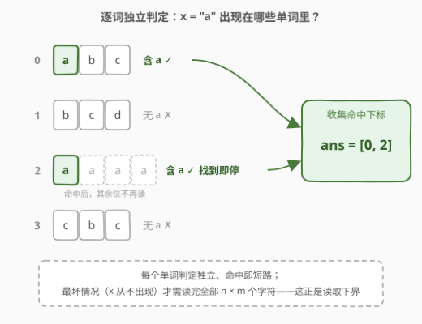
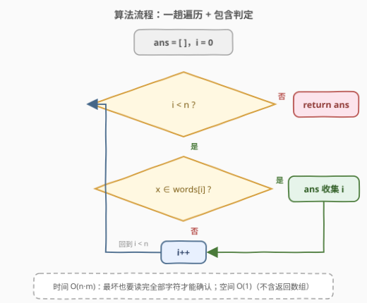
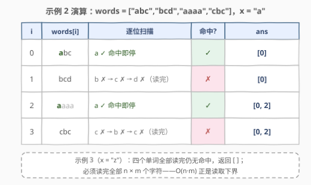

# LeetCode 查找包含给定字符的单词 题解

## 1. 题目概述

- **标题 / 题号**：查找包含给定字符的单词（#2942，easy）
- **链接**：https://leetcode.cn/problems/find-words-containing-character/
- **难度**：简单
- **标签**：数组、字符串

**题意**：给你一个下标从 **0** 开始的字符串数组 `words` 和一个字符 `x`。

请你返回一个**下标数组**，表示下标在数组中对应的单词**包含**字符 `x`。

**注意**：返回的数组可以是**任意**顺序。

**示例 1**：

```text
输入：words = ["leet","code"], x = "e"
输出：[0,1]
解释："e" 在两个单词中都出现了："leet" 和 "code"。所以我们返回下标 0 和 1。
```

**示例 2**：

```text
输入：words = ["abc","bcd","aaaa","cbc"], x = "a"
输出：[0,2]
解释："a" 在 "abc" 和 "aaaa" 中出现了，所以我们返回下标 0 和 2。
```

**示例 3**：

```text
输入：words = ["abc","bcd","aaaa","cbc"], x = "z"
输出：[]
解释："z" 没有在任何单词中出现。所以我们返回空数组。
```

**约束**：

- $1 \le words.length \le 50$
- $1 \le words[i].length \le 50$
- `x` 是一个小写英文字母
- `words[i]` 只包含小写英文字母

> 💡 读题先抓形态：这是一道**过滤型**问题——按谓词「单词包含字符 `x`」筛出下标集合。规模极小（$50 \times 50 = 2500$ 个字符），任何合理做法都能过；真正值得想清楚的是两点：①「包含判定」本身的最优成本；② 各单词判定之间**彼此独立**、可短路，天然一趟遍历。

## 2. 解题思路

### 2.1 暴力思路：双重循环逐字符扫描

官方提示就是 "Use two nested loops"：外层枚举下标 $i$ 从 $0$ 到 $n-1$，内层从左到右扫 `words[i]` 的每个字符，一旦遇到 `x` 就把 $i$ 记入答案并 `break`；整个单词扫完都没遇到则跳过。

这已经是最优做法——不存在能少读字符的聪明算法（见 2.2 的下界论证）。所谓「优化」只是把内层循环交给库函数：C++ 的 `words[i].find(x) != string::npos`、Python 的 `x in words[i]`，语义完全等价，短路行为也一致（命中即停）。

### 2.2 核心观察：判定独立 + 短路 + 读取下界



三条性质合在一起，直接框定解法形态：

1. **判定彼此独立**：`words[i]` 是否含 `x` 只取决于它自己，与其他单词无关——所以一趟遍历、逐词判定即可，不存在跨单词的状态或顺序依赖。
2. **判定可短路**：命中第一个 `x` 即可停止扫描该单词，无需读完。例如 `"aaaa"` 判定是否含 `a`，看第 0 位就够了。
3. **读取下界 $\Omega(n \cdot m)$**：最坏情况（示例 3，`x` 从不出现）必须**读完所有 $n \cdot m$ 个字符**才能确定答案是空数组——任何一个没读到的字符都可能是漏掉的 `x`。所以 $O(n \cdot m)$ 不只是暴力，也是**信息论下界**，暴力即正解。

$$\boxed{\ \mathrm{ans} = \{\, i \mid x \in \mathrm{words}[i] \,\}\ }$$

> 💡 一句话：**过滤题的最优解往往就是「写对谓词的一趟遍历」**——先想清楚谓词（包含判定）怎么写、贵不贵，再搭整体框架。本题谓词是 $O(m)$ 且可短路，框架是 $O(n)$ 一趟，乘起来就是答案。

### 2.3 算法流程图



**完整步骤**：

1. **初始化**：答案数组 `ans` 为空，下标 `i = 0`；
2. **循环判定**：只要 `i < n`，判定 `x` 是否出现在 `words[i]` 中（命中即短路停止）；是则把 `i` 追加进 `ans`；
3. **推进**：`i++`，回到第 2 步；
4. **收尾**：遍历结束返回 `ans`（无命中则返回空数组）。

> ⚠️ 内层「包含判定」若手写循环，命中后记得 `break`——不写不影响正确性，但会白白多读字符；短路是包含判定最朴素的加速。

### 2.4 示例演算



以示例 2（`words = ["abc","bcd","aaaa","cbc"]`，`x = "a"`）为例：

| $i$ | $words[i]$ | 逐位扫描 | 命中？ | `ans` |
|-----|-----------|---------|--------|-------|
| 0 | `"abc"` | `a` 命中即停 | ✓ | `[0]` |
| 1 | `"bcd"` | `b → c → d` 全读完 | ✗ | `[0]` |
| 2 | `"aaaa"` | `a` 命中即停 | ✓ | `[0, 2]` |
| 3 | `"cbc"` | `c → b → c` 全读完 | ✗ | `[0, 2]` |

遍历结束返回 `[0, 2]` ✓。示例 3（`x = "z"`）时四个单词全部读完仍无命中，返回 `[]`——这正是 2.2 中读取下界的直观来源。

## 3. 参考代码

### C++

```cpp
class Solution {
  public:
    vector<int> findWordsContaining(vector<string>& words, char x) {
        vector<int> ans;
        for (int i = 0; i < (int)words.size(); i++) {
            if (words[i].find(x) != string::npos) {
                ans.push_back(i);
            }
        }
        return ans;
    }
};
```

### Python

```python
class Solution:
    def findWordsContaining(self, words: List[str], x: str) -> List[int]:
        return [i for i, w in enumerate(words) if x in w]
```

> 💡 语言细节：C++ 的 `string::find` 找不到时返回 `string::npos`（极大的 `size_t` 值），`!= string::npos` 是标准判法；Python 的 `x in w` 底层是子串查找，单字符命中即短路，列表推导式一行完成「遍历 + 过滤 + 收集」。

## 4. 复杂度分析

| 维度 | 复杂度 | 说明 |
|------|--------|------|
| 时间复杂度 | $O(n \cdot m)$ | $n$ 个单词、平均长 $m$；命中可短路，但最坏（$x$ 不出现）需读完全部字符，$\Omega(n \cdot m)$ 也是下界 |
| 空间复杂度 | $O(1)$ | 仅遍历下标与判定变量（不计返回数组；若计入则为 $O(n)$） |

## 5. 扩展：多次查询——位掩码与倒排索引

单次查询下 $O(n \cdot m)$ 已最优。但如果面试官追问：**同一组 `words` 要查询 $q$ 个不同字符**呢？逐次扫描变成 $O(q \cdot n \cdot m)$，有两条加速路线：

- **路线一：位掩码字符集**（$O(n)$ 预处理 + $O(n)$ 单次查询）：把每个单词压缩成 26 位字符集掩码

  $$mask_i = \sum_{c \in \mathrm{words}[i]} 2^{\,c - \mathrm{a}}$$

  之后每次查询退化为 $n$ 次位测试 `mask[i] >> (x - 'a') & 1`，单词长度 $m$ 从查询成本中彻底消失，额外空间仅 $O(n)$。这正是 [1684. 统计一致字符串的数目](https://leetcode.cn/problems/count-the-number-of-consistent-strings/)（[题解](../1601-1700/1684_统计一致字符串的数目.md)）的核心套路。

- **路线二：倒排索引**（$O(n \cdot m)$ 预处理 + $O(1)$ 单次查询）：预处理「字符 → 下标列表」的 26 个桶（`pos[x].append(i)`），每次查询直接取出答案列表，空间 $O(n \cdot m)$——用空间换时间。

> 💡 对比：$q$ 小、单词长 → 位掩码（省空间、免读原串）；$q$ 大、重复查询多 → 倒排（查询零成本）。**单次查询两者都不如直接扫**——预处理本身就要 $O(n \cdot m)$，本题规模下纯属多此一举；但作为「查询次数变化 ⇒ 数据结构选择变化」的面试叙事非常好用。

## 6. 面试要点

1. **为什么 $O(n \cdot m)$ 已是最优，不能更快？**

   - 最坏情况（`x` 不出现，如示例 3）必须读完所有 $n \cdot m$ 个字符才能确认空数组
   - 任何一个未读字符都可能是漏掉的 `x`——$O(n \cdot m)$ 是读取下界，不是暴力凑合

2. **「包含判定」有哪些写法？各自的短路行为如何？**

   - 手写循环命中 `break`；C++ `find(x) != string::npos`；Python `x in w`——三者等价，命中即停
   - `count(x) > 0` 也正确，但会把整个单词**数完**，失去短路——本题无所谓，量级大了就是浪费

3. **「返回顺序任意」这个条件暗示什么？**

   - 只要求下标**集合**正确，升序、降序、乱序都合法
   - 但按遍历序（升序）输出最自然：一趟遍历天然有序，无需任何额外处理

4. **如果改成查询 $q$ 次，如何选数据结构？**

   - 位掩码字符集：$O(qn)$ 时间、$O(n)$ 空间，适合单词长
   - 倒排索引：$O(q)$ 时间、$O(nm)$ 空间，适合查询多
   - 单次查询直接扫最优——预处理成本无从摊销（见第 5 节）

5. **Python 一行式有什么容易踩的坑？**

   - `x in words` 判的是**列表成员**（整词相等），`x in w` 判的是**子串包含**——一字之差语义全变
   - 本题 `x` 恰为单字符，`in` 就是字符查找；若 `x` 是多字符串，`in` 变成子串匹配，与「包含字符」的题意不符

> 💡 **一句话总结**：谓词可短路、判定相互独立的一趟过滤，$O(n \cdot m)$ 既是暴力也是下界；追问多次查询时，位掩码与倒排索引是两条标准的空间换时间路线。

## 同类练习题

| # | 题目 | 与本题的关联 |
|---|------|-------------|
| 2185 | [统计包含给定前缀的字符串](https://leetcode.cn/problems/counting-words-with-a-given-prefix/)（[题解](../2101-2200/2185_统计包含给定前缀的字符串.md)） | 同一套过滤框架，谓词换成 `startswith` 前缀判定 |
| 1684 | [统计一致字符串的数目](https://leetcode.cn/problems/count-the-number-of-consistent-strings/)（[题解](../1601-1700/1684_统计一致字符串的数目.md)） | 位掩码字符集的实战——扩展路线一的本体 |
| 1935 | [可以输入的最大单词数](https://leetcode.cn/problems/maximum-number-of-words-you-can-type/)（[题解](../1901-2000/1935_可以输入的最大单词数.md)） | 反向过滤——判定「单词**不含**坏字符」，谓词取反 |
| 500 | [键盘行](https://leetcode.cn/problems/keyboard-row/) | 按字符集合归属（属于哪一行键盘）过滤单词，包含判定的集合版 |
