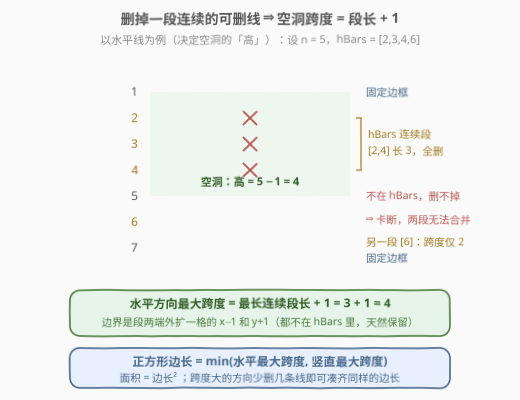
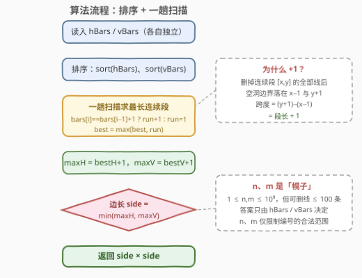
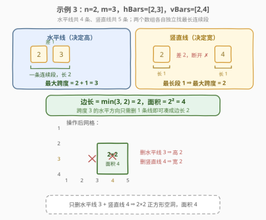

# 最大化网格图中正方形空洞的面积

- **题目名称**：最大化网格图中正方形空洞的面积
- **链接**：[2943. 最大化网格图中正方形空洞的面积](https://leetcode.cn/problems/maximize-area-of-square-hole-in-grid/)
- **难度**：中等
- **标签**：数组、排序

## 1. 题目概述

给你两个整数 `n` 和 `m`，以及两个整数数组 `hBars` 和 `vBars`。网格由 $n + 2$ 条**水平线**和 $m + 2$ 条**竖直线**组成，形成 1×1 的单元格。网格中的线条从 `1` 开始编号（水平线为 $1 \sim n+2$，竖直线为 $1 \sim m+2$）。

你可以从 `hBars` 中**删除**一些水平线条，并从 `vBars` 中删除一些竖直线条。注意，**其他线条是固定的，无法删除**（尤其是编号为 $1$ 和 $n+2$ 的边框线）。

返回移除一些线条（可以不移除任何线条）后，网格中**正方形空洞的最大面积**。

**示例 1**：

```text
输入：n = 2, m = 1, hBars = [2,3], vBars = [2]
输出：4
解释：水平线是 [1,2,3,4]，竖直线是 [1,2,3]。
构造最大正方形空洞的一种方法是移除水平线 2 和竖直线 2，
得到 2×2 的正方形空洞，面积 4。
```

**示例 2**：

```text
输入：n = 1, m = 1, hBars = [2], vBars = [2]
输出：4
解释：移除水平线 2 和竖直线 2，得到 2×2 的正方形空洞。
```

**示例 3**：

```text
输入：n = 2, m = 3, hBars = [2,3], vBars = [2,4]
输出：4
解释：构造最大正方形空洞的一种方法是移除水平线 3 和竖直线 4。
```

**约束条件**：

- $1 \le n, m \le 10^9$
- $1 \le hBars.length, vBars.length \le 100$
- $2 \le hBars[i] \le n + 1$，$2 \le vBars[i] \le m + 1$
- `hBars`、`vBars` 中所有值互不相同

> 💡 读题先抓三个**不变量**：① 水平线决定空洞的「高」，竖直线决定空洞的「宽」，两个方向**完全独立**；② 可删的线只能是 `hBars`/`vBars` 里的**内部线**——边框线 $1$ 和 $n+2$（或 $m+2$）永远删不掉；③ 空洞内部不能有任何线穿过，否则会被切开。另外注意 $n, m$ 高达 $10^9$ 但可删线**至多 100 条**——答案其实与 $n, m$ 无关，这是本题埋的「红鲱鱼」。

---

## 2. 解题思路

### 2.1 暴力思路：枚举删除子集 / 枚举边界对

最直白的做法是把「删除」当真：枚举 `hBars` 的每个子集与 `vBars` 的每个子集，共 $2^{|hBars|+|vBars|}$ 种组合，每个组合再扫描验证最大空洞——指数级，直接爆炸。

稍微动脑的暴力：枚举**空洞的边界**。空洞的高为 $k$，等价于存在两条水平线 $a$ 与 $a+k$，且开区间 $(a, a+k)$ 内的线**全部可删且全被删**。于是可以从大到小枚举边长 $k$（上界 $\min(|hBars|, |vBars|) + 1 \le 101$），对每个 $k$ 检查两个数组里是否各存在长为 $k-1$ 的连续段，总代价 $O(k_{\max} \cdot (|hBars|+|vBars|))$，已经能过。但这已经摸到正解门口——**每个方向只关心「最长连续段」这一个数**，根本不用逐个 $k$ 试。

### 2.2 核心观察：极长连续段 + 1



四条性质一环扣一环：

1. **空洞边界必须是「留下来的线」**：空洞上下由两条水平线界定，中间不能有任何线（否则空洞被切开）。所以若空洞夹在线 $a$ 与 $b$ 之间，则 $(a,b)$ 内的所有线都必须在 `hBars` 里且**全部被删**。
2. **按连续段整段全删最优**：把 `hBars` 排序后找**极长连续段** $[x, y]$（相邻元素差恰为 1）。将整段全删，空洞跨度为 $(y+1) - (x-1) = y - x + 2 = $ **段长 $+ 1$**。关键在于段两端外扩一格的线 $x-1$ 和 $y+1$ **都不在 `hBars` 里**（否则段还能延长），删不掉、天然充当边界。
3. **两段之间无法合并**：若两条连续段中间隔着一条不可删的线，空洞必然被它切开——所以每个方向的最大跨度只由**最长连续段**决定，与段的数量无关。
4. **横竖独立、短板决定边长**：设 $L_h$、$L_v$ 分别为两数组排序后的最长连续段长度，则

$$\boxed{\ \text{side} = \min(L_h, L_v) + 1, \qquad \text{ans} = \text{side}^2\ }$$

跨度大的方向**少删几条**（取子段）即可凑出同样的边长——示例 1 中水平方向本可到跨度 3，但竖直只有 2，于是只删水平线 2 一条。

> 💡 一条不删时天然存在 1×1 空洞；而约束保证 $|hBars|, |vBars| \ge 1$，单条线自成一个长 1 的段，所以边长至少为 2、答案至少为 4（三个示例全是 4 正是如此）。代码里把 `best` 初始化为 1 兜底，万无一失。

### 2.3 算法流程图



**完整步骤**：

1. **排序**：对 `hBars`、`vBars` 各自升序排序（值域到 $10^9$，不能开桶，但元素 $\le 100$ 个，排序绰绰有余）；
2. **一趟扫描**：维护当前连续段长度 `run` 与历史最长 `best`——相邻元素差 1 则 `run+1`，否则 `run` 重置为 1，随时更新 `best`；
3. **换算跨度**：$\text{maxH} = \text{bestH} + 1$，$\text{maxV} = \text{bestV} + 1$；
4. **取短板**：$\text{side} = \min(\text{maxH}, \text{maxV})$，返回 $\text{side}^2$。

> ⚠️ 注意 `n`、`m` **全程用不上**：它们只约束线编号的合法范围，只要输入合法，$n, m$ 再大也不改变答案。面试中主动点破这一点是加分项。

### 2.4 示例演算



以示例 3（`n=2, m=3, hBars=[2,3], vBars=[2,4]`）为例：

| 数组 | 排序后 | 连续段划分 | 最长段 $L$ | 最大跨度 $L+1$ |
|------|--------|-----------|-----------|---------------|
| `hBars` | $[2,3]$ | $[2,3]$ | $2$ | $3$ |
| `vBars` | $[2,4]$ | $[2]$、$[4]$（差 2 断开） | $1$ | $2$ |

边长 $= \min(3, 2) = 2$，面积 $= 2^2 = 4$ ✓——只需删水平线 3 与竖直线 4：水平方向跨度 3 用不完，取子段「只删线 3」凑成高 2；竖直方向删线 4 得宽 2。

再验证示例 1：`hBars=[2,3]` → 跨度 3，`vBars=[2]` → 跨度 2，边长 2、面积 4 ✓；示例 2：两侧跨度都是 2，面积 4 ✓。

---

## 3. 参考代码

### C++

```cpp
class Solution {
  public:
    int maximizeSquareHoleArea(int n, int m, vector<int>& hBars, vector<int>& vBars) {
        // 返回该方向的最大跨度 = 最长连续段长度 + 1
        auto maxSpan = [](vector<int>& bars) {
            sort(bars.begin(), bars.end());
            int best = 1, run = 1;
            for (int i = 1; i < (int)bars.size(); i++) {
                run = (bars[i] == bars[i - 1] + 1) ? run + 1 : 1;
                best = max(best, run);
            }
            return best + 1;
        };
        int side = min(maxSpan(hBars), maxSpan(vBars));
        return side * side;
    }
};
```

### Python

```python
class Solution:
    def maximizeSquareHoleArea(self, n: int, m: int, hBars: List[int], vBars: List[int]) -> int:
        def max_span(bars: List[int]) -> int:
            bars.sort()
            best = run = 1
            for i in range(1, len(bars)):
                run = run + 1 if bars[i] == bars[i - 1] + 1 else 1
                best = max(best, run)
            return best + 1

        side = min(max_span(hBars), max_span(vBars))
        return side * side
```

> 💡 `n`、`m` 作为参数出现在签名里却完全没用——不是疏忽，是题目故意放的烟雾弹。真要「用上」也只在合法性校验里（如断言 `2 <= h <= n+1`），对结果无任何影响。

---

## 4. 复杂度分析

| 维度 | 复杂度 | 说明 |
|------|--------|------|
| 时间复杂度 | $O\big((|hBars|+|vBars|) \log (|hBars|+|vBars|)\big)$ | 排序主导；两趟线性扫描可忽略。元素至多 100 个，实测常数极小 |
| 空间复杂度 | $O(1)$ | 原地排序，仅 `run`/`best` 等常数个变量（不计排序自身栈空间） |

> ⚠️ 常见疑问：$n, m$ 到 $10^9$，为什么不是 $O(n)$ 或 $O(m)$？因为网格本身**无需建出来**——空洞跨度只由可删线的编号连续性决定，$n, m$ 从头到尾只出现在输入签名里。

---

## 5. 扩展：去掉排序、以及几个变体

**哈希集合 O(k) 做法（[128. 最长连续序列](https://leetcode.cn/problems/longest-consecutive-sequence/) 的经典技巧）**：把数组倒进哈希集合，只从「段首」起数——满足 $x-1 \notin S$ 的 $x$ 才可能是段首，从它起向右数 $x, x+1, x+2, \dots$ 直到断开。每个元素最多被数两次，期望 $O(k)$。本题 $k \le 100$，排序与哈希都绰绰有余，但值域大、元素多的场景这就是正解。

**几个一步之遥的变体**：

- **求最大「矩形」而非正方形**：不用取 $\min$，答案直接 $= (L_h+1) \times (L_v+1)$——把 2.2 的第 4 条性质去掉即可；
- **带删除代价**：每条线删除有代价 $c_i$，求达到边长 $k$ 的最小总代价——「段内全删」变成「长为 $k-1$ 的滑动窗口内求和最小」，前缀和 / 单调队列登场；
- **与 [221. 最大正方形](https://leetcode.cn/problems/maximal-square/) 对照**：同叫「网格中最大正方形」，221 是 0/1 矩阵上逐格 DP 扩张，本题是几何构造 + 一维连续段——**二维 DP 结构 vs 一维排序结构**，面试中主动对比这两条思路线，比单刷一题有价值得多。

> 💡 一条主线：本题的本质是**「把几何问题压缩成一维序列问题」**——横竖独立后，剩下的只是「排序数组里最长的相邻差 1 段」，一个 `run` 变量就够。遇到网格/几何题先找「可分解的独立维度」，是最值得练的直觉。

---

## 6. 面试要点

1. **为什么某方向的最大跨度 = 最长连续段长度 + 1？**

   - 空洞内部不能有线 ⇒ 边界 $a, b$ 之间的线必须全在可删集合里且全删
   - 设 $(a,b)$ 内的线构成连续段 $[x,y]$，则 $b - a = y - x + 2 = $ 段长 $+ 1$
   - 极长段 $[x,y]$ 的外扩线 $x-1, y+1$ 不在 `hBars` 里（或是边框），删不掉、恰好当边界，取到上界

2. **两条连续段为什么不能合并出更大的空洞？**

   - 两段之间必然隔着一条**不可删**的线（若可删且相邻，两段本就是同一段）
   - 这条线留在网格中就会把空洞切开 ⇒ 每个方向只由**最长**的一段决定

3. **边长取 $\min$ 之后，跨度大的方向怎么「凑」？**

   - 长为 $L$ 的连续段里任取长 $k-1$ 的子段全删，即得跨度 $k$（$2 \le k \le L+1$）
   - 示例 1/3 中水平跨度到 3 但只删 1 条线，就是这个「取子段」的收缩

4. **$n, m$ 高达 $10^9$，算法为什么与它们无关？**

   - $n, m$ 只规定边框位置和线编号上限，限制输入合法性
   - 空洞跨度由可删线的**编号连续性**唯一决定，边框线 1 和 $n+2$ 反正删不掉
   - 同理不能开值域数组（$10^9$ 桶会爆内存），必须排序或哈希

5. **代码里 `best` 为什么初始化为 1 而不是 0？**

   - 兜底「一条都不删」的 1×1 空洞（跨度 1）
   - 本题约束 $|hBars| \ge 1$，实际恒有 `best >= 1`、边长 $\ge 2$，但防御性初始化让函数对空数组也正确

> 💡 **一句话总结**：横竖独立 ⇒ 各自排序找最长「相邻差 1」连续段 ⇒ 边长 $= \min(L_h, L_v) + 1$、面积 $= $ 边长²；$n, m$ 是烟雾弹，网格根本不用建——一道披着几何外衣的连续段扫描小题。

---

## 7. 同类练习题

- [128. 最长连续序列](https://leetcode.cn/problems/longest-consecutive-sequence/)（[题解](../0101-0200/128_最长连续序列.md)）：最长连续段的哈希集合 $O(n)$ 求法，即本题去掉排序的进阶版
- [221. 最大正方形](https://leetcode.cn/problems/maximal-square/)（[题解](../0201-0300/221_最大正方形.md)）：同为「网格中最大正方形」，DP 逐格扩张视角，与本题的几何构造视角互为对照
- [846. 一手顺子](https://leetcode.cn/problems/hand-of-straights/)（[题解](../0801-0900/846_一手顺子.md)）：把数值切分成长度为 W 的连续段，连续段构造的计数器实现
- [2414. 最长的字母序连续子字符串的长度](https://leetcode.cn/problems/length-of-the-longest-alphabetical-continuous-substring/)（[题解](../2401-2500/2414_最长的字母序连续子字符串的长度.md)）：相邻差 1 的最长 run 一趟扫描，本题扫描循环的直接练习
