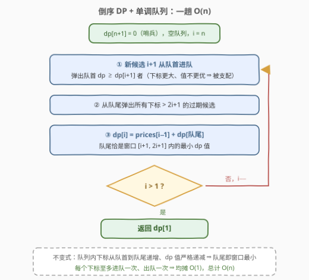
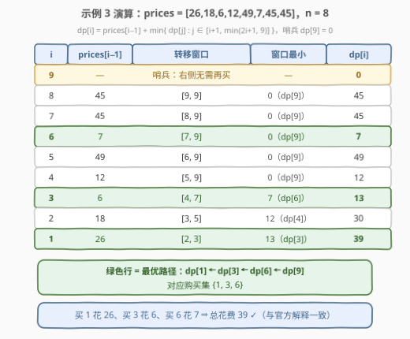

# LeetCode 购买水果需要的最少金币数 题解

## 1. 题目概述

- **标题 / 题号**：购买水果需要的最少金币数（#2944，medium）
- **链接**：https://leetcode.cn/problems/minimum-number-of-coins-for-fruits/
- **难度**：中等
- **标签**：动态规划、单调队列、滑动窗口

**题意**：水果超市共 $n$ 个水果，`prices[i-1]` 是第 $i$ 个水果的售价（原题用 0 起始的 `prices` 配「第几个水果」的编号，下标极易读晕，建议直接用示例校准）。促销规则：

> 花费 $prices[i-1]$ 购买第 $i$ 个水果，可以**免费获得**第 $i+1$ 至第 $2i$ 个水果——买得越靠后，赠送的「臂长」越长（恰好送 $i$ 个）。

注意：即使某个水果可以免费获得，也仍然可以花钱买它——为的是它的赠品。求把所有水果全部拿到手的**最少**金币数。

**示例 1**：

```text
输入：prices = [3,1,2]
输出：4
解释：花 3 买第 1 个（送第 2 个），再花 1 买「已经免费」的第 2 个（送第 3 个）。
买白嫖货反而更省——这是本题最反直觉的一步。
```

**示例 2**：

```text
输入：prices = [1,10,1,1]
输出：2
解释：花 1 买第 1 个（送第 2 个），花 1 买第 3 个（送第 4 个）。
```

**示例 3**：

```text
输入：prices = [26,18,6,12,49,7,45,45]
输出：39
解释：花 26 买第 1 个（送 2）；花 6 买第 3 个（送 4、5、6）；花 7 买第 6 个（送 7、8）。
```

**约束**：

- $1 \le prices.length \le 1000$
- $1 \le prices[i] \le 10^5$

> 💡 用示例 3 校准语义：买第 3 个水果送第 4、5、6 个，买第 6 个送第 7、8 个——**买 $i$ 送 $[i+1, 2i]$**。另外先抓一个不变量：赠品永远在购买位置的右侧，所以**第 1 个水果不可能被任何购买覆盖，必须花钱买**。

## 2. 解题思路

### 2.1 暴力思路：把「购买序列」想清楚，O(n²) DP 顺手就来

最笨的做法是枚举购买集合的所有子集，逐个检查覆盖性，$O(2^n \cdot n)$——只配当对拍器。

真正有生产力的一步是看清**购买序列**的结构。设最终花钱买下的水果按序为 $1 = i_1 < i_2 < \cdots < i_k$（首元素必为 1，见上面的不变量）。相邻两笔购买 $i_m$ 与 $i_{m+1}$ 之间必须满足什么约束？

买 $i_m$ 免费覆盖 $[i_m+1,\ 2i_m]$，于是**第一个没人管的水果是 $2i_m+1$**。要覆盖它只有两条路：

- 花钱买某个落在 $[i_m+1,\ 2i_m]$ 里的水果 $j$（白嫖货也可以买！），需满足 $j+1 \le 2i_m+1 \le 2j$，解得 $j \in [i_m+1,\ 2i_m]$；
- 或者干脆自己掏钱买下 $2i_m+1$。

两条路合起来：**下一笔购买 $j \in [i_m+1,\ 2i_m+1]$**。跳得更远（$j > 2i_m+1$）会让水果 $2i_m+1$ 永久失管。

于是定义 $dp[i]$：**已花钱买下第 $i$ 个水果，且 $[i, n]$ 全部到手**的最少金币；另设哨兵 $dp[n+1] = 0$（右边无需再买）：

$$dp[i] = prices[i-1] + \min_{i+1 \le j \le \min(2i+1,\ n+1)} dp[j], \qquad \text{ans} = dp[1]$$

每个状态扫 $O(i)$ 个转移源，总复杂度 $O(n^2)$；$n \le 1000$ 时约 $10^6$ 次比较，能过——但还差一口气。

### 2.2 核心观察：转移窗口两端同向左移 ⇒ 反向滑动窗口最小值

![核心概念：买 i 送 [i+1,2i]，下一笔购买落在 [i+1,2i+1]](../images/p2944_fruits_cover_window.svg)

盯着转移窗口 $[i+1,\ 2i+1]$ 看：$i$ 每减 1，**左端左移 1 格、右端左移 2 格**——两端同向移动。这正是一个滑动的窗口，只不过方向与 [239. 滑动窗口最大值](https://leetcode.cn/problems/sliding-window-maximum/) 相反：239 的窗口往右滑，本题的窗口往左滑。**窗口最小值 ⇒ 单调队列，$O(n)$**。

方向反转带来三个镜像操作（与 239 的最小值版逐条对照）：

| 操作 | 239（窗口右移） | 本题（窗口左移，$i$ 从 $n$ 递减到 1） |
|------|----------------|--------------------------------------|
| 新候选进队 | 队尾 | **队首**（新候选 $i+1$ 下标最小） |
| 弹被支配者 | 队尾（$dp \ge$ 新值者） | **队首**（$dp \ge dp[i+1]$ 者） |
| 弹过期者 | 队首 | **队尾**（下标 $> 2i+1$ 者） |
| 最值位置 | 队首 | **队尾** |

**支配关系为什么成立**：候选 $j$ 存活于满足 $i+1 \le j \le 2i+1$ 的那些 $i$，即 $i \in [\lceil (j-1)/2 \rceil,\ j-1]$——**下标越大，越早过期**。新候选 $i+1$ 是迄今下标最小、命最长的候选；若它的花费还不高于队首的老候选（下标更大、命更短），老候选「活得短、花费高」，永远轮不到出场，弹掉不心疼。

三个操作之后，队列内下标从队首到队尾递增、$dp$ 值严格递减，**队尾就是窗口 $[i+1, 2i+1]$ 内的最小 $dp$**：

$$dp[i] = prices[i-1] + dp[\text{队尾}]$$

### 2.3 算法流程图



**完整步骤**：

1. **初始化**：$dp[n+1] = 0$（哨兵），队列空，$i = n$；
2. **循环**（$i$ 从 $n$ 递减到 $1$）：
   - 新候选 $i+1$ 从**队首**进队：先弹掉队首所有 $dp \ge dp[i+1]$ 的被支配候选；
   - 从**队尾**弹掉所有下标 $> 2i+1$ 的过期候选；
   - $dp[i] = prices[i-1] + dp[\text{队尾}]$；
3. **返回** $dp[1]$（第 1 个水果必须买，$dp[1]$ 即答案）。

> ⚠️ 顺序不能乱：必须**先**让新候选 $i+1$ 进队（它自己就是合法的下一笔购买），**再**做过期清理，最后取队尾查询。三步合起来每个下标至多进队一次、出队一次，均摊 $O(1)$。

### 2.4 示例演算



以示例 3（`prices = [26,18,6,12,49,7,45,45]`，$n = 8$）为例，从哨兵 $dp[9] = 0$ 倒序逐格填表：

| $i$ | $prices[i-1]$ | 转移窗口 $[i+1, \min(2i+1, 9)]$ | 窗口最小 | $dp[i]$ |
|-----|---------------|--------------------------------|----------|---------|
| 9 | — | 哨兵：右侧无需再买 | — | 0 |
| 8 | 45 | $[9, 9]$ | $0\ (dp[9])$ | 45 |
| 7 | 45 | $[8, 9]$ | $0\ (dp[9])$ | 45 |
| 6 | 7 | $[7, 9]$ | $0\ (dp[9])$ | 7 |
| 5 | 49 | $[6, 9]$ | $0\ (dp[9])$ | 49 |
| 4 | 12 | $[5, 9]$ | $0\ (dp[9])$ | 12 |
| 3 | 6 | $[4, 7]$ | $7\ (dp[6])$ | 13 |
| 2 | 18 | $[3, 5]$ | $12\ (dp[4])$ | 30 |
| 1 | 26 | $[2, 3]$ | $13\ (dp[3])$ | 39 |

从 $dp[1]$ 回溯最优路径：$dp[1] \leftarrow dp[3] \leftarrow dp[6] \leftarrow dp[9]$，即**购买集 $\{1, 3, 6\}$**，总花费 $26 + 6 + 7 = 39$ ✓，与官方解释一字不差。

顺带验证示例 1（`prices = [3,1,2]`）：$dp[4]=0$，$dp[3]=2$，$dp[2]=1$，$dp[1]=3+\min(1,2)=4$——$dp[1]$ 取到 $dp[2]$，正是「花钱买白嫖的第 2 个水果」那条路径。

## 3. 参考代码

### C++

```cpp
class Solution {
  public:
    int minimumCoins(vector<int>& prices) {
        int n = prices.size();
        vector<int> dp(n + 2, 0);
        deque<int> dq;
        for (int i = n; i >= 1; i--) {
            while (!dq.empty() && dp[dq.front()] >= dp[i + 1]) dq.pop_front();
            dq.push_front(i + 1);
            while (!dq.empty() && dq.back() > 2 * i + 1) dq.pop_back();
            dp[i] = prices[i - 1] + dp[dq.back()];
        }
        return dp[1];
    }
};
```

### Python

```python
from collections import deque


class Solution:
    def minimumCoins(self, prices: List[int]) -> int:
        n = len(prices)
        dp = [0] * (n + 2)
        dq = deque()
        for i in range(n, 0, -1):
            while dq and dp[dq[0]] >= dp[i + 1]:
                dq.popleft()
            dq.appendleft(i + 1)
            while dq and dq[-1] > 2 * i + 1:
                dq.pop()
            dp[i] = prices[i - 1] + dp[dq[-1]]
        return dp[1]
```

> 💡 两处易错点：① 进队比较用 `>=`——值相等的老候选同样被支配，弹掉能让队列更短；② 过期判断是**严格大于** `2*i+1`——下标恰为 $2i+1$ 的候选还在窗口内（对应「自己买下第一个未覆盖水果」这条路径）。

## 4. 复杂度分析

| 维度 | 复杂度 | 说明 |
|------|--------|------|
| 时间复杂度 | $O(n)$ | 每个下标至多进队一次、出队一次（从队首或队尾），循环体均摊 $O(1)$ |
| 空间复杂度 | $O(n)$ | $dp$ 数组 $O(n)$ + 单调队列 $O(n)$ |

> ⚠️ $O(n^2)$ 的朴素 DP 在 $n \le 1000$ 下约 $10^6$ 次比较也能 AC，但一旦 $n$ 放大到 $10^5$ 就必须上单调队列——把「转移源是一个同向滑动的窗口」这个结构看透，代码量几乎不变，复杂度降一个数量级。

## 5. 扩展：同一 DP 的另外两副面孔

**正向窗口（标准方向的 239 模板）**。把状态反过来定义：$g[i]$ = 买下 $i$ 且 $[1, i]$ 全部到手的最少金币，则上一笔购买 $j$ 必须罩住 $[j+1, i-1]$，即 $j \in [\lfloor i/2 \rfloor,\ i-1]$：

$$g[i] = prices[i-1] + \min_{\lfloor i/2 \rfloor \le j \le i-1} g[j], \qquad g[1] = prices[0], \qquad \text{ans} = \min_{2i \ge n} g[i]$$

此时窗口 $[\lfloor i/2 \rfloor,\ i-1]$ 两端同向**右移**——新元素队尾进、过期队头弹、最小值在队头，就是 239 的原版模板。代价是答案要对「罩得住右边界 $2i \ge n$ 的最后一笔购买」取尾部最小。

**小根堆 + 懒删除**。官方标签里的 Heap 解法：倒序 DP 时把 $(dp[j], j)$ 丢进小根堆，每步先 push 新候选，再循环弹掉堆顶下标 $> 2i+1$ 的过期者，堆顶即窗口最小。$O(n \log n)$，不用维护单调性，适合快速写对；单调队列则是理论最优。

**「白嫖货也可以买」并非鸡肋**。示例 1 的最优解恰恰买了已免费的第 2 个水果。若删掉这条规则，示例 1 只能买 1 和 3（$3 + 2 = 5$），答案从 4 劣化到 5——这条规则让转移区间多出 $[i+1, 2i]$ 半段，是建模时不可丢的信息。

## 6. 面试要点

1. **为什么第 1 个水果必须花钱买？**

   - 购买 $i$ 的赠品区间是 $[i+1, 2i]$，永远在购买位置右侧
   - 不存在任何购买能覆盖水果 1，购买序列必以 1 开头，答案即 $dp[1]$

2. **为什么下一笔购买被限制在 $[i+1, 2i+1]$？**

   - 买 $i$ 只覆盖到 $2i$，水果 $2i+1$ 是第一个未被覆盖的
   - 要么某笔购买 $j \in [i+1, 2i]$ 顺带覆盖它（$j+1 \le 2i+1 \le 2j$），要么自己掏钱买它（$j = 2i+1$）
   - 跳过 $2i+1$ 再买，它将永久失管——转移区间的右端由此封死

3. **单调队列与 239 的差异在哪里？为什么最小值在队尾？**

   - 239 窗口右移：新元素队尾进，值从队首到队尾递减，最值在队首
   - 本题窗口左移：新元素队首进（下标最小、命最长），值从队首到队尾递减，**最小值在队尾**；过期改从队尾弹
   - 本质是同一套「弹被支配 + 弹过期」的镜像，方向由窗口滑动方向决定

4. **$dp[n+1] = 0$ 哨兵的作用是什么？**

   - $j = n+1$ 编码「不再买了」；它仅当 $2i \ge n$ 时才落入窗口 $[i+1, 2i+1]$
   - 恰好自动表达「买 $i$ 已罩住全部剩余水果」，省去对最后一段的特判

5. **弹被支配者为什么安全？会不会误删后面要用的候选？**

   - 被弹的老候选下标更大 ⇒ 存活区间 $[\lceil (j-1)/2 \rceil,\ j-1]$ 更早结束 ⇒ 更早过期
   - 它的花费还不小于新候选 ⇒ 在它存活的任何时刻，新候选都在窗口内且不更差
   - 双重劣势 ⇒ 永不可能是最优选择，删除无副作用

> 💡 **一句话总结**：买 $i$ 送 $[i+1, 2i]$ ⇒ 下一笔购买落在 $[i+1, 2i+1]$ ⇒ 倒序 DP 的转移窗口两端同向左移 ⇒ 镜像版滑动窗口最小值，单调队列一趟 $O(n)$。

## 同类练习题

| # | 题目 | 与本题的关联 |
|---|------|-------------|
| 239 | [滑动窗口最大值](https://leetcode.cn/problems/sliding-window-maximum/)（[题解](../0201-0300/239_滑动窗口最大值.md)） | 单调队列模板本体，对照本题看「窗口反向滑动时的三处镜像操作」 |
| 1696 | [跳跃游戏 VI](https://leetcode.cn/problems/jump-game-vi/)（[题解](../1601-1700/1696_跳跃游戏VI.md)） | $dp[i] = nums[i] + \max\ dp[i-k..i-1]$，正向定长窗口最值 DP 的招牌，本题把窗口换成随 $i$ 增长的变长窗口 |
| 1425 | [带限制的子序列和](https://leetcode.cn/problems/constrained-subsequence-sum/)（[题解](../1401-1500/1425_带限制的子序列和.md)） | 转移源窗口 $[i-k, i-1]$ 的单调队列优化 DP，与本题同模板 |
| 862 | [和至少为 K 的最短子数组](https://leetcode.cn/problems/shortest-subarray-with-sum-at-least-k/)（[题解](../0801-0900/862_和至少为K的最短子数组.md)） | 单调队列两头弹出各有语义（队头更新答案、队尾保单调）的教科书案例 |
| 871 | [最低加油次数](https://leetcode.cn/problems/minimum-number-of-refueling-stops/)（[题解](../0801-0900/871_最低加油次数.md)） | 同属「跳跃 + 代价」结构，堆贪心视角，与本题的 DP 视角互为对照 |
