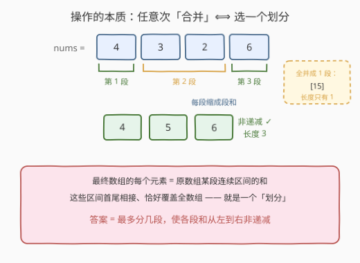
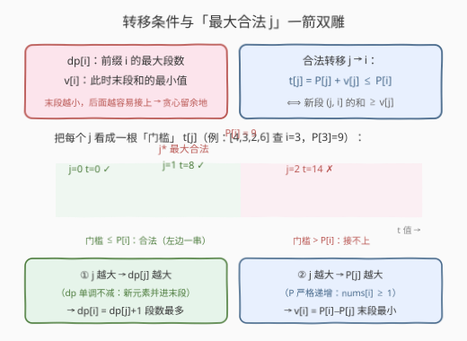
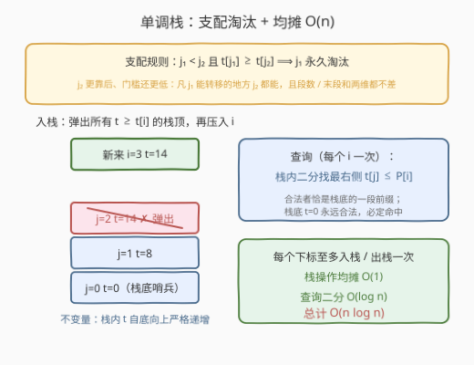
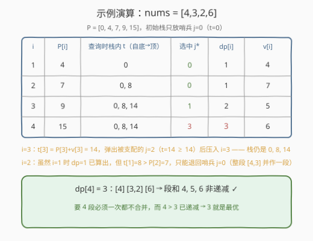

# 找到最大非递减数组的长度

- **题目名称**：找到最大非递减数组的长度
- **链接**：[2945. 找到最大非递减数组的长度](https://leetcode.cn/problems/find-maximum-non-decreasing-array-length/)
- **难度**：困难
- **标签**：动态规划、前缀和、单调栈、二分查找

## 1. 题目概述

给你一个下标从 **0** 开始的整数数组 `nums`。

你可以执行**任意次**操作。每次操作中，选择一个**子数组**（连续非空段），并把这个子数组用它所包含元素的**和**替换。比方说给定数组 `[1,3,5,6]`，可以选择子数组 `[3,5]`，用和 `8` 替换掉它，数组变为 `[1,8,6]`。

请你返回执行任意次操作以后，可以得到的**最长非递减**数组的长度。

**示例 1**：

```text
输入：nums = [5,2,2]
输出：1
解释：长度为 3 的数组不是非递减的。两种保留长度 2 的方案（[5,4] 与 [7,2]）也都不是非递减的。
只有把整个 [5,2,2] 替换成 [9]，数组才非递减，所以答案为 1。
```

**示例 2**：

```text
输入：nums = [1,2,3,4]
输出：4
解释：数组已经是非递减的，不需要任何操作。
```

**示例 3**：

```text
输入：nums = [4,3,2,6]
输出：3
解释：将 [3,2] 替换为 [5]，得到 [4,5,6]，它是非递减的，且没有更长的方案。
```

**约束条件**：

- $1 \le nums.length \le 10^5$
- $1 \le nums[i] \le 10^5$

---

## 2. 解题思路

### 2.1 暴力思路：看穿操作的本质——划分，再接龙 DP



第一步是把「任意次操作」翻译成静态结构。观察最终数组的任何一个元素：它由原数组中**一段连续区间**的元素经若干次合并而来；不同元素对应的区间互不重叠、依次拼接、恰好覆盖整个数组。反过来，任意一个划分都能通过逐段合并得到。于是：

> **任意次操作 ⟺ 把 `nums` 划分成若干连续段，最终数组 = 各段之和组成的序列。**
> 数组非递减 ⟺ **各段和从左到右非递减**。问题变成：**最多分几段，使段和序列非递减？**

这立刻是一个「接龙型」DP。记 $P$ 为前缀和（$P[0]=0$），定义：

- $dp[i]$：前缀 $i$（前 $i$ 个元素）能分出的**最大段数**；
- $v[i]$：在段数恰为 $dp[i]$ 的所有划分中，**最后一段和的最小值**（段数是第一关键字，末段和越小，给后面接的余地越大，这是贪心）。

转移时枚举上一段结束位置 $j < i$：新段 $(j, i]$ 的和为 $P[i] - P[j]$，它要不小于前缀 $j$ 的末段，合法条件与更新为：

$$dp[i] = \max\{dp[j] + 1 : j < i,\ P[i] - P[j] \ge v[j]\},\qquad v[i] = P[i] - P[j^*]$$

答案即 $dp[n]$。每个 $i$ 都要扫一遍全部 $j$，$O(n^2) = 10^{10}$，在 $n = 10^5$ 下必然超时。瓶颈在于：合法条件 $P[j] + v[j] \le P[i]$ 中的 $P[j] + v[j]$ **没有单调性**，无法直接滑动窗口，只能逐个比较。

### 2.2 核心观察：最大合法 j 一箭双雕 + 支配淘汰



先确认两条单调性（都来自 $nums[i] \ge 1$）：

- **$P$ 严格递增**：显然；
- **$dp$ 单调不减**：把 $nums[i+1]$ 并进「前缀 $i$ 最优划分」的最后一段，段数不变、末段和变大仍不小于倒数第二段，故 $dp[i+1] \ge dp[i]$。

再把合法条件改写成**门槛**形式：$t[j] := P[j] + v[j]$，则 $j \to i$ 可转移 ⟺ $t[j] \le P[i]$。于是两条单调性共同给出本题最妙的一步：

> **在所有合法 $j$ 中取最大的那个 $j^*$，两个偏好同时对齐：**
> ① $j$ 越大 $dp[j]$ 越大（$dp$ 单调不减）→ $dp[i] = dp[j^*]+1$ 段数最多；
> ② $j$ 越大 $P[j]$ 越大（$P$ 严格递增）→ $v[i] = P[i] - P[j^*]$ 末段和最小。

「段数最多」和「末段最小」这两个本来可能打架的目标，被同一个 $j^*$ 同时达成——每个 $i$ 只需找到**最右侧的门槛 $\le P[i]$ 的候选**。

候选怎么维护？注意**支配关系**：

> 若 $j_1 < j_2$ 且 $t[j_1] \ge t[j_2]$，则 $j_1$ 永久无用——$j_2$ 更靠后（$dp$、$P$ 两维都不差）且门槛更低（$j_1$ 能转移的地方 $j_2$ 都能）。

淘汰掉被支配者后，留下的候选满足**下标越大门槛越高**，即 $t$ 自底向上严格递增——这正是**单调栈**的形状：

- **查询**（每个 $i$ 一次）：栈内 $t$ 有序，二分找最右侧 $t[j] \le P[i]$ 的 $j$；栈底哨兵 $t[0] = 0$ 永远合法，必定命中；
- **入栈**（算完 $dp[i], v[i]$ 后）：弹出所有 $t \ge t[i]$ 的栈顶（它们已被 $i$ 支配），再压入 $i$。每个下标至多入栈、出栈各一次，均摊 $O(1)$。

> 💡 **只记 $(dp[j], v[j])$ 这一对信息，会不会漏掉「段数更少但末段和更小」的划分？** 不会。若最优解把前缀 $j$ 分成 $k$ 段，而 $dp[j] > k$，利用 $dp$ 相邻下标至多差 1（把末元素从末段摘掉即证），在 $(j_{k-1}, j_k]$ 中必存在 $m$ 使 $dp[m] = k$；把最优划分的最后一段截短到 $m$ 处仍是合法划分，故 $v[m]$ 不超过原末段和，用 $m$ 转移不劣。归纳可知任意「少段数」方案都被某个 $(dp[m], v[m])$ 支配。

### 2.3 算法流程



1. 预处理前缀和 $P[0..n]$；
2. 初始化单调栈：压入哨兵 $j = 0$（$t[0] = 0$，对应「空前缀、0 段、末段和 0」，因 $nums[i] \ge 1 > 0$ 任何段都接得上）；
3. $i$ 从 $1$ 到 $n$：
   - 栈内二分找最右侧 $t[j] \le P[i]$ 的下标 $j^*$；
   - $dp[i] = dp[j^*] + 1$，$v[i] = P[i] - P[j^*]$，$t[i] = P[i] + v[i]$；
   - 不断弹出栈顶中 $t \ge t[i]$ 的候选，压入 $i$；
4. 返回 $dp[n]$。

### 2.4 示例演算



以示例 3 `nums = [4,3,2,6]` 为例，$P = [0,4,7,9,15]$：

| i | P[i] | 查询时栈内 t（自底→顶） | 选中 j* | dp[i] | v[i] |
|---|------|------------------------|---------|-------|------|
| 1 | 4  | 0        | 0 | 1 | 4 |
| 2 | 7  | 0, 8     | 0 | 1 | 7 |
| 3 | 9  | 0, 8, 14 | 1 | 2 | 5 |
| 4 | 15 | 0, 8, 14 | 3 | **3** | 6 |

两个值得回味的瞬间：

- **$i=2$**：虽然 $i=1$ 已算出 $dp=1$，但 $t[1]=8 > P[2]=7$ 接不上，只能退回哨兵 $j=0$——把 $[4,3]$ 整体并作一段（和 7），这就是「门槛」挡掉的方向；
- **$i=3$**：$t[3] = 9+5 = 14$，与栈顶 $t[2]=14$ 相等，$j=2$ 被支配弹出（$i=3$ 更靠后且门槛相同），换 $i=3$ 入栈——随后 $i=4$ 正是踩着这个新栈顶得到 $dp[4]=3$，对应划分 $[4]\,[3,2]\,[6]$，段和 $4,5,6$。

---

## 3. 参考代码

### C++

```cpp
class Solution {
  public:
    int findMaximumLength(vector<int>& nums) {
        int n = nums.size();
        vector<long long> P(n + 1, 0);          // 前缀和（最大 1e10，必须 long long）
        for (int i = 0; i < n; i++) P[i + 1] = P[i] + nums[i];

        vector<int> dp(n + 1, 0);               // dp[0] = 0：空前缀 0 段
        vector<long long> v(n + 1, 0);          // v[0] = 0：哨兵，任何段和 >= 1 都能接
        vector<int> st = {0};                   // 单调栈：存候选下标 j
        vector<long long> ts = {0};             // 平行数组：t[j] = P[j] + v[j]，自底向上严格递增

        for (int i = 1; i <= n; i++) {
            // 二分找栈内最右侧 t[j] <= P[i]（栈底 t=0 必命中）
            int lo = 0, hi = (int)ts.size() - 1, k = 0;
            while (lo <= hi) {
                int mid = (lo + hi) >> 1;
                if (ts[mid] <= P[i]) { k = mid; lo = mid + 1; }
                else hi = mid - 1;
            }
            int j = st[k];
            dp[i] = dp[j] + 1;
            v[i] = P[i] - P[j];
            long long t = P[i] + v[i];
            while (!ts.empty() && ts.back() >= t) {   // 弹掉被 i 支配的栈顶
                ts.pop_back();
                st.pop_back();
            }
            st.push_back(i);
            ts.push_back(t);
        }
        return dp[n];
    }
};
```

### Python

```python
class Solution:
    def findMaximumLength(self, nums: List[int]) -> int:
        n = len(nums)
        P = [0] * (n + 1)                       # 前缀和
        for i, x in enumerate(nums):
            P[i + 1] = P[i] + x

        dp = [0] * (n + 1)                      # dp[0] = 0：空前缀 0 段
        v = [0] * (n + 1)                       # v[0] = 0：哨兵
        st, ts = [0], [0]                       # 栈存下标；ts 存 t[j]，自底向上严格递增

        for i in range(1, n + 1):
            k = bisect_right(ts, P[i]) - 1      # 最右侧 t[j] <= P[i]
            j = st[k]
            dp[i] = dp[j] + 1
            v[i] = P[i] - P[j]
            t = P[i] + v[i]
            while ts and ts[-1] >= t:           # 弹掉被 i 支配的栈顶
                ts.pop()
                st.pop()
            st.append(i)
            ts.append(t)
        return dp[n]
```

> ⚠️ 两处易踩坑：① $P$ 最大 $10^{10}$、$t$ 最大 $2 \times 10^{10}$，C++ 全程用 `long long`；② 弹栈条件是 `>=`（门槛相等时，靠后的新候选在两维都不差，旧的一样要弹），写成 `>` 会让栈里留下门槛相等的重复候选，虽不影响正确性但破坏「严格递增」不变量。

---

## 4. 复杂度分析

| 维度 | 复杂度 | 说明 |
|------|--------|------|
| 时间复杂度 | $O(n \log n)$ | 每个 $i$ 一次栈内二分 $O(\log n)$；入栈 / 出栈每个下标至多一次，均摊 $O(n)$ |
| 空间复杂度 | $O(n)$ | 前缀和、DP 数组与单调栈 |

---

## 5. 扩展：均摊 O(n) 双指针变体与同骨架问题

- **双指针均摊 $O(n)$**：查询阈值 $P[i]$ 随 $i$ 严格递增，且弹栈只会发生在「当前查询边界」的右侧（被弹者的 $t > P[i]$ 均不在合法前缀内），故合法前缀的右端点**只会向右移动**——用一个单调指针代替二分即可，总体 $O(n)$。二分版更好写好证，面试先给二分版，再口头升级。
- **同骨架问题**：「接龙 DP + 单调结构淘汰被支配转移」是一整族题：862 用单调双端队列（前缀和 + $P[i] \ge P[j] + K$ 的最短段）、1696 用滑动窗口最值优化 $dp$、2926 用树状数组处理一维偏序前驱。认出「合法转移条件可以写成对候选的支配/偏序关系」这一形状，是这类困难题的共同钥匙。

---

## 6. 面试要点

1. **为什么任意次操作等价于一个划分？**

   - 最终数组的每个元素都由原数组一段连续区间合并而来，各区间互不重叠且依次覆盖全数组，即划分；反之任何划分都能经若干次合并实现
   - 段和 = 区间和 → 前缀和 $O(1)$ 求出，问题归约为「最多分几段使段和非递减」

2. **为什么状态要额外记 $v[i]$（最小末段和）？**

   - 只记 $dp[i]$ 不够：段数相同的不同划分，末段和不同，直接影响后继能否接上
   - $v[i]$ 是「段数第一、末段最小」的字典序贪心——末段越小门槛 $t[i] = P[i]+v[i]$ 越低，给后面留的余地越大

3. **为什么取「最大的合法 j」就是双最优？**

   - $dp$ 单调不减（新元素并入末段，段数不减）→ 大 $j$ 给出更大 $dp[j]+1$
   - $P$ 严格递增（$nums[i] \ge 1$）→ 大 $j$ 给出更小 $v[i] = P[i]-P[j]$
   - 两个偏好同向，一个 $j^*$ 同时满足，所以每个 $i$ 只需一次查询

4. **单调栈维护什么不变量？支配关系怎么来的？**

   - $j_1 < j_2$ 且 $t[j_1] \ge t[j_2]$ ⟹ $j_1$ 永久淘汰：$j_2$ 门槛更低（凡 $j_1$ 合法处 $j_2$ 必合法）且更靠后（$dp$、$P$ 两维都不差）
   - 栈内 $t$ 自底向上严格递增 → 查询（找最右 $t \le P[i]$）可二分；入栈前弹光 $t \ge t[i]$ 的栈顶

5. **溢出与边界？**

   - $P$ 最大 $10^{10}$、$t$ 最大 $2 \times 10^{10}$：C++ 必须 `long long`
   - 栈底哨兵 $j=0, t=0$ 保证查询必命中；$n=1$ 时直接得 $dp[1]=1$；弹栈条件带等号

---

## 7. 同类练习题

- [239. 滑动窗口最大值](https://leetcode.cn/problems/sliding-window-maximum/)（[题解](../0201-0300/239_滑动窗口最大值.md)）：单调队列模板题，理解「弹掉被支配元素」的第一站
- [862. 和至少为 K 的最短子数组](https://leetcode.cn/problems/shortest-subarray-with-sum-at-least-k/)（[题解](../0801-0900/862_和至少为K的最短子数组.md)）：前缀和 + 单调队列，同样是「$P[i] \ge$ 某 threshold」型查询的姊妹题
- [1696. 跳跃游戏 VI](https://leetcode.cn/problems/jump-game-vi/)（[题解](../1601-1700/1696_跳跃游戏VI.md)）：滑动窗口最值优化接龙 DP，对照理解「窗口内挑最优前驱」的两种姿势
- [2926. 平衡子序列的最大和](https://leetcode.cn/problems/maximum-balanced-subsequence-sum/)（[题解](../2901-3000/2926_平衡子序列的最大和.md)）：同为「接龙 DP + 数据结构淘汰被支配转移」的困难题，偏序条件换成了树状数组
