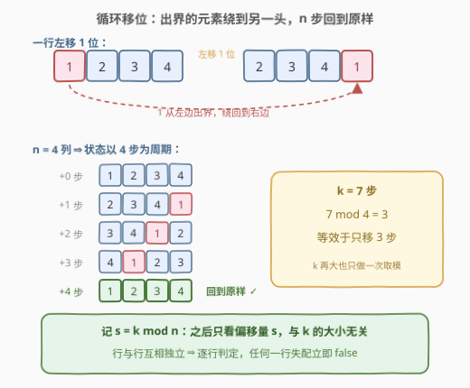
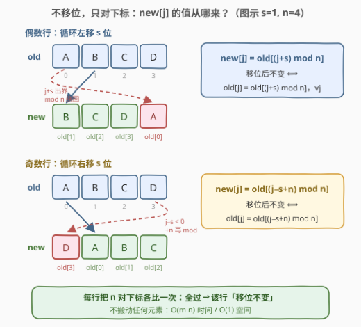
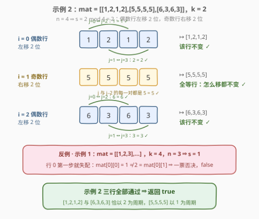

# LeetCode 循环移位后的矩阵相似检查 题解

## 1. 题目概述

- **标题 / 题号**：循环移位后的矩阵相似检查（#2946，easy）
- **链接**：https://leetcode.cn/problems/matrix-similarity-after-cyclic-shifts/
- **难度**：简单
- **标签**：数组、数学、矩阵、模拟

**题意**：给你一个下标从 0 开始、大小为 `m x n` 的整数矩阵 `mat` 和一个整数 `k`。进行下面操作 `k` 次：

- **偶数行**（0, 2, 4, ...）循环向左移动一位；
- **奇数行**（1, 3, 5, ...）循环向右移动一位。

如果经过 `k` 步后的最终矩阵与原始矩阵相同，则返回 `true`，否则返回 `false`。

**示例 1**：

```text
输入：mat = [[1,2,3],[4,5,6],[7,8,9]], k = 4
输出：false
解释：在每一步中，行 0 和行 2（偶数下标）进行左移，行 1（奇数下标）进行右移。
```

**示例 2**：

```text
输入：mat = [[1,2,1,2],[5,5,5,5],[6,3,6,3]], k = 2
输出：true
```

**示例 3**：

```text
输入：mat = [[2,2],[2,2]], k = 3
输出：true
解释：矩阵中的所有值都相等，即使进行循环移位，矩阵也会保持不变。
```

**约束**：

- $1 \le \text{mat.length} \le 25$
- $1 \le \text{mat[i].length} \le 25$
- $1 \le \text{mat[i][j]} \le 25$
- $1 \le k \le 50$

> 💡 读题先抓三个**关键字**：① **循环**——元素出界后绕到另一头，不丢弃；② **行独立**——操作从不跨行，行与行互不干扰；③ **k 步**——偶数行累计左移 `k` 位、奇数行累计右移 `k` 位。把这三点翻译成下标运算，本题就是一次纯遍历。

## 2. 解题思路

### 2.1 暴力思路：老实模拟 k 步

最直白的做法是把「操作」当真：复制一份矩阵，循环 `k` 次，每步对偶数行做一次「取出队头、追加到队尾」（左移一位），对奇数行做一次「取出队尾、插到队头」（右移一位）；`k` 步做完后与原矩阵逐格比较。时间复杂度 $O(k \cdot m \cdot n)$，本题 $k \le 50$、$m, n \le 25$，约 $3 \times 10^4$ 次操作，稳过——但既然每行做的都是**循环**移位，就有周期可挖。

### 2.2 核心观察：行独立 + $k \bmod n$ + 下标直接对比



三个观察层层递进：

1. **行独立**：操作不跨行，「最终矩阵 = 原矩阵」当且仅当**每一行**移位后都等于自己。任何一行失配即可立刻返回 `false`——判定粒度从矩阵降到行。
2. **$k \bmod n$ 规约**：长度为 $n$ 的行循环移位**以 $n$ 为周期**——左移 $n$ 位后每个元素都回到原位。所以左/右移 $k$ 位等价于左/右移 $s = k \bmod n$ 位。$k \le 50$ 时收益不大，但若 $k$ 高达 $10^9$，这一步就是从「会超时」到「秒过」的分水岭。
3. **不移位，只对下标**：根本不需要真的搬动元素。左移 $s$ 位后，新行第 $j$ 格装的是原行第 $(j+s) \bmod n$ 格的元素；右移 $s$ 位则是第 $(j-s+n) \bmod n$ 格。于是「移位后不变」直接翻译成一组**下标等式**：

$$\text{偶数行 } i：\ \mathtt{mat[i][j]} = \mathtt{mat[i][(j+s) \bmod n]},\quad \forall j$$

$$\text{奇数行 } i：\ \mathtt{mat[i][j]} = \mathtt{mat[i][(j-s+n) \bmod n]},\quad \forall j$$

> 💡 左移 $s$ 位和右移 $n-s$ 位是**同一件事**（都是把偏移量 $s$ 加到下标上），所以奇偶两种情况本质统一；但面试里分奇偶直写最不易错，统一写法留给 2.3 的彩蛋。

### 2.3 算法流程图



**完整步骤**：

1. **规约**：`s = k % n`，其中 `n` 为列数；
2. **双重循环**：遍历每一行 `i`、每一列 `j`；
3. **按下标奇偶定向**：`i` 为偶数（左移）取 `src = (j + s) % n`；`i` 为奇数（右移）取 `src = (j - s + n) % n`；
4. **对比**：`mat[i][j] != mat[i][src]` 立即返回 `false`；全部通过返回 `true`。

> ⚠️ `j - s + n` 中的 `+ n` 不是装饰：C++/Java 的 `%` 是**向零取整**，`j - s` 为负时取模结果也为负，越界访问。Python 的 `%` 结果与除数同号（天然非负），可以省掉，但写上 `+ n` 跨语言通用。

### 2.4 示例演算



以示例 2（`mat = [[1,2,1,2],[5,5,5,5],[6,3,6,3]]`, `k = 2`）为例，`n = 4`，`s = 2 % 4 = 2`：

| 行 $i$ | 行内容 | 奇偶 / 方向 | 需要成立的等式 | 核对 | 结果 |
|-------|--------|------------|----------------|------|------|
| 0 | `[1,2,1,2]` | 偶 / 左移 2 | $\text{mat}[0][j] = \text{mat}[0][(j+2)\%4]$ | $1{=}1,\ 2{=}2,\ 1{=}1,\ 2{=}2$ | ✓ |
| 1 | `[5,5,5,5]` | 奇 / 右移 2 | $\text{mat}[1][j] = \text{mat}[1][(j-2+4)\%4]$ | 全等，恒成立 | ✓ |
| 2 | `[6,3,6,3]` | 偶 / 左移 2 | $\text{mat}[2][j] = \text{mat}[2][(j+2)\%4]$ | $6{=}6,\ 3{=}3,\ 6{=}6,\ 3{=}3$ | ✓ |

三行全部通过，返回 `true` ✓。注意行 1 全等时**任何移位都不改变它**；行 0 和行 2 则是恰好以 2 为周期（`[1,2,1,2]` 左移两位还是自己）。

反观示例 1（`k = 4`, `n = 3`, `s = 1`）：第 0 行查 `mat[0][0] = mat[0][1]`，即 $1 \stackrel{?}{=} 2$，第一步就失配，返回 `false` ✓。

## 3. 参考代码

### C++

```cpp
class Solution {
  public:
    bool areSimilar(vector<vector<int>>& mat, int k) {
        int m = mat.size(), n = mat[0].size();
        int s = k % n;                          // 循环移位以 n 为周期
        for (int i = 0; i < m; ++i) {
            for (int j = 0; j < n; ++j) {
                // 偶数行左移 s：new[j] = old[(j+s)%n]
                // 奇数行右移 s：new[j] = old[(j-s+n)%n]
                int src = (i % 2 == 0) ? (j + s) % n : (j - s + n) % n;
                if (mat[i][j] != mat[i][src]) return false;
            }
        }
        return true;
    }
};
```

### Python

```python
class Solution:
    def areSimilar(self, mat: List[List[int]], k: int) -> bool:
        m, n = len(mat), len(mat[0])
        s = k % n
        for i, row in enumerate(mat):
            for j in range(n):
                src = (j - s) % n if i % 2 else (j + s) % n
                if row[j] != row[src]:
                    return False
        return True
```

> 💡 Python 切片一行流：左移 `s` 位的结果是 `row[s:] + row[:s]`，右移 `s` 位是 `row[-s:] + row[:-s]`（`s = 0` 时两者恰好都还原为 `row`，无陷阱）：
> ```python
> class Solution:
>     def areSimilar(self, mat: List[List[int]], k: int) -> bool:
>         k %= len(mat[0])
>         return all((r[k:] + r[:k] == r) if i % 2 == 0 else (r[-k:] + r[:-k] == r)
>                    for i, r in enumerate(mat))
> ```

## 4. 复杂度分析

| 维度 | 复杂度 | 说明 |
|------|--------|------|
| 时间复杂度 | $O(m \cdot n)$ | 每个格子恰好做一次下标换算与一次比较，`k % n` 是 $O(1)$ |
| 空间复杂度 | $O(1)$ | 只用 `s`、`src` 等常数个变量，矩阵原地判定 |

> ⚠️ 对比暴力模拟的 $O(k \cdot m \cdot n)$：本题数据小（$k \le 50$）二者都能过，但「先取模、再按下标直查」的写法对 $k$ 的规模**完全不敏感**——`k` 改成 $10^{18}$ 依然 $O(mn)$，这是面试中值得主动点出的稳健性。

## 5. 扩展：周期视角——一行「怎么移都不变」的充要条件

把 2.2 的下标等式再往深处推一步：$\text{old}[j] = \text{old}[(j+s) \bmod n]$ 对**所有** $j$ 成立，当且仅当该行以 $d = \gcd(s, n)$ 为**周期**——即每个「下标 $\bmod d$ 同余类」内部元素全等（映射 $j \mapsto (j+s) \bmod n$ 生成的轨道恰好就是 $j$ 所在的同余类）。

- **特例 $s = 0$**（`k` 是 `n` 的倍数）：$d = n$，任何行都满足——整体白移，直接返回 `true`；
- **特例 $d = 1$**（如 $n=2, s=1$）：行内所有元素必须相等——这正是示例 3 `[2,2]` 返回 `true` 的原因；
- 一般地，`[1,2,1,2]`（$n=4, s=2, d=2$）以 2 为周期，左右移 2 位都不动。

再往一维推广就是 [189. 轮转数组](https://leetcode.cn/problems/rotate-array/)：循环移位的三种实现（额外数组 / 三段反转 / 环状替换），其中三段反转做到 $O(1)$ 空间——本题因为「只判相等、不产出结果」，连搬元素都省了。

## 6. 面试要点

1. **为什么 `k` 可以先对 `n` 取模？**

   - 长度为 $n$ 的行循环移位 $n$ 位后**每个元素都回到原位**，状态以 $n$ 为周期
   - 于是左/右移 $k$ 位 ⟺ 左/右移 $k \bmod n$ 位；`k = 10^18` 也不慌

2. **为什么行与行可以独立判定？**

   - 操作只作用于单行内部、从不跨行；「矩阵相等」⟺「每一行移位后等于自己」
   - 所以逐行核对，任何一行失配立即 `false`，粒度从矩阵降到行

3. **`(j - s + n) % n` 里的 `+ n` 是防什么？**

   - C++/Java 的 `%` 向零取整：`j - s` 为负时结果为负，直接当下标是越界/UB
   - `s < n` 保证 `j - s + n ∈ (0, 2n)`，再 `% n` 落回合法区间；Python 的 `%` 天然非负可省

4. **左移和右移能统一吗？**

   - 能：左移 $s$ ⟺ 右移 $(n - s \bmod n) \bmod n$，都是给下标加偏移 $s$
   - 统一成「左移 $u$ 位」后奇偶行分别取 $u = s$ 与 $u = (n - s) \bmod n$，一个公式覆盖两种情况

5. **什么时候一行无论怎么移都不变？**

   - 充要条件：行以 $\gcd(s, n)$ 为周期（每个下标同余类内元素全等）
   - 两个好记的特例：$s \equiv 0 \pmod n$ 时任何行都不变；行内元素全等时对任何 $s$ 都不变

> 💡 **一句话总结**：行独立 ⇒ 逐行判定；循环移位以 $n$ 为周期 ⇒ `s = k % n`；「移位后不变」翻译成下标等式 `mat[i][j] == mat[i][(j±s+n) % n]` ⇒ 不搬元素、一次遍历、$O(mn)$ / $O(1)$ 收工。

## 同类练习题

| # | 题目 | 与本题的关联 |
|---|------|-------------|
| 189 | [轮转数组](https://leetcode.cn/problems/rotate-array/)（[题解](../0101-0200/189_轮转数组.md)） | 一维循环移位母题，三段反转实现 $O(1)$ 空间，本题的「单行版」 |
| 48 | [旋转图像](https://leetcode.cn/problems/rotate-image/)（[题解](../0001-0100/48_旋转图像.md)） | 矩阵下标映射的兄弟题，$(i,j) \mapsto (j,\ n-1-i)$ 与本题的 $(j \pm s) \bmod n$ 同属「算下标不动手」 |
| 566 | [重塑矩阵](https://leetcode.cn/problems/reshape-the-matrix/)（[题解](../0501-0600/566_重塑矩阵.md)） | 二维一维化下标互转，下标映射功夫的又一练 |
| 289 | [生命游戏](https://leetcode.cn/problems/game-of-life/)（[题解](../0201-0300/289_生命游戏.md)） | 矩阵原地模拟经典题，对照本题「连原地都懒得动」的取巧 |
