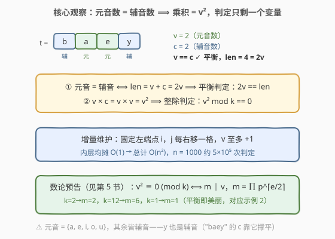
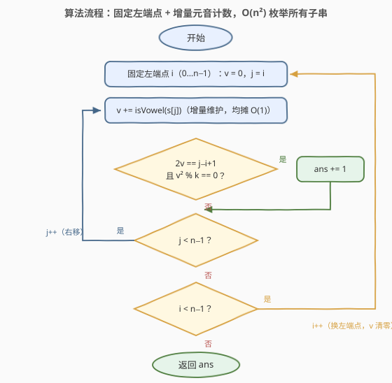
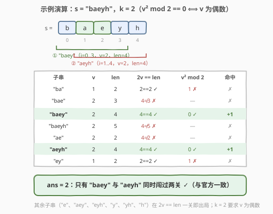

# LeetCode 统计美丽子字符串 I 题解

## 1. 题目概述

- **标题 / 题号**：统计美丽子字符串 I（#2947，medium）
- **链接**：https://leetcode.cn/problems/count-beautiful-substrings-i/
- **难度**：中等
- **标签**：字符串、哈希表、前缀和、枚举、数论

**题意**：给你一个字符串 `s` 和一个正整数 `k`。

用 `vowels` 和 `consonants` 分别表示字符串中元音字母和辅音字母的数量。如果某个字符串满足以下条件，则称其为**美丽字符串**：

- `vowels == consonants`，即元音字母和辅音字母的数量相等；
- `(vowels * consonants) % k == 0`，即元音字母和辅音字母的数量的乘积能被 `k` 整除。

返回字符串 `s` 中**非空美丽子字符串**的数量。子字符串是字符串中的一个连续字符序列。

英语中的**元音**字母为 `'a'`、`'e'`、`'i'`、`'o'` 和 `'u'`；**辅音**为除此之外的所有字母。

**示例 1**：

```text
输入：s = "baeyh", k = 2
输出：2
解释：字符串 s 中有 2 个美丽子字符串。
- 子字符串 "aeyh"：vowels = 2（["a","e"]），consonants = 2（["y","h"]）。
- 子字符串 "baey"：vowels = 2（["a","e"]），consonants = 2（["b","y"]）。
```

**示例 2**：

```text
输入：s = "abba", k = 1
输出：3
解释：3 个美丽子字符串为 "ab"、"ba"、"abba"。
```

**示例 3**：

```text
输入：s = "bcdf", k = 1
输出：0
解释：字符串 s 中没有美丽子字符串。
```

**约束**：

- $1 \le \text{s.length} \le 1000$
- $1 \le k \le 1000$
- `s` 仅由小写英文字母组成。

> 💡 本题核心是「**增量枚举 + 平方化简**」。两个关键观察把判定压缩到只剩一个计数变量：**元音数 = 辅音数时，子串长度必为 $2v$、乘积必为 $v^2$**——于是「平衡 + 整除」两条判据全部由元音个数 $v$ 一个变量表达，固定左端点后右端点右移时 $v$ 增量更新，$O(n^2)$ 收工。数论上 $v^2 \bmod k = 0$ 还可进一步化简为 $m \mid v$（$m = \prod p^{\lceil e/2 \rceil}$），这是第 5 节 $O(n)$ 解法通吃困难版 2949 的钥匙。

## 2. 解题思路

### 2.1 暴力思路：枚举所有子串，逐个重数

最直接的做法：枚举全部 $O(n^2)$ 个子串 $s[i..j]$，每个子串从头扫一遍数出元音数 `v` 和辅音数 `c`，再检查 `v == c` 与 `(v * c) % k == 0`。

单次检查 $O(n)$，总计 $O(n^3) \approx 5 \times 10^8$ 次字符比较（$n = 1000$），C++ 勉强能过、Python 必然超时。更本质的浪费在于：**相邻子串只差一个字符**——$s[i..j]$ 与 $s[i..j+1]$ 的元音数只差「$s[j+1]$ 是否元音」这一步，重扫整段毫无必要。

### 2.2 核心观察：平衡 ⟹ 乘积是平方数，一个计数变量走天下

**观察 1（平方化简）：设子串元音数为 $v$、辅音数为 $c$，则美丽条件可以全部改写成关于 $v$ 的判定。**

- 平衡条件 $v = c$ 成立时，子串长度 $\text{len} = v + c = 2v$；反过来 $2v = \text{len}$ 时 $c = \text{len} - v = v$。所以「元音 = 辅音」$\iff$ $2v = \text{len}$，**判定不再需要同时维护两个计数器**；
- 乘积条件 $v \times c = v \times v = v^2$，平衡时乘积自动是**完全平方数**，判定为 $v^2 \bmod k = 0$。

于是每个子串的美丽判定只剩两个关于 $v$ 的式子：$2v = \text{len}$ 且 $v^2 \bmod k = 0$。

**观察 2（增量维护）：固定左端点，右端点右移一格，$v$ 至多加一。**

枚举左端点 $i$，令 $j$ 从 $i$ 起右移：每进来一个字符，若是元音则 $v \leftarrow v + 1$，辅音则 $v$ 不变；$\text{len}$ 就是 $j - i + 1$，无需另行累加。内层均摊 $O(1)$，总体 $O(n^2)$，$n = 1000$ 时约 $5 \times 10^5$ 次判定，轻松通过。



**观察 3（数论化简，为第 5 节铺垫）：$v^2 \bmod k = 0 \iff m \mid v$。**

设 $k = \prod p^{e}$（质因数分解），则 $v^2 \equiv 0 \pmod k$ 要求每个质因子 $p$ 满足 $2 v_p(v) \ge e$，即 $v_p(v) \ge \lceil e/2 \rceil$。故令

$$m = \prod p^{\lceil e/2 \rceil}$$

（**最小的**使 $v^2 \bmod k = 0$ 的正整数 $v$），则整除条件等价于 $m \mid v$。例如 $k = 2 \to m = 2$（$v$ 必须是偶数，对应示例 1 中 $v = 1$ 的 `"ba"`、`"ey"` 被卡掉）；$k = 12 = 2^2 \cdot 3 \to m = 6$；$k = 1 \to m = 1$（乘积条件恒成立，平衡即美丽，对应示例 2）。

> 💡 一句话：**平衡把乘积压成平方、把长度压成 $2v$**——判定只剩元音计数 $v$ 一个变量；固定左端点增量维护 $v$，$O(n^2)$ 枚举所有子串。

### 2.3 算法流程图



**完整步骤**：

1. 初始化答案 `ans = 0`
2. 外层枚举左端点 $i$（$0 \sim n-1$）：`v = 0`
3. 内层 $j$ 从 $i$ 到 $n-1$：若 `s[j]` 是元音则 `v++`（增量维护）
4. 判定：$2v = j - i + 1$ 且 $v^2 \bmod k = 0$，成立则 `ans++`
5. 内层结束换下一个 $i$；外层结束返回 `ans`

### 2.4 示例演算

以示例 1 `s = "baeyh"`，`k = 2` 为例（此时 $v^2 \bmod 2 = 0 \iff v$ 为偶数）：

| 子串 | $v$（元音） | len | $2v = \text{len}$？ | $v^2 \bmod 2 = 0$？ | 命中 |
|------|------|-----|------|------|------|
| `"ba"` | 1 | 2 | $2 = 2$ ✓ | $1 \ne 0$ ✗ | ✗ |
| `"bae"` | 2 | 3 | $4 \ne 3$ ✗ | — | ✗ |
| `"baey"` | 2 | 4 | $4 = 4$ ✓ | $0$ ✓ | ✓ +1 |
| `"baeyh"` | 2 | 5 | $4 \ne 5$ ✗ | — | ✗ |
| `"ae"` | 2 | 2 | $4 \ne 2$ ✗（全元音不平衡） | — | ✗ |
| `"aeyh"` | 2 | 4 | $4 = 4$ ✓ | $0$ ✓ | ✓ +1 |
| `"ey"` | 1 | 2 | $2 = 2$ ✓ | $1 \ne 0$ ✗ | ✗ |

其余子串（`"e"`、`"aey"`、`"eyh"`、`"y"`、`"yh"`、`"h"`）在 $2v = \text{len}$ 一关即出局。最终 `ans = 2`，与官方答案一致 ✓。



顺带验证示例 2：`k = 1` 时 $m = 1$，乘积条件恒真，只需数平衡子串——`"ab"`、`"ba"`、`"abba"` 共 3 个 ✓；示例 3 中 `s` 全是辅音，$v$ 恒为 0，直接返回 0 ✓。

## 3. 参考代码

### C++

```cpp
class Solution {
    bool isVowel(char c) {
        return c == 'a' || c == 'e' || c == 'i' || c == 'o' || c == 'u';
    }
public:
    int beautifulSubstrings(string s, int k) {
        int n = s.size(), ans = 0;
        for (int i = 0; i < n; i++) {            // 枚举左端点
            int v = 0;                           // 子串 s[i..j] 的元音数
            for (int j = i; j < n; j++) {        // 右端点右移，增量维护
                v += isVowel(s[j]);
                if (v * 2 == j - i + 1 && v * v % k == 0)
                    ans++;
            }
        }
        return ans;
    }
};
```

### Python

```python
class Solution:
    def beautifulSubstrings(self, s: str, k: int) -> int:
        n, ans = len(s), 0
        for i in range(n):                       # 枚举左端点
            v = 0                                # 子串 s[i..j] 的元音数
            for j in range(i, n):                # 右端点右移，增量维护
                v += s[j] in 'aeiou'
                if v * 2 == j - i + 1 and v * v % k == 0:
                    ans += 1
        return ans
```

> 💡 两版逻辑一致。细节提醒：① `v * 2 == j - i + 1` 同时蕴含了「长度为偶数」与「元音 = 辅音」两件事，无需单独判奇偶；② $v \le 500$，`v * v` 最大 $2.5 \times 10^5$，`int` 不溢出；③ 若预处理出观察 3 的 $m$，判定可换成更快的 `v % m == 0`，但本题规模下没有区别。

## 4. 复杂度分析

| 维度 | 复杂度 | 说明 |
|------|--------|------|
| **时间复杂度** | $O(n^2)$ | 外层枚举 $n$ 个左端点，内层 $j$ 右移时 $v$ 增量更新均摊 $O(1)$；$n = 1000$ 时约 $\frac{n(n+1)}{2} \approx 5 \times 10^5$ 次判定 |
| **空间复杂度** | $O(1)$ | 只用 `v`、`ans` 等常数个变量 |

> ⚠️ 对比 2.1 的暴力：$O(n^3)$ 对每个子串从头重数元音，浪费在「相邻子串只差一个字符」上；增量维护把内层检查压到 $O(1)$。但 $O(n^2)$ 也到顶了——若 $n$ 放大到 $5 \times 10^4$（即困难版 2949），$2.5 \times 10^9$ 次判定必然超时，必须换 $O(n)$ 前缀和 + 哈希视角（见第 5 节）。

## 5. 扩展：O(n) 前缀和 + 双键哈希（通吃 2949 困难版）

[2949. 统计美丽子字符串 II](https://leetcode.cn/problems/count-beautiful-substrings-ii/) 把 $n$ 放大到 $5 \times 10^4$，$O(n^2)$ 超时。利用观察 3，可以像 525/974 那样做**前缀量配对计数**。

**把子串条件改写成「前缀量的差」。** 记 $V(p)$ 为前 $p$ 个字符中的元音数，位置 $p \in [0, n]$。子串 $(i, j]$（即 $s[i..j-1]$）满足：

- **平衡**：$V(j) - V(i) = (j - i) - (V(j) - V(i))$，即 $D(i) = D(j)$，其中 $D(p) = 2V(p) - p$（元音减辅音差的两倍）；
- **整除**：设子串元音数 $v = V(j) - V(i)$，条件 $m \mid v$ 等价于 $V(j) \equiv V(i) \pmod m$。

两个条件**各自独立**且都是「前缀量的差为零 / 模 $m$ 同余」，因此把 $(D(p),\ V(p) \bmod m)$ 打包成**双键**，从左到右扫一遍位置 $p$，每个位置与之前**同键**的位置两两配对即为美丽子串：

$$\text{ans} = \sum_{\text{key}} \binom{\text{cnt}[\text{key}]}{2}$$

实现上边扫边做：到达位置 $p$ 时先累加 `cnt[key]` 再自增，即自然完成组合数求和。$m$ 由 $k$ 质因数分解求得（$k \le 1000$，试除到 $\sqrt{k}$ 即可）。

```python
from collections import defaultdict

class Solution:
    def beautifulSubstrings(self, s: str, k: int) -> int:
        m, x, d = 1, k, 2                      # m = 最小 v 使 v² % k == 0
        while d * d <= x:
            if x % d == 0:
                e = 0
                while x % d == 0:
                    x //= d
                    e += 1
                m *= d ** ((e + 1) // 2)       # p^⌈e/2⌉
            d += 1
        if x > 1:                              # 剩余质因子指数为 1
            m *= x

        cnt = defaultdict(int)
        cnt[(0, 0)] = 1                        # 空前缀 p=0：D=0，V=0
        ans = V = 0
        for p, ch in enumerate(s, 1):
            V += ch in 'aeiou'
            key = (2 * V - p, V % m)           # 双键：平衡差值 + 元音数模 m
            ans += cnt[key]                    # 与之前同键位置两两配对
            cnt[key] += 1
        return ans
```

用示例 1 快速验证（$k=2, m=2$）：各位置键为 $p{=}0:(0,0)$、$p{=}1:(-1,0)$、$p{=}2:(0,1)$、$p{=}3:(1,0)$、$p{=}4:(0,0)$、$p{=}5:(-1,0)$——同键对恰为 $(0,4)$ 与 $(1,5)$，对应 `"baey"` 与 `"aeyh"`，答案 2 ✓。时间 $O(n)$、空间 $O(n)$，对 2947 与 2949 一份代码通吃。

> 💡 双键缺一不可：只留 $D$ 会把「平衡但 $m \nmid v$」的子串算进来（如 $k=2$ 时的 `"ba"`）；只留 $V \bmod m$ 会丢掉平衡约束（如 `"ae"`）。这与 974「前缀和模 $k$ 同余」、525「差值相等」是同一族套路——**当子串条件能拆成若干个前缀量的差分约束时，把每个约束编码成哈希键的一维即可**。

## 6. 面试要点

1. **为什么元音 = 辅音时，两条判定都只依赖元音计数 $v$ 一个变量？**

   - $v = c$ 时长度 $\text{len} = v + c = 2v$，反向也对：$2v = \text{len} \Rightarrow c = \text{len} - v = v$；乘积 $v \times c = v^2$ 自动是完全平方数。于是判定退化为 $(2v = \text{len}) \wedge (v^2 \bmod k = 0)$，内层只需维护一个计数器。注意 `y` 是**辅音**，别按拼音习惯误当元音。

2. **从 $O(n^3)$ 优化到 $O(n^2)$ 的关键一步是什么？**

   - 固定左端点 $i$ 后，右端点 $j$ 每右移一格，子串只新增一个字符，元音计数 $v$ 增量更新（元音则 +1），均摊 $O(1)$；长度就是 $j - i + 1$，连 len 都不用单独维护。避免了对每个子串从头重数。

3. **$v^2 \bmod k = 0$ 背后有什么数论结构？**

   - 设 $k = \prod p^e$，则 $v^2 \equiv 0 \pmod k \iff v_p(v) \ge \lceil e/2 \rceil$ 对每个质因子成立，即 $m = \prod p^{\lceil e/2 \rceil}$ 整除 $v$。$m$ 是使平方被 $k$ 整除的最小 $v$：$k = 8$ 时 $m = 4$（$v = 2$ 不行，$v = 4$ 行）；$k = 1$ 时 $m = 1$（条件恒真）。

4. **$O(n)$ 解法为什么用 $(D(p), V(p) \bmod m)$ 二维键，而不是单个前缀和？**

   - 两个条件必须同时满足，且各自是独立的前缀差分约束：平衡 $\iff D(i) = D(j)$，整除 $\iff V(i) \equiv V(j) \pmod m$。单独用任何一个键都会混入非法子串——只留 $D$ 会多算 `"ba"`（$k=2$），只留 $V \bmod m$ 会多算 `"ae"`。键的每一维对应一个差分约束，这是前缀配对计数的通用构造法。

5. **本题与 525 / 974 / 1248 这些前缀配对题是什么关系？**

   - 525「连续数组」是本题平衡键 $D$ 的鼻祖（0 当 $-1$ 数差值）；974「和可被 K 整除」是同余键 $V \bmod m$ 的模板（前缀和模 $k$ 配对）；本题把两个键**叠加**成二维键，是这一族套路的组合应用。1248 则展示「恰好型」用 atMost 差分的另一条路。

> 💡 **一句话总结**：平衡 ⟹ 长度 $2v$、乘积 $v^2$ ⟹ 判定只剩元音计数 $v$；增量枚举 $O(n^2)$ 通过本题，$m = \prod p^{\lceil e/2 \rceil}$ 化简 + 双键哈希 $O(n)$ 通吃困难版。

## 同类练习题

| # | 题目 | 与本题的关联 |
|---|------|-------------|
| 2949 | [统计美丽子字符串 II](https://leetcode.cn/problems/count-beautiful-substrings-ii/) | 同题面大 $n$ 版（$n \le 5 \times 10^4$），$O(n^2)$ 超时，本文第 5 节双键哈希原样平移 |
| 525 | [连续数组](https://leetcode.cn/problems/contiguous-array/)（[题解](../0501-0600/525_连续数组.md)） | 前缀差值哈希配对的母题（0 当 −1），本题的平衡键 $D$ 即其推广 |
| 974 | [和可被 K 整除的子数组](https://leetcode.cn/problems/subarray-sums-divisible-by-k/)（[题解](../0901-1000/974_和可被K整除的子数组.md)） | 前缀和模 $k$ 同余配对，本题的整除键 $V \bmod m$ 同款套路 |
| 1248 | [统计「优美子数组」](https://leetcode.cn/problems/count-number-of-nice-subarrays/)（[题解](../1201-1300/1248_统计优美子数组.md)） | 同为「前缀信息配对/恰好型」子串计数，atMost 差分与双键哈希两条路线的对照 |
