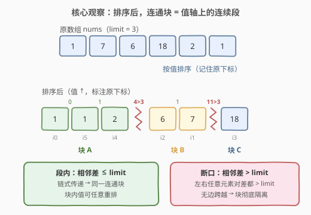
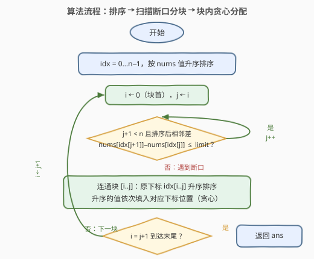
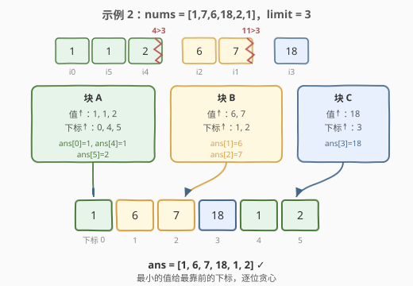

# 交换得到字典序最小的数组

- **题目名称**：交换得到字典序最小的数组
- **链接**：[2948. 交换得到字典序最小的数组](https://leetcode.cn/problems/make-lexicographically-smallest-array-by-swapping-elements/)
- **难度**：中等
- **标签**：并查集、数组、排序

## 1. 题目概述

给你一个下标从 **0** 开始的**正整数**数组 `nums` 和一个正整数 `limit`。

在一次操作中，你可以选择任意两个下标 $i$ 和 $j$，**如果**满足 $|nums[i] - nums[j]| \le limit$，则交换 $nums[i]$ 和 $nums[j]$。

返回执行任意次操作后能得到的**字典序最小的数组**。

如果在数组 $a$ 和数组 $b$ 第一个不同的位置上，数组 $a$ 中的对应元素比数组 $b$ 中的对应元素的字典序更小，则认为数组 $a$ 就比数组 $b$ 字典序更小。例如，数组 $[2,10,3]$ 比数组 $[10,2,3]$ 字典序更小，下标 $0$ 处是两个数组第一个不同的位置，且 $2 < 10$。

**示例 1**：

```text
输入：nums = [1,5,3,9,8], limit = 2
输出：[1,3,5,8,9]
解释：执行 2 次操作：
- 交换 nums[1] 和 nums[2]。数组变为 [1,3,5,9,8]。
- 交换 nums[3] 和 nums[4]。数组变为 [1,3,5,8,9]。
即便执行更多次操作，也无法得到字典序更小的数组。
```

**示例 2**：

```text
输入：nums = [1,7,6,18,2,1], limit = 3
输出：[1,6,7,18,1,2]
解释：执行 3 次操作：
- 交换 nums[1] 和 nums[2]。数组变为 [1,6,7,18,2,1]。
- 交换 nums[0] 和 nums[4]。数组变为 [2,6,7,18,1,1]。
- 交换 nums[0] 和 nums[5]。数组变为 [1,6,7,18,1,2]。
即便执行更多次操作，也无法得到字典序更小的数组。
```

**示例 3**：

```text
输入：nums = [1,7,28,19,10], limit = 3
输出：[1,7,28,19,10]
解释：[1,7,28,19,10] 是字典序最小的数组，因为不管怎么选择下标都无法执行操作。
```

**约束条件**：

- $1 \le \text{nums.length} \le 10^5$
- $1 \le \text{nums[i]} \le 10^9$
- $1 \le \text{limit} \le 10^9$

> 💡 本题核心是「**交换图建在值上 + 排序后只看相邻**」。可交换条件只依赖两个位置的**当前值**，于是把元素看成「值物品」：值差 $\le limit$ 的两个物品可对换，交换只在同一**值-连通块**内发生，每个块占据的下标集合是**不变量**，块内可任意重排。而值域上的连通性有个漂亮的性质——**排序后连通块必为连续段**：相邻差 $> limit$ 处即断口。剩下的事就是块内「值升序配下标升序」的贪心分配，$O(n \log n)$ 收工。

---

## 2. 解题思路

### 2.1 暴力思路：建图找连通块，块内重排

把每个下标看成一个节点，所有满足 $|nums[i] - nums[j]| \le limit$ 的下标对 $(i, j)$ 之间连一条边，得到「交换图」；同一连通块内的元素可以互相换到任意位置，块之间永远隔离。于是答案 = 每个连通块内把值升序分配给下标升序。

问题在建图成本：合法对可能有 $O(n^2)$ 个（例如 $limit$ 很大时**任意两点都有边**），$n = 10^5$ 时 $5 \times 10^9$ 次判边必然超时。瓶颈在于「值差条件」天然隐藏着**传递性**——绝大多数边是冗余的，我们只需要连通性，不需要显式的图。

### 2.2 核心观察：排序后连通块 = 值轴上的连续段

**观察 1（交换图建在「值」上，块占的下标集合是交换不变量）。**

可交换条件只看两个位置的**当前值**。把数组的每个元素抽象成一个「值物品」，初始放在各自下标的槽位里：一次操作 = 交换两个**值差 $\le limit$ 的物品**（无论它们此刻在哪个槽位）。注意值差 $\le limit$ 的两个物品属于同一连通关系，所以：

- **交换只发生在同一值-连通块内部**——交换两个物品不改变该块占据的槽位集合，也不改变任何物品的值，块的划分自始至终不变；
- 反过来，**不同块的物品永远无法交换**（跨块值差必 $> limit$）。

**观察 2（排序后，连通块 = 相邻差 $\le limit$ 的连续段）。**

将所有 $(值, 原下标)$ 对按值升序排列。设排序后相邻两个值为 $v_k \le v_{k+1}$：

- 若 $v_{k+1} - v_k > limit$：左边段内任意值 $\le v_k$、右边段内任意值 $\ge v_{k+1}$，**任意左右元素对的差都 $> limit$**，没有边跨过这里——这是一道**断口**，两侧连通块彻底隔离；
- 若 $v_{k+1} - v_k \le limit$：这两个值对应的物品直接相邻可交换，链式传递下整段连通。

于是 $O(n^2)$ 的判边塌缩成 $O(n)$ 次相邻比较——这正是暴力解法缺失的传递性：**排序后只看相邻就够了**。



**观察 3（块内可任意重排，字典序最小 = 值升序配下标升序）。**

连通块内部的物品通过「值差 $\le limit$」的邻接关系构成连通图，而**连通图的边对换可以生成任意排列**（对换沿路径把物品推移到目标位置，再把路径推回即可还原其余物品，数学上即：连通图的边对换生成全对称群 $S_m$）。所以每个块占据的下标集合上，可以摆出该块值的**任意排列**。

块与块之间完全独立（下标集合、值集合互不相交），全局字典序最小就是每块局部最优：把块内**值升序**依次填入块内**下标升序**的位置——最小的值给最靠前的下标，逐位贪心。

> 💡 一句话：**值差条件 ⇒ 连通性建在值上 ⇒ 排序后连通块 = 相邻差 $\le limit$ 的连续段 ⇒ 段内值升序配下标升序**。$O(n^2)$ 判边塌缩为 $O(n)$ 相邻比较。

### 2.3 算法流程图



**完整步骤**：

1. 构造下标数组 $idx$，按 $nums[idx[k]]$ 升序排序（值物品带上原下标）
2. $i \leftarrow 0$，从段首开始向右扩展：$j$ 不断右移，只要相邻差 $nums[idx[j+1]] - nums[idx[j]] \le limit$
3. $[i, j]$ 即一个连通块：取出其中的原下标并**升序排序**
4. 值已经是升序（$idx[i..j]$ 按值有序），把 $nums[idx[i+k]]$ 填入第 $k$ 小的下标
5. $i \leftarrow j + 1$，回到步骤 2 直到扫完；输出答案数组

### 2.4 示例演算

以示例 2 `nums = [1,7,6,18,2,1]`，`limit = 3` 为例。

**第一步：按值排序（记住原下标）**：

| 排序位 | 0 | 1 | 2 | 3 | 4 | 5 |
|--------|---|---|---|---|---|---|
| 值 | 1 | 1 | 2 | 6 | 7 | 18 |
| 原下标 | 0 | 5 | 4 | 2 | 1 | 3 |

**第二步：找断口**（相邻差与 $limit = 3$ 比较）：

- 差 $|1-1| = 0 \le 3$、$|2-1| = 1 \le 3$ → 连；$|6-2| = 4 > 3$ → ✂ **断口**
- $|7-6| = 1 \le 3$ → 连；$|18-7| = 11 > 3$ → ✂ **断口**

得到三个连通块：$\{1,1,2\}$（下标 $0,5,4$）、$\{6,7\}$（下标 $2,1$）、$\{18\}$（下标 $3$）。

**第三步：块内值升序配下标升序**：

| 连通块 | 值（升序） | 下标（升序） | 填入 |
|--------|-----------|--------------|------|
| A | $1, 1, 2$ | $0, 4, 5$ | $ans[0]{=}1,\ ans[4]{=}1,\ ans[5]{=}2$ |
| B | $6, 7$ | $1, 2$ | $ans[1]{=}6,\ ans[2]{=}7$ |
| C | $18$ | $3$ | $ans[3]{=}18$ |

最终 $ans = [1,6,7,18,1,2]$，与官方答案一致 ✓。



顺带验证示例 1：排序后 $[1,3,5 \mid 8,9]$，断口在 $8-5=3>2$ 处，两块分别分配得 $[1,3,5]$ 与 $ans[3]{=}8, ans[4]{=}9$，输出 $[1,3,5,8,9]$ ✓；示例 3 中所有相邻差 $6,9,9,21$ 均 $> 3$，五个块各含一个元素，数组原样返回 ✓。

---

## 3. 参考代码

### C++

```cpp
class Solution {
public:
    vector<int> lexicographicallySmallestArray(vector<int>& nums, int limit) {
        int n = nums.size();
        vector<int> idx(n);
        iota(idx.begin(), idx.end(), 0);
        sort(idx.begin(), idx.end(), [&](int a, int b) {
            return nums[a] < nums[b];            // 下标按值升序排
        });

        vector<int> ans(n);
        for (int i = 0; i < n; ) {
            int j = i;
            while (j + 1 < n && nums[idx[j + 1]] - nums[idx[j]] <= limit)
                j++;                             // [i, j] 为同一连通块（连续段）
            vector<int> pos(idx.begin() + i, idx.begin() + j + 1);
            sort(pos.begin(), pos.end());        // 块内原下标升序
            for (int k = 0; k <= j - i; k++)
                ans[pos[k]] = nums[idx[i + k]];  // 值升序配下标升序
            i = j + 1;
        }
        return ans;
    }
};
```

### Python

```python
class Solution:
    def lexicographicallySmallestArray(self, nums: List[int], limit: int) -> List[int]:
        n = len(nums)
        idx = sorted(range(n), key=lambda i: nums[i])   # 下标按值升序排

        ans = [0] * n
        i = 0
        while i < n:
            j = i
            while j + 1 < n and nums[idx[j + 1]] - nums[idx[j]] <= limit:
                j += 1                                  # [i, j] 为同一连通块
            pos = sorted(idx[i:j + 1])                  # 块内原下标升序
            for k, p in enumerate(pos):
                ans[p] = nums[idx[i + k]]               # 值升序配下标升序
            i = j + 1
        return ans
```

> 💡 两版逻辑一致。细节提醒：① 判断用**排序后相邻差** $nums[idx[j+1]] - nums[idx[j]]$，切勿误用原数组相邻差；② 段内值天然升序（$idx$ 按值排过），无需再排值，只排下标；③ $nums[i] \le 10^9$，差值用 `int` 即可，但求差前确保左边 $\le$ 右边（排序保证），避免绝对值处理。

---

## 4. 复杂度分析

| 维度 | 复杂度 | 说明 |
|------|--------|------|
| **时间复杂度** | $O(n \log n)$ | 值排序 $O(n \log n)$ 主导；扫描断口 $O(n)$；各块下标排序总计 $O(n \log n)$（每块 $\sum m_t \log m_t \le n \log n$） |
| **空间复杂度** | $O(n)$ | 下标数组 $idx$、临时下标表 `pos` 与答案数组（不计返回值则为 $O(n)$ 辅助） |

> ⚠️ 对比 2.1 的暴力：显式建交换图需 $O(n^2)$ 判边，$n = 10^5$ 时约 $5 \times 10^9$ 次比较必然超时。排序利用了「值差条件」的传递性——**排序后连通块必为连续段**，把判边压缩到相邻 $O(n)$ 次，这是本题从超时到 $O(n \log n)$ 的关键一跃。

---

## 5. 扩展：并查集写法与 1202 的对照

### 5.1 DSU 实现：排序后只并「相邻」

官方标签给了并查集——按观察 2，排序后**只需对相邻位置做 $O(n)$ 次 union**（相邻差 $\le limit$ 时合并），即可得到与显式建图完全相同的连通块划分，随后按根分组、组内值升序配下标升序：

```python
from collections import defaultdict

class Solution:
    def lexicographicallySmallestArray(self, nums: List[int], limit: int) -> List[int]:
        n = len(nums)
        fa = list(range(n))

        def find(x):
            while fa[x] != x:
                fa[x] = fa[fa[x]]          # 路径压缩
                x = fa[x]
            return x

        idx = sorted(range(n), key=lambda i: nums[i])
        for k in range(n - 1):             # 排序后只并相邻，O(n) 次 union
            if nums[idx[k + 1]] - nums[idx[k]] <= limit:
                fa[find(idx[k])] = find(idx[k + 1])

        groups = defaultdict(list)
        for i in range(n):                 # 按 i 升序遍历，组内下标天然升序
            groups[find(i)].append(i)

        ans = [0] * n
        for pos in groups.values():        # 每组：值升序配下标升序
            vals = sorted(nums[i] for i in pos)
            for i, v in zip(pos, vals):
                ans[i] = v
        return ans
```

主解法的一次线性扫描其实就是这个 DSU 结构的**隐式版本**——断口即并查集森林中不同树的分界。DSU 版多了常数与排序，但「排序 + 相邻合并」的写法可平移到任何「条件带传递性」的连通性问题。

### 5.2 与 1202「交换字符串中的元素」的对照

[1202. 交换字符串中的元素](https://leetcode.cn/problems/smallest-string-with-swaps/) 给定**下标对**列表，允许无条件交换这些下标——条件是**静态**的、直接建在下标上，DSU 按给定对合并即可。本题条件 $|nums[i] - nums[j]| \le limit$ 建在**值**上且随交换动态变化，初看更玄，但换到「值物品」视角后图反而变成静态的，且排序后只需看相邻。两题殊途同归：**连通块内自由重排 + 块间隔离**，然后块内贪心分配（1202 是拼接最小字符串，本题是最小数组）。

---

## 6. 面试要点

1. **交换条件依赖「当前值」，交换会改变邻接关系，为什么连通块划分却不变？**

   - 换到「值物品」视角：一次操作交换的是**值差 $\le limit$ 的两个物品**，而值差 $\le limit$ 的物品必属同一值-连通块。于是交换只发生在块内部——块内物品的值没变、占据的槽位集合也没变，块的划分自始至终静态不变；跨块交换因值差恒 $> limit$ 而永远非法。

2. **为什么排序后只需检查相邻差，而不是所有对？**

   - 断口正确性：若排序后相邻的 $v_k$ 与 $v_{k+1}$ 差 $> limit$，则左边任意值 $\le v_k$、右边任意值 $\ge v_{k+1}$，所有跨口元素对的差都 $> limit$，无边跨越，必为块边界；段内正确性：相邻差 $\le limit$ 的链把整段物品两两直接相连，链式传递保证连通。传递性使 $O(n^2)$ 判边塌缩为 $O(n)$。

3. **为什么连通块内可以实现任意排列？**

   - 块内物品按「值差 $\le limit$」构成连通图。连通图的边对换生成全对称群：要把物品 $x$ 换到槽位 $s$，沿 $x$ 到 $s$ 的路径逐边对换把 $x$ 推过去，再把路径上的其余物品沿反方向推回原位即可。归纳可得任意目标排列都可达成。

4. **贪心「值升序配下标升序」为什么全局最优？跨块会不会互相干扰？**

   - 不会。每个块占据的下标集合与值集合互不相交，块间排列完全独立，全局解 = 各块局部解的拼积。块内要让字典序最小，第 $k$ 小的下标必须拿第 $k$ 小的值（交换论证：若小的下标拿了大的值，与拿小值的更大下标对换后字典序严格变小）。

5. **本题与 1202 的本质区别是什么？DSU 分别建在什么上面？**

   - 1202 的交换条件是**静态下标对**（pairs 列表固定），DSU 直接建在下标上按给定对合并；本题条件是**动态的值差**（交换后各位置的值变了），需要换到值域视角——DSU 实际建在「值排序后的相邻关系」上。共同点：都是「连通块内自由重排 + 块间隔离」，再块内贪心。

> 💡 **一句话总结**：值差 $\le limit$ 的可交换条件 ⟹ 连通性建在值上 ⟹ 排序后连通块 = 相邻差 $\le limit$ 的连续段 ⟹ 段内值升序配下标升序，$O(n \log n)$ 完事；DSU 是同一结构的显式写法。

---

## 7. 同类练习题

- [1202. 交换字符串中的元素](https://leetcode.cn/problems/smallest-string-with-swaps/)（[题解](../1201-1300/1202_交换字符串中的元素.md)）：本题的「静态下标对」版，DSU 建在下标上，块内排序拼接最小字符串，与本文 5.2 节对照
- [2421. 好路径的数目](https://leetcode.cn/problems/number-of-good-paths/)（[题解](../2401-2500/2421_好路径的数目.md)）：按值升序渐增连边 + DSU，同款「值域排序后连通性只看局部」的思想
- [721. 账户合并](https://leetcode.cn/problems/accounts-merge/)（[题解](../0701-0800/721_账户合并.md)）：DSU 分组后组内排序输出的纯模板题，适合巩固「连通块 + 组内排序」骨架
- [1631. 最小体力消耗路径](https://leetcode.cn/problems/path-with-minimum-effort/)：按边权排序渐增连边判连通，与本题「排序后只看相邻」同为传递性压缩判边的思路
