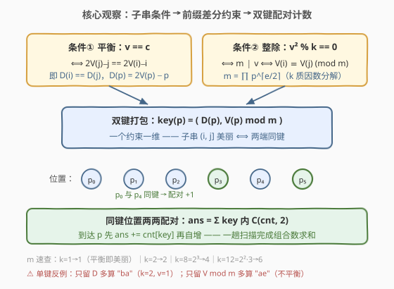
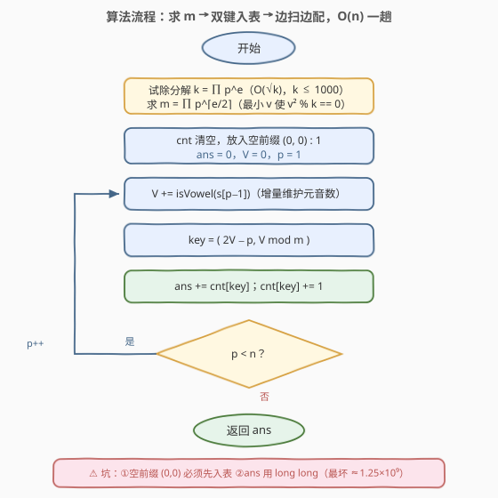
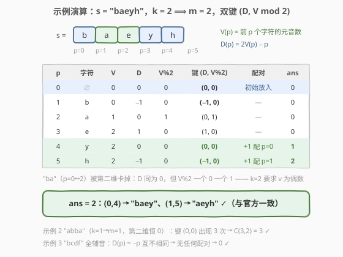

# LeetCode 统计美丽子字符串 II 题解

## 1. 题目概述

- **标题 / 题号**：统计美丽子字符串 II（#2949，hard）
- **链接**：https://leetcode.cn/problems/count-beautiful-substrings-ii/
- **难度**：困难
- **标签**：字符串、哈希表、前缀和、数论、数学

**题意**：给你一个字符串 `s` 和一个正整数 `k`。

用 `vowels` 和 `consonants` 分别表示字符串中元音字母和辅音字母的数量。如果某个字符串满足以下条件，则称其为**美丽字符串**：

- `vowels == consonants`，即元音字母和辅音字母的数量相等；
- `(vowels * consonants) % k == 0`，即元音字母和辅音字母的数量的乘积能被 `k` 整除。

返回字符串 `s` 中**非空美丽子字符串**的数量。子字符串是字符串中的一个连续字符序列。

英语中的**元音**字母为 `'a'`、`'e'`、`'i'`、`'o'` 和 `'u'`；**辅音**为除此之外的所有字母。

**示例 1**：

```text
输入：s = "baeyh", k = 2
输出：2
解释：字符串 s 中有 2 个美丽子字符串。
- 子字符串 "aeyh"：vowels = 2（["a","e"]），consonants = 2（["y","h"]）。
- 子字符串 "baey"：vowels = 2（["a","e"]），consonants = 2（["b","y"]）。
```

**示例 2**：

```text
输入：s = "abba", k = 1
输出：3
解释：3 个美丽子字符串为 "ab"、"ba"、"abba"。
```

**示例 3**：

```text
输入：s = "bcdf", k = 1
输出：0
解释：字符串 s 中没有美丽子字符串。
```

**约束**：

- $1 \le \text{s.length} \le 5 \times 10^4$
- $1 \le k \le 1000$
- `s` 仅由小写英文字母组成。

> 💡 本题是 [2947. 统计美丽子字符串 I](https://leetcode.cn/problems/count-beautiful-substrings-i/)（$n \le 1000$）的大 $n$ 版，题面完全相同。核心是两步化简：**数论上**把 $v^2 \bmod k = 0$ 收敛为 $m \mid v$（$m = \prod p^{\lceil e/2 \rceil}$，由 $k$ 质因数分解而来）；**结构上**把「平衡」「整除」两条子串判定各自改写成**前缀量的差分约束**，打包成双键 $(D(p),\ V(p) \bmod m)$，一趟扫描做**同键配对计数**——525「连续数组」与 974「和可被 K 整除」两套前缀哈希套路的合体，$O(n)$ 收工。

## 2. 解题思路

### 2.1 暴力思路：2947 的 O(n²) 增量枚举直接搬过来会怎样

[2947 题解](../2901-3000/2947_统计美丽子字符串I.md)的做法：固定左端点 $i$，右端点 $j$ 右移时**增量维护**元音数 $v$，判定 $2v = j-i+1$ 且 $v^2 \bmod k = 0$，总计 $O(n^2)$。

本题 $n$ 放大到 $5 \times 10^4$：$\frac{n(n+1)}{2} \approx 1.25 \times 10^9$ 次判定。就算单次判定只有几条指令，C++ 也要数秒、Python 直接爆炸——**枚举本身**就是瓶颈，判定再快也无济于事。必须换视角：不枚举子串，而是**枚举位置、让子串在「配对」中被动产生**。目标是 $O(n)$ 或 $O(n \log n)$。

### 2.2 核心观察：整除条件数论化简 + 子串条件差分化

**观察 1（数论化简）：$v^2 \bmod k = 0 \iff m \mid v$，其中 $m = \prod p^{\lceil e/2 \rceil}$。**

设 $k = \prod p^e$（质因数分解），则 $v^2 \equiv 0 \pmod k$ 要求每个质因子满足 $2 v_p(v) \ge e$，即 $v_p(v) \ge \lceil e/2 \rceil$。于是取

$$m = \prod p^{\lceil e/2 \rceil}$$

整除条件等价于 $m \mid v$。$m$ 是**最小的**使 $v^2 \bmod k = 0$ 的正整数 $v$（因 $2\lceil e/2 \rceil \ge e$，故 $k \mid m^2$）。速查：$k = 1 \to m = 1$（乘积条件恒真，平衡即美丽）；$k = 2 \to m = 2$（$v$ 须为偶数）；$k = 8 = 2^3 \to m = 4$（$v = 2$ 不行、$v = 4$ 行）；$k = 12 = 2^2 \cdot 3 \to m = 6$。$k \le 1000$，试除到 $\sqrt{k}$ 即可分解。

**观察 2（差分化）：两条子串条件都是「前缀量的差」。**

记 $V(p)$ 为**前 $p$ 个字符**中的元音数（$p \in [0, n]$），考虑子串 $(i, j]$（即 $s[i..j-1]$），其元音数 $v = V(j) - V(i)$、辅音数 $c = (j - i) - v$：

- **平衡** $v = c \iff 2v = j - i \iff 2V(j) - j = 2V(i) - i$，即 $D(i) = D(j)$，其中 $D(p) = 2V(p) - p$（元音减辅音差的两倍）；
- **整除** $m \mid v \iff V(j) - V(i) \equiv 0 \pmod m \iff V(j) \equiv V(i) \pmod m$。

两个条件**各自独立**、且都形如「前缀量在两端相等/同余」。这正是 525（差值相等）与 974（模 $k$ 同余）各自的套路——本题把两者**叠加**。

**观察 3（双键配对）：把 $(D(p),\ V(p) \bmod m)$ 打包成键，同键位置两两配对。**

子串 $(i, j]$ 美丽 $\iff$ 位置 $i$ 与 $j$ 的键完全相同。于是答案就是每个键内部位置的组合数：

$$\text{ans} = \sum_{\text{key}} \binom{\text{cnt}[\text{key}]}{2}$$

实现上不必先数完再算组合数：从左到右扫描，到达位置 $p$ 时先 `ans += cnt[key]`（与之前每个同键位置配一次对），再 `cnt[key] += 1`，即自然完成求和。注意**空前缀** $p = 0$（$D = 0$，$V = 0$）必须预先放入表中。



> 💡 一句话：**整除条件收敛成 $m \mid v$，两条判定差分成 $D$ 相等 + $V$ 同余，双键一包，配对计数**。键的每一维对应一个独立的差分约束——这是前缀配对计数的通用构造法。

### 2.3 算法流程图



**完整步骤**：

1. 试除法分解 $k$，求 $m = \prod p^{\lceil e/2 \rceil}$
2. 哈希表 `cnt` 清空，放入空前缀键 `(0, 0) = 1`；`ans = 0`，`V = 0`
3. $p$ 从 $1$ 到 $n$：`V += isVowel(s[p-1])`（增量维护元音数）
4. 计算 `key = (2V - p, V % m)`，执行 `ans += cnt[key]; cnt[key] += 1`
5. 扫描结束返回 `ans`

### 2.4 示例演算

以示例 1 `s = "baeyh"`，`k = 2` 为例：$m = 2$，双键为 $(D,\ V \bmod 2)$。逐位置计算：

| $p$ | 字符 | $V(p)$ | $D = 2V - p$ | $V \bmod 2$ | 键 | 配对 | ans |
|-----|------|--------|--------------|-------------|------------|------|-----|
| 0 | ∅ | 0 | 0 | 0 | (0, 0) | 初始放入 | 0 |
| 1 | b | 0 | −1 | 0 | (−1, 0) | — | 0 |
| 2 | a | 1 | 0 | 1 | (0, 1) | — | 0 |
| 3 | e | 2 | 1 | 0 | (1, 0) | — | 0 |
| 4 | y | 2 | 0 | 0 | **(0, 0)** | 配 $p{=}0$ → "baey" | 1 |
| 5 | h | 2 | −1 | 0 | **(−1, 0)** | 配 $p{=}1$ → "aeyh" | 2 |

同键对恰为 $(0, 4)$ 与 $(1, 5)$，对应子串 `"baey"`（$v=2$ 偶，平衡）与 `"aeyh"`，`ans = 2` ✓。注意 $"ba"$（$p{=}0$ 与 $p{=}2$，$D$ 同为 0 但 $V \bmod 2$ 一个 0 一个 1）被第二维键卡掉——正是 $k=2$ 要求 $v$ 为偶数的体现。



顺带验证示例 2：`"abba"`，$k = 1 \to m = 1$（第二维恒 0，退化为只看 $D$）。各位置键：$p{=}0:(0,0)$、$p{=}1:(1,0)$、$p{=}2:(0,0)$、$p{=}3:(-1,0)$、$p{=}4:(0,0)$——键 $(0,0)$ 出现 3 次，$\binom{3}{2} = 3$ 对：$(0,2)$→`"ab"`、$(2,4)$→`"ba"`、$(0,4)$→`"abba"` ✓。示例 3 全辅音，$D(p) = -p$ 互不相同，0 对 ✓。

## 3. 参考代码

### C++

```cpp
class Solution {
    bool isVowel(char c) {
        return c == 'a' || c == 'e' || c == 'i' || c == 'o' || c == 'u';
    }
public:
    long long beautifulSubstrings(string s, int k) {
        long long m = 1, x = k;                    // m = 最小 v 使 v² % k == 0
        for (int d = 2; (long long)d * d <= x; d++) {
            if (x % d == 0) {
                int e = 0;
                while (x % d == 0) { x /= d; e++; }
                for (int t = 0; t < (e + 1) / 2; t++) m *= d;  // p^⌈e/2⌉
            }
        }
        if (x > 1) m *= x;                         // 剩余大质因子（指数 1）

        unordered_map<long long, int> cnt;
        cnt[0] = 1;                                // 空前缀 p=0：(D,r)=(0,0) 编码为 0
        long long ans = 0, V = 0;
        for (int p = 1; p <= (int)s.size(); p++) {
            V += isVowel(s[p - 1]);
            long long key = (2 * V - p) * 1001 + V % m;  // r=V%m < m ≤ k ≤ 1000，单射
            ans += cnt[key]++;                     // 先配对再入表
        }
        return ans;
    }
};
```

### Python

```python
from collections import defaultdict

class Solution:
    def beautifulSubstrings(self, s: str, k: int) -> int:
        m, x, d = 1, k, 2                          # m = 最小 v 使 v² % k == 0
        while d * d <= x:
            if x % d == 0:
                e = 0
                while x % d == 0:
                    x //= d
                    e += 1
                m *= d ** ((e + 1) // 2)           # p^⌈e/2⌉
            d += 1
        if x > 1:                                  # 剩余质因子指数为 1
            m *= x

        cnt = defaultdict(int)
        cnt[(0, 0)] = 1                            # 空前缀 p = 0
        ans = V = 0
        for p, ch in enumerate(s, 1):
            V += ch in 'aeiou'
            key = (2 * V - p, V % m)               # 双键：平衡差 + 元音数模 m
            ans += cnt[key]                        # 与之前所有同键位置配对
            cnt[key] += 1
        return ans
```

> 💡 两版逻辑一致，均对三个示例验证通过。细节提醒：① **返回值用 `long long`**——最坏 $n+1$ 个位置全同键时 $\binom{50001}{2} \approx 1.25 \times 10^9$，已逼近 `int` 上限，而官方签名本来就是 `long long`；② C++ 把二元组编码成 `D * 1001 + r`（$r = V \bmod m < m \le k \le 1000$），两对键若编码相等则 $(D_1 - D_2) \times 1001 = r_2 - r_1$，右边绝对值小于 1001，只能 $D_1 = D_2,\ r_1 = r_2$，单射无碰撞；③ 这份代码**原样能过 2947**，一份代码通吃两题。

## 4. 复杂度分析

| 维度 | 复杂度 | 说明 |
|------|--------|------|
| **时间复杂度** | $O(n + \sqrt{k})$ | 试除分解 $k$ 只到 $\sqrt{k} \le 32$；主循环一趟 $n$ 次，每次哈希表查询/插入均摊 $O(1)$ |
| **空间复杂度** | $O(n)$ | 哈希表最多存 $n + 1$ 个键（位置 $p = 0 \sim n$）；$D \in [-n, n]$、$V \bmod m < 1000$，键空间虽大但实际条目数不超过位置数 |

> ⚠️ 对比 2.1：$O(n^2)$ 枚举 $\approx 1.25 \times 10^9$ 次判定必然超时；本解法每个位置只做一次哈希操作，$n = 5 \times 10^4$ 时约 $10^5$ 次表操作，快了四个数量级。换来的是：子串不再被显式枚举，而是作为「同键位置对」被**计数**——用组合数 $\binom{c}{2}$ 一次吞掉一个键内的全部 $c$ 对。

## 5. 扩展：前缀状态配对的三部曲——525 / 974 / 1371 / 2949

把「前缀量 + 哈希 + 配对/查询」看作一族套路，本题恰好是集大成者：

| 题目 | 子串约束 | 前缀状态 | 用状态做什么 |
|------|----------|----------|--------------|
| 525 连续数组 | 0 与 1 个数相等 | $D(p)$（0 当 $-1$ 的差值） | 同状态配对计数 |
| 974 和可被 K 整除 | 区间和 $\equiv 0 \pmod k$ | 前缀和 $\bmod k$ | 同余配对计数 |
| 1371 元音偶数次 | 五种元音均出现偶数次 | 五维奇偶性打包成 5-bit 掩码 | **同状态求最远距离**（最长子串） |
| **2949 本题** | 平衡 **且** $m \mid v$ | $(D(p),\ V(p) \bmod m)$ 二元组 | 同状态配对计数 |

三个启示：**① 状态设计 = 把子串约束编码成「前缀状态的函数」**——约束 $\iff$ 两端状态相等（525/2949）、同余（974）、按位异或为零（1371）；**② 多个独立约束就堆叠成多维状态**，本题两维、1371 五维（压成一个 32 位整数）；**③ 同一张状态表既能计数（配对）也能求最长（首现位置）**——把 `cnt[key] += 1` 换成 `first[key] = min(first[key], p)` 就从计数器变成了 1371 的最长距离 tracker。

顺带一提，官方 hints 走的是另一条路：先枚举所有满足 $x^2 \bmod k = 0$ 的 $x$（即 $m$ 的倍数，不超过 $n/2$ 个），再对每个 $x$ 统计「元音 = 辅音 = $x$」的子串数。本质仍是前缀配对，但按 $x$ 分组要多套一层循环，且需要「长度为 $2x$ 且元音为 $x$」这类更绕的约束拆解；双键法一步到位，更值得作为模板记住。

## 6. 面试要点

1. **2947 的 $O(n^2)$ 增量枚举为什么在这里失效？瓶颈在判定还是枚举？**

   - 瓶颈在**枚举**：$n = 5 \times 10^4$ 时有 $\approx 1.25 \times 10^9$ 个子串，哪怕判定 $O(1)$ 也超时。所以优化方向不是「更快地判定每个子串」，而是**根本不逐个枚举子串**——把子串计数转化为「位置对」计数，用哈希配对 + 组合数一次算清一群。

2. **$v^2 \bmod k = 0$ 如何化简？$m$ 为什么是「最小」的？**

   - 设 $k = \prod p^e$，则 $v^2 \equiv 0 \pmod k \iff v_p(v) \ge \lceil e/2 \rceil$ 对每个质因子成立 $\iff m = \prod p^{\lceil e/2 \rceil}$ 整除 $v$。最小性：$m^2 = \prod p^{2\lceil e/2 \rceil}$ 且 $2\lceil e/2 \rceil \ge e$，故 $k \mid m^2$，即 $v = m$ 本身已满足；任何 $v < m$ 必有某质因子次数不足。反例直觉：$k = 8 = 2^3$ 时 $v = 2$（$v^2 = 4$）不行，$v = 4$（$v^2 = 16$）才行——因为平方把每个质因子次数**翻倍**，$\lceil e/2 \rceil$ 正是翻倍后够到 $e$ 的最低门槛。

3. **为什么双键 $(D, V \bmod m)$ 缺一不可？**

   - 两个条件必须同时满足且各自独立：只留 $D$ 会把「平衡但 $m \nmid v$」的子串算进来（$k=2$ 时 $"ba"$：$D$ 两端相等、平衡，但 $v = 1$ 奇数，$v^2 = 1$ 不被 2 整除）；只留 $V \bmod m$ 会丢掉平衡约束（$"ae"$：两端 $V \bmod 2$ 同为... 不妨看 $"ae"$ 本身 $v=2$ 偶、但 $c = 0$ 不平衡）。**键的每一维对应一个差分约束，约束一个都不能少**——这是前缀配对计数的通用构造原则。

4. **边扫边 `ans += cnt[key]` 为什么恰好等于 $\sum \binom{\text{cnt}}{2}$？**

   - 到达位置 $p$ 时，`cnt[key]` 恰是**之前**同键位置的个数，累加即与它们逐个配对；随后自增把自己登记进表。每个同键二元组 $(i, j)$ 恰在**后到者** $j$ 扫描到时被计一次，不多不少。等价于每键最终 $\binom{c}{2}$ 对，但省去了第二次遍历。

5. **实现上有哪些坑？**

   - ① 空前缀 $p = 0$（键 $(0,0)$）必须先放入，否则所有以 $s[0]$ 开头的美丽子串（如示例 1 的 $"baey"$）全部漏计；② 返回值用 64 位：最坏全同键 $\binom{n+1}{2} \approx 1.25 \times 10^9$ 逼近 `int` 上限；③ C++ 的 `unordered_map` 不接受 `pair`，用 `D * 1001 + r` 编码成整数（$r < m \le 1000$ 保证单射），或者自定义哈希；④ `y` 是辅音，别按拼音习惯误当元音。

> 💡 **一句话总结**：$v^2 \bmod k = 0$ 数论化简为 $m \mid v$（$m = \prod p^{\lceil e/2 \rceil}$），平衡与整除两条判定差分成 $D$ 相等 + $V$ 同余，双键打包一趟扫描配对计数——525 + 974 的合体技，$O(n)$ 通吃 2947/2949。

## 同类练习题

| # | 题目 | 与本题的关联 |
|---|------|-------------|
| 2947 | [统计美丽子字符串 I](https://leetcode.cn/problems/count-beautiful-substrings-i/)（[题解](../2901-3000/2947_统计美丽子字符串I.md)） | 同题面小 $n$ 版（$n \le 1000$），$O(n^2)$ 增量枚举即可，本文第 5 节的双键代码原样平移通吃 |
| 525 | [连续数组](https://leetcode.cn/problems/contiguous-array/)（[题解](../0501-0600/525_连续数组.md)） | 前缀差值配对计数的母题（0 当 $-1$），本题平衡键 $D$ 即其推广 |
| 974 | [和可被 K 整除的子数组](https://leetcode.cn/problems/subarray-sums-divisible-by-k/)（[题解](../0901-1000/974_和可被K整除的子数组.md)） | 前缀和模 $k$ 同余配对，本题整除键 $V \bmod m$ 同款套路 |
| 1371 | [每个元音包含偶数次的最长子字符串](https://leetcode.cn/problems/find-the-longest-substring-containing-vowels-in-even-counts/)（[题解](../1301-1400/1371_每个元音包含偶数次的最长子字符串.md)） | 五维奇偶状态压成 bitmask 求**最长**，与本题「状态配对求**计数**」互为镜像 |
| 1248 | [统计「优美子数组」](https://leetcode.cn/problems/count-number-of-nice-subarrays/)（[题解](../1201-1300/1248_统计优美子数组.md)） | 同为前缀信息配对的子串计数，atMost 差分与前缀哈希两条路线的对照 |
