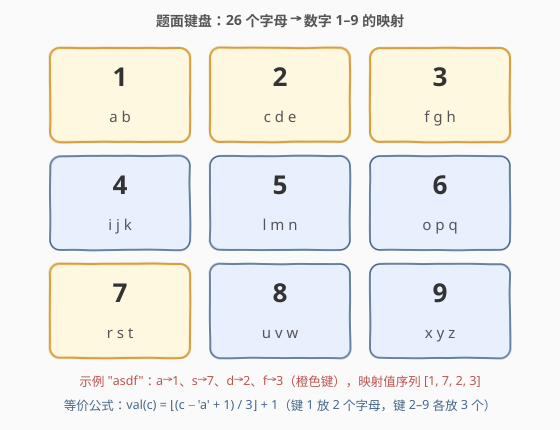
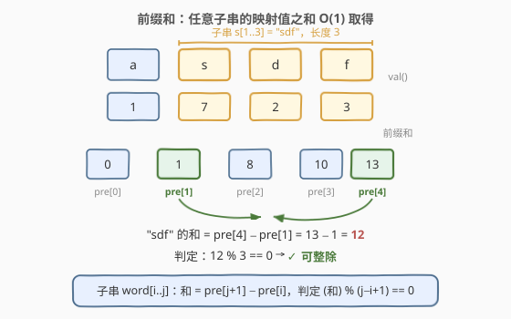
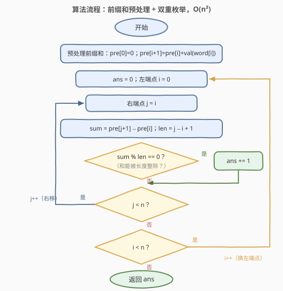
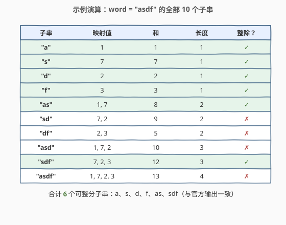

# 可整除子串的数量

- **题目名称**：可整除子串的数量
- **链接**：[2950. 可整除子串的数量](https://leetcode.cn/problems/number-of-divisible-substrings/)
- **难度**：中等
- **标签**：哈希表、字符串、计数、前缀和

## 1. 题目概述

> ⚠️ 本题为 LeetCode 付费题，题意描述根据官方示例用例与 hints 重建，可能与官方题面有出入。（题面与字母映射已用官方三个示例及多份过题代码交叉核对。）

按老式电话键盘的样式，26 个小写英文字母被映射到数字 $1 \sim 9$：**键 1 放 2 个字母，键 2–9 各放 3 个字母**，即

| 数字 | 1 | 2 | 3 | 4 | 5 | 6 | 7 | 8 | 9 |
|------|---|---|---|---|---|---|---|---|---|
| 字母 | a b | c d e | f g h | i j k | l m n | o p q | r s t | u v w | x y z |

如果字符串中**每个字符的映射值之和能被字符串长度整除**，则称该字符串是**可整除的**（divisible）。

给定字符串 `word`，返回其中**可整分子字符串**的数量。子字符串是字符串中连续的非空字符序列。

**示例 1**：

```text
输入：word = "asdf"
输出：6
解释：a→1、s→7、d→2、f→3。10 个子串中恰好 6 个可整除：
"a"(1/1)、"s"(7/1)、"d"(2/1)、"f"(3/1)、"as"(8/2)、"sdf"(12/3)。
```

**示例 2**：

```text
输入：word = "bdh"
输出：4
解释：4 个可整分子串为 "b"、"d"、"h"、"bdh"（b=1、d=2、h=3，和 6 能被长度 3 整除）。
```

**示例 3**：

```text
输入：word = "abcd"
输出：6
解释：6 个可整分子串为 "a"、"b"、"c"、"d"、"ab"(1+1=2, 2/2)、"cd"(2+2=4, 4/2)。
```

**约束条件**：

- $1 \le \text{word.length} \le 2000$
- `word` 仅由小写英文字母组成。



> 💡 本题核心是「**前缀和 + 整除判定**」。值域只有 $1 \sim 9$、$n \le 2000$：先用前缀和把任意子串的映射值之和压到 $O(1)$ 取得，再 $O(n^2)$ 枚举全部子串即可通过（官方 hints 即此路线）；更进一步，**「和能被长度整除」⟺「平均值是 $1 \sim 9$ 中的某个整数」**，把整除判定改写成 9 次「和为 0 的子数组计数」，用前缀和 + 哈希可以做到 $O(9n)$，见第 5 节。

---

## 2. 解题思路

### 2.1 暴力思路：枚举所有子串，逐个重扫求和

最直接的做法：枚举全部 $O(n^2)$ 个子串 `word[i..j]`，每个子串从头扫一遍累加映射值，再检查 $\text{sum} \bmod \text{len} == 0$。

单次求和 $O(n)$，总计 $O(n^3) \approx 8 \times 10^9$（$n = 2000$），必然超时。更本质的浪费在于：**相邻子串只差一个字符**——`word[i..j]` 与 `word[i..j+1]` 的和只差 $\text{val}(word[j+1])$ 一步，重扫整段毫无必要。

### 2.2 核心观察：前缀和让任意子串求和变 O(1)

**观察 1（映射的公式化）**：26 个字母按「键 1 放 2 个、键 2–9 各放 3 个」分组，等价于一个整除公式

$$\text{val}(c) = \left\lfloor \frac{c - \texttt{'a'} + 1}{3} \right\rfloor + 1$$

代入验证：$a \to 1$、$s \to 7$、$d \to 2$、$f \to 3$，与示例 1 官方表格逐一吻合。

> ⚠️ **整除语义坑**：社区流传的紧凑写法 $\lfloor (c - \texttt{'c'}) / 3 \rfloor + 2$ 在 Python 中成立（负数向下取整），但 C++/Java 的整数除法**向零截断**：$(\texttt{'a'} - \texttt{'c'}) / 3 = -2/3$ 在 C++ 里得 $0$ 而不是 $-1$，会把 `a`、`b` 错映射成 2。用分子恒非负的上式（或直接打 26 长度的查找表）最稳。

**观察 2（前缀和）**：令 $pre[0] = 0$，$pre[i+1] = pre[i] + \text{val}(word[i])$，则子串 $word[i..j]$ 的映射值之和为 $pre[j+1] - pre[i]$，配合长度 $j - i + 1$，整除判定只要 $O(1)$：

$$\left(pre[j+1] - pre[i]\right) \bmod \left(j - i + 1\right) == 0$$



**观察 3（量级预算）**：$n \le 2000$ 时子串总数 $\frac{n(n+1)}{2} \approx 2 \times 10^6$，每对 $(i, j)$ 只做一次减法、取模，总计远低于 $10^8$ 的运算预算，$O(n^2)$ 稳定通过。

> 💡 一句话：**预处理 $O(n)$ 前缀和，枚举 $O(n^2)$ 对端点，每对 $O(1)$ 判定**——这就是官方 hints 指定的路线（hints 原文：先 $O(n^2)$ 枚举子串，再用 partial sum 把每个子串的求和压到 $O(1)$）。

### 2.3 算法流程图



**完整步骤**：

1. 预处理前缀和数组：`pre[0] = 0`，`pre[i+1] = pre[i] + val(word[i])`
2. `ans = 0`，外层枚举左端点 $i$（$0 \sim n-1$）
3. 内层 $j$ 从 $i$ 到 $n-1$：`sum = pre[j+1] - pre[i]`，`len = j - i + 1`
4. 若 `sum % len == 0` 则 `ans++`
5. 内层结束换下一个 $i$；外层结束返回 `ans`

### 2.4 示例演算

以示例 1 `word = "asdf"` 为例（映射值序列 $[1, 7, 2, 3]$，前缀和 $[0, 1, 8, 10, 13]$）：

| 子串 | 映射值 | 和 | 长度 | 整除？ |
|------|--------|----|------|--------|
| `"a"` | 1 | 1 | 1 | ✓ |
| `"s"` | 7 | 7 | 1 | ✓ |
| `"d"` | 2 | 2 | 1 | ✓ |
| `"f"` | 3 | 3 | 1 | ✓ |
| `"as"` | 1, 7 | 8 | 2 | ✓ |
| `"sd"` | 7, 2 | 9 | 2 | ✗ |
| `"df"` | 2, 3 | 5 | 2 | ✗ |
| `"asd"` | 1, 7, 2 | 10 | 3 | ✗ |
| `"sdf"` | 7, 2, 3 | 12 | 3 | ✓ |
| `"asdf"` | 1, 7, 2, 3 | 13 | 4 | ✗ |

命中 6 个：`"a"`、`"s"`、`"d"`、`"f"`、`"as"`、`"sdf"`，与官方输出一致 ✓。



顺带验证示例 2：`b=1、d=2、h=3`，单字符 3 个全中，`"bdh"` 和为 $6$ 能被 $3$ 整除再 +1，`"bd"`、`"dh"` 分别为 $3$、$5$ 均不被 $2$ 整除，共 $4$ ✓；示例 3：`a=1、b=1、c=2、d=2`，单字符 4 个 + `"ab"`$(2/2)$ + `"cd"`$(4/2)$，而 `"bc"`$=3$ 为奇数出局，共 $6$ ✓。

---

## 3. 参考代码

### C++

```cpp
class Solution {
public:
    int countDivisibleSubstrings(string word) {
        int n = word.size();
        vector<int> pre(n + 1, 0);                       // pre[i] = 前 i 个字符映射值之和
        for (int i = 0; i < n; i++) {
            char c = word[i];
            pre[i + 1] = pre[i] + (c - 'a' + 1) / 3 + 1; // 分子恒非负，跨语言安全
        }
        int ans = 0;
        for (int i = 0; i < n; i++)                      // 枚举子串 word[i..j]
            for (int j = i; j < n; j++)
                if ((pre[j + 1] - pre[i]) % (j - i + 1) == 0)
                    ans++;
        return ans;
    }
};
```

### Python

```python
class Solution:
    def countDivisibleSubstrings(self, word: str) -> int:
        n = len(word)
        pre = [0] * (n + 1)                              # pre[i] = 前 i 个字符映射值之和
        for i, ch in enumerate(word):
            pre[i + 1] = pre[i] + (ord(ch) - ord('a') + 1) // 3 + 1
        ans = 0
        for i in range(n):                               # 枚举子串 word[i..j]
            for j in range(i, n):
                if (pre[j + 1] - pre[i]) % (j - i + 1) == 0:
                    ans += 1
        return ans
```

> 💡 两版逻辑一致。细节提醒：① 映射公式**分子恒非负**（$c - \texttt{'a'} + 1 \ge 1$），C++/Python 语义一致；若改用 $(c - \texttt{'c'})/3 + 2$ 务必警惕 C++ 负数除法向零截断；② 答案上限 $\frac{n(n+1)}{2} \approx 2 \times 10^6$，`int` 足够；③ 固定左端点、右端点右移时**增量累加**当前和也可以（省掉 pre 数组、空间 $O(1)$），但前缀和把「预处理」与「枚举」解耦，更贴合第 5 节的 $O(9n)$ 扩展。

---

## 4. 复杂度分析

| 维度 | 复杂度 | 说明 |
|------|--------|------|
| **时间复杂度** | $O(n^2)$ | 预处理 $O(n)$；枚举 $\frac{n(n+1)}{2} \approx 2 \times 10^6$ 对 $(i, j)$，每对一次减法 + 取模 |
| **空间复杂度** | $O(n)$ | 前缀和数组 `pre`（改用增量累加可降到 $O(1)$） |

> ⚠️ 对比 2.1 的暴力：$O(n^3)$ 把时间浪费在「每个子串从头重扫」上，前缀和把单次求和压到 $O(1)$。$n \le 2000$ 时 $O(n^2)$ 从容通过；若 $n$ 放大到 $10^5$ 量级，$O(n^2)$ 的 $10^{10}$ 次判定不可行，需要第 5 节的 $O(9n)$ 视角。

---

## 5. 扩展：平均值整数化 + 前缀和哈希，O(9n) 通吃

**观察 4（值域收缩）**：每个映射值 $\text{val} \in [1, 9]$，于是长度为 $L$ 的子串之和 $\text{sum} \in [L, 9L]$。当 $L \mid \text{sum}$ 时商 $\text{sum}/L$ 必落在 $[1, 9]$ 内，即

$$L \mid \text{sum} \iff \exists\, d \in \{1, \dots, 9\}:\ \text{sum} = L \cdot d \iff \sum_{k} \left(\text{val}_k - d\right) = 0$$

**整除判定被改写成了「和为 0 的子数组计数」**——这正是 [560. 和为 K 的子数组](https://leetcode.cn/problems/subarray-sum-equals-k/) 的 $K = 0$ 特例：前缀和 + 哈希表一遍扫描，相同前缀和两两配对。

**会不会重复计数？** 不会。一个子串的和与长度都是定值，其平均值 $\text{sum}/L$ 若为整数则**唯一**，只会在 $d = \text{sum}/L$ 那一轮被计入，9 轮之间互不重叠。对每个 $d \in [1, 9]$ 把数组变换为 $\text{val}_k - d$，统计前缀和相等的位置对即可：

```python
from collections import defaultdict

class Solution:
    def countDivisibleSubstrings(self, word: str) -> int:
        a = [(ord(ch) - ord('a') + 1) // 3 + 1 for ch in word]
        ans = 0
        for d in range(1, 10):            # 枚举子串的平均值 d = sum / len
            cnt = defaultdict(int)
            cnt[0] = 1                    # 空前缀
            s = 0
            for v in a:
                s += v - d                # 前缀和：∑(val_k − d)
                ans += cnt[s]             # 与之前相同前缀和的位置配对
                cnt[s] += 1
        return ans
```

用示例 1 快速验证（映射值 $[1,7,2,3]$）：$d{=}1$ 命中 `"a"`（$1/1$）、$d{=}2$ 命中 `"d"`、$d{=}3$ 命中 `"f"`、$d{=}4$ 命中 `"as"`（$8/2$）与 `"sdf"`（$12/3$）、$d{=}7$ 命中 `"s"`，其余 $d$ 无命中，合计 $6$ ✓。时间 $O(9n) = O(n)$、空间 $O(n)$。

> 💡 与 974 的对照值得体会：974「和可被 K 整除」能用「前缀和模 $k$ 同余配对」，是因为模数 $k$ **固定**；本题的模数是子串**长度**（随子串变化），同余套路直接搬不过来。而「平均值整数化」把变模数问题转写成 $\text{sum} - L \cdot d = 0$，模数消失，回到目标和为零的子数组计数——**值域小（1–9）是这次转写得以成立的前提**。

---

## 6. 面试要点

1. **26 个字母到 1–9 的映射怎么写成公式？有哪些实现坑？**

   - 分组是「键 1 两个字母，键 2–9 各三个」，故 $\text{val}(c) = \lfloor (c - \texttt{'a'} + 1)/3 \rfloor + 1$，验证 `a→1`、`s→7`、`d→2`、`f→3`。坑在整除语义：$(c - \texttt{'c'})/3 + 2$ 这类**分子可能为负**的写法依赖向下取整，C++/Java 向零截断会算错 `a`、`b`；打表或保证分子非负即可规避。

2. **从 $O(n^3)$ 到 $O(n^2)$ 的关键一步是什么？**

   - 前缀和（或固定左端点增量累加）：$pre[j+1] - pre[i]$ 让任意子串求和 $O(1)$。本质是消除「相邻子串只差一个字符却整段重扫」的冗余。$n = 2000$ 时约 $2 \times 10^6$ 对端点，远在运算预算内。

3. **$O(9n)$ 解法为什么枚举 $d \in [1, 9]$ 就够了？会不会重复计数？**

   - 映射值 $\in [1, 9]$ ⟹ 子串平均值 $\in [1, 9]$；「和被长度整除」⟺「平均值恰为某整数 $d$」⟹ $\sum(\text{val}_k - d) = 0$。每个子串平均值唯一，只会被其 $d = \text{sum}/L$ 那一轮命中，9 轮不重不漏。

4. **为什么 974 的「前缀和模 k 同余」在本题直接失效？**

   - 974 的模数 $k$ 是给定常数，前缀和同余可以配对；本题模数是子串长度 $L$，随枚举对象变化，无法构造固定的同余键。转机是值域小：$\text{sum} = L \cdot d$ 改写后模数消失，化为 560 的 $K=0$ 特例。**「变模数 ⟶ 枚举商」是值域受限时的通用逃生通道**。

5. **本题与 560 / 525 / 1248 这一族子串计数题的关系？**

   - 560 是「目标和子数组」母题（本题第 5 节即其 $K=0$ 特例）；525 把 0/1 换成 $\pm 1$ 后做前缀差值配对；1248 是「恰好型」用 atMost 差分的另一条路。共同骨架都是**把子串条件转写成前缀量之差/之和，再用哈希表配对计数**。

> 💡 **一句话总结**：映射值域 $[1,9]$ + $n \le 2000$——前缀和 $O(1)$ 区间和 + $O(n^2)$ 双重枚举是官方指定路线；「和被长度整除 ⟺ 平均值是 1–9 中的整数」的转写把它优化到 $O(9n)$ 前缀和哈希，与 560/974 同族而不同键。

---

## 7. 同类练习题

- [560. 和为 K 的子数组](https://leetcode.cn/problems/subarray-sum-equals-k/)（[题解](../0501-0600/560_和为K的子数组.md)）：第 5 节「和为 0 子数组计数」的母题（$K=0$ 特例），前缀和 + 哈希标准模板
- [974. 和可被 K 整除的子数组](https://leetcode.cn/problems/subarray-sums-divisible-by-k/)（[题解](../0901-1000/974_和可被K整除的子数组.md)）：固定模数同余配对；对比本题「模数随长度变化」为何失效
- [525. 连续数组](https://leetcode.cn/problems/contiguous-array/)（[题解](../0501-0600/525_连续数组.md)）：前缀差值配对计数的母题（0 当 $-1$），同一族套路
- [1248. 统计「优美子数组」](https://leetcode.cn/problems/count-number-of-nice-subarrays/)（[题解](../1201-1300/1248_统计优美子数组.md)）：恰好型子串计数，atMost 差分与哈希配对两条路线的对照
- [2949. 统计美丽子字符串 II](https://leetcode.cn/problems/count-beautiful-substrings-ii/)（[题解](../2901-3000/2949_统计美丽子字符串II.md)）：同区间的近邻，「子串统计 + 前缀量双键哈希」的近期综合应用
