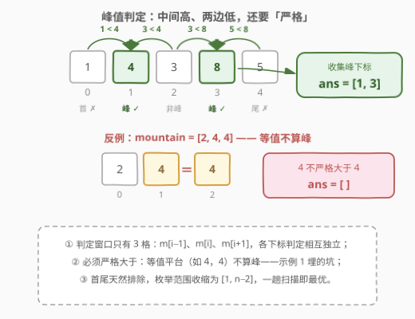
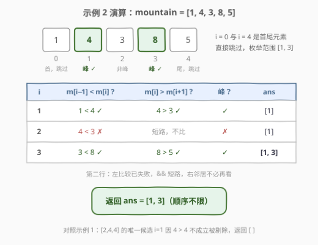

# 找出峰值

- **题目名称**：找出峰值
- **链接**：[2951. 找出峰值](https://leetcode.cn/problems/find-the-peaks/)
- **难度**：简单
- **标签**：数组、枚举

## 1. 题目概述

给你一个下标从 **0** 开始的数组 `mountain`。你的任务是找出数组 `mountain` 中的所有**峰值**。

以数组形式返回给定数组中**峰值**的下标，**顺序不限**。

**注意**：

- **峰值** 是指一个**严格大于**其相邻元素的元素。
- 数组的第一个和最后一个元素**不**是峰值。

**示例 1**：

```text
输入：mountain = [2,4,4]
输出：[]
解释：mountain[0] 和 mountain[2] 不可能是峰值，因为它们是数组的第一个和最后一个元素。
mountain[1] 也不可能是峰值，因为它不严格大于 mountain[2]。
因此，答案为 []。
```

**示例 2**：

```text
输入：mountain = [1,4,3,8,5]
输出：[1,3]
解释：mountain[0] 和 mountain[4] 不可能是峰值，因为它们是数组的第一个和最后一个元素。
mountain[2] 也不可能是峰值，因为它不严格大于 mountain[3] 和 mountain[1]。
但是 mountain[1] 和 mountain[3] 严格大于它们的相邻元素。
因此，答案是 [1,3]。
```

**约束条件**：

- $3 \le mountain.length \le 100$
- $1 \le mountain[i] \le 100$

> 💡 读题先抓形态：这是一道**局部判定型枚举**问题——每个位置的「峰性」只由自身和左右邻居共 3 个元素决定，与远处无关。规模极小（$n \le 100$），怎么写都能过；真正值得抠的是三个细节：① 首尾天然排除，枚举范围收缩；② 「严格大于」排除等值平台；③ 判定相互独立 ⇒ 一趟遍历即最优。

---

## 2. 解题思路

### 2.1 暴力思路：枚举每个下标，查两侧邻居

最直接的做法：枚举所有下标 $i$ 从 $0$ 到 $n-1$，对每个位置先判断是否在边界（首尾直接排除），再看 $mountain[i-1] < mountain[i]$ 且 $mountain[i] > mountain[i+1]$ 是否同时成立，成立则把 $i$ 收进答案。

这已经是最优框架——「暴力」与「正解」在本题几乎重合，唯一的优化空间是**把边界检查从循环体挪到循环范围上**：既然首尾注定不是峰，枚举范围直接从 $[0, n-1]$ 收缩为 $[1, n-2]$，循环体内只剩两次比较，连越界特判都省了。

### 2.2 核心观察：窗口只有 3 格 + 严格大于 + 独立判定



三条性质框定解法形态：

1. **判定窗口只有 3 格**：位置 $i$ 是否为峰，只取决于 $m[i-1] < m[i] > m[i+1]$ 这一个布尔表达式，与数组其他部分无关——各下标判定**相互独立**，天然一趟遍历，不存在跨位置的状态依赖。
2. **严格大于，等值不算**：示例 1 的 $[2,4,4]$ 是官方埋的坑——中间的 $4$ 与右邻相等，**不严格大于**，不是峰。比较必须用严格不等号，写成 $\ge$ 就会在平台上翻车。
3. **读取下界 $\Omega(n)$**：要输出**全部**峰，最坏情况（如严格递增数组）必须读完每个元素才能确认答案为空——任何一个没读的位置都可能是漏掉的峰。所以 $O(n)$ 一趟扫描不只是暴力，也是信息论下界。

$$\boxed{\ \mathrm{ans} = \{\, i \mid 1 \le i \le n-2,\ \ m[i-1] < m[i] > m[i+1] \,\}\ }$$

顺带一个输出侧的性质：**相邻两个峰的下标至少相差 2**——若 $i$ 与 $i+1$ 同时为峰，则 $m[i] > m[i+1]$ 与 $m[i+1] > m[i]$ 同时成立，矛盾。故 $n$ 个元素最多 $\lfloor (n-1)/2 \rfloor$ 个峰（如 $[1,2,1,2,1]$），这是答案数组空间的紧上界。

> 💡 一句话：**「找出全部峰」的最优解就是「写对谓词的一趟扫描」**——谓词是 3 格窗口的严格双降判定，框架是收缩到 $[1, n-2]$ 的一次 for 循环，两者拼起来既是暴力也是下界。

### 2.3 算法流程图

![算法流程：一趟扫描 [1, n-2]](../images/p2951_algorithm_flow.svg)

**完整步骤**：

1. **初始化**：答案数组 `ans` 为空，枚举下标 `i = 1`；
2. **判定**：若 `mountain[i-1] < mountain[i]` 且 `mountain[i] > mountain[i+1]`（`&&` 左侧先判，失败即短路），把 `i` 追加进 `ans`；
3. **推进**：`i++`，只要 `i <= n-2` 就回到第 2 步；
4. **收尾**：遍历结束返回 `ans`（无峰则返回空数组）。

> ⚠️ 常见手误是把循环条件写成 `i < n`：访问 `mountain[i+1]` 时会在 $i = n-1$ 处越界；也不必从 $i = 0$ 起步再在循环体里判边界——直接把范围收缩成 $[1, n-2]$ 更干净。

### 2.4 示例演算



以示例 2（`mountain = [1,4,3,8,5]`，$n = 5$）为例，枚举范围 $[1, 3]$：

| $i$ | $m[i-1] < m[i]$ ? | $m[i] > m[i+1]$ ? | 峰？ | `ans` |
|-----|------------------|------------------|------|-------|
| 1 | $1 < 4$ ✓ | $4 > 3$ ✓ | ✓ | `[1]` |
| 2 | $4 < 3$ ✗ | 短路，不再比较 | ✗ | `[1]` |
| 3 | $3 < 8$ ✓ | $8 > 5$ ✓ | ✓ | `[1, 3]` |

遍历结束返回 `[1, 3]` ✓。示例 1（`[2,4,4]`）中唯一的候选 $i = 1$ 因 $4 > 4$ 不成立被剔除，返回 `[]`——正是 2.2 中「等值平台不算峰」的落点。

---

## 3. 参考代码

### C++

```cpp
class Solution {
  public:
    vector<int> findPeaks(vector<int>& mountain) {
        vector<int> ans;
        int n = mountain.size();
        for (int i = 1; i < n - 1; i++) {
            if (mountain[i - 1] < mountain[i] && mountain[i] > mountain[i + 1]) {
                ans.push_back(i);
            }
        }
        return ans;
    }
};
```

### Python

```python
class Solution:
    def findPeaks(self, mountain: List[int]) -> List[int]:
        return [i for i in range(1, len(mountain) - 1)
                if mountain[i - 1] < mountain[i] > mountain[i + 1]]
```

> 💡 语言细节：C++ 里 `i < n - 1` 等价于 `i <= n - 2`，`&&` 短路保证左侧失败时不再比较右侧（本题 $i$ 有界，短路只是省一次比较）；Python 的链式比较 `a < b > c` 一行表达「严格高于两侧」，`range(1, n-1)` 右开区间正好枚举到 $n-2$ 为止。

---

## 4. 复杂度分析

| 维度 | 复杂度 | 说明 |
|------|--------|------|
| 时间复杂度 | $O(n)$ | 一次扫描 $[1, n-2]$，每个位置常数次比较；$\Omega(n)$ 也是读取下界（未读元素都可能是峰） |
| 空间复杂度 | $O(1)$ | 仅循环下标与临时比较（不计返回数组；若计入，由峰间距性质至多 $\lfloor (n-1)/2 \rfloor$ 个元素） |

---

## 5. 扩展：从「枚举全部峰」到「二分找一个峰」

本题 $O(n)$ 已是下界，无优化空间——但前提是「**要全部**」。条件一变，算法就换形态：

- **[162. 寻找峰值](https://leetcode.cn/problems/find-peak-element/)**：只要返回**任意一个**峰，且题目保证相邻元素不相等（无平台）。此时可二分 $O(\log n)$：若 $m[mid] < m[mid+1]$，右半（含 $mid+1$）必有峰，否则左半（含 $mid$）必有峰——「往高的一侧走，走到头就是峰」。
- **[852. 山脉数组的峰顶索引](https://leetcode.cn/problems/peak-index-in-a-mountain-array/)**：更强的结构保证（先严格增后严格减的**单峰**数组），同样二分找唯一峰顶。
- **[1901. 寻找峰值 II](https://leetcode.cn/problems/find-a-peak-element-ii/)**：推广到二维矩阵，「行上取列最大值 + 对行二分」，$O(m \log n)$。

**为什么本题不能照搬二分？** 两头都不占：① 要输出**全部**峰，$\Omega(n)$ 的读取下界挡死任何 $o(n)$ 算法；② 本题允许相邻相等，平台会摧毁二分的方向论证——遇到 $m[mid] = m[mid+1]$ 时「往大的一侧走」失去依据（如 $[1,2,2,1]$，站在中间的平台上无从判断哪边有峰）。162 的「相邻不等」约束正是为二分量身铺路。

> 💡 面试叙事：**「输出满足条件的全部元素」是遍历问题，「输出任一满足者」才可能二分**——还要叠加「无平台」这类结构保证，二分的方向论证才立得住。把这层因果讲清楚，比背 162 的模板更有分量。

---

## 6. 面试要点

1. **枚举范围为什么是 $[1, n-2]$？**

   - 首尾元素只有一侧邻居，题目明文规定不算峰
   - 把边界排除做进循环边界，循环体内只剩纯判定，还顺带避免 $m[-1]$ / $m[n]$ 越界

2. **「严格大于」和「大于等于」差在哪？**

   - 示例 1 的 $[2,4,4]$：中间的 $4$ 与右邻相等，等值平台不算峰
   - 用 $\ge$ 会错误输出 `[1]`；「严格」二字是本题唯一的知识点型考点

3. **峰最多能有多少个？相邻的峰能挨着吗？**

   - 不能：若 $i$、$i+1$ 都是峰，会推出 $m[i] > m[i+1]$ 与 $m[i+1] > m[i]$ 同时成立，矛盾
   - 故峰下标两两至少差 2，$n$ 个元素最多 $\lfloor (n-1)/2 \rfloor$ 个峰（如 $[1,2,1,2,1]$）

4. **能不能用二分把复杂度降到 $O(\log n)$？**

   - 本题不能：要输出**全部**峰，未读的位置都可能是峰，$\Omega(n)$ 读取下界
   - 若改为「任找一个峰」且保证相邻不等（162），二分可行——见第 5 节的方向论证

5. **Python 链式比较 `a < b > c` 的语义是什么？**

   - 等价于 `a < b and b > c`，且短路求值，恰好一行表达「严格高于两侧」
   - 注意方向别写反：`a < b < c` 表达的是「递增」，不是「峰」

> 💡 **一句话总结**：3 格窗口 + 严格双降谓词 + 收缩到 $[1, n-2]$ 的一趟扫描，$O(n)$ 既是暴力也是下界；追问加速时，「全部」变「任一」、加「无平台」保证，才轮到二分登场。

---

## 7. 同类练习题

- [852. 山脉数组的峰顶索引](https://leetcode.cn/problems/peak-index-in-a-mountain-array/)（[题解](../0801-0900/852_山脉数组的峰顶索引.md)）：单峰结构保证下二分找唯一峰顶，$O(\log n)$
- [941. 有效的山脉数组](https://leetcode.cn/problems/valid-mountain-array/)（[题解](../0901-1000/941_有效的山脉数组.md)）：反过来判定整个数组是不是一座山（先严格增后严格减）
- [162. 寻找峰值](https://leetcode.cn/problems/find-peak-element/)（[题解](../0101-0200/162_寻找峰值.md)）：找任意一个峰 + 相邻不等保证，第 5 节二分扩展的本体
- [1901. 寻找峰值 II](https://leetcode.cn/problems/find-a-peak-element-ii/)（[题解](../1901-2000/1901_寻找峰值II.md)）：峰判定推广到二维矩阵，行二分 + 列最大值
