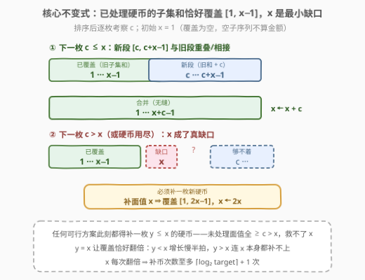
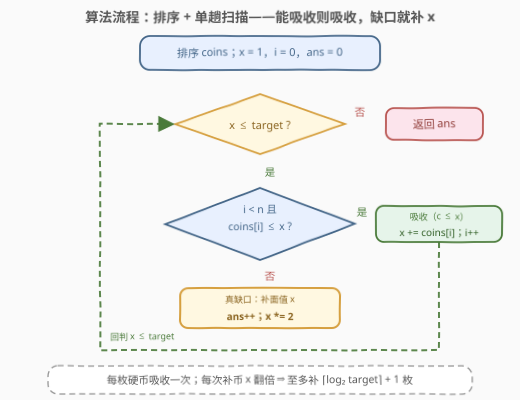
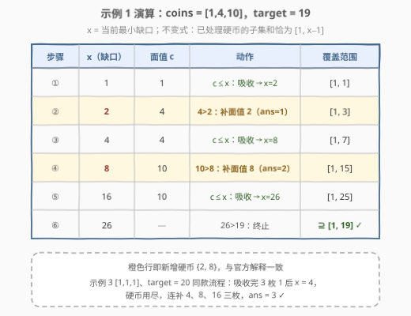

# LeetCode 需要添加的硬币的最小数量 题解

## 1. 题目概述

- **标题 / 题号**：需要添加的硬币的最小数量（#2952，medium）
- **链接**：https://leetcode.cn/problems/minimum-number-of-coins-to-be-added/
- **难度**：中等
- **标签**：贪心、数组、排序

**题意**：给定下标从 0 开始的整数数组 `coins`，表示**可用的硬币面值**，以及一个整数 `target`。

如果存在某个 `coins` 的**子序列**总和为 $x$，那么整数 $x$ 就是一个**可取得的金额**。

返回需要添加到数组中的**任意面值**硬币的**最小数量**，使范围 $[1, target]$ 内的**每个整数**都属于可取得的金额。

> 💡 「子序列」= 删掉若干元素（可不删）后剩余元素保序构成的**非空**数组——本质是**子集和**：每枚硬币至多用一次，且顺序无关。这一点决定了它与零钱兑换家族（硬币无限用）的分野。

**示例 1**：

```text
输入：coins = [1,4,10], target = 19
输出：2
解释：添加面值 2 和 8 各一枚，得到 [1,2,4,8,10]，
      1 到 19 的所有整数都可用其中的硬币组合得到。
```

**示例 2**：

```text
输入：coins = [1,4,10,5,7,19], target = 19
输出：1
解释：只需添加一枚面值 2 的硬币，得到 [1,2,4,5,7,10,19]。
```

**示例 3**：

```text
输入：coins = [1,1,1], target = 20
输出：3
解释：添加面值 4、8、16 各一枚，得到 [1,1,1,4,8,16]。
```

**约束**：

- $1 \le target \le 10^5$
- $1 \le coins.length \le 10^5$
- $1 \le coins[i] \le target$

> 💡 关键信号：$n \cdot target$ 高达 $10^{10}$，任何「枚举子集和 / 逐个金额验证」的做法都会爆。但题目只问「每个金额**是否**可取得」的真假，不问方案数——这个连续覆盖结构正是 [330. 按要求补齐数组](https://leetcode.cn/problems/patching-array/) 与 [1798. 你能构造出连续值的最大数目](https://leetcode.cn/problems/maximum-number-of-consecutive-values-you-can-make/) 的同款甜区，可把整个可达性压缩成**一个标量**做贪心。

## 2. 解题思路

### 2.1 暴力思路：子集和验证 + 枚举补币——决策空间无界

最直觉的暴力分两层：

- **验证层**：给定一组硬币，用布尔子集和 DP 判定 $[1, target]$ 每个值是否可达：`dp[s] |= dp[s−c]`，每个硬币倒序更新一次，$O(n \cdot target)$。$n = target = 10^5$ 时是 $10^{10}$，即便 bitset 压位也要 $\approx 1.6 \times 10^8$ 字访问，勉强只够跑**一次**验证。
- **决策层**：添加的硬币面值是**任意**正整数，候选空间 $[1, target]$。枚举「先补哪枚、再补哪枚」是组合爆炸；即便二分答案 $k$ 再验证「补 $k$ 枚是否足够」，验证本身也没有高效的判定手段（补哪 $k$ 枚仍需枚举）。

> ⚠️ 暴力的死结在于「先选补丁、再验证覆盖」。换视角：**不枚举金额，只盯住最小的不可达金额**——它是整个可达结构的瓶颈，把无穷的验证压成一个缺口的修补。

### 2.2 核心观察：不变式「已处理硬币的子集和恰为 $[1, x-1]$」



将 `coins` **排序**后从小到大处理，维护一个标量 $x$，配合一条严格不变式：

> **不变式**：由「已处理的原生硬币 + 已主动添加的硬币」构成的子集和集合，**恰好**是连续区间 $[0, x-1]$（0 对应空子序列）。即 $[1, x-1]$ 全部可取得，而 $x$ 暂时凑不出——$x$ 就是当前**最小缺口**。

初始没有任何硬币被处理，子集和只有 $\{0\}$，故 $x = 1$。逐枚考察排序后的下一枚面值 $c$：

**情况① $c \le x$（吸收）**：$[1, x-1]$ 中的每个和 $v$ 添上 $c$ 得 $v + c \in [c, c+x-1]$；由 $c \le x$ 知新段与 $[1, x-1]$ 相接或重叠，合并后覆盖恰为 $[1, x+c-1]$。更新 $x \mathrel{{+}{=}} c$。

**情况② $c > x$（或硬币已用尽）——真缺口**：$x$ 凑不出——已处理硬币的和值全落在 $[0, x-1]$ 内，未处理的面值全都 $\ge c > x$，任何包含它们的子集和都 $> x$。所以**必须补一枚面值 $y \le x$ 的新硬币**。补 $y$ 后覆盖变为 $[1, x-1] \cup [y, y+x-1]$：

- $y = x$：恰接成 $[1, 2x-1]$，覆盖**翻倍**，扩展最大；
- $y < x$：新覆盖 $[1, x+y-1]$，增长慢半拍；
- $y > x$：$x$ 本身仍凑不出，缺口没补上，白补。

故最优动作是**补面值 $x$**：$ans{+}{+}$，$x \leftarrow 2x$，且 $i$ 不动（下一轮再判同一枚 $c$）。直到 $x > target$ 结束。

> 💡 **一句话**：`coins[i] ≤ x` 则吸收 `x += coins[i]`；否则补 `x` 本身令 `x *= 2`。与 330 的 `miss`、1798 的「可达区间」是同一个不变式的三副面孔。

### 2.3 算法流程图



**完整步骤**：

1. **初始化**：`coins` 排序；`x = 1`（最小缺口），`i = 0`（扫描下标），`ans = 0`；
2. **循环**（当 `x <= target`）：
   - 若 `i < n` 且 `coins[i] <= x`：**吸收**，`x += coins[i]`，`i += 1`；
   - 否则：**补一枚面值 x**，`ans += 1`，`x *= 2`（下标 `i` 不动，下一轮重新判 `coins[i]`）；
3. **返回** `ans`。

> ⚠️ 两个易漏点：① `i` 用尽但 `x ≤ target` 仍成立时，走补币分支继续翻倍——对应示例 3「原生硬币全吸收完仍不够」的情形；② 补币后**不要**推进 `i`，因为补出来的覆盖可能已把 `coins[i]` 罩住（此时下一轮直接吸收它），也可能还不够（继续补）。

### 2.4 示例演算



以示例 1（`coins = [1,4,10]`，`target = 19`）为例，跟踪 $x$ 的演化：

| 步骤 | $x$（缺口） | 当前面值 $c$ | 判定 | 动作 | 覆盖范围 |
|------|------------|-------------|------|------|----------|
| ① | 1 | 1 | $1 \le 1$ ✓ | 吸收，$x \leftarrow 2$ | $[1, 1]$ |
| ② | 2 | 4 | $4 > 2$ ✗ | **补面值 2**，$ans = 1$，$x \leftarrow 4$ | $[1, 3]$ |
| ③ | 4 | 4 | $4 \le 4$ ✓ | 吸收，$x \leftarrow 8$ | $[1, 7]$ |
| ④ | 8 | 10 | $10 > 8$ ✗ | **补面值 8**，$ans = 2$，$x \leftarrow 16$ | $[1, 15]$ |
| ⑤ | 16 | 10 | $10 \le 16$ ✓ | 吸收，$x \leftarrow 26$ | $[1, 25]$ |
| ⑥ | 26 | — | $26 > 19$ | 终止 | $[1, 25] \supseteq [1, 19]$ ✓ |

补出 $\{2, 8\}$ 两枚，与官方解释一致。注意步骤④补完 8 之后覆盖已到 $[1,15]$，此时 $c = 10 \le 16$ 被直接吸收——**补币不会让任何原生硬币作废**，只可能把它们「罩进」覆盖里。

**验证示例 3**（`coins = [1,1,1]`，`target = 20`）：三枚 1 依次吸收后 $x = 4$；硬币用尽，连补 $4, 8, 16$ 三枚，$x$ 依次变 $8, 16, 32 > 20$，$ans = 3$ ✓。

## 3. 参考代码

### C++

```cpp
class Solution {
  public:
    int minimumAddedCoins(vector<int>& coins, int target) {
        sort(coins.begin(), coins.end());
        int x = 1, ans = 0, i = 0, n = coins.size();
        while (x <= target) {
            if (i < n && coins[i] <= x) {
                x += coins[i++];
            } else {
                ans++;
                x *= 2;
            }
        }
        return ans;
    }
};
```

### Python

```python
class Solution:
    def minimumAddedCoins(self, coins: List[int], target: int) -> int:
        coins.sort()
        x, ans, i, n = 1, 0, 0, len(coins)
        while x <= target:
            if i < n and coins[i] <= x:
                x += coins[i]
                i += 1
            else:
                ans += 1
                x *= 2
        return ans
```

> 💡 与 330 的区别只在入口：330 的 `nums` 题目保证升序，本题 `coins` **乱序**，必须先排序。溢出方面，$x \le target \le 10^5$ 时才进入循环体，吸收/翻倍后 $x \le 2 \times 10^5$，`int` 足够（330 的 $n$ 可达 $2^{31}-1$ 才需要 `long long`）。

## 4. 复杂度分析

| 维度 | 复杂度 | 说明 |
|------|--------|------|
| 时间复杂度 | $O(n \log n)$ | 排序主导；扫描阶段每枚原生硬币恰好吸收一次（$O(n)$），每次补币 $x$ 翻倍、至多 $\lceil \log_2 target \rceil + 1 \approx 18$ 次 |
| 空间复杂度 | $O(1)$ | 忽略排序栈，仅 `x / i / ans` 三个变量 |

> 💡 $n = 10^5$ 时排序约 $1.7 \times 10^6$ 次比较，扫描仅 $10^5 + 18$ 步——把「$10^{10}$ 的子集和空间」压成「一个缺口的翻倍追赶」，正是这条不变式的威力。

## 5. 扩展：贪心正确性与三胞胎问题

**为什么补 $x$ 是最优的（交换论证）**。设在某缺口时刻，任何可行方案都必须补一枚 $y \le x$（未处理面值全 $> x$，救不了缺口；补 $y > x$ 则 $x$ 仍不可达，还需再补）。定义 $f(x)$ = 从覆盖 $[1, x-1]$ 出发、用剩余原生硬币补齐到 $target$ 还需的最少补币数，显然 $f$ 关于 $x$ **单调不增**（起点覆盖越宽，剩余需求越少）。补 $y$ 后缺口变 $x + y$，补 $x$ 后变 $2x \ge x + y$，故 $f(2x) \le f(x+y)$——每一步取 $y = x$ 都不劣于任何其他选择，归纳即得全局最优。

**三胞胎对照**（同一不变式的三副面孔）：

| 题号 | 问法 | 不变式 |
|------|------|--------|
| [1798. 你能构造出连续值的最大数目](https://leetcode.cn/problems/maximum-number-of-consecutive-values-you-can-make/) | 给定硬币，连续覆盖能到多远 | 覆盖 $[0, x]$，遇到 $c > x+1$ 即**停**（读题） |
| [330. 按要求补齐数组](https://leetcode.cn/problems/patching-array/) | 给定 $[1,n]$，最少补几个数 | 缺口处补 `miss`，翻倍追赶（本题原版，$n$ 巨大需 `long long`） |
| **2952（本题）** | 给定 $[1,target]$，最少补几枚硬币 | 同 330，仅多一步排序 |

**为什么不能用 bitset 子集和 DP**：压位 DP 只能**验证**给定硬币集合的可达性，无法回答「补哪枚」；且 $n \cdot target = 10^{10}$ 的规模连一次验证都吃力。可达性的「连续前缀」结构才是降维的关键——它让真值表坍缩成一个右端点。

## 6. 面试要点

1. **不变式的严格表述是什么？为什么「恰好」很重要？**

   - 已处理硬币（原生吸收的 + 主动补的）的子集和集合**恰为** $[0, x-1]$，不多不少
   - 「不多」（$x$ 不可达）保证遇到 $c > x$ 时判定「真缺口」成立：已处理的凑不出 $x$，未处理的全 $> x$ 更凑不出
   - 若只说「$[1,x-1]$ 可达」而不排除更大的和值，缺口判定就不严谨

2. **为什么缺口处补 $x$ 而不是别的面值？**

   - $y > x$：$x$ 本身仍凑不出，缺口还在，这一枚白补
   - $y < x$：新覆盖 $[1, x+y-1]$，比补 $x$ 得到的 $[1, 2x-1]$ 窄
   - 由 $f(x)$ 单调不增 + 交换论证，每步补 $x$ 不劣于任何方案

3. **为什么必须排序？**

   - 归纳按面值升序进行，保证考察 $c$ 之前所有更小面值已处理
   - 判「$c > x$ ⇒ 后续面值全都暂时够不着」依赖排序后的单调性；乱序会误判（先遇大面值就误以为必须补币）

4. **循环什么时候终止？$i$ 用尽后会发生什么？**

   - 终止条件是 $x > target$（覆盖已罩住目标区间），不是「硬币处理完」
   - $i$ 用尽后每轮都走补币分支，$x$ 连续翻倍至多 $\lceil \log_2 target \rceil + 1$ 轮——示例 3 正是这种情形

5. **补币会不会「浪费」原生硬币？**

   - 不会。补 $x$ 只扩大覆盖，不消耗任何东西；下一轮若 $coins[i] \le x$ 仍会被吸收
   - 反而可能发生的是：补币后覆盖已把某枚原生面值**罩进** $[1, x-1]$（如示例 1 步骤⑤的 10），它照常被吸收，不影响正确性

## 同类练习题

| # | 题目 | 与本题的关联 |
|---|------|-------------|
| 330 | [按要求补齐数组](https://leetcode.cn/problems/patching-array/)（[站内题解](../0301-0400/330_按要求补齐数组.md)） | 本题的原版模板，`miss` 贪心 + 翻倍追赶，$n$ 巨大需 `long long` |
| 1798 | [你能构造出连续值的最大数目](https://leetcode.cn/problems/maximum-number-of-consecutive-values-you-can-make/)（[站内题解](../1701-1800/1798_你能构造出连续值的最大数目.md)） | 镜像问法——给定硬币求最大连续覆盖，遇到断点即停 |
| 322 | [零钱兑换](https://leetcode.cn/problems/coin-change/)（[站内题解](../0301-0400/322_零钱兑换.md)） | 对照组——硬币可无限使用、只求凑单个金额的完全背包 DP |
| 518 | [零钱兑换 II](https://leetcode.cn/problems/coin-change-ii/)（[站内题解](../0501-0600/518_零钱兑换II.md)） | 对照组——求凑法计数，与本题「每枚一次 + 全覆盖」的结构差异 |
