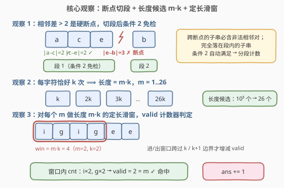
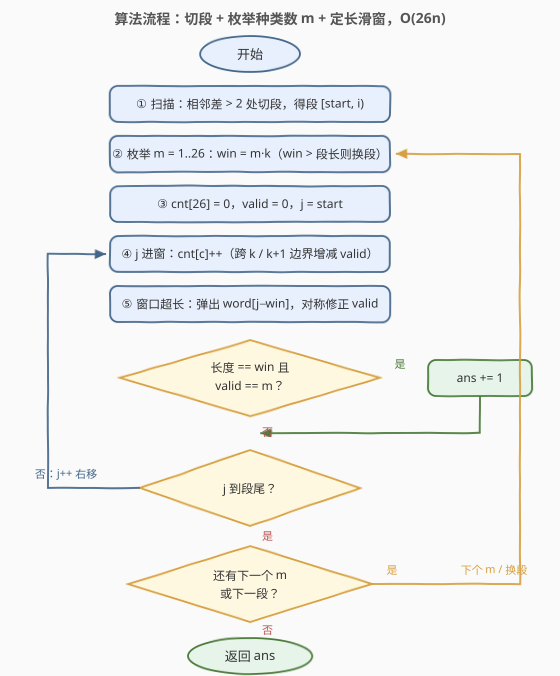
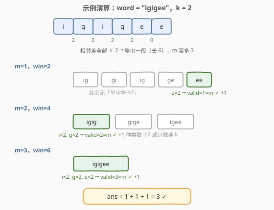

# 统计完全子字符串

- **题目名称**：统计完全子字符串
- **链接**：[2953. 统计完全子字符串](https://leetcode.cn/problems/count-complete-substrings/)
- **难度**：困难
- **标签**：哈希表、字符串、滑动窗口

## 1. 题目概述

给你一个字符串 `word` 和一个整数 `k`。

如果 `word` 的一个子字符串 `s` 满足以下条件，我们称它是**完全字符串**：

- `s` 中每个字符**恰好**出现 `k` 次；
- `s` 中相邻两个字符 `c1` 和 `c2` 在字母表中的位置**至多**相差 `2`，即 `|c1 − c2| ≤ 2`。

请你返回 `word` 中**完全**子字符串的数目。**子字符串**指的是一个字符串中一段连续**非空**的字符序列。

**示例 1**：

```text
输入：word = "igigee", k = 2
输出：3
解释：完全子字符串需要满足每个字符恰好出现 2 次，且相邻字符相差至多为 2：
      igigee, igigee, igigee。
```

**示例 2**：

```text
输入：word = "aaabbbccc", k = 3
输出：6
解释：完全子字符串需要满足每个字符恰好出现 3 次，且相邻字符相差至多为 2：
      aaabbbccc, aaabbbccc, aaabbbccc, aaabbbccc, aaabbbccc, aaabbbccc。
```

**约束条件**：

- $1 \le \text{word.length} \le 10^5$
- `word` 只包含小写英文字母
- $1 \le k \le \text{word.length}$

> 💡 本题是「**定长滑窗计数**」的经典组合：两条约束一硬一软——相邻差 $\le 2$ 是**位置约束**，先用一遍扫描**切段**彻底解决；每个字符恰好 $k$ 次是**频率约束**，利用字母表只有 26 种，把可能的窗口长度压缩到 $\{k, 2k, \dots, 26k\}$ 共 26 个候选，每种长度一次 $O(\text{段长})$ 的定长滑窗即可。总复杂度 $O(26n)$。

---

## 2. 解题思路

### 2.1 暴力思路：枚举所有子串，逐个验证

最直接的做法：枚举全部 $O(n^2)$ 个子串 $word[i..j]$，对每个子串从头扫一遍，数出各字符频率、检查相邻字符差，再判定「每个字符恰好 $k$ 次」。

单次检查 $O(n)$，总计 $O(n^3) \approx 10^{15}$（$n = 10^5$），完全不可行；就算用增量维护把检查压到 $O(1)$，$O(n^2) \approx 5 \times 10^9$ 个子串也依然超时。**必须利用约束本身把搜索空间砍小**——两条约束各藏着一个关键结构。

### 2.2 核心观察：断点切段 + 种类数枚举的定长滑窗

**观察 1（断点切段）：相邻差 $> 2$ 是「硬断点」，任何跨断点的子串都不合法。**

条件 2 只涉及**相邻**字符。若 $|word[i-1] - word[i]| > 2$，则所有同时包含下标 $i-1$ 和 $i$ 的子串直接出局；反过来，只要子串**完全落在某一段内**（段内任意相邻差都 $\le 2$），条件 2 自动满足。于是把 `word` 按断点切成若干段，**在每段内独立计数，且段内无需再检查条件 2**——位置约束被一遍扫描彻底消掉。

**观察 2（长度候选只有 26 个）：完全子串的长度必为 $m \cdot k$，$m \in [1, 26]$。**

条件 1 要求每个出现的字符恰好 $k$ 次。设子串共含 $m$ 种字符，则长度 $= m \times k$；而小写字母只有 26 种，$m \le 26$。**候选长度从 $10^5$ 个坍缩到 26 个**——对每段、每个 $m$，用长度 $m \cdot k$ 的**定长滑窗**扫一遍段即可。

**观察 3（valid 计数器）：维护「恰好出现 $k$ 次的字符种数」，$valid = m$ 即命中。**

窗口长度固定为 $m \cdot k$ 时，若窗口内有 $m$ 种字符的计数**恰好等于** $k$，这 $m$ 种贡献的字符总数 $m \cdot k$ 恰好填满窗口——不可能再有别的字符，条件 1 成立。于是只需一个计数器 $valid$：字符进窗时计数从 $k-1 \to k$ 则 $valid{+}{+}$，从 $k \to k{+}1$ 则 $valid{-}{-}$；出窗时对称处理。**判定收敛为一行：$valid == m$**。



> 💡 一句话：**硬断点切段消灭条件 2，长度 $m \cdot k$ 只有 26 种消灭维度，$valid$ 计数器把频率判定压成 $O(1)$**。三步合起来，每段 $O(26 \times \text{段长})$，全串 $O(26n)$。

### 2.3 算法流程图



**完整步骤**：

1. 从左到右扫描 `word`，遇 $|word[i] - word[i-1]| > 2$（或到达末尾）则得到一段 $[start, i)$
2. 对该段枚举字符种类数 $m = 1, 2, \dots$：窗口长度 $win = m \cdot k$，若 $win >$ 段长则停止（更大的 $m$ 只会更长）
3. 定长滑窗扫段：右端进字符、更新 `cnt[]` 与 `valid`；窗口超过 `win` 则弹出左端、对称修正
4. 每个位置判定：窗口长度已达 $win$ 且 $valid == m$，则 `ans++`
5. 段内所有 $m$ 扫完，进入下一段；全部段处理完返回 `ans`

### 2.4 示例演算

以示例 1 `word = "igigee"`，`k = 2` 为例。相邻差依次为 $|i-g|=2$、$|g-i|=2$、$|i-g|=2$、$|g-e|=2$、$|e-e|=0$，全部 $\le 2$——整串是一段，长度 6。段长 6、$k=2$，$m$ 至多 $3$：

| $m$ | 窗口长 $m \cdot k$ | 窗口与频率 | 命中 |
|-----|------|------------|------|
| 1 | 2 | `ig`(i1,g1)、`gi`、`ig`、`ge` 均非「单字符×2」；`ee`(e2) ✓ | `ee` → +1 |
| 2 | 4 | `igig`(i2,g2) ✓；`gige`(g2,i1,e1) ✗；`igee`(i1,g1,e2) ✗ | `igig` → +1 |
| 3 | 6 | `igigee`(i2,g2,e2) ✓ | `igigee` → +1 |

合计 `ans = 3`，与官方答案一致 ✓。



顺带验证示例 2：`"aaabbbccc"` 无断点整串一段，$m{=}1$ 命中 `aaa`/`bbb`/`ccc`，$m{=}2$ 命中 `aaabbb`/`bbbccc`，$m{=}3$ 命中 `aaabbbccc`，共 6 个 ✓。

---

## 3. 参考代码

### C++

```cpp
class Solution {
public:
    int countCompleteSubstrings(string word, int k) {
        int n = word.size(), ans = 0;
        int start = 0;                                   // 当前段起点
        for (int i = 1; i <= n; i++) {
            // i == n，或相邻差 > 2：段 [start, i) 在此结束
            if (i < n && abs(word[i] - word[i - 1]) <= 2) continue;
            int len = i - start;
            for (int m = 1; m <= 26 && m * k <= len; m++) {  // 枚举字符种类数
                int win = m * k;
                int cnt[26] = {0};
                int valid = 0;                           // 恰好出现 k 次的字符种数
                for (int j = start; j < i; j++) {
                    int c = word[j] - 'a';
                    if (++cnt[c] == k) valid++;
                    else if (cnt[c] == k + 1) valid--;   // 越过 k：从恰好变超额
                    if (j - start + 1 > win) {           // 窗口超长，弹出左端
                        int d = word[j - win] - 'a';
                        if (cnt[d] == k) valid--;
                        else if (cnt[d] == k + 1) valid++; // 从超额退回恰好
                        cnt[d]--;
                    }
                    if (j - start + 1 >= win && valid == m) ans++;
                }
            }
            start = i;
        }
        return ans;
    }
};
```

### Python

```python
class Solution:
    def countCompleteSubstrings(self, word: str, k: int) -> int:
        n = len(word)
        codes = [ord(c) - 97 for c in word]
        ans, start = 0, 0
        for i in range(1, n + 1):
            # i == n，或相邻差 > 2：段 [start, i) 在此结束
            if i < n and abs(codes[i] - codes[i - 1]) <= 2:
                continue
            for m in range(1, 27):                       # 枚举字符种类数
                win = m * k
                if win > i - start:                      # 更大的 m 只会更长
                    break
                cnt = [0] * 26
                valid = 0                                # 恰好出现 k 次的字符种数
                for j in range(start, i):
                    c = codes[j]
                    cnt[c] += 1
                    if cnt[c] == k:
                        valid += 1
                    elif cnt[c] == k + 1:                # 越过 k：从恰好变超额
                        valid -= 1
                    if j - start + 1 > win:              # 窗口超长，弹出左端
                        d = codes[j - win]
                        if cnt[d] == k:
                            valid -= 1
                        elif cnt[d] == k + 1:            # 从超额退回恰好
                            valid += 1
                        cnt[d] -= 1
                    if valid == m and j - start + 1 >= win:
                        ans += 1
            start = i
        return ans
```

> 💡 两版逻辑一致。细节提醒：① **先加右端再弹左端**，且弹出的是 `j - win`（窗口固定为 $[j-win+1,\ j]$）；② `cnt` 跨过 $k+1$ 之后（如 $k{=}1$ 时计到 2、3）不需要再动 `valid`——超额态在 $k{+}1$ 那一步已经扣过了；③ Python 版预计算 `codes` 把 `ord` 移出内层循环，$26n \approx 2.6 \times 10^6$ 次内层迭代可稳过。

---

## 4. 复杂度分析

| 维度 | 复杂度 | 说明 |
|------|--------|------|
| **时间复杂度** | $O(26\,n)$ | 每段 $[l, r)$ 对 $m = 1 \dots \min(26, \frac{r-l}{k})$ 各做一次 $O(r-l)$ 定长滑窗，求和 $\Sigma\,26 \times \text{段长} = 26n$；$n = 10^5$ 时约 $2.6 \times 10^6$ 次内层操作 |
| **空间复杂度** | $O(26)$ | 每个字符的计数数组 `cnt[26]` 与常数个计数器，即 $O(1)$ |

> ⚠️ 对比 2.1 的暴力：$O(n^3)$ 笨重在「对每个子串从头验证」；本题的关键不是把验证做快，而是**让需要验证的窗口只剩 $O(26n)$ 个**——断点切段 + 长度候选 $m \cdot k$ 两个观察负责砍数量，$valid$ 计数器负责把单个判定压到 $O(1)$。

---

## 5. 扩展：不预分段——有序多重集动态维护「窗口内相邻差最大值」

官方提示给出了另一条路：不切段，用**一个滑动窗口同时处理两条约束**，把窗口内所有相邻差 $|word[i] - word[i-1]|$ 动态维护在一个**有序多重集**（C++ `multiset`）里，每个位置 $O(\log n)$ 取最大值判断条件 2；频率条件仍由 `cnt[]` 判定。

要点：右端进入字符 `word[j]` 时插入差值 $|word[j] - word[j-1]|$，左端弹出字符 `word[i]` 时 erase 对应差值 $|word[i+1] - word[i]|$；`*ms.rbegin() <= 2` 即窗口满足条件 2。复杂度 $O(n \log n)$（配合「窗口长度必为 $m \cdot k$ 的倍数跳跃」或对每个 $m$ 单独扫）。

```cpp
#include <set>
class Solution {
public:
    int countCompleteSubstrings(string word, int k) {
        int n = word.size(), ans = 0;
        for (int m = 1; m <= 26; m++) {
            int win = m * k;
            if (win > n) break;
            multiset<int> diffs;                     // 窗口内相邻差
            int cnt[26] = {0}, valid = 0;
            for (int j = 0; j < n; j++) {
                if (j) diffs.insert(abs(word[j] - word[j - 1]));
                int c = word[j] - 'a';
                if (++cnt[c] == k) valid++;
                else if (cnt[c] == k + 1) valid--;
                if (j + 1 > win) {
                    int d = word[j - win] - 'a';
                    if (cnt[d] == k) valid--;
                    else if (cnt[d] == k + 1) valid++;
                    cnt[d]--;
                    diffs.erase(diffs.find(abs(word[j - win + 1] - word[j - win])));
                }
                if (j + 1 >= win && valid == m
                    && (diffs.empty() || *diffs.rbegin() <= 2))   // win==1 时无相邻对，空真
                    ans++;
            }
        }
        return ans;
    }
};
```

两个实现视角对比：

| 视角 | 条件 2 的处理 | 复杂度 | 特点 |
|------|--------------|--------|------|
| **切段 + 定长滑窗**（正文） | 预处理一遍，段内免费 | $O(26n)$ | 无数据结构，常数小，**推荐** |
| **multiset 动态维护** | 窗口内相邻差的最大值实时查询 | $O(26\,n \log n)$ | 不需预处理，思路可推广到「相邻差 $\le D$」可变的场景 |

> 💡 选择建议：约束是**静态阈值**时优先切段（把约束编译进结构）；阈值**动态变化**或切段代价高时才上多重集。这个权衡与 239「滑动窗口最大值」里单调队列 vs 重扫的取舍同源。

---

## 6. 面试要点

1. **为什么可以按相邻差 $> 2$ 切段，切段不会漏掉合法子串吗？**

   - 条件 2 只约束**相邻**字符。跨断点（$|word[i-1]-word[i]|>2$）的子串必然包含这对相邻字符，直接非法；合法子串必然整个落在某一段内，而段内任意相邻差 $\le 2$，条件 2 自动满足。切段是「不重不漏」的划分——两个方向的论证都要说清。

2. **为什么完全子串的长度只有 26 种候选？**

   - 每个出现的字符恰好 $k$ 次，设出现 $m$ 种字符，长度 $= m \cdot k$；小写字母仅 26 种，故 $m \in [1, 26]$，长度 $\in \{k, 2k, \dots, 26k\}$。这把「枚举哪个长度」从 $O(n)$ 降为 $O(26)$，是本题从平方级降到线性常数级的关键。

3. **定长滑窗里 `valid` 计数器为什么能代替「逐一检查 26 个计数」？**

   - `valid` 记录计数恰好等于 $k$ 的字符种数。窗口长度恰为 $m \cdot k$ 时，`valid == m` 意味着这 $m$ 种字符合计 $m \cdot k$ 个字符，正好填满窗口——不可能存在其他字符。进出窗口时计数跨越 $k$ / $k+1$ 边界才增减 `valid`，均摊 $O(1)$。

4. **总复杂度怎么算？26 个 $m$ 各扫一遍整段，会不会退化成 $O(26 \cdot 26 \cdot n)$？**

   - 不会。对段长 $L$ 的段，$m$ 只需枚举到 $\min(26, \lfloor L/k \rfloor)$，每个 $m$ 一次 $O(L)$ 滑窗，段内 $O(26L)$；各段求和 $\Sigma 26 L_i = 26n$。段切得越碎，单段可选的 $m$ 越少，总量始终以 $26n$ 封顶。

5. **本题的滑窗和「至多型 / 至少型」滑窗（如 2958、713）有何本质区别？**

   - 本题是**定长**滑窗：长度被条件 1 锁死为 $m \cdot k$，窗口不做伸缩，只有平移，判定靠 `valid == m` 的「恰好」语义；至多型/至少型是**变长**滑窗，靠收缩/扩张维护单调性（如 713 乘积、2958 频率至多 $k$）。「恰好 $k$ 次」没有单调性可言，定长化恰好吃掉这个难点——这与 30「串联所有单词的子串」的单词级定长滑窗同一思路。

> 💡 **一句话总结**：相邻差断点切段消灭位置约束，$m \cdot k$ 的 26 个长度候选 + `valid` 计数器的定长滑窗消灭频率约束，$O(26n)$ 一次扫完。

---

## 7. 同类练习题

- [395. 至少有 K 个重复字符的最长子串](https://leetcode.cn/problems/longest-substring-with-at-least-k-repeating-characters/)（[题解](../0301-0400/395_至少有K个重复字符的最长子串.md)）：同款「枚举窗口内字符种类数 $m$」把不可能的约束拆成 26 个可行子问题，对照本题的定长版
- [2958. 最多 K 个重复元素的最长子串](https://leetcode.cn/problems/length-of-longest-subarray-with-at-most-k-frequency/)：「至多 $k$ 次」变长滑窗的代表，与本题「恰好 $k$ 次」定长滑窗互为镜像
- [1248. 统计「优美子数组」](https://leetcode.cn/problems/count-number-of-nice-subarrays/)（[题解](../1201-1300/1248_统计优美子数组.md)）：另一条处理「恰好型」子串计数的路——atMost 差分，适合无定长结构可用时
- [2947. 统计美丽子字符串 I](https://leetcode.cn/problems/count-beautiful-substrings-i/)（[题解](../2901-3000/2947_统计美丽子字符串I.md)）：同为「双约束子串计数」，先化简判定再选枚举姿势，可与本题互相印证
