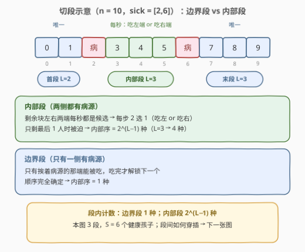
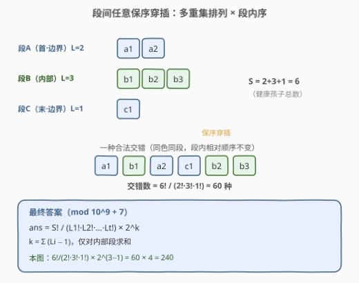
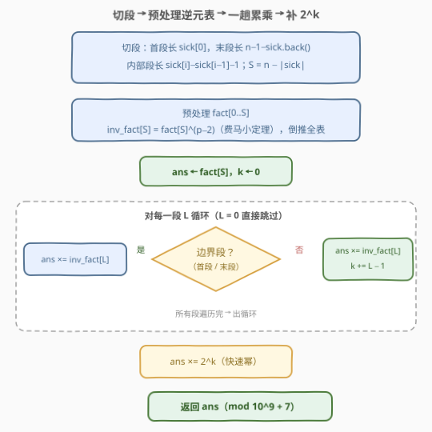
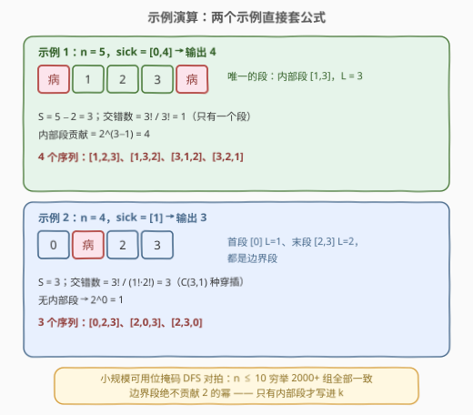

# LeetCode 统计感冒序列的数目 题解

## 1. 题目概述

- **标题 / 题号**：统计感冒序列的数目（#2954，hard）
- **链接**：https://leetcode.cn/problems/count-the-number-of-infection-sequences/
- **难度**：困难
- **标签**：数学、组合数学、费马小定理

**题意**：给你一个整数 `n` 和一个下标从 0 开始、按**升序**排序的整数数组 `sick`。

有 $n$ 位小朋友站成一排，按顺序编号为 $0$ 到 $n-1$。数组 `sick` 包含**一开始**就得了感冒的小朋友的位置。如果位置为 $i$ 的小朋友得了感冒，他会传染给下标为 $i-1$ 或 $i+1$ 的小朋友，前提是被传染的小朋友存在且还没有得感冒。**每一秒中，至多一位**还没感冒的小朋友会被传染。

经过有限的秒数后，队列中所有小朋友都会感冒。**感冒序列**指的是所有一开始没有感冒的小朋友最后得感冒的顺序序列（不含初始病号）。请你返回所有感冒序列的数目。由于答案可能很大，请将答案对 $10^9 + 7$ 取余后返回。

**示例 1**：

```text
输入：n = 5, sick = [0,4]
输出：4
解释：编号 1、2、3 未感冒，可能的感冒序列为 [1,2,3]、[1,3,2]、[3,1,2]、[3,2,1]。
```

**示例 2**：

```text
输入：n = 4, sick = [1]
输出：3
解释：编号 0、2、3 未感冒，可能的感冒序列为 [0,2,3]、[2,0,3]、[2,3,0]。
```

**约束**：

- $2 \le n \le 10^5$
- $1 \le \text{len(sick)} \le n - 1$
- $0 \le \text{sick}[i] \le n - 1$，`sick` 中的值互不相同且按升序排列

> 💡 读题先抓**结构**：传染只能发生在"患病-健康"相邻处，所以健康小朋友被 `sick` 天然切成了若干**独立段**；"每秒至多传染一人"意味着我们只关心**顺序**、不关心具体秒数。两句话合起来暗示：把序列数拆成"段内顺序 × 段间穿插"两个独立因子。

## 2. 解题思路

### 2.1 暴力思路：DFS 模拟每秒的分支

每秒枚举当前所有"与患病者相邻的健康孩子"（可能不止一个），逐个分支递归，用位掩码做记忆化（$2^S$ 个状态）。但 $S = n - |\text{sick}|$ 最多接近 $10^5$，状态数是天文数字，必然爆炸——只有 $n \le 20$ 左右才能跑动，必须挖掘结构。

### 2.2 核心观察：切段后"段内顺序"独立可算



把 `sick`（升序）当作分隔符，健康小朋友被切成至多三类段：

| 段类型 | 位置 | 长度 | 病源在几侧 |
|--------|------|------|-----------|
| 首段 | $[0,\ \text{sick}[0]-1]$ | $\text{sick}[0]$ | 1 侧（右） |
| 内部段 | $(\text{sick}[i],\ \text{sick}[i+1])$ 之间 | $\text{sick}[i+1]-\text{sick}[i]-1$ | **2 侧** |
| 末段 | $[\text{sick}[-1]+1,\ n-1]$ | $n-1-\text{sick}[-1]$ | 1 侧（左） |

关键在于**段内感染一定是"从端点向内蚕食"**：一个健康孩子被感染时必须与已感染者相邻，等价于每一步从剩余块的**左端或右端**取走一人。

- **边界段（单侧病源）**：只有挨着病源的那一端能被吃，吃完才解锁下一个——顺序完全确定，内部序恰 **1** 种；
- **内部段（双侧病源）**：剩余块左右两端每秒都是候选，每步 2 选 1；只剩最后 1 人时别无选择。长为 $L$ 的段，前 $L-1$ 步各 2 选 1（最后一步被迫），内部序共 $2^{L-1}$ 种。

> ⚠️ $L = 0$ 的段（相邻病号紧挨着）必须跳过：$0! = 1$ 虽不影响乘积，但**绝不能**把 $L-1 = -1$ 计入指数 $k$，否则答案直接错。

### 2.3 跨段合并：多重集排列（多项式系数）



段与段之间**完全独立**：任一时刻，每个还没吃完的段的"下一个待感染者"都在其剩余块的端点、天然与病源（初始病号或新感染者）相邻，所以任意穿插都合法，只需**同段内部相对顺序不变**。

于是全局感冒序列 = 各段内部序的**保序交错**。设各段长度为 $L_1, L_2, \dots, L_t$，健康孩子总数 $S = \sum L_i = n - |\text{sick}|$，交错方式数为多项式系数（多重集排列）：

$$\frac{S!}{L_1!\, L_2! \cdots L_t!}$$

再乘上每段自己的内部序数，得到最终公式：

$$\boxed{\ \text{ans} \;=\; \frac{S!}{\prod_i L_i!} \times 2^{k} \pmod{10^9+7}, \qquad k = \sum_{\text{内部段}} (L_i - 1)\ }$$

> 💡 除法取模用**费马小定理**：$p = 10^9+7$ 是质数，$a^{-1} \equiv a^{p-2} \pmod p$。预处理 $fact[\,]$ 后倒推 $inv\_fact[\,]$，所有除法都变成乘逆元。

### 2.4 算法流程图



**完整步骤**：

1. **切段**：由 `sick` 算出首段长、各内部段长、末段长，$S = n - |\text{sick}|$；
2. **预处理**：线性递推 $fact[0..S]$，用费马小定理求出 $inv\_fact[S]$ 后倒推全表；
3. **累乘**：$ans \leftarrow fact[S]$；对每段 $L > 0$ 乘 $inv\_fact[L]$，若是内部段再令 $k \mathrel{+}= L-1$；
4. **收尾**：$ans \mathrel{\times}= 2^{k} \bmod p$（快速幂），返回。

### 2.5 示例演算



以示例 1（$n = 5$，`sick = [0,4]`）为例：

| 步骤 | 内容 | 结果 |
|------|------|------|
| 切段 | 首段长 $0$（$\text{sick}[0]=0$）、内部段 $[1,3]$ 长 $3$、末段长 $0$ | $S = 3$ |
| 交错数 | $3!/3! = 1$（只有一个段） | 1 |
| 段内序 | 内部段贡献 $2^{3-1} = 4$ | 4 |
| 合计 | $1 \times 4$ | **4** ✓ |

再算示例 2（$n = 4$，`sick = [1]`）：

| 步骤 | 内容 | 结果 |
|------|------|------|
| 切段 | 首段 $[0]$ 长 $1$、末段 $[2,3]$ 长 $2$，无内部段 | $S = 3$ |
| 交错数 | $3!/(1!\cdot 2!) = 3$ | 3 |
| 段内序 | 边界段各 $1$ 种 | 1 |
| 合计 | $3 \times 1$ | **3** ✓ |

列举验证示例 2：首感染者只能是 $0$ 或 $2$（都挨着病号 $1$），编号 $3$ 挨着的 $2$ 初始还是健康、不可能首发——三个序列 $[0,2,3]$、$[2,0,3]$、$[2,3,0]$ 与公式完全吻合。另外用 $n \le 10$ 的位掩码 DFS 穷举对拍 2000+ 组数据亦全部一致。

## 3. 参考代码

### C++

```cpp
class Solution {
  public:
    int numberOfSequence(int n, vector<int>& sick) {
        constexpr long long MOD = 1'000'000'007;
        auto power = [&](long long x, long long e) {           // 快速幂
            long long r = 1;
            for (; e; e >>= 1, x = x * x % MOD)
                if (e & 1) r = r * x % MOD;
            return r;
        };

        const int S = n - (int)sick.size();                    // 健康孩子总数
        vector<long long> fact(S + 1), invFact(S + 1);
        fact[0] = 1;
        for (int i = 1; i <= S; ++i) fact[i] = fact[i - 1] * i % MOD;
        invFact[S] = power(fact[S], MOD - 2);                  // 费马小定理
        for (int i = S; i >= 1; --i) invFact[i - 1] = invFact[i] * i % MOD;

        long long ans = fact[S];                               // 多项式系数分子
        if (sick[0] > 0) ans = ans * invFact[sick[0]] % MOD;   // 首段：边界段
        long long k = 0;                                       // 2 的指数
        for (int i = 1; i < (int)sick.size(); ++i) {
            int L = sick[i] - sick[i - 1] - 1;                 // 内部段
            if (L > 0) { ans = ans * invFact[L] % MOD; k += L - 1; }
        }
        const int tail = n - 1 - sick.back();
        if (tail > 0) ans = ans * invFact[tail] % MOD;         // 末段：边界段
        return (int)(ans * power(2, k) % MOD);
    }
};
```

### Python

```python
class Solution:
    def numberOfSequence(self, n: int, sick: List[int]) -> int:
        MOD = 10**9 + 7
        S = n - len(sick)                           # 健康孩子总数
        fact = [1] * (S + 1)
        for i in range(1, S + 1):
            fact[i] = fact[i - 1] * i % MOD
        inv_fact = [1] * (S + 1)
        inv_fact[S] = pow(fact[S], MOD - 2, MOD)    # 费马小定理
        for i in range(S, 0, -1):
            inv_fact[i - 1] = inv_fact[i] * i % MOD

        ans = fact[S]                                # 多项式系数分子
        if sick[0] > 0:                              # 首段：边界段
            ans = ans * inv_fact[sick[0]] % MOD
        k = 0
        for a, b in zip(sick, sick[1:]):             # 内部段
            L = b - a - 1
            if L > 0:
                ans = ans * inv_fact[L] % MOD
                k += L - 1
        tail = n - 1 - sick[-1]                      # 末段：边界段
        if tail > 0:
            ans = ans * inv_fact[tail] % MOD
        return ans * pow(2, k, MOD) % MOD
```

> 💡 三类段的长度全部来自 `sick` 的相邻差值与数组两端，一趟扫描即可；`k = 0` 时 `pow(2, 0) = 1` 自然成立，无需特判。

## 4. 复杂度分析

| 维度 | 复杂度 | 说明 |
|------|--------|------|
| 时间复杂度 | $O(n)$ | 预处理阶乘表 $O(S)$，扫段累乘 $O(|\text{sick}|)$，快速幂 $O(\log k)$，总量线性 |
| 空间复杂度 | $O(n)$ | `fact` / `inv_fact` 两个长度 $S+1$ 的数组 |

## 5. 扩展：逐段合并的组合恒等式视角

把"一次算出多项式系数"换成"逐段合并"，能得到同一公式的另一种写法：设已合并段总长为 $T$，新来一段长 $L$ 的段，从 $T + L$ 个槽位里选 $L$ 个给新段（其余段保序占满剩余槽），方案数 $\binom{T+L}{L}$；若新段是内部段再乘 $2^{L-1}$：

$$\text{ans} = \prod_{\text{段}} \binom{T + L}{L} \times 2^{[\text{内部}] (L-1)}$$

把 $\binom{T+L}{L} = \frac{(T+L)!}{T!\,L!}$ 逐项展开，分子连乘恰为 $S!$、分母恰为 $\prod L_i!$——两种写法**恒等**。递推视角的好处是：当问题改成**流式**（病号一个个出现、随时查询当前序列数）时也能逐段维护。

另一个值得玩味的点：**"每秒至多一人"其实不产生任何约束**。感冒序列只关心顺序、与真实秒数无关，把同一序列里的事件依次安排在第 $1, 2, \dots, S$ 秒即是一张合法时间表。识别出"时序信息是冗余的"，是本题从"模拟"跳到"计数"的分水岭。

## 6. 面试要点

1. **为什么边界段内部序唯一？**

   - 边界段只有一端接触病源，第一个被感染的只能是紧邻病号的那位；他病倒后才解锁下一位，依次向内单调推进
   - 全程无任何分叉 → 恰 1 种顺序

2. **内部段为什么是 $2^{L-1}$ 而不是别的式子？**

   - 每一步（除最后一步）从剩余块左右两端 2 选 1，共 $L-1$ 次自由选择；最后剩 1 人被迫
   - 每组"左右选择序列"对应唯一感染顺序（第 $i$ 步的选择直接决定第 $i$ 个感染者是谁）→ 恰 $2^{L-1}$

3. **为什么段间交错数是多项式系数？**

   - 任一时刻每个未耗尽段的下一个候选者都在其端点、与病源相邻 → 任意穿插都合法
   - 计数对象是"各段保序序列的合并方案"，即多重集排列 $S!/\prod L_i!$；与各段内部序相乘，独立不重不漏

4. **模 $10^9+7$ 下的除法怎么做？**

   - $p$ 为质数，费马小定理 $a^{-1} \equiv a^{p-2}$；先算 $inv\_fact[S]$ 再用 $inv\_fact[i-1] = inv\_fact[i] \cdot i$ 倒推全表，任意 $L_i!$ 的逆元 $O(1)$ 可得
   - 指数 $k$ 先累加、最后一次 `pow(2, k, p)`，比逐段乘 2 更省事

5. **有哪些边界情况？**

   - 相邻病号（段长 0）：跳过，且不能把 $-1$ 计入 $k$
   - `sick[0] = 0`（无首段）/ `sick[-1] = n-1`（无末段）：乘法自然跳过，无需特判
   - 只有一个健康孩子（$S = 1$）：$1! \times 2^0 = 1$，公式自然给出 1

> 💡 **一句话总结**：病号切段 → 边界段 1 种、内部段 $2^{L-1}$ 种内部序；段间任意保序穿插给 $S!/\prod L_i!$；费马小定理把除法变乘法，$O(n)$ 收工。

## 同类练习题

| # | 题目 | 与本题的关联 |
|---|------|-------------|
| 1916 | [统计为蚁群构筑房间的不同顺序](https://leetcode.cn/problems/count-ways-to-build-rooms-in-an-ant-colony/)（[题解](../1901-2000/1916_统计为蚁群构筑房间的不同顺序.md)） | 树上前驱约束的顺序计数，同为 $S!/\prod \text{size}!$ + 费马小定理 |
| 2514 | [统计同位异构字符串数目](https://leetcode.cn/problems/count-anagrams/) | 逐词套 $S!/\prod \text{cnt}!$ 再连乘，多项式系数的直接应用 |
| 1467 | [两个盒子中球的颜色数相同的概率](https://leetcode.cn/problems/probability-of-a-two-boxes-having-the-same-number-of-distinct-balls/)（[题解](../1401-1500/1467_两个盒子中球的颜色数相同的概率.md)） | 多重集排列计方案数再算概率，分母同款多项式系数 |
| 1359 | [有效快递配送数目](https://leetcode.cn/problems/count-all-valid-pickup-and-delivery-options/)（[题解](../1301-1400/1359_有效快递配送数目.md)） | 带配对约束的顺序计数，阶乘 × 逐位方案数 |
| 1643 | [第 K 条最小指令](https://leetcode.cn/problems/kth-smallest-instructions/) | 交错计数 $\binom{m+n}{m}$ 的构造版，按位定序与本题"段间穿插"同源 |
