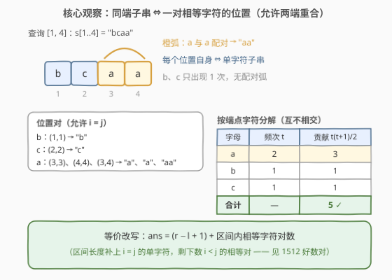
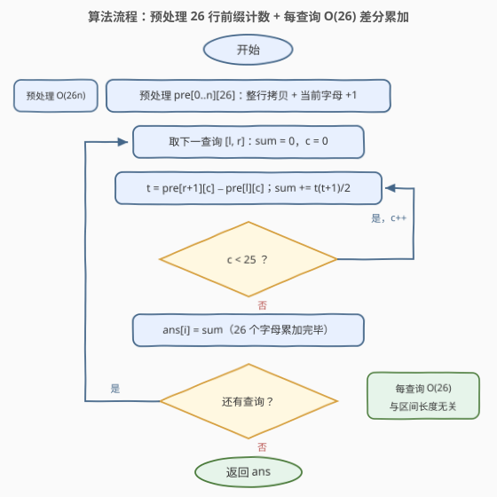
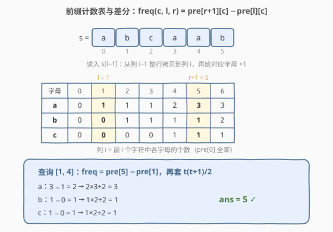

# 同端子串的数量

- **题目名称**：同端子串的数量
- **链接**：[2955. 同端子串的数量](https://leetcode.cn/problems/number-of-same-end-substrings/)
- **难度**：中等
- **标签**：数组、哈希表、字符串、计数、前缀和

## 1. 题目概述

> ⚠️ 本题为 LeetCode 付费题（🔒），官方 GraphQL 接口不返回题面；本文题意依据官方示例用例与 hints、并对照社区镜像收录的官方中文题面整理，与官方题面一致。

给定一个**下标从 0 开始**的字符串 `s`，以及一个二维整数数组 `queries`，其中 `queries[i] = [l_i, r_i]` 表示 `s` 中从索引 `l_i` 开始到索引 `r_i` 结束的子串（**包括两端**），即 `s[l_i..r_i]`。

如果一个**下标从 0 开始**且长度为 `n` 的字符串 `t` 两端的字符相同，即 `t[0] == t[n-1]`，则该字符串被称为**同端**字符串。**子串**是一个字符串中连续的非空字符序列。

返回一个数组 `ans`，其中 `ans[i]` 是第 `i` 个查询对应的子串 `s[l_i..r_i]` 中**同端子串的数量**。

**示例 1**：

```text
输入：s = "abcaab", queries = [[0,0],[1,4],[2,5],[0,5]]
输出：[1,5,5,10]
解释：每个查询的同端子串如下：
- s[0..0] 是 "a"，有 1 个："a"。
- s[1..4] 是 "bcaa"，有 5 个："b"、"c"、"a"、"a"、"aa"。
- s[2..5] 是 "caab"，有 5 个："c"、"a"、"a"、"b"、"aa"。
- s[0..5] 是 "abcaab"，有 10 个："a"、"b"、"c"、"a"、"a"、"b" 六个单字符，
  外加 "aa"、"abca"、"abcaa"、"bcaab"（首尾同为 a 或 b 的多字符子串）。
```

**示例 2**：

```text
输入：s = "abcd", queries = [[0,3]]
输出：[4]
解释：唯一的查询 s[0..3] 中每个字符恰好出现一次，只有 4 个单字符同端子串："a"bcd、a"b"cd、ab"c"d、abc"d"。
```

**约束条件**：

- $2 \le \text{s.length} \le 3 \times 10^4$
- `s` 仅包含小写英文字母。
- $1 \le \text{queries.length} \le 3 \times 10^4$
- $0 \le l_i \le r_i < \text{s.length}$

> 💡 一句话点题：**同端 ⟺ 子串首尾是一对相等字符（允许两端重合）**。把同端子串按「端点字符」分成 26 个互不相交的类，字符 $c$ 在区间内出现 $t$ 次就贡献 $\frac{t(t+1)}{2}$ 个（允许重合的位置对数，即 $\binom{t+1}{2}$）；频次不逐个数字符，用 26 行**前缀计数表** $O(1)$ 差分，单次查询 $O(26)$，总量 $O\big(26(n+q)\big)$。

---

## 2. 解题思路

### 2.1 暴力思路：逐查询重数，成本被区间长度绑架

最直接的做法分两档：

- **逐子串判定**：对每个查询枚举区间内所有子串并检查首尾字符是否相同。单查询 $O(\text{len}^2)$ 个子串、每个判定 $O(1)$，最坏总量 $q \cdot n^2 \approx 2.7 \times 10^{13}$，完全不可行。
- **逐查询数频次**：意识到同端子串由「一对相等字符位置」决定后，对每个查询线性扫一遍区间统计 26 个字母的频次 $t_c$，再套组合公式 $\sum_c \frac{t_c(t_c+1)}{2}$。单查询 $O(\text{len} + 26)$，总量 $O(q \cdot n) \approx 9 \times 10^8$——C++ 开 O2 勉强能过，Python 必然超时。

第二档的瓶颈很清晰：**重叠查询反复重数同一段字符**。查询成本被区间长度绑架，而「区间内某字符出现几次」本质上只是两个前缀量的差——这就是前缀和该出场的信号。

### 2.2 核心观察：按端点字符分解 + 前缀计数差分

**观察 1（按字符分解，位置对双射）**：同端子串的两端字符必须相同，因此全体同端子串按「端点字符 $c$」划分为至多 26 个**互不相交**的类，可以分别计数再相加。

固定字符 $c$，设它在查询区间 $[l, r]$ 内出现于位置 $p_1 < p_2 < \dots < p_t$。任取一对 $(p_i, p_j)$（**允许 $i = j$**），子串 $s[p_i..p_j]$ 两端皆为 $c$，是同端子串；反过来，每个两端为 $c$ 的同端子串的左右端点恰好是这样一对位置。这是一一对应，于是 $c$ 的贡献为可重合位置对的个数：

$$\binom{t}{2} + t = \binom{t+1}{2} = \frac{t(t+1)}{2}$$

其中 $i < j$ 的对给出两端**不同位置**的同端子串，$i = j$ 的对给出**单字符**子串（长度为 1 的子串首尾天然相同）。

由此还有一个常用等价改写：记区间内相等字符对数为 $P = \#\{(i,j) : l \le i < j \le r,\ s_i = s_j\}$，则

$$\text{ans} = \sum_c \frac{t_c(t_c+1)}{2} = (r - l + 1) + P$$

即「区间长度 + 相等字符对数」——这把本题与 1512「好数对」直接挂钩。



**观察 2（前缀计数 O(1) 差分）**：预处理 $pre[i][c]$ = 前 $i$ 个字符（即 $s[0..i-1]$）中字母 $c$ 的出现次数，$pre[0]$ 全零。则闭区间频次一行搞定：

$$freq(c, l, r) = pre[r+1][c] - pre[l][c]$$

每个查询只需枚举 26 个字母各做一次减法，**成本与区间长度完全无关**——这正是把 2.1 中 $O(q \cdot n)$ 的 $n$ 消掉的关键。

> 💡 一句话：**同端 = 一对相等字符的位置（允许重合）**，按字符分解后每个字母贡献 $\frac{t(t+1)}{2}$；频次由前缀计数表差分 $O(1)$ 得到，$O\big(26(n+q)\big)$ 收工。

### 2.3 算法流程图



**完整步骤**：

1. 预处理前缀计数表 $pre[0..n][0..25]$：$pre[i] \leftarrow pre[i-1]$ 整行拷贝后，$pre[i][s_{i-1}] \mathrel{+}= 1$
2. 对每个查询 $[l, r]$：置 $sum \leftarrow 0$
3. 枚举字母 $c \in \{a, \dots, z\}$：$t \leftarrow pre[r+1][c] - pre[l][c]$，$sum \leftarrow sum + \frac{t(t+1)}{2}$
4. 记录 $ans_i \leftarrow sum$，转向下一查询
5. 所有查询处理完毕，返回 $ans$

### 2.4 示例演算

先建 $s = $ `"abcaab"` 的前缀计数表（只列出现过的字母；$pre[i]$ 对应 $s[0..i-1]$）：

| $i$ | 0 | 1 | 2 | 3 | 4 | 5 | 6 |
|------|---|---|---|---|---|---|---|
| $s_{i-1}$ | — | a | b | c | a | a | b |
| **a** | 0 | 1 | 1 | 1 | 2 | 3 | 3 |
| **b** | 0 | 0 | 1 | 1 | 1 | 1 | 2 |
| **c** | 0 | 0 | 0 | 1 | 1 | 1 | 1 |

四个查询逐一演算（频次均由 $pre[r+1] - pre[l]$ 差分得到）：

| 查询 $[l, r]$ | 子串 | 频次（a/b/c） | 计算 $\sum t(t+1)/2$ | 答案 |
|------|------|------|------|------|
| $[0, 0]$ | `"a"` | 1 / 0 / 0 | $1$ | **1** |
| $[1, 4]$ | `"bcaa"` | 2 / 1 / 1 | $3 + 1 + 1$ | **5** |
| $[2, 5]$ | `"caab"` | 2 / 1 / 1 | $3 + 1 + 1$ | **5** |
| $[0, 5]$ | `"abcaab"` | 3 / 2 / 1 | $6 + 3 + 1$ | **10** |

以第二个查询 $[1, 4]$（子串 `"bcaa"`）展开位置对验证双射：`b` 在位置 1 → $(1,1)$ 给出 `"b"`；`c` 在位置 2 → $(2,2)$ 给出 `"c"`；`a` 在位置 3、4 → $(3,3)$、$(4,4)$ 给出两个 `"a"`，$(3,4)$ 给出 `"aa"`。共 $1 + 1 + 3 = 5$ 个，与官方答案一致 ✓。



顺带验证示例 2：`s = "abcd"` 中每个字符各出现 1 次，四个字母各贡献 $\frac{1 \times 2}{2} = 1$，答案 $4$ ✓。

---

## 3. 参考代码

### C++

```cpp
class Solution {
public:
    vector<int> sameEndSubstringCount(string s, vector<vector<int>>& queries) {
        int n = s.size();
        // pre[i][c]：前 i 个字符中字母 c 的出现次数
        vector<array<int, 26>> pre(n + 1);
        pre[0].fill(0);
        for (int i = 1; i <= n; i++) {
            pre[i] = pre[i - 1];                    // 整行拷贝
            pre[i][s[i - 1] - 'a']++;
        }
        vector<int> ans;
        ans.reserve(queries.size());
        for (auto& q : queries) {
            int l = q[0], r = q[1], sum = 0;
            for (int c = 0; c < 26; c++) {
                int t = pre[r + 1][c] - pre[l][c];  // 闭区间 [l, r] 内字母 c 的频次
                sum += t * (t + 1) / 2;
            }
            ans.push_back(sum);
        }
        return ans;
    }
};
```

### Python

```python
class Solution:
    def sameEndSubstringCount(self, s: str, queries: List[List[int]]) -> List[int]:
        pre = [[0] * 26]                        # pre[i][c]：前 i 个字符中字母 c 的出现次数
        for ch in s:
            row = pre[-1][:]                    # 整行拷贝
            row[ord(ch) - 97] += 1
            pre.append(row)

        ans = []
        for l, r in queries:
            total = 0
            for c in range(26):
                t = pre[r + 1][c] - pre[l][c]   # 闭区间 [l, r] 内字母 c 的频次
                total += t * (t + 1) // 2
            ans.append(total)
        return ans
```

> 💡 两版逻辑一致。细节提醒：① 前缀下标取「前 $i$ 个字符」的**左闭右开**语义，$pre[r+1] - pre[l]$ 恰好对齐闭区间 $[l, r]$，天然不越界；② 中间量 $t(t+1) \le 9 \times 10^8$、答案上限 $\binom{30001}{2} \approx 4.5 \times 10^8$，`int` 均安全（若 $n$ 放大到 $10^5$ 级需换 `long long`）；③ C++ 用 `array<int, 26>` 整行赋值比逐格填 26 次更简洁，Python 用切片拷贝同理。

---

## 4. 复杂度分析

| 维度 | 复杂度 | 说明 |
|------|--------|------|
| **时间复杂度** | $O\big(26(n + q)\big)$ | 预处理 $n$ 次整行拷贝共 $26n$；每查询 26 次减法与累加，与区间长度无关；$n, q \le 3 \times 10^4$ 时约 $1.6 \times 10^6$ 次基本操作 |
| **空间复杂度** | $O(26n)$ | 前缀计数表 $(n+1) \times 26$（不计返回数组） |

> ⚠️ 对比 2.1：逐查询扫描是 $O(q \cdot n) \approx 9 \times 10^8$（Python 超时），逐子串判定更是 $O(q \cdot n^2)$ 天文数字；前缀差分把每个查询的成本压到常数 $26$，代价只是 $26n$ 的预处理空间——典型的「空间换时间」。

---

## 5. 扩展：字符集变大怎么办？（莫队 O(1) 增删）

26 行前缀表把字符集大小 $\Sigma$ 写进了复杂度：空间 $O(\Sigma n)$、单查询 $O(\Sigma)$。小写字母 $\Sigma = 26$ 无所谓，但若字符集是任意字节甚至 Unicode，这张表就建不起了。此时观察 1 的**增量形式**给出另一条路——莫队算法：

窗口纳入一个字符 $c$（频次 $t \to t+1$）时，答案增量 $\frac{(t+1)(t+2)}{2} - \frac{t(t+1)}{2} = t + 1$；移出一个 $c$（$t \to t-1$）时减量恰为 $t$。也就是说**加一个字符加 $cnt[c]+1$、删一个字符减 $cnt[c]$（旧值）**，增删都是 $O(1)$、与字符集无关。莫队把查询离线按左端点分块排序，指针均摊移动 $O((n+q)\sqrt{n})$ 次，总复杂度 $O\big((n+q)\sqrt{n}\big)$，空间只需 $O(\Sigma)$ 的计数数组（甚至可用哈希表懒建）。

```python
class Solution:
    def sameEndSubstringCount(self, s: str, queries: List[List[int]]) -> List[int]:
        n, m = len(s), len(queries)
        B = max(1, int(n / (m ** 0.5)) + 1)      # 块长 ≈ n/√q
        order = sorted(range(m), key=lambda k: (queries[k][0] // B, queries[k][1]))
        cnt = [0] * 26
        cur, L, R = 0, 0, -1                      # cur = 当前窗口 Σ t(t+1)/2
        ans = [0] * m
        for k in order:
            l, r = queries[k]
            while R < r:                          # 右扩：t → t+1，增量 t+1
                R += 1
                c = ord(s[R]) - 97
                cur += cnt[c] + 1
                cnt[c] += 1
            while L > l:                          # 左扩：同理
                L -= 1
                c = ord(s[L]) - 97
                cur += cnt[c] + 1
                cnt[c] += 1
            while R > r:                          # 右缩：t → t−1，减量 t（旧值）
                c = ord(s[R]) - 97
                cur -= cnt[c]
                cnt[c] -= 1
                R -= 1
            while L < l:                          # 左缩：同理
                c = ord(s[L]) - 97
                cur -= cnt[c]
                cnt[c] -= 1
                L += 1
            ans[k] = cur
        return ans
```

本题约束下（$\Sigma = 26$、$n, q \le 3 \times 10^4$）前缀表版本在线、代码短、更快，是首选；莫队胜在**字符集无关**。此外若只需查询「单个字符在区间内的频次」，用每个字符的出现位置有序数组 + 二分即可 $O(\log n)$；强制在线的大字符集区间计数则要请出 wavelet tree / 主席树这类重武器，超出本文范围。

---

## 6. 面试要点

1. **为什么每个字符的贡献是 $\frac{t(t+1)}{2}$ 而不是 $t^2$？**

   - 同端子串由一对相等字符位置唯一决定，位置对是**无序**且**允许重合**的：$\binom{t}{2}$ 个 $i < j$ 的对（两端不同位置）加 $t$ 个 $i = j$ 的对（单字符子串），合计 $\binom{t+1}{2} = \frac{t(t+1)}{2}$。若算 $t^2$ 就把有序对（$(p_i, p_j)$ 与 $(p_j, p_i)$）重复统计了。

2. **前缀计数表的下标语义怎么定才不容易越界？**

   - 取「左闭右开」：$pre[i][c]$ 表示**前 $i$ 个字符**（$s[0..i-1]$）中 $c$ 的个数，$pre[0]$ 全零。闭区间 $[l, r]$ 的频次 = $pre[r+1][c] - pre[l][c]$，右端点 $r+1 \le n$ 不越界；若把 $pre[i]$ 定义成「以 $i$ 结尾」，边界就要小心 $l = 0$ 的特判。

3. **`int` 会不会溢出？**

   - 本题 $n \le 3 \times 10^4$：最坏全同字符时答案 $\binom{30001}{2} \approx 4.5 \times 10^8$，中间量 $t(t+1) \le 9 \times 10^8$，均在 `int` 范围内。若 $n$ 放大到 $10^5$（全同字符 $\approx 5 \times 10^9$），必须换 64 位整型。

4. **本题与 1512「好数对」、1177「构建回文串检测」是什么关系？**

   - 1512 是本题公式的全局版：$\sum_c \binom{t_c}{2}$ 数相等对，没有查询也没有 $i = j$ 的单字符贡献（本题 = 区间长度 + 区间相等对数）。1177 与本题共用「26 行前缀计数表 + 区间差分」的预处理，只是把「频次求和」换成「数出现奇数次的字母个数」。

5. **为什么莫队的增删是 $O(1)$？公式怎么推？**

   - 纳入一个 $c$：$t \to t+1$，$\frac{t(t+1)}{2} \to \frac{(t+1)(t+2)}{2}$，增量 $t+1$，即 `cur += cnt[c] + 1`；移出一个 $c$：$t \to t-1$，减量 $t$，即先 `cur -= cnt[c]` 再自减。增删成本与字符集大小无关，这是莫队能摆脱 $\Sigma$ 依赖的原因。

> 💡 **一句话总结**：同端 ⟺ 一对相等字符位置（允许重合）⟹ 按字符分解 $\sum \frac{t(t+1)}{2}$ ⟹ 前缀计数表差分把查询压到 $O(26)$；字符集变大时用莫队 $O(1)$ 增删替换前缀表。

---

## 7. 同类练习题

- [1512. 好数对的数目](https://leetcode.cn/problems/number-of-good-pairs/)（[题解](../1501-1600/1512_好数对的数目.md)）：全局版 $\sum \binom{t_c}{2}$ 相等对计数，本题公式去掉单字符贡献、去掉区间查询的形态
- [1177. 构建回文串检测](https://leetcode.cn/problems/can-make-palindrome-from-substring/)（[题解](../1101-1200/1177_构建回文串检测.md)）：同款 26 行前缀计数表 + 区间查询，把「频次求和」换成「数奇数次字母个数」
- [1180. 统计只含单一字母的子串](https://leetcode.cn/problems/count-substrings-with-only-one-distinct-letter/)（[题解](../1101-1200/1180_统计只含单一字母的子串.md)）：游程长度 $L$ 贡献 $\frac{L(L+1)}{2}$，同款组合公式按连续段分解
- [1513. 仅含 1 的子串数](https://leetcode.cn/problems/number-of-substrings-with-only-1s/)（[题解](../1501-1600/1513_仅含1的子串数.md)）：1 的游程贡献 $\binom{L+1}{2}$，本题 $\frac{t(t+1)}{2}$ 公式的游程版
- [303. 区域和检索 - 数组不可变](https://leetcode.cn/problems/range-sum-query-immutable/)（[题解](../0301-0400/303_区域和检索 - 数组不可变.md)）：前缀和区间差分的母题，本题把「一行和」扩成「26 行计数」
