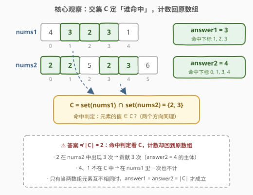
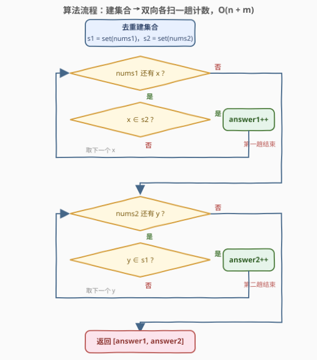
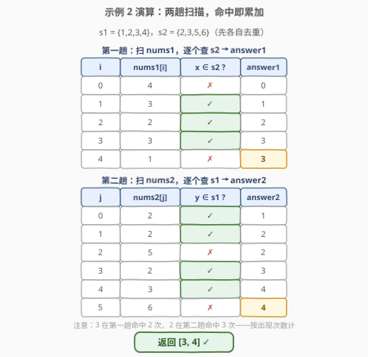

# LeetCode 找到两个数组中的公共元素 题解

## 1. 题目概述

- **标题 / 题号**：找到两个数组中的公共元素（#2956，easy）
- **链接**：https://leetcode.cn/problems/find-common-elements-between-two-arrays/
- **难度**：简单
- **标签**：数组、哈希表、集合

**题意**：给你两个下标从 **0** 开始的整数数组 `nums1` 和 `nums2`，它们分别含有 `n` 和 `m` 个元素。请你计算以下两个数值：

- `answer1`：使得 `nums1[i]` 在 `nums2` 中出现的下标 `i` 的数量。
- `answer2`：使得 `nums2[i]` 在 `nums1` 中出现的下标 `i` 的数量。

返回 `[answer1, answer2]`。

**示例 1**：

```text
输入：nums1 = [2,3,2], nums2 = [1,2]
输出：[2,1]
解释：nums1 中下标 0、2 的元素 2 出现在 nums2 中，answer1 = 2；
     nums2 中下标 1 的元素 2 出现在 nums1 中，answer2 = 1。
```

**示例 2**：

```text
输入：nums1 = [4,3,2,3,1], nums2 = [2,2,5,2,3,6]
输出：[3,4]
解释：nums1 中下标在 1、2、3 的元素在 nums2 中也存在，answer1 = 3；
     nums2 中下标在 0、1、3、4 的元素在 nums1 中也存在，answer2 = 4。
```

**示例 3**：

```text
输入：nums1 = [3,4,2,3], nums2 = [1,5]
输出：[0,0]
解释：两个数组中没有相同的数字。
```

**约束**：

- $n = \mathrm{nums1.length}$，$m = \mathrm{nums2.length}$
- $1 \le n, m \le 100$
- $1 \le \mathrm{nums1}[i], \mathrm{nums2}[i] \le 100$

> 💡 读题先翻译：题面绕（「使得……出现的下标 $i$ 的数量」），本质就是——**answer1 = nums1 中值也存在于 nums2 的元素个数，answer2 对称**。它是 349「两个数组的交集」的**计数变体**：不返回交集元素本身，而是分别在两个**原数组**里数「值落在交集中」的元素个数。

## 2. 解题思路

### 2.1 暴力思路：逐元素线性查找

官方 hint 直接给了答案：约束很小，暴力可解。对 `nums1` 的每个元素，扫整个 `nums2` 判存在性；`answer2` 对称处理：

```text
ans1 = 0
for x in nums1:            # n 次
    if x in nums2:         # 对列表线性查找，O(m)
        ans1 += 1
# ans2 同理：扫 nums2，查 nums1
```

时间 $O(n \cdot m)$，本题 $n, m \le 100$，最多 $10^4$ 次比较，轻松通过。但它的要害在于：**同一个「$x$ 是否在 nums2 中」的问题被重复问了 $n$ 遍，而答案只取决于 $x$ 的值**——把 `nums2` 去重放进哈希集合，每次查询降为 $O(1)$，重复提问的成本就消失了。

### 2.2 核心观察：存在性判定 → 哈希集合 + 双向对称



三个观察合起来就是全部：

1. **只问存在性，不问次数**：判定「`nums1[i]` 在 `nums2` 中出现」只需要知道**值在不在**——**集合**（去重）就够了，不需要计数映射。$s_2 = \mathrm{set}(\mathrm{nums2})$ 建好后，查询均摊 $O(1)$。
2. **双向对称**：`answer1` 要查 $s_2$，`answer2` 要查 $s_1$——互相把对方装进集合，各自扫自己的一趟。
3. **计数在原数组，不在集合**：`answer1` 数的是 `nums1` 中命中元素的**出现次数**，不是交集大小。统一视角：设 $C = \mathrm{set}(\mathrm{nums1}) \cap \mathrm{set}(\mathrm{nums2})$（共同值集合），则（$[\cdot]$ 为 0/1 指示函数）

$$\mathrm{answer}_1=\sum_{x \in \mathrm{nums}_1}[\,x \in C\,],\qquad \mathrm{answer}_2=\sum_{y \in \mathrm{nums}_2}[\,y \in C\,]$$

（对 $x \in \mathrm{nums1}$ 有 $x \in s_2 \Leftrightarrow x \in C$，因为 $x$ 已保证在 $s_1$ 中；$y$ 同理。）

> ⚠️ **最容易踩的坑**：把答案算成交集大小 $|C|$。示例 2 中 $C = \{2,3\}$，$|C| = 2$，但答案是 $[3,4]$——因为 2 在 `nums2` 中出现 3 次、3 出现 1 次，**命中计数发生在原数组上，重复元素每次出现都计一次**。这正是本题与 349「两个数组的交集」（返回去重后的交集元素）的本质区别。

### 2.3 算法流程图



**完整步骤**：

1. **建集合**：$s_1 = \mathrm{set}(\mathrm{nums1})$、$s_2 = \mathrm{set}(\mathrm{nums2})$，各一趟去重；
2. **第一趟**：`answer1 = 0`，遍历 `nums1` 的每个 $x$，$x \in s_2$ 则 `answer1++`；
3. **第二趟**：`answer2 = 0`，遍历 `nums2` 的每个 $y$，$y \in s_1$ 则 `answer2++`；
4. **返回** `[answer1, answer2]`。

> 💡 也可以先算交集 $C = s_1 \cap s_2$，再对 $C$ 做两趟计数——判定对象从「对方的集合」换成「交集」，语义完全等价（见 2.2 的等价证明）。

### 2.4 示例演算



以示例 2 演算（$s_1 = \{1,2,3,4\}$，$s_2 = \{2,3,5,6\}$）。

**第一趟**（扫 `nums1`，查 $s_2$）：

| $i$ | $\mathrm{nums1}[i]$ | $\in s_2$ ? | `answer1` |
|-----|--------------------|-------------|-----------|
| 0 | 4 | ✗ | 0 |
| 1 | 3 | ✓ | 1 |
| 2 | 2 | ✓ | 2 |
| 3 | 3 | ✓ | 3 |
| 4 | 1 | ✗ | 3 |

**第二趟**（扫 `nums2`，查 $s_1$）：

| $j$ | $\mathrm{nums2}[j]$ | $\in s_1$ ? | `answer2` |
|-----|--------------------|-------------|-----------|
| 0 | 2 | ✓ | 1 |
| 1 | 2 | ✓ | 2 |
| 2 | 5 | ✗ | 2 |
| 3 | 2 | ✓ | 3 |
| 4 | 3 | ✓ | 4 |
| 5 | 6 | ✗ | 4 |

返回 `[3, 4]` ✓。注意第一趟里 3 命中两次（下标 1、3）、第二趟里 2 命中三次（下标 0、1、3）——「计数按出现次数」的直接体现。

## 3. 参考代码

### C++

```cpp
class Solution {
  public:
    vector<int> findIntersectionValues(vector<int>& nums1, vector<int>& nums2) {
        unordered_set<int> s1(nums1.begin(), nums1.end());
        unordered_set<int> s2(nums2.begin(), nums2.end());
        int ans1 = 0, ans2 = 0;
        for (int x : nums1) ans1 += s2.count(x);
        for (int y : nums2) ans2 += s1.count(y);
        return {ans1, ans2};
    }
};
```

### Python

```python
class Solution:
    def findIntersectionValues(self, nums1: List[int], nums2: List[int]) -> List[int]:
        s1, s2 = set(nums1), set(nums2)
        return [sum(x in s2 for x in nums1), sum(y in s1 for y in nums2)]
```

> 💡 语言细节：C++ 用迭代器区间一步构造 `unordered_set`；`count` 返回 0/1，可直接当布尔累加。Python 的 `sum(x in s2 for x in nums1)` 把布尔当 0/1 求和，一行一个答案。

## 4. 复杂度分析

| 维度 | 复杂度 | 说明 |
|------|--------|------|
| 时间复杂度 | $O(n + m)$ | 建两个集合 $O(n) + O(m)$，两趟扫描各 $O(n)$、$O(m)$，每次集合查询均摊 $O(1)$ |
| 空间复杂度 | $O(n + m)$ | 两个哈希集合；值域 $1 \sim 100$ 改用 bool 数组可降到 $O(V)$（$V = 101$，见第 5 节） |

## 5. 扩展：值域小 → 布尔数组代替哈希集合

约束给了 $1 \le \mathrm{nums}[i] \le 100$：值域是连续小区间，用 `bool` 数组做桶标记即可，查询 $O(1)$ 且常数远小于哈希（无哈希计算、无冲突探测、缓存友好）：

```cpp
class Solution {
  public:
    vector<int> findIntersectionValues(vector<int>& nums1, vector<int>& nums2) {
        bool in1[101] = {false}, in2[101] = {false};
        for (int x : nums1) in1[x] = true;
        for (int y : nums2) in2[y] = true;
        int ans1 = 0, ans2 = 0;
        for (int x : nums1) ans1 += in2[x];
        for (int y : nums2) ans2 += in1[y];
        return {ans1, ans2};
    }
};
```

> 💡 **set 还是桶？** 值域小且稠密（如本题 $1 \sim 100$）→ 桶最快；值域大或稀疏（如含负数、$10^9$ 级别）→ 哈希集合（或桶 + 偏移量）。面试先给哈希版（不依赖值域假设的通用解），再主动提值域优化，是标准的加分叙事。

顺带一提：如果题目改成「返回交集中每个元素在两边的**出现次数**」，就得从 `set` 升级到计数映射（`Counter` / `unordered_map`）——那正是 [350. 两个数组的交集 II](https://leetcode.cn/problems/intersection-of-two-arrays-ii/)（[题解](../0301-0400/350_两个数组的交集II.md)）的做法。**存在性用 set，计数用 map**，是哈希题的基本功分界线。

## 6. 面试要点

1. **题面绕，怎么快速抓住本质？**

   - 「使得 nums1[i] 在 nums2 中出现的下标 i 的数量」= nums1 中值出现在 nums2 里的**元素个数**
   - 双向各问一遍；计数按原数组的出现次数，与交集大小无关

2. **为什么用 set 而不用 Counter？**

   - 判定只关心「在不在」，不关心「几次」——存在性问题是集合问题
   - 用 Counter 也能过，但多存了用不上的次数信息；改成 350 题那种要次数的问法才需要 Counter

3. **answer 会不会等于交集大小？什么时候相等？**

   - 一般不等：示例 2 中 $|C| = 2$ 但 answer = [3,4]，重复元素按次计
   - 当两个数组各自元素互不相同时，才有 $\mathrm{answer}_1 = \mathrm{answer}_2 = |C|$

4. **O(n·m) 暴力和 O(n+m) 哈希，面试怎么取舍？**

   - 本题 $n, m \le 100$，暴力 $10^4$ 完全能过（官方 hint 也点名 brute force 可行）
   - 但「重复存在性查询 → 建集合摊销」是通用套路：询问规模一旦上到 $10^5$，暴力立刻不可行，哈希是标准答案

5. **值域 1~100 还能怎么优化？**

   - bool 数组做桶标记，$O(V)$ 空间、$O(1)$ 精确查询，常数优于哈希（见第 5 节）
   - 更极端地，101 个值可以压进两个 128 位整数做位图，空间降到 $O(V/64)$

> 💡 **一句话总结**：双向存在性计数 = 互相 `set(对方)` + 各扫自己一趟；命中判定看交集，计数回原数组按出现次数——别把答案错算成交集大小。

## 同类练习题

| # | 题目 | 与本题的关联 |
|---|------|-------------|
| 349 | [两个数组的交集](https://leetcode.cn/problems/intersection-of-two-arrays/)（[题解](../0301-0400/349_两个数组的交集.md)） | 本题的「去重版」——返回交集元素本身而非计数，set 交集运算的直接应用 |
| 350 | [两个数组的交集 II](https://leetcode.cn/problems/intersection-of-two-arrays-ii/)（[题解](../0301-0400/350_两个数组的交集II.md)） | 要出现次数的交集 → set 升级为 Counter 计数映射，第 5 节扩展的本体 |
| 2215 | [找出两数组的不同](https://leetcode.cn/problems/find-the-difference-of-two-arrays/)（[题解](../2201-2300/2215_找出两数组的不同.md)） | 镜像题——双向求**差集** $A \setminus B$、$B \setminus A$，本题求双向交集计数，一进一出对照着看 |
| 2248 | [多个数组求交集](https://leetcode.cn/problems/intersection-of-multiple-arrays/)（[题解](../2201-2300/2248_多个数组求交集.md)） | 交集从两个数组推广到多个，逐个 set 收缩候选集 |
