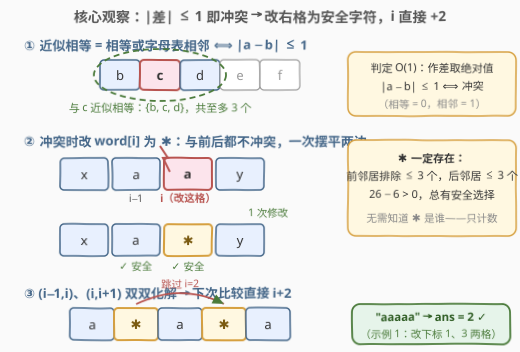
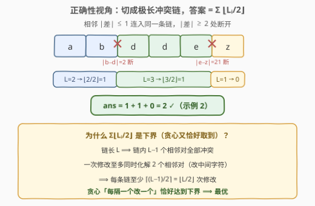
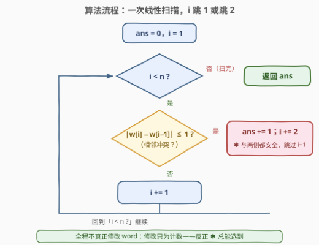
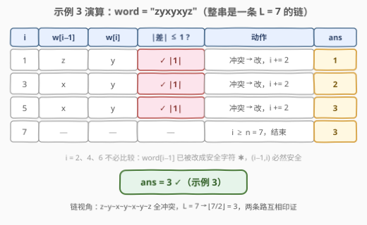

# 消除相邻近似相等字符

- **题目名称**：消除相邻近似相等字符
- **链接**：[2957. 消除相邻近似相等字符](https://leetcode.cn/problems/remove-adjacent-almost-equal-characters/)
- **难度**：中等
- **标签**：贪心、字符串、动态规划

## 1. 题目概述

给你一个下标从 **0** 开始的字符串 `word`。一次操作中，你可以选择 `word` 中任意一个下标 `i`，将 `word[i]` 修改成任意一个小写英文字母。

请你返回消除 `word` 中所有相邻**近似相等**字符的**最少**操作次数。

两个字符 `a` 和 `b` 如果满足 `a == b` 或者 `a` 和 `b` 在字母表中是相邻的，那么我们称它们是**近似相等**字符。

**示例 1**：

```text
输入：word = "aaaaa"
输出：2
解释：将 word 变为 "acaca"，该字符串没有相邻近似相等字符。
```

**示例 2**：

```text
输入：word = "abddez"
输出：2
解释：将 word 变为 "ybdoez"，该字符串没有相邻近似相等字符。
```

**示例 3**：

```text
输入：word = "zyxyxyz"
输出：3
解释：将 word 变为 "zaxaxaz"，该字符串没有相邻近似相等字符。
```

**约束条件**：

- $1 \le \mathrm{word.length} \le 100$
- `word` 只包含小写英文字母

> 💡 读题先翻译：「近似相等」就是**字符编码差不超过 1**（相等差 0，字母表相邻差 1）。目标：让每个相邻对 $(i-1, i)$ 的编码差都 $\ge 2$，求最少改动几个位置。它是「相邻不能相同」类问题（如 1758 交替二进制串）的**加强版**——不光不能相等，还不能贴着。

---

## 2. 解题思路

### 2.1 暴力思路

先排掉一个直觉陷阱：**数相邻冲突对的个数当答案**？反例就是 `"aaaaa"`——4 个相邻对全部冲突，但答案是 2（改下标 1、3 两格成 `acaca`）。因为**一次修改可以同时化解两个相邻对**，所以冲突对计数既不是下界也不是答案。

真·暴力：每个位置有 26 种改法，DFS 枚举所有方案是 $O(26^n)$，爆炸。可行的朴素解是 **DP 兜底**——把「每个位置最终改成哪个字母」当状态（见第 5 节），$O(26^2 n)$，本题 $n \le 100$ 时约 $6.8 \times 10^5$ 次转移，轻松通过。这是稳妥的保底解法，但远非最优。

### 2.2 核心观察：贪心——冲突时改右格，i 直接跳 2



三个观察合起来就是全部：

1. **判定 $O(1)$**：相邻对冲突 $\iff |w[i] - w[i-1]| \le 1$——字符编码作差取绝对值即可，无需分类讨论「相等/相邻」。
2. **冲突时改右格 $w[i]$，且新字符可以与前后都不冲突**：与某个字符近似相等的字母至多 3 个（它自身及左右邻居），所以「前邻居 + 后邻居」至多排除 $3 + 3 = 6$ 个字母，$26 - 6 > 0$，**安全字符 ✱ 必然存在**。这正是官方 hint 2 的关键：只需证明存在，**不必真的找出它是谁**。
3. **跳 2**：既然改完的 $w[i]$ 与左右两侧都安全，相邻对 $(i-1, i)$ 和 $(i, i+1)$ 双双化解，下一场比较直接从 $(i+1, i+2)$ 打响——$i \mathrel{+}= 2$。一次修改覆盖两个相邻对，这就是 `"aaaaa"` 只需 2 次的原因。

**正确性（切链下界）**：把 `word` 在「相邻差 $\ge 2$」处切断，得到若干条**极长冲突链**：



- 链长 $L$ ⟹ 链内 $L-1$ 个相邻对**全部**冲突；
- 一次修改至多同时化解 2 个相邻对（改中间字符）；
- 所以每条链至少需要 $\lceil (L-1)/2 \rceil = \lfloor L/2 \rfloor$ 次修改——这是**下界**；
- 而贪心「遇到冲突改右格、跳 2」恰好等价于逐链**每隔一个改一个**，每条链恰好改 $\lfloor L/2 \rfloor$ 次——**上界与下界重合**，贪心最优：

$$\mathrm{ans} = \sum_i \left\lfloor \frac{L_i}{2} \right\rfloor$$

### 2.3 算法流程图



**完整步骤**：

1. 初始化 `ans = 0`，扫描指针 `i = 1`；
2. 若 $i \ge n$，扫描结束，返回 `ans`；
3. 比较 $w[i]$ 与 $w[i-1]$ 的编码差：若 $\le 1$（冲突），`ans += 1`（想象把 $w[i]$ 改成安全字符 ✱），`i += 2`——相邻对 $(i-1,i)$、$(i,i+1)$ 同时化解；
4. 否则（安全），`i += 1`；
5. 回到步骤 2。

> ⚠️ **实现要点**：全程**不真正修改** `word`——修改只为计数服务，反正 ✱ 总能选到。若在循环里真去改字符，反而要费心构造「与两侧都安全」的具体字母，纯属自找麻烦。

### 2.4 示例演算



以示例 3 `word = "zyxyxyz"` 演算（编码差：$|y-z|=1$、$|x-y|=1$……全串相邻差全为 1）：

| $i$ | $w[i-1]$ | $w[i]$ | 冲突？ | 动作 | `ans` |
|-----|----------|--------|--------|------|-------|
| 1 | z | y | ✓ \|1\| ≤ 1 | 改，`i += 2` | 1 |
| 3 | x | y | ✓ \|1\| ≤ 1 | 改，`i += 2` | 2 |
| 5 | x | y | ✓ \|1\| ≤ 1 | 改，`i += 2` | 3 |
| 7 | — | — | — | $i \ge n = 7$，结束 | 3 |

$i = 2, 4, 6$ 被跳过：$w[i-1]$ 已被改成安全字符 ✱，$(i-1, i)$ 必然安全。返回 3 ✓。

**链视角复核**：整串是一条 $L = 7$ 的链，$\lfloor 7/2 \rfloor = 3$，与贪心一致。示例 2 `"abddez"` 切链 $a\text{-}b \mid d\text{-}d\text{-}e \mid z$，$\lfloor 2/2 \rfloor + \lfloor 3/2 \rfloor + \lfloor 1/2 \rfloor = 1 + 1 + 0 = 2$ ✓。

---

## 3. 参考代码

### C++

```cpp
class Solution {
  public:
    int removeAlmostEqualCharacters(string word) {
        int ans = 0;
        for (int i = 1; i < (int)word.size(); i++) {
            if (abs(word[i] - word[i - 1]) <= 1) {
                ans++;  // 把 word[i] 改成与前后都不冲突的字符（必存在，无需构造）
                i++;    // 相邻对 (i-1,i) 与 (i,i+1) 双双化解，直接跳到 i+2
            }
        }
        return ans;
    }
};
```

### Python

```python
class Solution:
    def removeAlmostEqualCharacters(self, word: str) -> int:
        ans, i = 0, 1
        while i < len(word):
            if abs(ord(word[i]) - ord(word[i - 1])) <= 1:
                ans += 1   # 改 word[i] 为安全字符，只计数不落盘
                i += 2     # (i-1,i) 与 (i,i+1) 同时化解
            else:
                i += 1
        return ans
```

> 💡 语言细节：C++ 在 `for` 循环体内额外 `i++`，配合循环自增正好实现「跳 2」；Python 用 `while` 手动控制步进更直观。`char` 直接相减即得编码差（Python 需 `ord`），无需哈希或预处理。

---

## 4. 复杂度分析

| 维度 | 复杂度 | 说明 |
|------|--------|------|
| 时间复杂度 | $O(n)$ | 单趟扫描，每步 $O(1)$ 判定（作差取绝对值） |
| 空间复杂度 | $O(1)$ | 只维护指针与计数器，不修改、不复制原串 |

---

## 5. 扩展：链分解写法与通用 DP

**等价写法——链分解计数**：按 2.2 的正确性证明，直接统计每条极长链的长度并求和 $\sum \lfloor L_i/2 \rfloor$，与贪心殊途同归：

```python
class Solution:
    def removeAlmostEqualCharacters(self, word: str) -> int:
        ans, chain = 0, 1
        for i in range(1, len(word)):
            if abs(ord(word[i]) - ord(word[i - 1])) <= 1:
                chain += 1
            else:
                ans += chain // 2
                chain = 1
        return ans + chain // 2
```

**通用 DP（面试保底）**：若不放心贪心论证，可以用 DP 稳妥求解。令 $dp[c]$ 为「已处理前缀的末尾字符最终为 $c$」的最少修改数，转移时枚举当前字符的目标值 $c$，从前缀里挑一个与 $c$ 差 $\ge 2$ 的前驱取最小：

```python
class Solution:
    def removeAlmostEqualCharacters(self, word: str) -> int:
        INF = 0x3F3F3F3F
        dp = [0] * 26          # 空前缀：任意末尾字符代价 0
        for ch in word:
            ndp = [INF] * 26
            for c in range(26):
                cost = 0 if c == ord(ch) - 97 else 1
                best = min(dp[p] for p in range(26) if abs(p - c) > 1)
                ndp[c] = best + cost
            dp = ndp
        return min(dp)
```

时间 $O(26^2 n)$、空间 $O(26)$。这个版本**不依赖「安全字符存在」的论证**，是这类「相邻约束 + 最少修改」问题的万能模板（1758、926 都是它的退化形式）。顺带一提：由于禁的是 $|p - c| \le 1$（只禁 3 个前驱），内层最小值可用前后缀 $\min$ 优化到 $O(26 n)$，本题 $n \le 100$ 无此必要。

> 💡 **贪心 vs DP 怎么选**：先给贪心（$O(n)$，证明靠切链下界），被追问正确性时退回 DP 兜底——「快解 + 稳证」是标准叙事。

---

## 6. 面试要点

1. **「近似相等」如何 O(1) 判定？**

   - 字符编码作差取绝对值：$|a - b| \le 1$ ⟺ 相等（差 0）或字母表相邻（差 1）
   - 不要写成 `a == b || a == b+1 || a == b-1` 再分类讨论，作差一行搞定

2. **为什么不能直接数冲突对个数？**

   - 反例 `"aaaaa"`：4 个相邻对全冲突，答案却是 2——改中间字符可一次化解**两个**相邻对
   - 冲突对计数高估了代价；正确结构是切链，每条链 $L$ 贡献 $\lfloor L/2 \rfloor$

3. **冲突时改左格还是右格？为什么改完能跳 2？**

   - 从左往右扫时左格已保证安全，改右格 $w[i]$；新字符可选成与前、后邻居都不冲突（各排除 $\le 3$ 个，$26 - 6 > 0$ 必存在）
   - 于是 $(i-1,i)$ 与 $(i,i+1)$ 双双化解，下次比较从 $i+2$ 起；反向扫描改左格对称成立

4. **怎么证明贪心最优？**

   - 切链下界：链长 $L$ 有 $L-1$ 个全冲突相邻对，每次修改至多覆盖 2 个对 ⟹ $\ge \lceil (L-1)/2 \rceil = \lfloor L/2 \rfloor$
   - 贪心「每隔一个改一个」恰好逐链达到该下界 ⟹ 上界 = 下界，最优

5. **代码里真的要修改字符串、构造安全字符吗？**

   - 不用：题目只要次数，hint 2 明说「只需证明存在，无需找出」——计数后直接跳 2 即可
   - 若面试官追问「输出修改后的串」：逐冲突位置枚举 26 个字母，取与两侧差都 $\ge 2$ 的第一个（必存在）

> 💡 **一句话总结**：判定看 $|\text{差}| \le 1$，冲突改右格、一步跳 2——一次修改摆平两个相邻对；正确性锚点是切链下界 $\sum \lfloor L_i/2 \rfloor$。

---

## 7. 同类练习题

- [1758. 生成交替二进制字符串的最少操作数](https://leetcode.cn/problems/minimum-changes-to-make-alternating-binary-string/)（[题解](../1701-1800/1758_生成交替二进制字符串的最少操作数.md)）：相邻必须「严格不同」的最少翻转——本题约束（差 $\ge 2$）的二值弱化版，同样一次翻转可照顾一边
- [926. 将字符串翻转到单调递增](https://leetcode.cn/problems/flip-string-to-monotone-increasing/)（[题解](../0901-1000/926_将字符串翻转到单调递增.md)）：相邻非递减约束下的最少翻转，前缀计数与 DP 两种视角
- [1047. 删除字符串中的所有相邻重复项](https://leetcode.cn/problems/remove-all-adjacent-duplicates-in-string/)（[题解](../1001-1100/1047_删除字符串中的所有相邻重复项.md)）：相邻相等用栈消除——对照本题「改字符」vs「删字符」两种消除手段
- [1578. 使绳子变成彩色的最短时间](https://leetcode.cn/problems/minimum-time-to-make-rope-colorful/)（[题解](../1501-1600/1578_使绳子变成彩色的最短时间.md)）：相邻同色必须去其一的贪心保留——同为「相邻冲突逐对解决」范式
- [2663. 字典序最小的美丽字符串](https://leetcode.cn/problems/lexicographically-smallest-beautiful-string/)（[题解](../2601-2700/2663_字典序最小的美丽字符串.md)）：相邻不等且差 $\ne 1$ 的字典序最小构造——本题约束的正向构造版，「安全字符选择」的具体化
