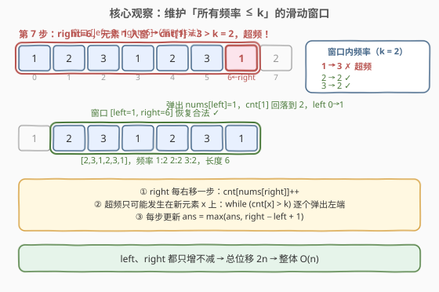
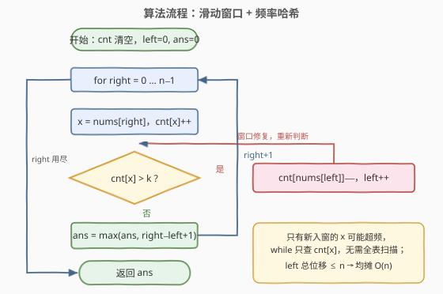
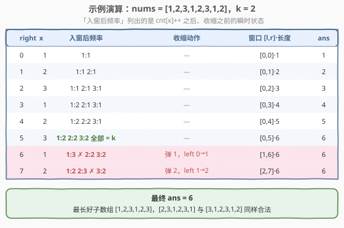

# 最多 K 个重复元素的最长子数组

- **题目名称**：最多 K 个重复元素的最长子数组
- **链接**：[2958. 最多 K 个重复元素的最长子数组](https://leetcode.cn/problems/length-of-longest-subarray-with-at-most-k-frequency/)
- **难度**：中等
- **标签**：数组、哈希表、滑动窗口

## 1. 题目概述

给你一个整数数组 `nums` 和一个整数 `k`。

一个元素 `x` 在数组中的**频率**指的是它在数组中的出现次数。

如果一个子数组中所有元素的频率都**小于等于** $k$，那么我们称这个数组是**好**子数组。

请你返回 `nums` 中**最长好**子数组的长度。

**子数组**指的是一个数组中一段连续非空的元素序列。

**示例 1**：

```text
输入：nums = [1,2,3,1,2,3,1,2], k = 2
输出：6
解释：最长好子数组是 [1,2,3,1,2,3]，值 1、2 和 3 在子数组中的频率都没有超过 k = 2。
      [2,3,1,2,3,1] 和 [3,1,2,3,1,2] 也是好子数组。
```

**示例 2**：

```text
输入：nums = [1,2,1,2,1,2,1,2], k = 1
输出：2
解释：最长好子数组是 [1,2]，值 1 和 2 在子数组中的频率都没有超过 k = 1。[2,1] 也是好子数组。
```

**示例 3**：

```text
输入：nums = [5,5,5,5,5,5,5], k = 4
输出：4
解释：最长好子数组是 [5,5,5,5]，值 5 的频率没有超过 k = 4。
```

**约束条件**：

- $1 \le \text{nums.length} \le 10^5$
- $1 \le \text{nums[i]} \le 10^9$
- $1 \le k \le \text{nums.length}$

> 💡 本题是 [3. 无重复字符的最长子串](https://leetcode.cn/problems/longest-substring-without-repeating-characters/) 的**频率泛化版**：把「每个元素至多出现 1 次」放宽成「每个元素至多出现 $k$ 次」，解法仍是同一个模板——**滑动窗口 + 哈希计数**，只是收缩条件从 `cnt[x] > 1` 变成 `cnt[x] > k`。

---

## 2. 解题思路

### 2.1 暴力思路

枚举所有子数组 $[i, j]$（共 $O(n^2)$ 个），对每个固定左端点 $i$，向右扩展 $j$ 并用哈希表**增量**维护频率：`nums[j]` 入表后若 `cnt[nums[j]] > k` 则停止扩展，记录长度 $j - i$。

单次扩展均摊 $O(1)$，总计 $O(n^2) \approx 10^{10}$（$n = 10^5$），仍然超时。瓶颈在于：**以不同 $i$ 开头的窗口大量重叠，同样的元素被反复数了好多遍**。

### 2.2 核心观察：滑动窗口 + 频率哈希



**观察 1（合法性对窗口长度单调）**：「所有元素频率 $\le k$」是**收缩方向单调**的性质——窗口越长，元素只多不少，频率只增不减。因此固定右端点 $right$ 时，合法的左端点构成一段**前缀区间** $[0, f(right)]$；且 $right$ 右移后 $f$ 单调不减（窗口变长只会让合法起点更靠右）。这正是**同向双指针**适用的信号：`left` 和 `right` 都只增不减。

**观察 2（超频只可能发生在新入窗的元素上）**：设当前窗口合法，`right` 入窗只执行了 `cnt[x]++` 一个增量操作，其它元素的计数没有变化、依然 $\le k$。所以需要修复的**只有 $x$ 一个**——`while (cnt[x] > k)` 逐个弹出左端元素即可，无需全表扫描。

**观察 3（均摊 $O(n)$）**：`left` 从头到尾只前进不后退，全程最多移动 $n$ 步；`right` 同理。两层循环嵌套但指针总位移 $2n$，总复杂度 $O(n)$。

> 💡 与 3 题的一个微妙差异：3 题里 $k=1$，可以用「记录每个字符最新下标」让 `left` **直接跳**到重复位置的下一位；本题 $k > 1$ 时，`left` 必须**逐个弹出**（每弹一个都要给对应元素减计数），不能跳——但因为 `left` 总位移不超过 $n$，均摊复杂度不受影响。

### 2.3 算法流程图



**完整步骤**：

1. 初始化哈希表 `cnt`（元素 → 窗口内出现次数）、`left = 0`、`ans = 0`
2. `right` 从 $0$ 到 $n-1$ 逐个右移，令 $x = nums[right]$，执行 `cnt[x]++`
3. 若 `cnt[x] > k`：循环执行 `cnt[nums[left]]--`、`left++`，直到 `cnt[x] == k`（窗口恢复合法）
4. 更新 `ans = max(ans, right - left + 1)`
5. `right` 走完全程，返回 `ans`

### 2.4 示例演算

以示例 1 `nums = [1,2,3,1,2,3,1,2]`，`k = 2` 为例（完整 8 步见下图）：

- 前 6 步窗口持续扩张：`right = 5` 时窗口 `[1,2,3,1,2,3]`，三个元素频率恰好都是 2，`ans = 6`。
- 第 7 步 `right = 6`：`1` 入窗后 `cnt[1] = 3 > 2`，弹出 `left = 0` 处的 `1`，窗口变为 `[2,3,1,2,3,1]`，长度仍为 6。
- 第 8 步 `right = 7`：`2` 入窗后 `cnt[2] = 3 > 2`，弹出 `left = 1` 处的 `2`，窗口变为 `[3,1,2,3,1,2]`，长度仍为 6。
- 最终答案 $6$ ✓



顺带验证示例 2、3：`[1,2,1,2,1,2,1,2]`、$k=1$ 时任意 3 连必含两个相同值，`ans = 2` ✓；`[5,5,5,5,5,5,5]`、$k=4$ 时第 5 个 `5` 入窗即超频，`ans = 4` ✓。

---

## 3. 参考代码

### C++

```cpp
class Solution {
  public:
    int maxSubarrayLength(vector<int>& nums, int k) {
        unordered_map<int, int> cnt;   // 元素 -> 窗口内出现次数
        int left = 0, ans = 0;

        for (int right = 0; right < (int)nums.size(); right++) {
            int x = nums[right];
            cnt[x]++;                      // 先入窗
            while (cnt[x] > k) {           // 只有 x 可能超频
                cnt[nums[left]]--;         // 逐个弹出左端
                left++;
            }
            ans = max(ans, right - left + 1);
        }

        return ans;
    }
};
```

### Python

```python
class Solution:
    def maxSubarrayLength(self, nums: List[int], k: int) -> int:
        cnt = defaultdict(int)      # 元素 -> 窗口内出现次数
        left = ans = 0

        for right, x in enumerate(nums):
            cnt[x] += 1                 # 先入窗
            while cnt[x] > k:           # 只有 x 可能超频
                cnt[nums[left]] -= 1    # 逐个弹出左端
                left += 1
            ans = max(ans, right - left + 1)

        return ans
```

> ⚠️ **注意** `while` 的判断对象是**新入窗的 $x$** 而非整个哈希表。若写成「检查所有元素的频率」会在每个位置多花 $O(\text{不同元素数})$ 的时间，最坏退化到 $O(n^2)$。`left` 弹出过程中 `cnt[x]` 迟早降到 $k$（$x$ 自己的早期出现一定会被弹出），循环必然终止。

---

## 4. 复杂度分析

| 维度 | 复杂度 | 说明 |
|------|--------|------|
| 时间复杂度 | $O(n)$ | `left`、`right` 各至多前进 $n$ 步，哈希操作均摊 $O(1)$ |
| 空间复杂度 | $O(\min(n, U))$ | 哈希表只存**窗口内出现过的元素**，$U$ 为不同元素个数，最坏 $O(n)$ |

---

## 5. 扩展：等价的「先收缩再入窗」写法

上面代码是「先入窗、后修复」；也存在对称的「先收缩、后入窗」写法——先把窗口缩到给 $x$ 腾出一个名额，再放入 $x$，窗口**始终合法**：

```cpp
for (int right = 0; right < n; right++) {
    while (cnt[nums[right]] >= k) {   // x 已有 k 个，先腾位置
        cnt[nums[left]]--;
        left++;
    }
    cnt[nums[right]]++;               // 再入窗，必然合法
    ans = max(ans, right - left + 1);
}
```

两种写法等价，都是「不变式驱动」：前者维持「修复后合法」，后者维持「始终合法」。面试中任写其一即可，能说清**循环不变式**是加分项。

---

## 6. 面试要点

1. **为什么本题可以用滑动窗口？**

   - 窗口合法性（所有频率 $\le k$）随窗口扩大单调变坏：固定 `right` 时合法 `left` 是前缀区间，且该区间左端随 `right` 右移单调不减。这种「单侧单调」结构正是双指针 $O(n)$ 的前提。

2. **`while` 里为什么只检查 `cnt[x]`，不用检查其它元素？**

   - 入窗只对 $x$ 做了一次 `++`，其余元素计数不变、仍满足 $\le k$；出窗只做 `--`，也只会让它们更合法。因此超频只可能出现在 $x$ 上。

3. **两重循环（`for` 套 `while`）为什么是 $O(n)$ 而不是 $O(n^2)$？**

   - 均摊分析：`left` 全程只前进，总移动次数 $\le n$。内层 `while` 的总执行次数被 `left` 的总位移摊还，所以整体仍是线性。

4. **和 3 题（无重复字符的最长子串）相比，为什么这里不能让 `left`「跳跃」？**

   - 3 题 $k=1$ 时重复即违规，`left` 可以直接跳到「上次出现位置 + 1」；本题允许 $k$ 个重复，`left` 必须逐个弹出以修正每个元素的计数。若强行用「第 $k+1$ 次出现位置」做跳跃，需要额外维护每个元素的出现位置队列，实现更重且均摊复杂度不变。

5. **如果要求输出最长好子数组本身（而非长度）怎么做？**

   - 更新 `ans` 时同时记录达成最大值的 `left`（或 `start = right - ans + 1`），最后返回 `nums[start : start + ans]` 即可。

---

## 7. 同类练习题

- [3. 无重复字符的最长子串](https://leetcode.cn/problems/longest-substring-without-repeating-characters/)：本题 $k = 1$ 的字符串版，同一套滑窗模板
- [1695. 删除子数组的最大得分](https://leetcode.cn/problems/maximum-erasure-value/)：元素互异（$k=1$）窗口上再求「窗口和最大」，滑窗 + 前缀和维护
- [2461. 长度为 K 子数组中的最大和](https://leetcode.cn/problems/maximum-sum-of-distinct-subarrays-with-length-k/)：定长窗口 + 元素互异判定，与本题互为「变长 / 定长」对照
- [1248. 统计「优美子数组」](https://leetcode.cn/problems/count-number-of-nice-subarrays/)：另一类「至多 K」约束的滑窗计数，体会约束单调性的不同来源
- [2953. 统计完全子字符串](https://leetcode.cn/problems/count-complete-substrings/)：频率约束从「至多 $k$」升级为「恰好 $k$」的困难版（本仓库已有题解）
