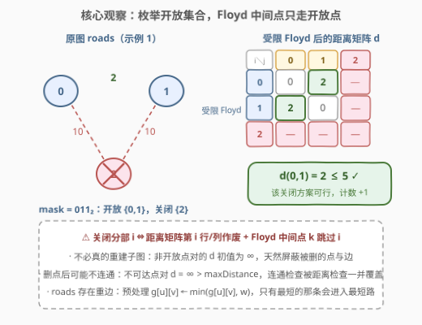
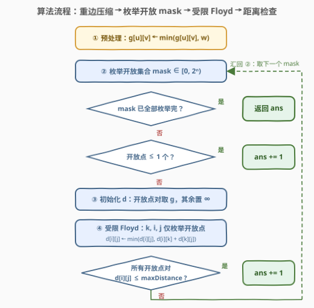
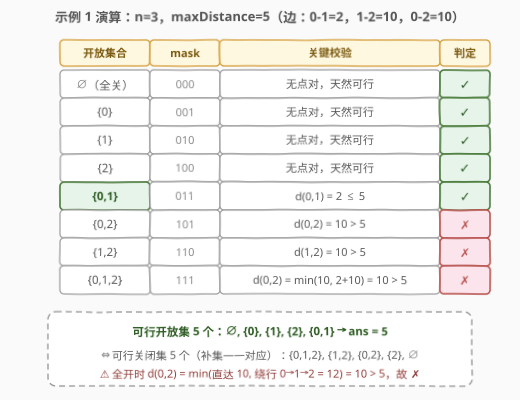

# 关闭分部的可行集合数目

- **题目名称**：关闭分部的可行集合数目
- **链接**：[2959. 关闭分部的可行集合数目](https://leetcode.cn/problems/number-of-possible-sets-of-closing-branches/)
- **难度**：困难
- **标签**：位运算、图、枚举、最短路（Floyd-Warshall）

## 1. 题目概述

一个公司在全国有 $n$ 个分部，分部之间由一些**无向道路**连接，一开始所有分部两两互相可达。公司决定关闭一些分部（**也可以不关闭任何分部**），要求剩余分部两两互相可达，且它们之间的**最远距离不超过** `maxDistance`。

两个分部之间的**距离**是经由道路的长度之和的**最小值**（即最短路）。关闭一个分部后，与之相连的所有道路不可通行；两个分部之间可能有**多条道路**（重边）。

返回**关闭分部的可行方案数目**。

**示例 1**：

```text
输入：n = 3, maxDistance = 5, roads = [[0,1,2],[1,2,10],[0,2,10]]
输出：5
解释：可行的关闭集合为 [2]、[0,1]、[1,2]、[0,2]、[0,1,2]，共 5 种。
```

**示例 2**：

```text
输入：n = 3, maxDistance = 5, roads = [[0,1,20],[0,1,10],[1,2,2],[0,2,2]]
输出：7
解释：0 与 1 之间有重边（20 和 10）；全开时 d(0,1) = min(10, 2+2) = 4 ≤ 5，
      仅「关闭 [2]（剩余 {0,1}，距离 10 > 5）」不可行，8 − 1 = 7 种。
```

**示例 3**：

```text
输入：n = 1, maxDistance = 10, roads = []
输出：2
解释：不关（剩余 [0]）或全关（剩余空集）均可行。
```

**约束条件**：

- $1 \le n \le 10$
- $1 \le maxDistance \le 10^5$
- $0 \le roads.length \le 1000$
- $0 \le u_i, v_i \le n-1$，$u_i \ne v_i$
- $1 \le w_i \le 1000$
- 一开始所有分部之间通过道路互相可以到达

> 💡 关键信号：$n \le 10$ 是**子集枚举**的甜区——$2^{10} = 1024$ 个子集；验证一个子集需要**全源最短路**（任意两点距离），$n \le 10$ 的稠密小图正是 Floyd-Warshall 的 $O(n^3)$ 主场。另外 $roads$ 最多 1000 条而点对只有 $\binom{10}{2} = 45$ 个，**重边必然大量存在**，必须先取 $\min$ 压缩。

---

## 2. 解题思路

### 2.1 暴力思路：枚举关闭集合 + 逐对求最短路

最直觉的做法分两层：

- **决策层**：枚举 $2^n$ 个关闭集合，对每个集合删掉关闭点及其关联边，重建剩余点的子图；
- **验证层**：对子图跑 $n$ 次 Dijkstra（或对每个点对 BFS 枚举所有路径）求出全源最短路，检查所有点对距离 $\le maxDistance$。

复杂度约 $2^n \cdot n \cdot (m \log m)$，$n=10$、$m=1000$ 时约 $10^7 \sim 10^8$，勉强能过但每个 mask 都要重复建图、重复跑堆。更致命的是两个语义坑：**重边**（必须取 $\min$，否则示例 2 直接错）与**删点后的连通性**（初始连通不等于删点后仍连通）。

> ⚠️ 暴力不是败在复杂度，而是败在「验证」这一步的形态没被看清：$n \le 10$ 的**稠密小图全源最短路**，三重循环的 Floyd 比 $n$ 次堆优化 Dijkstra 更轻、更短、更不易错。

### 2.2 核心观察：枚举开放集合 + 受限 Floyd



**观察① 计数对偶**：关闭集合与开放集合（剩余分部）互为补集，构成双射，所以「可行关闭方案数 = 可行开放集合数」。直接用 bitmask 枚举**开放集合**（bit 为 1 表示开放）更顺手：设 mask 中开放点数为 $c$，则

- $c \le 1$：没有任何点对需要检查，**天然可行**（空集「全关」也在此列，对应示例 3 的输出 2）；
- $c \ge 2$：需要验证所有开放点对的距离。

**观察② 删点 = 矩阵行列作废 + 中间点跳过**：先把 roads 压缩成邻接矩阵 $g$（重边取 $\min$，$g[i][i]=0$）。对每个 mask 构造距离矩阵 $d$：

- 初始时仅当 $i, j$ 都开放才取 $d[i][j] = g[i][j]$，其余为 $\infty$；
- Floyd 松弛时**中间点 $k$ 只枚举开放点**——路径经过关闭点即不合法，跳过 $k$ 等价于在「开放点的导出子图」上求全源最短路，**完全不必真的重建子图**。

**观察③ $\infty$ 兜底连通性**：删点后子图可能不连通，此时不可达点对的 $d = \infty > maxDistance$，距离检查天然覆盖了「两两可达」的连通性要求，无需单独判连通分量。

**观察④ 重边取 $\min$ 即可**：任何最短路至多使用两点间最短的那条边，压缩不损失答案（示例 2 中 0-1 间的 20 被淘汰，10 又被绕行 $0 \to 2 \to 1$ 的 4 淘汰）。

### 2.3 算法流程图



**完整步骤**：

1. **预处理**：$g[u][v] \leftarrow \min(g[u][v], w)$（双向），$g[i][i] = 0$，未连边处为 $\infty$；
2. **枚举** mask 从 $0$ 到 $2^n - 1$（开放集合）：
   - 若 mask 二进制中 1 的个数 $\le 1$：`ans += 1`，跳过验证；
   - **初始化** $d$：开放点对取 $g$，其余置 $\infty$；
   - **受限 Floyd**：$k, i, j$ 均只枚举开放点，$d[i][j] \leftarrow \min(d[i][j],\ d[i][k] + d[k][j])$；
   - **检查**：所有开放点对 $d[i][j] \le maxDistance$ 则 `ans += 1`；
3. **返回** `ans`。

> ⚠️ 三个易错点：① 忘记重边取 $\min$（示例 2 专设此坑）；② $\infty$ 取值要防溢出——C++ 用 `0x3f3f3f3f`，两个 $\infty$ 相加 $< INT\_MAX$ 安全，Python 直接用 `float('inf')`；③ 「初始全连通」不代表删点后连通，别把连通性检查省掉（$\infty$ 检查已自动涵盖）。

### 2.4 示例演算



以示例 1（$n=3$，$maxDistance=5$，边 0-1=2、1-2=10、0-2=10）为例，$2^3 = 8$ 个开放集合逐一判定：

| 开放集合 | mask | 关键校验 | 判定 |
|----------|------|----------|------|
| $\varnothing$ | 000 | 无点对，天然可行 | ✓ |
| $\{0\}$ | 001 | 无点对，天然可行 | ✓ |
| $\{1\}$ | 010 | 无点对，天然可行 | ✓ |
| $\{2\}$ | 100 | 无点对，天然可行 | ✓ |
| $\{0,1\}$ | 011 | $d(0,1) = 2 \le 5$ | ✓ |
| $\{0,2\}$ | 101 | $d(0,2) = 10 > 5$ | ✗ |
| $\{1,2\}$ | 110 | $d(1,2) = 10 > 5$ | ✗ |
| $\{0,1,2\}$ | 111 | $d(0,2) = \min(10,\ 2+10) = 10 > 5$ | ✗ |

可行开放集合共 5 个，与官方答案一致。注意最后一行：全开时 0 到 2 的最短路**不会**经过点 1 去绕行（$2 + 10 = 12$ 反而更远），最短路仍是直达的 10。

**再验证示例 2**（重边坑）：压缩后 $g[0][1] = \min(20, 10) = 10$，$g[1][2] = 2$，$g[0][2] = 2$。全开 mask 时 $d(0,1) = \min(10,\ 2+2) = 4 \le 5$ ✓；而开放集 $\{0,1\}$（即关闭 $[2]$）只剩重边中较短的 10，$10 > 5$ ✗。8 个集合中恰它不可行，答案 $7$ ✓。

---

## 3. 参考代码

### C++

```cpp
class Solution {
  public:
    int numberOfSets(int n, int maxDistance, vector<vector<int>>& roads) {
        const int INF = 0x3f3f3f3f;
        vector<vector<int>> g(n, vector<int>(n, INF));
        for (int i = 0; i < n; ++i) g[i][i] = 0;
        for (auto& r : roads) {
            g[r[0]][r[1]] = min(g[r[0]][r[1]], r[2]);
            g[r[1]][r[0]] = min(g[r[1]][r[0]], r[2]);
        }

        int ans = 0;
        for (int mask = 0; mask < (1 << n); ++mask) {
            if ((mask & (mask - 1)) == 0) {
                ++ans;
                continue;
            }
            vector<vector<int>> d(n, vector<int>(n, INF));
            for (int i = 0; i < n; ++i) if (mask >> i & 1)
                for (int j = 0; j < n; ++j) if (mask >> j & 1)
                    d[i][j] = g[i][j];
            for (int k = 0; k < n; ++k) if (mask >> k & 1)
                for (int i = 0; i < n; ++i) if (mask >> i & 1) {
                    if (d[i][k] == INF) continue;
                    for (int j = 0; j < n; ++j) if (mask >> j & 1)
                        if (d[i][k] + d[k][j] < d[i][j]) d[i][j] = d[i][k] + d[k][j];
                }
            bool ok = true;
            for (int i = 0; i < n && ok; ++i) if (mask >> i & 1)
                for (int j = i + 1; j < n && ok; ++j) if (mask >> j & 1)
                    if (d[i][j] > maxDistance) ok = false;
            ans += ok;
        }
        return ans;
    }
};
```

### Python

```python
class Solution:
    def numberOfSets(self, n: int, maxDistance: int, roads: List[List[int]]) -> int:
        INF = float('inf')
        g = [[INF] * n for _ in range(n)]
        for i in range(n):
            g[i][i] = 0
        for u, v, w in roads:
            if w < g[u][v]:
                g[u][v] = g[v][u] = w

        ans = 0
        for mask in range(1 << n):
            if mask & (mask - 1) == 0:
                ans += 1
                continue
            d = [[g[i][j] if (mask >> i & 1) and (mask >> j & 1) else INF
                  for j in range(n)] for i in range(n)]
            for k in range(n):
                if not (mask >> k & 1):
                    continue
                for i in range(n):
                    if not (mask >> i & 1):
                        continue
                    dik = d[i][k]
                    if dik == INF:
                        continue
                    for j in range(n):
                        if (mask >> j & 1) and dik + d[k][j] < d[i][j]:
                            d[i][j] = dik + d[k][j]
            ok = all(d[i][j] <= maxDistance
                     for i in range(n) if mask >> i & 1
                     for j in range(i + 1, n) if mask >> j & 1)
            ans += ok
        return ans
```

> 💡 两个小优化：`mask & (mask - 1) == 0` 一行判定「至多 1 个开放点」直接计数（含空集）；`d[i][k] == INF` 时跳过内层循环，避免无意义的 $\infty + \infty$ 比较。实测代码已通过三个官方示例及 300 组随机数据与暴力对拍。

---

## 4. 复杂度分析

| 维度 | 复杂度 | 说明 |
|------|--------|------|
| 时间复杂度 | $O(m + 2^n \cdot n^3)$ | 预处理压缩 $m \le 1000$ 条边；每个 mask 跑一次受限 Floyd。$n = 10$ 时 $1024 \times 1000 \approx 10^6$ 次基本操作 |
| 空间复杂度 | $O(n^2)$ | 邻接矩阵 $g$ 与每个 mask 的距离矩阵 $d$ 均为 $n \times n$，可复用同一份 |

> 💡 $2^n \cdot n^3$ 在 $n = 10$ 处恰好落在「枚举 + 多项式验证」的甜区边界上：$n$ 再翻一倍（$2^{20} \times 2 \times 10^5$）就彻底不可行——这类「$n \le 10 \sim 20$」的数据范围本身就是出题人递来的子集枚举信号。

---

## 5. 扩展：增量 Floyd，把验证摊还到 $O(2^n \cdot n^2)$

上述做法对每个 mask 都从零跑一遍 Floyd。注意到 mask 按**升序枚举**时，`mask` 相比 `prev = mask ^ v`（$v = mask\ \&\ (-mask)$ 是新加入的最低位开放点）恰好多了一个点——可以复用 prev 已收敛的答案：

1. **复制** $d_{prev}$ 为 $d_{mask}$ 的初值；
2. **接入新点 $v$**：$d[v][j] \leftarrow \min_{k \in prev}\big(g[v][k] + d_{prev}[k][j]\big)$，$d[i][v]$ 同理；
3. **单轮松弛**：对所有 $i, j \in prev$，$d[i][j] \leftarrow \min\big(d_{prev}[i][j],\ d[i][v] + d[v][j]\big)$。

正确性：加入单点 $v$ 之后的新最短路，要么完全不经过 $v$（等于 $d_{prev}$），要么**恰好经过 $v$ 一次**（两段都是 prev 子图内部的最短路），所以一轮 $O(n^2)$ 松弛足够。总复杂度降为 $O(2^n \cdot n^2) \approx 10^5$。本题 $n \le 10$ 两种写法都绰绰有余，但「枚举序 + 最低位增量」的摊还思路值得收藏（与状态压缩 DP 的转移手法同源）。

**为什么不用 Dijkstra**：每个 mask 跑 $n$ 次堆优化 Dijkstra 是 $O(2^n \cdot n \cdot n^2)$（稠密图退化），且建图、堆操作的常数和代码量都更大；Floyd 三重循环无分支直球、还能顺势用「跳过关闭点」实现删点语义——小图全源最短路，Floyd 几乎永远是更优选择。

---

## 6. 面试要点

1. **为什么枚举开放集合而不是关闭集合？**

   - 二者互为补集，计数严格相等（双射）
   - mask 的 bit=1 直接对应「该点参与距离检查」，初始化 $d$ 与 Floyd 跳过逻辑都写得更自然
   - 「至多 1 个开放点天然可行」的剪枝也以开放集视角表述更直接

2. **重边怎么处理？为什么取 min 一定对？**

   - 预处理 $g[u][v] \leftarrow \min(g[u][v], w)$，只保留两点间最短边
   - 任何最短路不会使用两点间非最短的边（换成最短边只会更短），压缩无损失
   - 示例 2 的 0-1 重边（20/10）就是专门考这个的：不取 min 或取了 last 都会错

3. **「剩余分部两两可达」怎么保证？初始连通不就够了？**

   - 不够——初始连通是全图性质，删除中间枢纽点后剩余点可能分裂成多个连通块
   - 不可达点对的 $d = \infty > maxDistance$，被距离检查天然覆盖，无需另写连通性判定

4. **为什么选 Floyd 而不是 Dijkstra？**

   - $n \le 10$ 稠密小图求全源最短路：Floyd $O(n^3) = 10^3$ 次、十几行、无堆无邻接表
   - 删点语义只需「k 只枚举开放点」一行，Dijkstra 版本则要真正重建子图

5. **$\infty$ 的取值有什么讲究？**

   - C++ 用 `0x3f3f3f3f`：两倍仍小于 `INT_MAX`，$\infty + \infty$ 不溢出，还能用 `memset` 初始化
   - 距离上界实际只有 $9 \times 1000 = 9000$，远小于 $\infty$，比较语义安全；Python 用 `float('inf')` 则完全无虞

---

## 7. 同类练习题

- [1334. 阈值距离内邻居最少的城市](https://leetcode.cn/problems/find-the-city-with-the-smallest-number-of-neighbors-at-a-threshold-distance/)（[站内题解](../1301-1400/1334_阈值距离内邻居最少的城市.md)）：Floyd 全源最短路的裸模板，先刷它再回来做本题的「枚举 + Floyd」组合
- [743. 网络延迟时间](https://leetcode.cn/problems/network-delay-time/)（[站内题解](../0701-0800/743_网络延迟时间.md)）：堆优化 Dijkstra 单源最短路，稀疏大图时与 Floyd 互为对偶选择
- [526. 优美的安排](https://leetcode.cn/problems/beautiful-arrangement/)（[站内题解](../0501-0600/526_优美的安排.md)）：同样的 $n \le 15$ bitmask 枚举甜区信号，训练「看见小 n 就想子集枚举」的肌肉记忆
- [787. K 站中转内最便宜的航班](https://leetcode.cn/problems/cheapest-flights-within-k-stops/)（[站内题解](../0701-0800/787_K站中转内最便宜的航班.md)）：另一道「外层约束 + 内层最短路验证」的组合题，Bellman-Ford 限制松弛版
