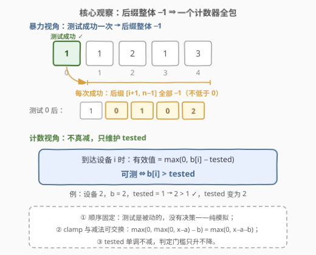
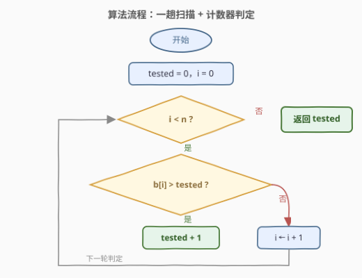
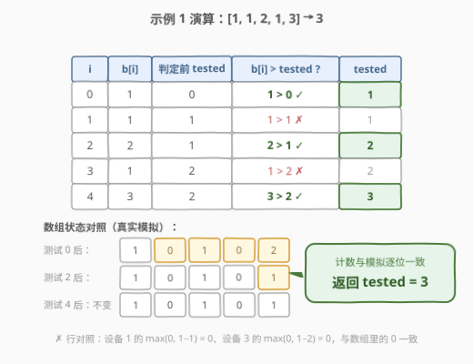

# 统计已测试设备

- **题目名称**：统计已测试设备
- **链接**：[2960. 统计已测试设备](https://leetcode.cn/problems/count-tested-devices-after-test-operations/)
- **难度**：简单
- **标签**：数组、计数、模拟

## 1. 题目概述

给你一个长度为 $n$、下标从 **0** 开始的整数数组 `batteryPercentages`，表示 $n$ 个设备的电池百分比。

你的任务是**按顺序**测试每个设备 $i$（从 $0$ 到 $n-1$），执行以下测试操作：

- 如果 $batteryPercentages[i] > 0$：
  - **增加**已测试设备的计数；
  - 将下标 $j \in [i+1,\ n-1]$ 的所有设备的电池百分比**减少 1**，且不会低于 0，即 $batteryPercentages[j] = \max(0,\ batteryPercentages[j] - 1)$；
  - 移动到下一个设备。
- 否则，直接移动到下一个设备，不执行任何测试。

返回一个整数，表示按顺序执行完测试操作后**已测试设备**的数量。

**示例 1**：

```text
输入：batteryPercentages = [1,1,2,1,3]
输出：3
解释：按顺序从设备 0 开始执行测试操作：
- 设备 0：1 > 0，测试成功（第 1 台已测试），数组变为 [1,0,1,0,2]；
- 设备 1：0，跳过；
- 设备 2：1 > 0，测试成功（第 2 台已测试），数组变为 [1,0,1,0,1]；
- 设备 3：0，跳过；
- 设备 4：1 > 0，测试成功（第 3 台已测试），数组保持不变。
因此答案是 3。
```

**示例 2**：

```text
输入：batteryPercentages = [0,1,2]
输出：2
解释：设备 0 电池为 0 跳过；设备 1 测试成功（第 1 台），数组变为 [0,1,1]；
设备 2 测试成功（第 2 台）。答案是 2。
```

**约束条件**：

- $1 \le n = batteryPercentages.length \le 100$
- $0 \le batteryPercentages[i] \le 100$

> 💡 读题先定性：测试**顺序固定**、每步成功与否完全由当前数组状态决定——**没有任何决策空间**，这不是贪心或 DP，而是纯模拟题。真正的考点只有一个：把「每次成功后后缀整体 $-1$」的 $O(n^2)$ 模拟，压缩成「维护一个计数器」的 $O(n)$ 一趟扫描。

---

## 2. 解题思路

### 2.1 暴力思路：照题面直接模拟

最直接的做法：从左到右枚举设备 $i$，若当前 $batteryPercentages[i] > 0$，计数 +1，再用一个内层循环把 $[i+1, n-1]$ 全部执行 $b[j] = \max(0,\ b[j] - 1)$。

```cpp
// O(n^2)：照题面逐字模拟，n ≤ 100 时稳过
int tested = 0;
for (int i = 0; i < n; i++) {
    if (b[i] > 0) {
        tested++;
        for (int j = i + 1; j < n; j++) b[j] = max(0, b[j] - 1);
    }
}
```

$n \le 100$ 时内层循环最多跑 $100 \times 100 = 10^4$ 次，毫无压力。但留意一个结构性特征：**每次修改都是「后缀整体 $-1$」——均匀且形状相同**，这种修改没必要逐个做。

### 2.2 核心观察：后缀整体 −1 ⇒ 一个计数器全包



三点观察把 $O(n^2)$ 压到 $O(n)$：

1. **到达 $i$ 之前的所有减法，只来自已成功的测试**。成功的测试全部发生在下标 $< i$ 的设备上，共 $tested$ 次，每次都让设备 $i$ 减 1。所以设备 $i$ 的当前有效值为
   $$\max\bigl(0,\ batteryPercentages[i] - tested\bigr)$$
2. **clamp 与减法可交换**：$\max(0, \max(0, x-a) - b) = \max(0, x - a - b)$，归纳可得任意多轮——中途被截断在 0 不影响「总减量 = 成功测试数」这个计数。这是计数器能替代逐个减法的根基。
3. **判定条件收敛为一个比较**：设备 $i$ 可测 $\iff \max(0,\ b[i] - tested) > 0 \iff b[i] > tested$。

$$\boxed{\ \text{设备 } i \text{ 测试成功} \iff batteryPercentages[i] > tested\ }$$

> 💡 一句话：**不要问「数组现在长什么样」，只问「已经成功了几次」**——后缀整体 $-1$ 是均匀的，均匀的修改就不必逐个做，攒进计数器即可。

顺带一个单调性：$tested$ 只增不减，门槛越来越高——原值追不上「成功次数」的设备注定测不了。这也解释了答案为什么可能远小于正数个数：示例 1 中 5 个正设备只测出 3 台（$[2,1,1]$ 按序只能测 1 台，见第 5 节）。

### 2.3 算法流程图



**完整步骤**：

1. **初始化**：`tested = 0`，`i = 0`；
2. **判定**：若 `batteryPercentages[i] > tested`，则 `tested++`；
3. **推进**：`i++`，未到数组末尾则回到第 2 步；
4. **收尾**：返回 `tested`。

> ⚠️ 常见手误是把条件写成 `batteryPercentages[i] > 0`——那等于无视了先前成功测试带来的减量。示例 1 会在设备 1、3 上误判成功，把答案多算成 5。

### 2.4 示例演算



以示例 1（`batteryPercentages = [1,1,2,1,3]`）为例：

| $i$ | $b[i]$ | 判定前 `tested` | $b[i] > tested$ ? | `tested` | 数组实际状态（对照模拟） |
|-----|--------|----------------|------------------|----------|--------------------------|
| 0 | 1 | 0 | $1 > 0$ ✓ | **1** | `[1,0,1,0,2]` |
| 1 | 1 | 1 | $1 > 1$ ✗ | 1 | `[1,0,1,0,2]` |
| 2 | 2 | 1 | $2 > 1$ ✓ | **2** | `[1,0,1,0,1]` |
| 3 | 1 | 2 | $1 > 2$ ✗ | 2 | `[1,0,1,0,1]` |
| 4 | 3 | 2 | $3 > 2$ ✓ | **3** | `[1,0,1,0,1]` |

返回 `tested = 3` ✓。最右列是暴力模拟的数组状态，用来交叉验证计数视角：设备 2 的有效值 $\max(0, 2-1) = 1 > 0$，与状态 `[1,0,1,0,2]` 里下标 2 处的 $1$ 完全吻合；设备 3 的 $\max(0, 1-2) = 0$，与数组里的 $0$ 一致。

---

## 3. 参考代码

### C++

```cpp
class Solution {
  public:
    int countTestedDevices(vector<int>& batteryPercentages) {
        int tested = 0;
        for (int x : batteryPercentages) {
            if (x > tested) {
                tested++;
            }
        }
        return tested;
    }
};
```

### Python

```python
class Solution:
    def countTestedDevices(self, batteryPercentages: List[int]) -> int:
        tested = 0
        for x in batteryPercentages:
            if x > tested:
                tested += 1
        return tested
```

> 💡 语言细节：两版都不修改原数组——`for (int x : ...)` 与 `for x in ...` 都是按值遍历，判定与计数在同一个 `if` 里一步完成；循环变量直接和 `tested` 比较，读起来就是判定条件 $\boxed{b[i] > tested}$ 的逐字翻译。

---

## 4. 复杂度分析

| 维度 | 复杂度 | 说明 |
|------|--------|------|
| 时间复杂度 | $O(n)$ | 一趟扫描，每个设备一次比较；$\Omega(n)$ 也是读取下界——未读的设备都可能被测，任何 $o(n)$ 算法都会漏判 |
| 空间复杂度 | $O(1)$ | 仅一个计数器；暴力模拟同为 $O(1)$ 空间，但时间是 $O(n^2)$ |

---

## 5. 扩展：顺序若可选，反序即最优

本题把「按顺序」写死，没有决策；把这三个字拿掉，问题立刻有意思起来——**测试顺序会影响答案吗？会**：

- `[2,1,1]` 按序测试：测完设备 0 后设备 1、2 归零，只测得 1 台；
- **从右往左**测：测设备 2 不伤任何人（右侧无设备），测设备 1 只伤已测完的设备 2，测设备 0 同理——**互不伤害**，3 台全测成功。

原因：测试 $j$ 只削弱 $j$ **右侧**的设备，而反序时右侧设备都已测完，削弱全部落空。于是反序恰好能测掉**所有初始为正的设备**，且这就是全局上界——初始 $\le 0$ 的设备只减不增，永远测不了：

$$\text{顺序可选时的最优答案} = \#\{\, i \mid batteryPercentages[i] > 0 \,\}$$

（对拍验证：枚举 $n \le 7$ 的全部测试顺序，最优值恒等于正数个数。）

再推广一步：若每次成功测试使后缀**整体减 $k$**（仍 clamp 到 0），同款论证给出判定条件 $b[i] > k \cdot tested$——后缀减法「均匀」的本质没变，计数器思想照用（已对拍验证）。

> 💡 关联套路：把「一段区间整体 $\pm 1$」攒起来不逐个做的通用工具是**差分数组**（区间修改 $O(1)$，最后前缀和还原）。本题因为修改区间永远是「后缀」且判定与修改交织，退化成单计数器；批量区间修改版本见第 7 节的 1109 / 3355。

---

## 6. 面试要点

1. **这题为什么不是贪心？**

   - 测试顺序固定、每步无选择，成功与否完全由状态决定——是**纯模拟**，不存在「贪心选择」
   - 容易误判成贪心的恰恰是判定条件 $b[i] > tested$，它长得像策略，实际只是状态化简

2. **为什么 $\max(0, b[i] - tested)$ 等于逐次 clamp 减的结果？**

   - clamp 与减法可交换：$\max(0, \max(0, x-a) - b) = \max(0, x-a-b)$，归纳到任意多轮
   - 所以「中途截断在 0」不破坏计数，设备 $i$ 承受的总减量恒等于它左侧的成功测试数

3. **把条件写成 `b[i] > 0` 错在哪？**

   - 忽略了先前成功测试对本设备的减量；示例 1 会把设备 1、3 误判成功，多算成 5
   - 正确条件是与**已成功次数**比较：$b[i] > tested$

4. **暴力 $O(n^2)$ 能过吗？为什么还要写 $O(n)$？**

   - $n \le 100$ 当然能过（至多 $10^4$ 次操作）；但把「均匀的后缀修改」压缩成计数器，是面试官想听的优化意识
   - 约束放大到 $n \le 10^6$、$b[i] \le 10^9$ 时，$O(n)$ 版依旧秒过，$O(n^2)$ 直接超时

5. **答案的上界是什么？按序测试能达到吗？**

   - 初始 $\le 0$ 的设备永不可能被测（只减不增），故答案 $\le$ 正数个数
   - 按序未必达到上界：示例 1 有 4 个正设备只测出 3，`[2,1,1]` 按序只测出 1——第 5 节的反序测试才能取到上界

> 💡 **一句话总结**：顺序固定 ⇒ 无决策 ⇒ 纯模拟；后缀均匀 $-1$ ⇒ 一个 $tested$ 计数器替代 $O(n^2)$ 的逐个减法，判定只剩 $b[i] > tested$ 一个比较。

---

## 7. 同类练习题

- [1109. 航班预订统计](https://leetcode.cn/problems/corporate-flight-bookings/)（[题解](../1101-1200/1109_航班预订统计.md)）：区间整体加减的通用工具——差分数组，本题「后缀 $-1$」的批量版
- [1893. 检查是否区域内的整数都被覆盖](https://leetcode.cn/problems/check-if-all-the-integers-in-a-range-are-covered/)（[题解](../1801-1900/1893_检查是否区域内所有整数都被覆盖.md)）：用差分替代逐区间模拟，判定型而非计数型
- [3355. 零数组变换 I](https://leetcode.cn/problems/zero-array-transformation-i/)：多段区间减 1 后判定元素是否全部归零——差分 + 前缀和
- [1854. 人口最多的年份](https://leetcode.cn/problems/maximum-population-year/)（[题解](../1801-1900/1854_人口最多的年份.md)）：用计数/差分代替逐年模拟的又一实例
