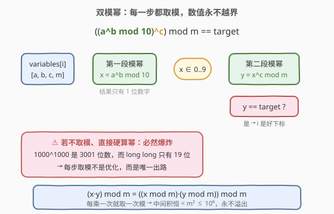
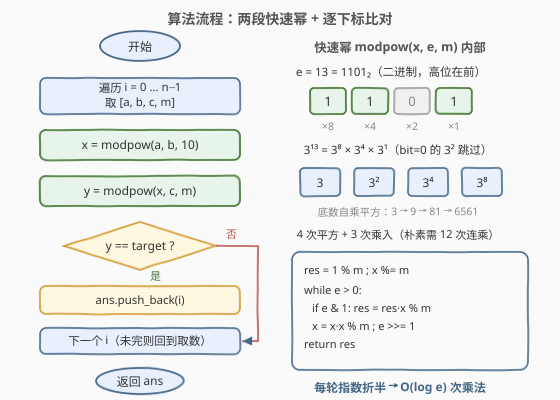
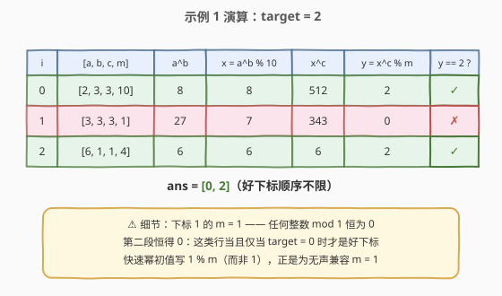

# 双模幂运算

- **题目名称**：双模幂运算
- **链接**：[2961. 双模幂运算](https://leetcode.cn/problems/double-modular-exponentiation/)
- **难度**：中等
- **标签**：数组、数学、模拟

## 1. 题目概述

给你一个下标从 **0** 开始的二维数组 `variables`，其中 `variables[i] = [ai, bi, ci, mi]`，以及一个整数 `target`。

如果满足以下公式，则下标 `i` 是 **好下标**：

- `0 <= i < variables.length`
- `((ai^bi % 10)^ci) % mi == target`

返回一个由 **好下标** 组成的数组，**顺序不限**。

**示例 1**：

```text
输入：variables = [[2,3,3,10],[3,3,3,1],[6,1,1,4]], target = 2
输出：[0,2]
解释：对于 variables 数组中的每个下标 i：
1) 对于下标 0，variables[0] = [2,3,3,10]，(2^3 % 10)^3 % 10 = 8^3 % 10 = 2。
2) 对于下标 1，variables[1] = [3,3,3,1]，(3^3 % 10)^3 % 1 = 7^3 % 1 = 0。
3) 对于下标 2，variables[2] = [6,1,1,4]，(6^1 % 10)^1 % 4 = 6 % 4 = 2。
因此，返回 [0,2] 作为答案。
```

**示例 2**：

```text
输入：variables = [[39,3,1000,1000]], target = 17
输出：[]
解释：对于下标 0，variables[0] = [39,3,1000,1000]，(39^3 % 10)^1000 % 1000 = 9^1000 % 1000 = 1。
```

**约束条件**：

- $1 \le \text{variables.length} \le 100$
- $\text{variables[i]} = [a_i, b_i, c_i, m_i]$
- $1 \le a_i, b_i, c_i, m_i \le 10^3$
- $0 \le \text{target} \le 10^3$

> 💡 本题形式是「模拟」，考点却是 **模幂运算（modular exponentiation）**：$a^b$ 最大 $1000^{1000}$ 是 3001 位数，64 位整数根本装不下，必须**边乘边取模 + 快速幂**。公式里的两层取模（先 $\bmod\ 10$ 再 $\bmod\ m$）恰好对应**两段串联的模幂**，照抄公式逐段计算即可。

---

## 2. 解题思路

### 2.1 暴力思路：直接把幂算出来

最直接的做法：对每个下标老老实实计算 $a^b$，再取模 10、算 $c$ 次方、再取模 $m$。问题出在**数值规模**上：

- 第一段 $a^b$：最大 $1000^{1000} = 10^{3000}$，是 **3001 位数**；
- 第二段底数虽缩到 $0 \sim 9$，但 $9^{1000} \approx 10^{954}$，仍是 **955 位数**。

而 C++/Java 的 `long long` 上限约 $9.2 \times 10^{18}$（19 位数），连第一步都过不去。Python 的任意精度整数理论上能硬算（$n \le 100$ 时甚至能通过），但单次幂高达上万比特，纯属「靠语言特性硬扛」，换语言立刻翻车——不是可接受的解法。

> ⚠️ 也别试图「化简」公式：$((a^b \bmod 10)^c) \bmod m \ne (a^b)^c \bmod m$。取模不能随意穿过幂运算，内层的 $\bmod\ 10$ 是公式本身的一部分。反例：$a{=}2, b{=}5, c{=}2, m{=}100$ 时左边 $= (32 \bmod 10)^2 \bmod 100 = 4$，右边 $= 2^{10} \bmod 100 = 24$。

### 2.2 核心观察：模乘法恒等式 + 两段模幂

**观察 1（模乘法恒等式）**：

$$(x \cdot y) \bmod m = \big((x \bmod m) \cdot (y \bmod m)\big) \bmod m$$

证明只需把 $x = q_1 m + r_1$、$y = q_2 m + r_2$ 代入展开：$xy = (\text{整数}) \cdot m + r_1 r_2$，余数只由 $r_1 r_2$ 决定。**推论**：计算 $x^e \bmod m$ 时可以**每乘一次就取一次模**，中间值永远小于 $m$——取模从此不是「事后修正」，而是全程护航。

**观察 2（本题的数值界）**：套用公式分两段计算：

$$x = a^b \bmod 10 \in [0, 9], \qquad y = x^c \bmod m \in [0, m-1] \subseteq [0, 999]$$

全程任何中间乘积都 $< m^2 \le 10^6$，`int` 都绰绰有余（写 `long long` 是肌肉记忆）。**溢出问题彻底消失**。



**观察 3（快速幂）**：逐次乘 $x$ 需要 $e$ 次乘法；把指数按二进制分解，**反复自乘平方**只需 $O(\log e)$ 次。例如 $3^{13} = 3^{8} \cdot 3^{4} \cdot 3^{1}$（$13 = 1101_2$），4 次平方 + 3 次乘入代替 12 次连乘。

> 💡 一句话：**模乘法恒等式保证「边乘边模」合法，快速幂保证「算得快」**。两者合体就是模幂运算 `modpow(x, e, m)`——本题对每个下标串行调用两次：先 `modpow(a, b, 10)`，再 `modpow(x, c, m)`，与 `target` 比较即可。

### 2.3 算法流程图



**完整步骤**：

1. `ans` 置空，遍历每个下标 $i$，取出 $[a, b, c, m]$
2. 第一段模幂：$x = a^b \bmod 10$（快速幂，模数 10）
3. 第二段模幂：$y = x^c \bmod m$（快速幂，模数 $m$）
4. 若 $y = \text{target}$，把 $i$ 加入 `ans`
5. 遍历结束返回 `ans`（顺序不限）

### 2.4 示例演算

以示例 1 为例（`target = 2`）：

| i | [a, b, c, m] | $a^b$ | $x = a^b \bmod 10$ | $x^c$ | $y = x^c \bmod m$ | 好下标？ |
|---|--------------|-------|--------------------|-------|--------------------|----------|
| 0 | [2, 3, 3, 10] | $2^3 = 8$ | 8 | $8^3 = 512$ | $512 \bmod 10 = 2$ | ✓ |
| 1 | [3, 3, 3, 1] | $3^3 = 27$ | 7 | $7^3 = 343$ | $343 \bmod 1 = 0$ | ✗ |
| 2 | [6, 1, 1, 4] | $6^1 = 6$ | 6 | $6^1 = 6$ | $6 \bmod 4 = 2$ | ✓ |

命中下标 0 和 2，返回 `[0, 2]` ✓。



> ⚠️ **注意 $m = 1$ 的下标 1**：任何整数 $\bmod\ 1 = 0$，第二段恒为 0——只有 `target = 0` 时这种下标才可能是好下标。快速幂初值写 `1 % m`（而不是 `1`）正是为了把 $m=1$ 无声地兼容掉。

---

## 3. 参考代码

### C++

```cpp
class Solution {
    // 快速幂：计算 x^e mod m（e >= 0）
    long long modpow(long long x, long long e, long long m) {
        long long res = 1 % m;              // m = 1 时结果恒为 0，初值必须取模
        x %= m;
        for (; e > 0; e >>= 1) {
            if (e & 1) res = res * x % m;   // 当前二进制位是 1：乘入答案
            x = x * x % m;                  // 底数自乘平方
        }
        return res;
    }
public:
    vector<int> getGoodIndices(vector<vector<int>>& variables, int target) {
        vector<int> ans;
        for (int i = 0; i < (int)variables.size(); ++i) {
            int a = variables[i][0], b = variables[i][1];
            int c = variables[i][2], m = variables[i][3];
            if (modpow(modpow(a, b, 10), c, m) == target)
                ans.push_back(i);
        }
        return ans;
    }
};
```

### Python

```python
class Solution:
    def getGoodIndices(self, variables: List[List[int]], target: int) -> List[int]:
        # 内置三参数 pow(base, exp, mod) 就是模幂运算
        return [i for i, (a, b, c, m) in enumerate(variables)
                if pow(pow(a, b, 10), c, m) == target]
```

面试若要求手写 `modpow`，与 C++ 版逐行对应：

```python
class Solution:
    def modpow(self, x: int, e: int, m: int) -> int:
        res = 1 % m                 # 兼容 m = 1
        x %= m
        while e:
            if e & 1:
                res = res * x % m
            x = x * x % m
            e >>= 1
        return res

    def getGoodIndices(self, variables: List[List[int]], target: int) -> List[int]:
        return [i for i, (a, b, c, m) in enumerate(variables)
                if self.modpow(self.modpow(a, b, 10), c, m) == target]
```

> 💡 细节提醒：① C++ 里 `a ^ b` 是**异或**不是乘方，`std::pow` 是浮点函数（大数精度全毁），都不能用于本题；② `modpow` 内先 `x %= m`、初值 `1 % m`，是处理 $m=1$ / $e=0$ 的通用保险；③ 本题中间积 $< 10^6$，`int` 足够，但模幂函数习惯性用 `long long`——模数放大到 $10^9$ 时乘积逼近 $10^{18}$，必须 64 位。

---

## 4. 复杂度分析

| 维度 | 复杂度 | 说明 |
|------|--------|------|
| **时间复杂度** | $O(n(\log b + \log c))$ | 每个下标两段快速幂，各至多 $\lceil \log_2 1000 \rceil = 10$ 轮（每轮 1 次平方 + 至多 1 次乘入）；$n \le 100$，总计约 $4000$ 次乘法取模 |
| **空间复杂度** | $O(1)$ | 除返回数组外只用常数变量 |

> ⚠️ 对比 2.1：朴素「边乘边模」（逐次乘底数 $e$ 次）是 $O(n(b+c)) \approx 2 \times 10^5$ 次乘法，本题约束下也能通过；但快速幂把单段降到 $O(\log e)$，模数、指数放大许多数量级依然从容，是必须掌握的版本。

---

## 5. 扩展：指数大到存不下时——欧拉定理降幂

本题指数 $b, c \le 1000$，64 位整数装得下指数本身。若题目升级为「指数以数组/字符串给出」（如 [372. 超级次方](https://leetcode.cn/problems/super-pow/)）或高达 $10^{18}$ 以上，就需要**指数降幂**。

**扩展欧拉定理**：当 $b \ge \varphi(m)$ 时，

$$a^b \equiv a^{\,b \bmod \varphi(m) + \varphi(m)} \pmod m$$

其中 $\varphi$ 是欧拉函数；特别地 $m$ 为质数且 $\gcd(a, m) = 1$ 时退化为**费马小定理** $a^b \equiv a^{b \bmod (m-1)} \pmod m$。于是「巨指数模幂」= 先把指数对 $\varphi(m)$ 降下来，再跑一遍本题的快速幂。指数以数组逐位给出时（372），也可以用 $a^{10b+d} = (a^b)^{10} \cdot a^d$ 逐位折叠。

顺带两个小彩蛋：

- **末位循环节**：本题内层模数恰是 10，而 $a^b$ 的末位数字循环周期 $\le 4$（如 $2,4,8,6$ 循环），故也可用 $(b-1) \bmod 4 + 1$ 规约指数——但该技巧只对模 10 好用，快速幂才是通用武器。
- **现实应用**：RSA 解密 $c^d \bmod n$ 就是一次模幂运算，快速幂（及其工程加速版蒙哥马利乘法）是密码学的基石算法。

---

## 6. 面试要点

1. **为什么不能直接计算 $a^b$？**

   - $a, b \le 1000$，$a^b$ 最大 $10^{3000}$（3001 位），远超 64 位整数上限 $\approx 9.2 \times 10^{18}$；第二段 $9^{1000} \approx 10^{954}$ 同样溢出。Python 大整数能硬扛但不具迁移性。正解是模乘法恒等式保证的「边乘边取模」。

2. **「边乘边模」为什么合法？**

   - $(xy) \bmod m = ((x \bmod m)(y \bmod m)) \bmod m$：把 $x, y$ 写成 $qm + r$ 展开即证。推论是幂运算每步乘法后立即取模，中间值恒 $< m$，永不溢出。

3. **快速幂的原理与手写要点？**

   - 指数二进制分解：$3^{13} = 3^8 \cdot 3^4 \cdot 3^1$。迭代式三变量：`res`（答案）、`x`（不断自乘平方）、`e`（右移折半），`e & 1` 时把当前 `x` 乘入，$O(\log e)$ 次乘法。初值 `res = 1 % m`、入口 `x %= m`，兼容 $m = 1$。

4. **C++ 实现本题有哪些坑？**

   - `^` 是异或运算符不是乘方；`std::pow` 是浮点函数，$10^{3000}$ 级别的结果精度全毁；模数一般化后中间积必须 `long long`。另外公式**不能化简**——内层 $\bmod 10$ 是题设的一部分，照抄公式分两段算。

5. **如果指数大到 64 位装不下怎么办？**

   - 扩展欧拉定理降幂：$b \ge \varphi(m)$ 时 $a^b \equiv a^{b \bmod \varphi(m) + \varphi(m)} \pmod m$；指数以数组逐位给出时可用 $a^{10b+d} = (a^b)^{10} \cdot a^d$ 逐位折叠（372 超级次方）；质数模数则用费马小定理取 $b \bmod (m-1)$。

> 💡 **一句话总结**：公式 $((a^b \bmod 10)^c) \bmod m$ 就是**两段串联的模幂**——模乘法恒等式让它算得「安全」，快速幂让它算得「快」；Python 的 `pow(x, e, m)` 一行收工，C++ 手写 6 行 `modpow`。

---

## 7. 同类练习题

- [50. Pow(x, n)](https://leetcode.cn/problems/powx-n/)（[题解](../0001-0100/50_Powx_n.md)）：快速幂浮点版母题，先打牢「平方 + 位判断」的 $O(\log n)$ 套路
- [372. 超级次方](https://leetcode.cn/problems/super-pow/)（[题解](../0301-0400/372_超级次方.md)）：指数以数组形式给出的模幂，本题第 5 节降幂技巧的实战场
- [1922. 统计好数字的数目](https://leetcode.cn/problems/count-good-numbers/)（[题解](../1901-2000/1922_统计好数字的数目.md)）：$5^n \cdot 4^n \bmod (10^9+7)$，模数放大后必须 64 位快速幂的计数应用
- [2954. 统计感冒序列的数目](https://leetcode.cn/problems/count-the-number-of-infection-sequences/)（[题解](../2901-3000/2954_统计感冒序列的数目.md)）：同区间近邻，组合数取模中用快速幂计算乘法逆元
