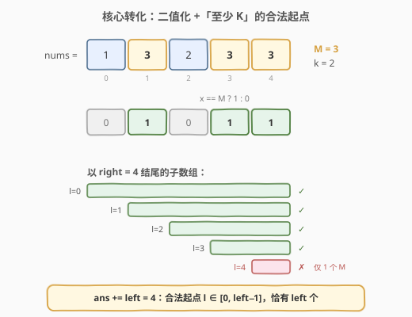
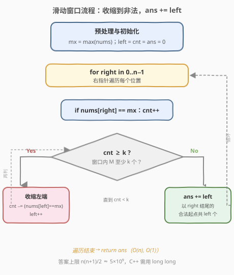
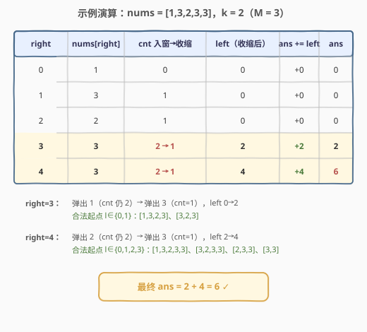

# LeetCode 统计最大元素出现至少 K 次的子数组 题解

## 1. 题目概述

- **标题 / 题号**：统计最大元素出现至少 K 次的子数组（#2962，medium）
- **链接**：https://leetcode.cn/problems/count-subarrays-where-max-element-appears-at-least-k-times/
- **难度**：中等
- **标签**：数组、滑动窗口

**题意**：给你一个整数数组 `nums` 和一个**正整数** `k`。请统计有多少个子数组满足：`nums` 中的**最大**元素在该子数组中**至少出现 `k` 次**，并返回这一数目。

子数组是数组中的一个连续元素序列。

**示例 1**：

```text
输入：nums = [1,3,2,3,3], k = 2
输出：6
解释：包含最大元素 3 至少 2 次的子数组为 [1,3,2,3]、[1,3,2,3,3]、[3,2,3]、[3,2,3,3]、[2,3,3] 和 [3,3]。
```

**示例 2**：

```text
输入：nums = [1,4,2,1], k = 3
输出：0
解释：没有子数组包含最大元素 4 至少 3 次。
```

**约束**：

- `1 <= nums.length <= 10^5`
- `1 <= nums[i] <= 10^6`
- `1 <= k <= 10^5`

> 💡 **答案会很大**：`n = 10^5` 时子数组总数达 $\frac{n(n+1)}{2} \approx 5 \times 10^9$，超出 32 位整数范围，C++ 必须用 `long long`。

## 2. 解题思路

### 2.1 暴力思路

先求出全局最大值 $M$，再枚举所有 $O(n^2)$ 个子数组，逐个判断其中 $M$ 的出现次数是否 $\ge k$。即使借助「出现次数前缀和」把单次判断降到 $O(1)$，整体仍是 $O(n^2)$，在 $n = 10^5$ 下约 $10^{10}$ 次操作，必然超时。

### 2.2 核心观察：二值化 +「至少 K」滑窗计数



**观察一：只有全局最大值 $M$ 有意义。**

子数组的最大元素恰好是 $M$，当且仅当该子数组**包含** $M$——$M$ 是全局最大值，没有元素能超过它；不含 $M$ 的子数组最大值必然更小。于是「最大元素出现至少 $k$ 次」等价于「$M$ 出现至少 $k$ 次」，问题**二值化**为：把 `x == M` 看作 `1`、否则看作 `0`，统计包含至少 $k$ 个 `1` 的子数组数（与 [1248. 统计「优美子数组」](../1201-1300/1248_统计优美子数组.md) 的奇偶二值化同源，其余数值全部无关）。

**观察二：「至少 k」对窗口长度单调，可直接滑窗。**

窗口越长，包含的 $M$ 只多不少。因此固定右端点 `right` 时，合法左端点 $l$ 必然是一段**前缀** $[0, \text{left}-1]$：

- 维护窗口内 $M$ 的出现次数 `cnt`；
- 当 `cnt >= k` 时不断右移 `left`（弹出的元素若等于 $M$ 则 `cnt--`），直到 `cnt < k`；
- 此时 `l < left` 的子数组全部合法，`l >= left` 的全非法——以 `right` 结尾的合法子数组恰有 `left` 个，`ans += left`。

> 💡 **与 1248 的对照**：「恰好 K」的合法窗口从短到长会经历 非法→合法→非法，单指针一轮收缩给不出合法起点区间的两个边界，必须用 $\text{atMost}(K) - \text{atMost}(K-1)$ 差分；本题「至少 K」的合法性单调（越长越合法），一次滑窗直接计数，反而更简单。

### 2.3 算法流程图



流程：

1. 预处理 $M = \max(\text{nums})$，初始化 `left = cnt = ans = 0`
2. 遍历 `right` 从 `0` 到 `n-1`：
   - 若 `nums[right] == M`，`cnt++`
   - **当** `cnt >= k`：若 `nums[left] == M` 则 `cnt--`，`left++`（循环收缩）
   - `ans += left`
3. 返回 `ans`

> ⚠️ **不变式**：每轮收缩结束后，窗口 `[left, right]` 内 $M$ 的个数 `cnt < k`；而 `[left-1, right]`（若 `left > 0`）内的个数 $\ge k$——`left-1` 是最后一个被弹出的位置，弹出时以它为左端的窗口已合法，此后右端只会更远。因此 `l ∈ [0, left-1]` 的子数组全部合法、`l >= left` 全非法，`ans += left` 不重不漏。

### 2.4 示例演算

以 `nums = [1,3,2,3,3], k = 2` 为例（$M = 3$）：



| right | nums[right] | cnt 入窗→收缩 | left（收缩后） | ans += left | ans |
|-------|-------------|--------------|---------------|-------------|-----|
| 0 | 1 | 0 | 0 | +0 | 0 |
| 1 | 3 | 1 | 0 | +0 | 0 |
| 2 | 2 | 1 | 0 | +0 | 0 |
| 3 | 3 | 2 → 1 | 2 | +2 | 2 |
| 4 | 3 | 2 → 1 | 4 | +4 | 6 |

- `right = 3`：入窗后 `cnt = 2`，弹出 `1`（`cnt` 仍 2）再弹出 `3`（`cnt = 1`），`left` 到 2；合法起点 `l ∈ {0,1}`，对应 `[1,3,2,3]`、`[3,2,3]`；
- `right = 4`：入窗后 `cnt = 2`，弹出 `2`（`cnt` 仍 2）再弹出 `3`（`cnt = 1`），`left` 到 4；合法起点 `l ∈ {0,1,2,3}`，对应 `[1,3,2,3,3]`、`[3,2,3,3]`、`[2,3,3]`、`[3,3]`。

合计 `6` 个，与示例一致。

## 3. 参考代码

### 方法一：滑动窗口（推荐）

#### C++

```cpp
class Solution {
  public:
    long long countSubarrays(vector<int>& nums, int k) {
        int mx = *max_element(nums.begin(), nums.end());
        long long ans = 0;
        int left = 0, cnt = 0;
        for (int right = 0; right < (int)nums.size(); right++) {
            cnt += (nums[right] == mx);
            while (cnt >= k) {
                cnt -= (nums[left] == mx);
                left++;
            }
            ans += left;
        }
        return ans;
    }
};
```

#### Python

```python
class Solution:
    def countSubarrays(self, nums: List[int], k: int) -> int:
        mx = max(nums)
        ans = left = cnt = 0
        for right, x in enumerate(nums):
            cnt += x == mx
            while cnt >= k:
                cnt -= nums[left] == mx
                left += 1
            ans += left
        return ans
```

### 方法二：记录出现位置（倒数第 k 个 M）

对每个 `right`，若到当前位置 $M$ 已出现 $\ge k$ 次，则合法起点为 `l <= 倒数第 k 个 M 的下标`，即 `ans += pos[-k] + 1`。

#### C++

```cpp
class Solution {
  public:
    long long countSubarrays(vector<int>& nums, int k) {
        int mx = *max_element(nums.begin(), nums.end());
        long long ans = 0;
        vector<int> pos;
        for (int i = 0; i < (int)nums.size(); i++) {
            if (nums[i] == mx) pos.push_back(i);
            if ((int)pos.size() >= k)
                ans += pos[(int)pos.size() - k] + 1;
        }
        return ans;
    }
};
```

#### Python

```python
class Solution:
    def countSubarrays(self, nums: List[int], k: int) -> int:
        mx = max(nums)
        ans = 0
        pos = []
        for i, x in enumerate(nums):
            if x == mx:
                pos.append(i)
            if len(pos) >= k:
                ans += pos[-k] + 1
        return ans
```

## 4. 复杂度分析

| 方法 | 时间复杂度 | 空间复杂度 | 说明 |
|------|-----------|-----------|------|
| 滑动窗口 | `O(n)` | `O(1)` | `left` 与 `right` 各自单向移动，累计最多各 `n` 步 |
| 记录出现位置 | `O(n)` | `O(m)` | `m` 为 `M` 的出现次数，最坏 `O(n)` |

> 💡 两法时间同阶；滑动窗口空间 `O(1)` 且与 713/1248 一脉相承，面试首选。「倒数第 k 个出现位置」胜在直观，适合作为引出滑窗的讲解路径。

## 5. 扩展：「至多 / 至少 / 恰好」三类滑窗计数模板

| 类型 | 收缩条件 | 计数方式 | 代表题 |
|------|---------|---------|--------|
| **至多 K** | `while cnt > K` 收缩到合法 | `ans += right - left + 1` | [713. 乘积小于 K 的子数组](../0701-0800/713_乘积小于K的子数组.md)、[992. K 个不同整数的子数组](../0901-1000/992_K个不同整数的子数组.md) |
| **至少 K** | `while cnt >= K` 收缩到非法 | `ans += left` | **本题**、[1358. 包含所有三种字符的子字符串数目](../1301-1400/1358_包含所有三种字符的子字符串数目.md) |
| **恰好 K** | 差分转化 | `atMost(K) - atMost(K-1)` | [1248. 统计「优美子数组」](../1201-1300/1248_统计优美子数组.md) |

> 💡 **记忆窍门**：两者互为镜像——「至多」型收缩到**刚好合法**，合法起点是 `l ∈ [left, right]` 的**后缀**，数 `right - left + 1` 个；「至少」型收缩到**刚好非法**，合法起点是 `l ∈ [0, left-1]` 的**前缀**，数 `left` 个。

## 6. 面试要点

1. **为什么只需关心全局最大值 `M`？**

   - 子数组含 `M` ⇒ 其最大元素就是 `M`（全局无更大元素）；不含 `M` ⇒ 最大元素必小于 `M`。故「最大元素出现至少 k 次」⇔「含 `M` 至少 k 次」，数组可二值化，其余数值无关。

2. **`ans += left` 为什么正确？**

   - 收缩结束后不变式：`[left, right]` 内 `M` 的个数 `< k`，故 `l >= left` 的子数组（都是它的子窗口）全非法；而 `[left-1, right]` 内个数 `>= k`（`left-1` 被弹出时窗口已合法，之后右端只增不减），故 `l <= left-1` 的子数组（都包含它）全合法。合法起点恰为 `l ∈ [0, left-1]`，共 `left` 个。

3. **为什么「恰好 K」不能像本题一样一次滑窗？**

   - 固定 `right` 时，「恰好 k 个」的合法起点是一段**中间区间** `[l₁, l₂]`：`l₁` 是计数从 `> k` 降到 `= k` 的位置，`l₂` 是从 `= k` 降到 `< k` 的位置。一次收缩循环只能定位其中一个边界，故常用差分 `atMost(K) − atMost(K−1)` 两次线性扫描替代（见 1248/992）。

4. **为什么 C++ 返回值必须用 `long long`？**

   - 答案上限是全体子数组数 $\frac{n(n+1)}{2}$，`n = 10^5` 时约 `5×10^9`，超过 `INT_MAX`（约 `2.1×10^9`）；`ans += left` 的逐步累加同样会溢出 `int`。

5. **把「最大元素」换成「最小元素」或任意指定值 `x`，做法变吗？**

   - 完全同构：二值化条件从 `x == max(nums)` 换成 `x == min(nums)` 或 `x == target`，滑窗部分一行不改。

## 同类练习题

| # | 题目 | 与本题的关联 |
|---|------|-------------|
| 2444 | [统计定界子数组的数目](https://leetcode.cn/problems/count-subarrays-with-fixed-bounds/)（[题解](../2401-2500/2444_统计定界子数组的数目.md)） | 同时约束子数组最大值 ≤ maxK 且最小值 ≥ minK 的滑窗计数，本题的多约束升级版 |
| 795 | [区间子数组个数](https://leetcode.cn/problems/number-of-subarrays-with-bounded-maximum/)（[题解](../0701-0800/795_区间子数组个数.md)） | 统计最大值落在 [L, R] 内的子数组数，「至多」差分思想的变体 |
| 1358 | [包含所有三种字符的子字符串数目](https://leetcode.cn/problems/number-of-substrings-containing-all-three-characters/)（[题解](../1301-1400/1358_包含所有三种字符的子字符串数目.md)） | 与本题同为「至少型」`ans += left` 模板 |
| 992 | [K 个不同整数的子数组](https://leetcode.cn/problems/subarrays-with-k-different-integers/)（[题解](../0901-1000/992_K个不同整数的子数组.md)） | 「恰好 K」必须差分，对照本题直接滑窗 |
| 1248 | [统计「优美子数组」](https://leetcode.cn/problems/count-number-of-nice-subarrays/)（[题解](../1201-1300/1248_统计优美子数组.md)） | 二值化 + 恰好/至多转化的经典题，与本题思想同源 |
