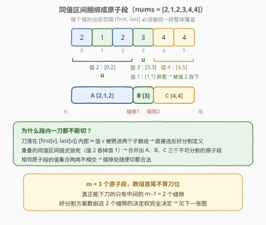
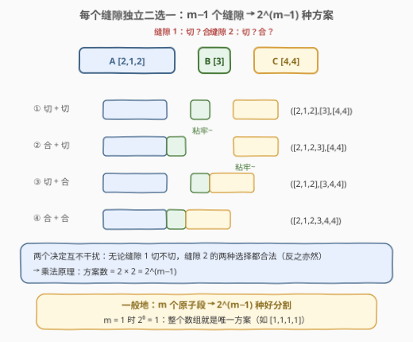
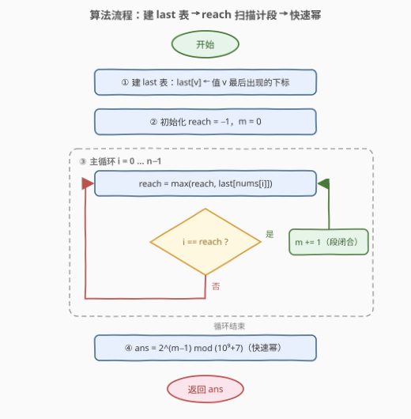
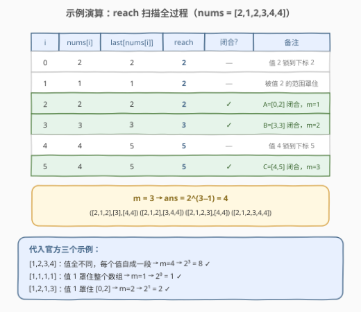

# LeetCode 统计好分割方案的数目 题解

## 1. 题目概述

- **标题 / 题号**：统计好分割方案的数目（#2963，hard）
- **链接**：https://leetcode.cn/problems/count-the-number-of-good-partitions/
- **难度**：困难
- **标签**：数组、哈希表、数学、组合数学

**题意**：给你一个下标从 **0** 开始、由**正整数**组成的数组 `nums`。

将数组分割成一个或多个**连续**子数组，如果不存在包含了相同数字的两个子数组，则认为是一种**好分割方案**。返回 `nums` 的**好分割方案**的**数目**。由于答案可能很大，请返回答案对 $10^9 + 7$ 取余的结果。

**示例 1**：

```text
输入：nums = [1,2,3,4]
输出：8
解释：有 8 种好分割方案：([1],[2],[3],[4]), ([1],[2],[3,4]), ([1],[2,3],[4]),
([1],[2,3,4]), ([1,2],[3],[4]), ([1,2],[3,4]), ([1,2,3],[4]) 和 ([1,2,3,4])。
```

**示例 2**：

```text
输入：nums = [1,1,1,1]
输出：1
解释：唯一的好分割方案是：([1,1,1,1])。
```

**示例 3**：

```text
输入：nums = [1,2,1,3]
输出：2
解释：有 2 种好分割方案：([1,2,1],[3]) 和 ([1,2,1,3])。
```

**约束**：

- $1 \le \text{nums.length} \le 10^5$
- $1 \le \text{nums}[i] \le 10^9$

> 💡 读题先抓**约束的方向**："不存在两个子数组包含相同数字"等价于"**每个值的所有出现必须落在同一段里**"——这把"计数问题"变成了"值的出现范围划界问题"。再注意到 $10^9$ 的值域逼我们用哈希表、$10^5$ 的长度逼我们把 $2^{n-1}$ 级枚举压缩成一个公式。

## 2. 解题思路

### 2.1 暴力思路：枚举所有切缝组合

$n$ 个元素之间有 $n-1$ 个缝隙，每个缝隙"切"或"不切"，共 $2^{n-1}$ 种分割。逐种检查：把每段数字放进集合，看任意两段集合是否相交。单次检查 $O(n)$，总复杂度 $O(2^{n-1} \cdot n)$——$n = 10^5$ 时是天文数字，必须挖掘"哪些缝隙根本不能切、哪些一定可以切"的结构。

### 2.2 核心观察：同值区间捆绑出"原子段"



**第一步：每个值划出一个"必须整体包含"的区间。** 若值 $v$ 第一次出现在 $\text{first}[v]$、最后一次出现在 $\text{last}[v]$，则任何一刀都不能落在 $(\text{first}[v],\ \text{last}[v]]$ 内部——否则 $v$ 被劈进两段，直接违反好分割定义。

**第二步：重叠的区间合并成原子段。** 不同值的区间会互相"锁死"：如下面自造例子 `nums = [2,1,2,3,4,4]`，值 $2$ 的区间 $[0,2]$ 把夹在中间的值 $1$（区间 $[1,1]$）一口吞下，三者必须待在同一段。把所有互相重叠（或触碰）的链合并，得到若干**原子段**——每段内部任何位置都不能下刀，段与段的边界是"刀能落下的全部候选位置"。

> 💡 这一步和 [56. 合并区间](https://leetcode.cn/problems/merge-intervals/) 的"区间合并"、[763. 划分字母区间](https://leetcode.cn/problems/partition-labels/) 的"字母分组"是**同一个模型**。妙在本题区间端点就是下标，天然有序，无需排序——一趟"跳跃游戏式"扫描即可完成合并（见 2.4）。

### 2.3 计数：缝隙独立二选一，$2^{m-1}$ 收工



设合并后得到 $m$ 个原子段。两个方向夹逼出答案：

- **必要性（刀只能落在原子段边界）**：好分割的每一段都是若干**完整原子段**的并——若某刀落在原子段内部，该段内必有某个值的区间被劈开，矛盾；
- **充分性（边界随便切都合法）**：任意只在原子段边界下刀的分割都合法——每个值的完整区间都在单个原子段内，因此无论相邻原子段怎么合并，任何值都不会同时出现在两段里。

于是**好分割 ⟺ 原子段的连续分组**：$m$ 个原子段排成一排，中间 $m-1$ 个缝隙**各自独立**地选择"切开"或"合并"，互不干扰：

$$\boxed{\ \text{ans} = 2^{\,m-1} \bmod (10^9+7)\ }$$

> ⚠️ $m = 1$ 时指数为 $0$，$2^0 = 1$ 自然成立（如示例 2 整个数组是一段），无需特判。

### 2.4 算法流程图



**完整步骤**：

1. **建 `last` 表**：一趟遍历，哈希表记录每个值**最后出现**的下标（正序扫描时后写覆盖前写，天然留最大）；
2. **`reach` 扫描**：再一趟遍历，维护 $\text{reach} = \max(\text{reach},\ \text{last}[\text{nums}[i]])$——它表示"当前原子段至少要延伸到哪里"；当 $i = \text{reach}$ 时该段闭合，$m \mathrel{+}= 1$；
3. **快速幂**：返回 $2^{m-1} \bmod (10^9+7)$。

这正是 [55. 跳跃游戏](https://leetcode.cn/problems/jump-game/) 的 `reach` 扫描（`last[nums[i]]` 扮演"跳跃距离"），并用 [45. 跳跃游戏 II](https://leetcode.cn/problems/jump-game-ii/) 的方式数"步数"——只不过每"一步"是一个原子段。

### 2.5 示例演算



以 `nums = [2,1,2,3,4,4]` 为例，`last = {2:2,\ 1:1,\ 3:3,\ 4:5}`：

| $i$ | $\text{nums}[i]$ | $\text{last}[\text{nums}[i]]$ | $\text{reach}$ | $i = \text{reach}$? | 动作 |
|-----|------|------|------|------|------|
| 0 | 2 | 2 | 2 | 否 | 值 2 把段锁定到下标 2 |
| 1 | 1 | 1 | 2 | 否 | 被值 2 的范围罩住 |
| 2 | 2 | 2 | 2 | **是** | 原子段 $A=[0,2]$ 闭合，$m=1$ |
| 3 | 3 | 3 | 3 | **是** | 原子段 $B=[3,3]$ 闭合，$m=2$ |
| 4 | 4 | 5 | 5 | 否 | 值 4 把段锁定到下标 5 |
| 5 | 4 | 5 | 5 | **是** | 原子段 $C=[4,5]$ 闭合，$m=3$ |

$m = 3$，答案 $2^{3-1} = 4$。手工枚举验证：$([2,1,2]\,[3]\,[4,4])$、$([2,1,2]\,[3,4,4])$、$([2,1,2,3]\,[4,4])$、$([2,1,2,3,4,4])$，恰 4 种 ✓。

三个官方示例亦吻合：$[1,2,3,4]$ 全不同值 $m=4 \to 2^3=8$；$[1,1,1,1]$ 整体一段 $m=1 \to 2^0=1$；$[1,2,1,3]$ 中值 1 罩住前三个 $m=2 \to 2^1=2$。另用 $n \le 9$ 的位枚举暴力对拍 3000 组随机数据全部一致。

## 3. 参考代码

### C++

```cpp
class Solution {
  public:
    int numberOfGoodPartitions(vector<int>& nums) {
        constexpr long long MOD = 1'000'000'007;
        const int n = nums.size();

        unordered_map<int, int> last;                 // 值 -> 最后出现下标
        for (int i = 0; i < n; ++i) last[nums[i]] = i;

        int m = 0, reach = -1;                        // m: 原子段个数
        for (int i = 0; i < n; ++i) {
            reach = max(reach, last[nums[i]]);        // 当前段至少延伸到 reach
            if (i == reach) ++m;                      // 原子段闭合
        }

        long long ans = 1, base = 2;                  // 快速幂 2^(m-1)
        for (long long e = m - 1; e; e >>= 1, base = base * base % MOD)
            if (e & 1) ans = ans * base % MOD;
        return (int)ans;
    }
};
```

### Python

```python
class Solution:
    def numberOfGoodPartitions(self, nums: List[int]) -> int:
        MOD = 10**9 + 7

        last = {}                                    # 值 -> 最后出现下标
        for i, x in enumerate(nums):
            last[x] = i

        m, reach = 0, -1                             # m: 原子段个数
        for i, x in enumerate(nums):
            reach = max(reach, last[x])              # 当前段至少延伸到 reach
            if i == reach:
                m += 1                               # 原子段闭合
        return pow(2, m - 1, MOD)
```

> 💡 `last` 表也可以倒序一趟建成（首次遇到即最后出现）；`reach` 初始化为 $-1$ 或 $0$ 均可，因为 $i = 0$ 时必然会被 `last[nums[0]] >= 0` 覆盖。

## 4. 复杂度分析

| 维度 | 复杂度 | 说明 |
|------|--------|------|
| 时间复杂度 | $O(n)$ | 建 `last` 表一趟 $O(n)$，`reach` 扫描一趟 $O(n)$，快速幂 $O(\log m)$，总量线性 |
| 空间复杂度 | $O(n)$ | 哈希表最多存 $n$ 个不同值 |

## 5. 扩展：区间合并的三副面孔

同一模型在仓库里出现过三次，写法值得对照：

| 题目 | 目标 | 合并手段 |
|------|------|----------|
| [56. 合并区间](https://leetcode.cn/problems/merge-intervals/)（[题解](../0001-0100/56_合并区间.md)） | 输出合并后的区间 | 端点无序 → **排序** $O(n \log n)$ 后线性合并 |
| [763. 划分字母区间](https://leetcode.cn/problems/partition-labels/)（[题解](../0701-0800/763_划分字母区间.md)） | 段数**最多**的划分 | 端点即下标天然有序 → `reach` 扫描 $O(n)$，等价于"所有缝隙全切" |
| 本题 2963 | 数**所有**合法切法 | 同一趟 `reach` 扫描数出 $m$，再 $2^{m-1}$ |

可以看出 2963 = "763 的分段" + "缝隙独立组合计数"。**排序版区间合并是通法，下标版 `reach` 扫描是特化**：当区间端点与扫描顺序天然一致时，排序这一步可以整个省掉，复杂度从 $O(n \log n)$ 降到 $O(n)$。

另一个方向的变体：若把"相同数字不能跨段"改成"相同数字**恰好**每段各一个"或"段内数字互不相同"，原子段模型立刻失效——前者是另一类计数，后者直接退化为滑窗（如 [3. 无重复字符的最长子串](https://leetcode.cn/problems/longest-substring-without-repeating-characters/)）。识别约束到底"捆绑"还是"互斥"，决定用合并还是滑窗。

## 6. 面试要点

1. **为什么相同数字必须落在同一段？**

   - 好分割的定义是"不存在包含相同数字的两个子数组"；若值 $v$ 的两次出现被分进两段，这两段就包含了相同数字，直接违反定义
   - 逆否形式：每个值的完整出现范围 $[\text{first}[v], \text{last}[v]]$ 必须被同一段整体覆盖

2. **为什么原子段内部一刀都不能切、边界一刀都合法？**

   - 内部：切在 $[\text{first}[v], \text{last}[v]]$ 内必劈开某个值；原子段是被同值区间链锁死的极大块，链上任何位置下刀都会劈开某个值
   - 边界：相邻原子段的值集合两两不相交，任意合并相邻段后每个值仍完整落在一段内 → 合法

3. **为什么答案是 $2^{m-1}$ 而不是 $2^m$ 或别的？**

   - 决策单位是**缝隙**不是段：$m$ 个原子段只有 $m-1$ 个缝隙，每个缝隙独立"切/合"
   - $m=1$ 时没有缝隙，$2^0 = 1$（整段本身），公式自然覆盖，无需特判

4. **`reach` 扫描为什么对？它和 56 题排序合并等价吗？**

   - $\text{reach}$ 始终是"已扫过的值"的 `last` 最大值；$i < \text{reach}$ 说明还有值要延伸到更右边，刀落不下；$i = \text{reach}$ 说明所有覆盖 $i$ 的同值区间都已闭合，段在此截断
   - 等价于把每个值看成区间 $[\text{first}[v], \text{last}[v]]$ 做 56 题式合并；只因端点即下标、天然按左端点有序，排序被省去

5. **有哪些实现细节容易翻车？**

   - `last` 表要存**最后**出现（正序扫描靠覆盖，倒序扫描靠首遇）；只存第一次出现会把 `[2,1,2]` 拆错
   - $m-1$ 作为指数先减再快速幂；$m=1$ 时指数为 0，`pow(2, 0, MOD) = 1` 正确
   - 值域 $10^9$ 必须哈希表；若值域 $\le n$ 可换定长数组提速（常数更小）

> 💡 **一句话总结**：同值出现范围把数组锁成 $m$ 个不可分割的原子段（`last` 表 + `reach` 一趟扫描，跳跃游戏式区间合并）；合法切法 ⟺ 原子段间 $m-1$ 个缝隙的独立二选一，答案 $2^{m-1} \bmod (10^9+7)$。

## 同类练习题

| # | 题目 | 与本题的关联 |
|---|------|-------------|
| 763 | [划分字母区间](https://leetcode.cn/problems/partition-labels/)（[题解](../0701-0800/763_划分字母区间.md)） | 同款"同值区间捆绑成原子段"，只是求段数最多（全切）而非数切法 |
| 56 | [合并区间](https://leetcode.cn/problems/merge-intervals/)（[题解](../0001-0100/56_合并区间.md)） | 重叠区间合并的通法（排序版），本题是其"端点天然有序"的特化 |
| 55 | [跳跃游戏](https://leetcode.cn/problems/jump-game/)（[题解](../0001-0100/55_跳跃游戏.md)） | `reach`（能到达的最远位置）扫描的原型，本题 `last[nums[i]]` 扮演跳跃距离 |
| 45 | [跳跃游戏 II](https://leetcode.cn/problems/jump-game-ii/)（[题解](../0001-0100/45_跳跃游戏%20II.md)） | `reach` 扫描按"段"计数的最小步数，与本题数原子段的手法同源 |
