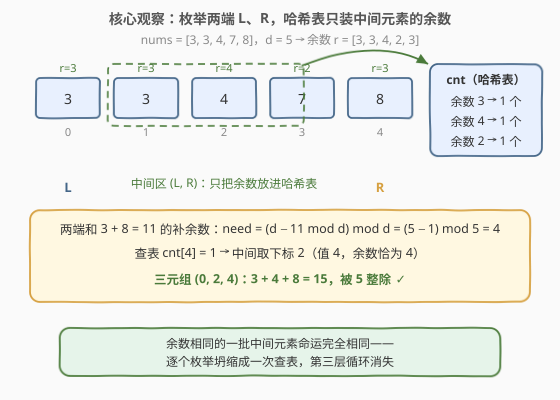
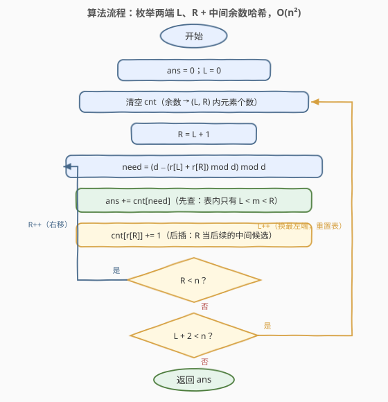
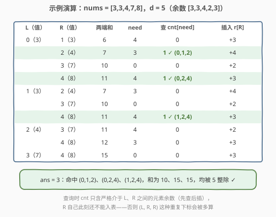

# 可被整除的三元组数量

- **题目名称**：可被整除的三元组数量
- **链接**：[2964. 可被整除的三元组数量](https://leetcode.cn/problems/number-of-divisible-triplet-sums/)
- **难度**：中等
- **标签**：数组、哈希表、计数

## 1. 题目概述

> ⚠️ 本题为 LeetCode 付费题，题意描述根据官方示例用例与 hints 重建，可能与官方题面有出入。（题意已用官方三个示例与官方 hints 的四步提示交叉核对：按下方题意实现的暴力解与 hints 路线解在 5000+ 组随机数据上完全一致，三个示例输出分别为 3、4、0。）

给定一个下标从 0 开始的整数数组 `nums` 和一个整数 `d`，返回**三元组** $(i, j, k)$ 的数量，要求：

- $0 \le i < j < k < n$，且
- $(\text{nums}[i] + \text{nums}[j] + \text{nums}[k]) \bmod d = 0$（三数之和能被 $d$ 整除）。

**示例 1**：

```text
输入：nums = [3,3,4,7,8], d = 5
输出：3
解释：(0,1,2)：3+3+4=10；(0,2,4)：3+4+8=15；(1,2,4)：3+4+8=15。
三组和都能被 5 整除，其余 7 个三元组均不满足。
```

**示例 2**：

```text
输入：nums = [3,3,3,3], d = 3
输出：4
解释：任意三元组的和都是 9，都能被 3 整除，共 C(4,3) = 4 个。
```

**示例 3**：

```text
输入：nums = [3,3,3,3], d = 6
输出：0
解释：任意三元组的和都是 9，9 mod 6 = 3 ≠ 0，一个都没有。
```

**约束条件**（付费题官方约束不可见，按官方 hints 所需的 $O(n^2)$ 路线重建）：

- $3 \le \text{nums.length}$，规模为数百到数千量级；
- `nums[i]` 与 `d` 均为正整数（`int` 范围内量级），精确上界不影响下方解法的正确性。

> 💡 本题是「三数之和」的**同余版**：15 题要求三数之和**等于** target，本题要求三数之和 $\equiv 0 \pmod d$。核心套路完全同宗——**固定一维、哈希降一维**：官方 hints 的路线是「枚举最左 L 与最右 R 两端，用哈希表统计夹在中间的元素余数」，第三层循环坍缩成一次 $O(1)$ 查表，总复杂度 $O(n^2)$。

---

## 2. 解题思路

### 2.1 暴力思路：三重循环逐个判定

最直接的做法：枚举全部 $\binom{n}{3}$ 个下标三元组 $(i,j,k)$，逐个求和并检查能否被 $d$ 整除。时间 $O(n^3)$：$n=1000$ 时约 $1.7 \times 10^8$ 次判定已经吃紧，$n=2000$ 时约 $1.3 \times 10^9$ 必然超时。

冗余在哪？**固定两端 $(i,k)$ 后，中间元素 $j$ 合法与否只取决于 $\text{nums}[j] \bmod d$ 是否等于一个确定的值**——余数相同的一批中间元素命运完全相同，暴力却把它们拆开逐个重算整除判定，没有合并。

### 2.2 核心观察：枚举两端、哈希查中间

**观察 1（整除条件 ⟺ 余数方程）**：模运算对加法封闭，三数之和被 $d$ 整除当且仅当三个余数之和模 $d$ 归零：

$$d \mid (a+b+c) \iff \big((a \bmod d) + (b \bmod d) + (c \bmod d)\big) \bmod d = 0$$

所以整件事只与每个元素的**余数** $r_i = \text{nums}[i] \bmod d \in [0, d-1]$ 有关，可以先把数组整体换成余数序列。

**观察 2（固定两端，合法的中间余数唯一）**：固定最左端 $L$ 与最右端 $R$（$L < R$），中间元素 $m$ 必须满足 $L < m < R$ 且

$$r_m \equiv -(r_L + r_R) \pmod d$$

即中间元素的余数必须恰为**一个确定的数**——两端和的「补余数」：

$$\text{need} = \big(d - (r_L + r_R) \bmod d\big) \bmod d$$

于是数对 $(L, R)$ 的贡献 = 区间 $(L, R)$ 内**余数等于 need 的元素个数**，一次哈希查询即可。

**观察 3（R 右移，哈希表 O(1) 增量维护）**：固定 $L$ 后让 $R$ 从 $L+1$ 起向右扫。$R$ 每前进一步，$(L, R)$ 开区间的元素集合**恰好只新进一个元素**（原下标 $R-1$）——查询前把它的余数入表即可，无需重建整张表。



**不重不漏**：三元组 $(i,j,k)$ 的最左 $i$、最右 $k$ 唯一确定，只会在 $L=i$、$R=k$ 那一轮被考察；中间元素 $j \in (i,k)$ 的余数恰在表中，`need` 匹配时被加一。左/中/右三个下标角色互斥完备，每个合法三元组**恰好被统计一次**。

### 2.3 算法流程图



**完整步骤**：

1. 预处理余数序列 $r[i] = \text{nums}[i] \bmod d$
2. `ans = 0`，外层枚举最左端 $L = 0 \sim n-3$，每轮**清空**哈希表 `cnt`
3. 内层 $R$ 从 $L+1$ 到 $n-1$：
   - 计算 $\text{need} = (d - (r_L + r_R) \bmod d) \bmod d$
   - **先查**：`ans += cnt[need]`（此刻表内只有严格介于 $L$、$R$ 之间的元素）
   - **后插**：`cnt[r[R]] += 1`（$R$ 从下一轮起成为新的中间候选）
4. 外层结束，返回 `ans`

> ⚠️ **顺序坑**：「先查后插」不能颠倒。查询发生在 $R$ 处，表里只能放严格介于 $L$ 与 $R$ 之间的元素；若先把 $r_R$ 入表再查询，当 `need` 恰好等于 $r_R$ 时，会把 $(L, R, R)$ 这种**重复下标**的三元组也数进去（对应条件 $(\text{nums}[L] + 2\,\text{nums}[R]) \bmod d = 0$），造成多算。

### 2.4 示例演算

以示例 1 `nums = [3,3,4,7,8]`、`d = 5` 为例（余数序列 $[3,3,4,2,3]$）：

| L（值） | R（值） | 两端和 | need | 查 cnt[need] | 插入 r[R] |
|---------|---------|--------|------|--------------|-----------|
| 0（3） | 1（3） | 6 | 4 | 0 | +3 |
|         | 2（4） | 7 | 3 | **1** ✓ (0,1,2) | +4 |
|         | 3（7） | 10 | 0 | 0 | +2 |
|         | 4（8） | 11 | 4 | **1** ✓ (0,2,4) | +3 |
| 1（3） | 2（4） | 7 | 3 | 0 | +4 |
|         | 3（7） | 10 | 0 | 0 | +2 |
|         | 4（8） | 11 | 4 | **1** ✓ (1,2,4) | +3 |
| 2（4） | 3（7） | 11 | 4 | 0 | +2 |
|         | 4（8） | 12 | 3 | 0 | +3 |
| 3（7） | 4（8） | 15 | 0 | 0 | +3 |

合计 `ans = 3`，与官方输出一致 ✓。



顺带验证示例 2：`[3,3,3,3]`、`d=3`，余数全为 0，任两端和 $6 \bmod 3 = 0$、need $= 0$，中间余数全命中——$L=0$ 轮命中 $1+2=3$ 个、$L=1$ 轮命中 $1$ 个，共 $4$ ✓；示例 3：$d=6$ 时 need 恒为 $0$ 而中间余数全为 $3$，一次不中，输出 $0$ ✓。

---

## 3. 参考代码

> ⚠️ 付费题官方代码模板不可见，函数名 `divisibleTripletSum` 与签名按题名推断，提交时以官网实际模板为准。

### C++

```cpp
class Solution {
public:
    int divisibleTripletSum(vector<int>& nums, int d) {
        int n = nums.size();
        vector<int> r(n);
        for (int i = 0; i < n; i++) r[i] = nums[i] % d;     // 整除条件只看余数
        long long ans = 0;                                   // 上限 C(n,3)，防溢出
        for (int L = 0; L + 2 < n; L++) {                    // 三元组最左端
            unordered_map<int, int> cnt;                     // 余数 -> (L,R) 内元素个数
            for (int R = L + 1; R < n; R++) {                // 三元组最右端
                int need = (int)((d - ((long long)r[L] + r[R]) % d) % d);
                auto it = cnt.find(need);
                if (it != cnt.end()) ans += it->second;      // 先查：表内只有 L<m<R
                cnt[r[R]]++;                                 // 后插：R 成为后续的中间候选
            }
        }
        return (int)ans;
    }
};
```

### Python

```python
class Solution:
    def divisibleTripletSum(self, nums: List[int], d: int) -> int:
        n = len(nums)
        r = [x % d for x in nums]                 # 整除条件只看余数
        ans = 0
        for L in range(n - 2):                    # 三元组最左端
            cnt = defaultdict(int)                # 余数 -> (L, R) 内元素个数
            for R in range(L + 1, n):             # 三元组最右端
                need = (d - (r[L] + r[R]) % d) % d  # 中间元素应有的余数
                ans += cnt[need]                  # 先查：表内只有 L < m < R
                cnt[r[R]] += 1                    # 后插：R 成为后续的中间候选
        return ans
```

> 💡 两版逻辑一致（已与暴力解对拍验证）。细节提醒：① `need` 用 `(d − x mod d) mod d` 计算，$x \bmod d = 0$ 时得到 $d \bmod d = 0$，结果恒落在 $[0, d-1]$；② C++ 里 `r[L] + r[R]` 最大 $2d-2$，若官方 $d$ 接近 `INT_MAX` 会溢出，故求和处升 `long long`；③ 若官方约束允许负数，C++ 的 `%` 会产出负余数，需用 `((x % d) + d) % d` 规整到 $[0, d-1]$，Python 的 `%` 天然非负无需处理；④ 答案上限 $\binom{n}{3}$，官方约束不可见时累加器用 `long long` 最稳，确认 $n$ 较小后可换回 `int`。

---

## 4. 复杂度分析

| 维度 | 复杂度 | 说明 |
|------|--------|------|
| **时间复杂度** | $O(n^2)$ | 外层 $L$ 共 $n$ 轮，内层 $R$ 总步数 $\sum_{L}(n-L-1) = \binom{n}{2}$；每步一次取模 + 一次哈希查询 + 一次插入，均摊 $O(1)$ |
| **空间复杂度** | $O(\min(n, d))$ | 哈希表同一时刻只装 $(L, R)$ 之间元素的余数，键数不超过 $\min(n, d)$；每个 $L$ 重置复用，不随平方增长 |

> ⚠️ 对比 2.1 的暴力：$O(n^3)$ 把时间浪费在「余数相同的中间元素被拆开逐个判定」上；把第三层循环坍缩成一次按余数查表，即降到 $O(n^2)$。这也是「k 数之和」家族从 $O(n^k)$ 降到 $O(n^{k-1})$ 的通用一步。

---

## 5. 扩展：两条变体路线

**变体 A：枚举最右端点 + 「数对和余数」哈希（升维视角）**

换个方向固定：枚举三元组的**最右**元素 $k$，用哈希表维护已见过的所有数对 $(i, j)$（$j < k$）的「数对和余数」计数。每到一个新 $k$：查互补余数 $(d - \text{nums}[k] \bmod d) \bmod d$ 的数对个数，再把 $(i, k)$ 全部入表：

```python
def divisibleTripletSum(self, nums: List[int], d: int) -> int:
    n, ans = len(nums), 0
    pair = defaultdict(int)                 # 数对和余数 -> 数对个数（j < 当前 k）
    for k in range(n):
        need = (d - nums[k] % d) % d        # 需要数对和的余数 = need
        ans += pair[need]
        for i in range(k):                  # 把 (i, k) 作为新数对入表
            pair[(nums[i] + nums[k]) % d] += 1
    return ans
```

同样 $O(n^2)$，但空间涨到 $O(\min(d, n^2))$（数对和余数的种类远多于单元素余数），且每个 $k$ 要 $O(k)$ 次入表、常数更大——**官方 hints 路线（每步只插一个键）严格更优**。这一视角的价值在于**升维推广**：它把三元组看成「一个数 + 一个数对」，与 [1. 两数之和](https://leetcode.cn/problems/two-sum/) 的哈希套路同构；数四元组被 $d$ 整除时，把「数对」表再升成「三元组和」表逐层套用即可，正是 1 → 15 → 18 升维链在「同余版」上的镜像。

**变体 B：d 很小时——余数分桶 + 组合计数**

若已知 $d$ 很小（如 $d \le 10^3$），可以先把全部元素按余数分桶 `cnt[0..d-1]`，再枚举余数对 $r_1 \le r_2$，解出唯一的 $r_3 = (d - (r_1 + r_2) \bmod d) \bmod d$（要求 $r_3 \ge r_2$），按「三者全同 / 前两同 / 后两同 / 互异」四种情况套组合数 $\binom{c}{3}$、$\binom{c}{2} \cdot c'$ 与乘法原理计数，时间 $O(n + d^2)$、与 $n$ 解耦。这是 [923. 三数之和的多种可能](https://leetcode.cn/problems/3sum-with-multiplicity/) 桶计数套路的同余版（另见 [974. 和可被K整除的子数组](https://leetcode.cn/problems/subarray-sums-divisible-by-k/) 的同余配对）。本题 $d$ 未见小上界保证（可达 $10^9$ 量级），hints 路线不依赖 $d$ 的大小，是更通用的选择。

---

## 6. 面试要点

1. **整除条件怎么转化成余数方程？为什么可以只看余数？**

   - $d \mid (a+b+c) \iff (a \bmod d + b \bmod d + c \bmod d) \bmod d = 0$，因为模运算对加法封闭（$(a+b) \bmod d = ((a \bmod d) + (b \bmod d)) \bmod d$）。数组可先整体换成余数序列，值域压到 $[0, d-1]$，后续所有计数只与余数有关。

2. **官方 hints 的 $O(n^2)$ 是怎么把第三层循环消掉的？**

   - 枚举最左 $L$ 与最右 $R$ 两层。固定 $L$ 后 $R$ 右移时，$(L, R)$ 开区间的元素集合每次恰好新进一个，哈希表 $O(1)$ 增量维护「中间元素余数 → 个数」；由余数方程解出唯一合法中间余数 $\text{need}$，`cnt[need]` 一次查表即得该数对的全部贡献。本质是把「同余数的一批中间元素」合并计数，第三维从 $O(n)$ 枚举坍缩成 $O(1)$ 查询。

3. **「先查后插」的顺序为什么不能反？**

   - 查询发生在 $R$ 处，表内只能放严格介于 $L$ 与 $R$ 之间的元素。若先插入 $r_R$ 再查询，`need` 恰等于 $r_R$ 时会把 $(L, R, R)$ 这种重复下标的三元组也数进去（即 $(\text{nums}[L] + 2\,\text{nums}[R]) \bmod d = 0$ 的情形），导致多算。

4. **怎么保证每个合法三元组不重不漏？**

   - 三元组 $(i,j,k)$ 的最左 $i$、最右 $k$ 唯一确定，只在 $L=i$、$R=k$ 那一轮被考察；中间 $j \in (i,k)$ 的余数恰好在表中，`need` 匹配时被加一。左/中/右三个角色互斥且完备，计数恰好一次——这是「按角色划分统计」的标准不重不漏论证。

5. **与 15 / 923 / 1010 这一族题的关系？**

   - 15（三数之和）是「和等于 target」用排序 + 双指针降维；923 是值域小时的分桶 + 组合计数；1010 是本题的**两数版**（两数和被 60 整除，按余数互补配对）；本题是「和 $\equiv 0 \pmod d$」用**余数哈希**降维。共同骨架：固定一维，把剩余维度之一哈希化（或分桶/双指针化），$k$ 层循环降 $k-1$ 层。

> 💡 **一句话总结**：三数之和模 $d$ 归零 ⟺ 三个余数模 $d$ 归零——枚举两端 $L, R$，用「先查后插」的余数哈希表数中间元素，$O(n^2)$ 时间、$O(\min(n,d))$ 空间，官方 hints 指定路线。

---

## 7. 同类练习题

- [1. 两数之和](https://leetcode.cn/problems/two-sum/)（[题解](../0001-0100/1_两数之和.md)）：哈希降维的鼻祖——固定一端查互补目标，本题的 need 就是「模 $d$ 版的互补数」
- [15. 三数之和](https://leetcode.cn/problems/3sum/)（[题解](../0001-0100/15_三数之和.md)）：固定一维、剩二维排序双指针；与本题「枚举两端查中间」互为镜像的降维方式
- [923. 三数之和的多种可能](https://leetcode.cn/problems/3sum-with-multiplicity/)（[题解](../0901-1000/923_三数之和的多种可能.md)）：值域小时分桶 + 组合计数，第 5 节变体 B 的母题
- [1010. 总持续时间可被 60 整除的歌曲](https://leetcode.cn/problems/pairs-of-songs-with-total-durations-divisible-by-60/)（[题解](../1001-1100/1010_总持续时间可被60整除的歌曲对.md)）：本题的「两数版」——余数互补配对的单层哈希
- [2950. 可整除子串的数量](https://leetcode.cn/problems/number-of-divisible-substrings/)（[题解](../2901-3000/2950_可整除子串的数量.md)）：同区间近邻，另一类「整除 + 计数」问题（前缀和视角）
